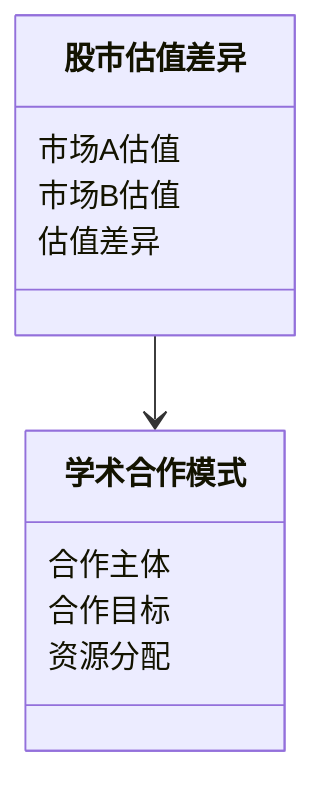
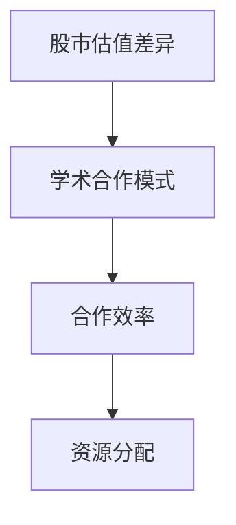

                 


# 股市估值差异对国际学术合作模式的影响

> 关键词：股市估值差异，国际学术合作模式，学术资源分配，合作效率，经济周期

> 摘要：本文探讨了股市估值差异对国际学术合作模式的影响。通过分析股市估值差异的形成原因及其对学术资源分配和合作效率的影响，本文提出了新的学术合作模式的优化策略。

---

## 第一章：股市估值差异的定义与特征

### 1.1 股市估值的基本概念
股市估值是衡量公司股票价值的重要指标，常用的估值方法包括市盈率（PE）、市净率（PB）等。这些指标反映了市场对公司的预期和信心。

### 1.2 估值差异的形成原因
- 市场流动性：流动性高的市场通常能给出更准确的估值。
- 信息不对称：不同市场获取的信息不一致，导致估值差异。
- 经济周期：经济波动影响投资者对公司的预期，从而影响估值。

---

## 第二章：国际学术合作模式的定义与分类

### 2.1 学术合作的基本概念
学术合作是指不同机构或国家之间的研究人员共同开展研究项目，共享资源和成果。

### 2.2 国际学术合作的主要模式
- 政府间协议：如欧盟的“地平线2020”计划。
- 大学间合作：如麻省理工学院与新加坡南洋理工大学的合作。
- 科研机构合作：如国际原子能机构与各国研究机构的合作。

---

## 第三章：股市估值差异对学术合作模式的影响机制

### 3.1 股市估值差异的传导路径
- 资金分配：估值高的市场可能吸引更多的资金，影响学术机构的资金分配。
- 资源分配：资金充足的机构可能主导合作，影响合作模式的公平性。

### 3.2 学术资源分配的影响
- 高估值市场可能拥有更多的研究资金，导致学术资源向这些地区集中，影响合作的多样性。

### 3.3 合作模式的动态调整
- 机构可能根据市场估值调整合作策略，优化资源配置。

---

## 第四章：算法原理与数学模型

### 4.1 估值差异的量化模型
- 使用市盈率差异公式：$$ D_{PE} = |PE_{A} - PE_{B}| $$
- 使用市净率差异公式：$$ D_{PB} = |PB_{A} - PB_{B}| $$

### 4.2 学术合作效率的评价公式
- 合作效率：$$ E_{efficiency} = \frac{C}{T} $$
  - C为合作成果数量，T为合作时间。

---

## 第五章：系统分析与架构设计

### 5.1 领域模型


### 5.2 系统架构


---

## 第六章：项目实战

### 6.1 环境安装
- 数据来源：股票市场数据（如Yahoo Finance）。
- 工具：Python、Pandas、Matplotlib。

### 6.2 核心实现代码
```python
import pandas as pd
import matplotlib.pyplot as plt

# 获取股票数据
data = pd.read_csv('stock_data.csv')

# 计算市盈率差异
pe_a = data['PE_A']
pe_b = data['PE_B']
pe_diff = abs(pe_a - pe_b)

# 绘制估值差异分布图
plt.hist(pe_diff, bins=10)
plt.xlabel('PE差异')
plt.ylabel('频率')
plt.title('股市估值差异分布')
plt.show()
```

---

## 第七章：总结与建议

### 7.1 本章小结
股市估值差异对国际学术合作模式有显著影响，主要体现在资源分配和合作效率上。

### 7.2 最佳实践
- 机构应根据市场估值调整合作策略，优化资源配置。
- 政府应制定政策，减少估值差异对学术合作的负面影响。

### 7.3 注意事项
- 数据获取的难度可能限制研究的深度。
- 需进一步研究不同经济周期下的合作模式变化。

### 7.4 拓展阅读
- 推荐阅读《金融市场与投资学》和《合作经济与组织行为》。

---

作者：AI天才研究院 & 禅与计算机程序设计艺术

