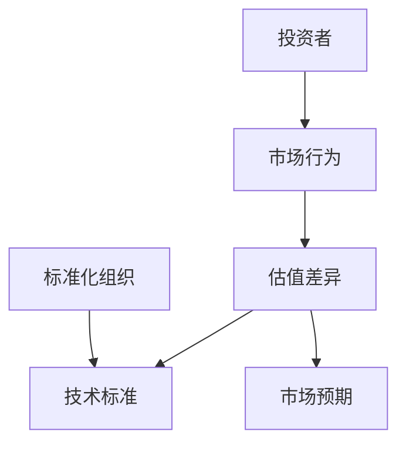
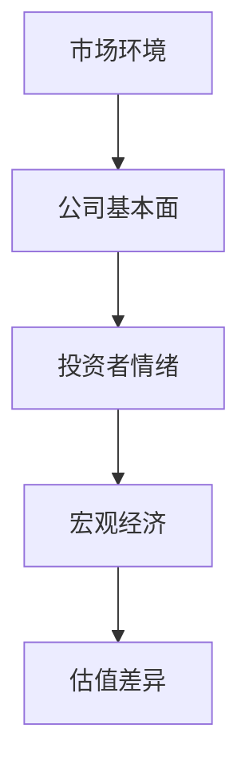

                 

# 股市估值差异对国际技术标准制定的影响

> 关键词：股市估值差异、国际技术标准、制定影响、技术标准制定、股市估值、国际标准

> 摘要：本文探讨了股市估值差异对国际技术标准制定的影响，分析了股市估值差异的核心概念及其与国际技术标准制定的联系，通过影响因素分析和博弈论模型，系统性地研究了两者之间的相互作用。文章结合实际案例，展示了如何通过技术标准制定影响股市估值差异，并提出了相关系统的架构设计和实现方案。

---

## 第一部分: 背景介绍

### 第1章: 股市估值差异与国际技术标准制定的背景

#### 1.1 问题背景
股票市场的估值差异指的是不同市场或同一市场内不同股票之间的价值评估差异。这种差异通常由多种因素引起，包括市场流动性、信息不对称、投资者情绪等。国际技术标准的制定则涉及不同国家或组织在技术规范上的协调与统一，是全球技术发展的重要推动力。

#### 1.2 问题描述
股市估值差异的复杂性在于其动态变化和多样性，而国际技术标准的制定需要考虑全球市场的多样性与统一性。两者之间的关系尚未得到充分研究，但可以预见，股市估值差异可能通过影响企业的技术发展和市场预期，反过来影响国际技术标准的制定。

#### 1.3 问题解决
通过分析股市估值差异对国际技术标准制定的影响，可以找到优化标准制定过程的方法，减少因估值差异带来的负面影响，同时利用其积极作用推动技术发展。

#### 1.4 边界与外延
股市估值差异的边界包括市场环境、政策法规等因素，而国际技术标准制定的外延则涉及多个利益相关者的协调。两者的关系受到经济、政治和技术等多种因素的影响。

#### 1.5 概念结构与核心要素
股市估值差异的核心要素包括市场参与者的估值行为、市场信息和制度规则。国际技术标准制定的核心要素包括标准内容、制定流程和参与者角色。

---

## 第二部分: 核心概念与联系

### 第2章: 核心概念原理

#### 2.1 股市估值差异的原理
股市估值差异受多种因素影响，包括公司基本面、市场情绪和宏观经济环境。其动态变化反映了市场的波动性和不确定性。

#### 2.2 国际技术标准制定的原理
国际技术标准的制定需要协调不同利益相关者的需求，通常采用协商和投票机制。标准的制定过程涉及技术评估、利益平衡和实施推广。

#### 2.3 股市估值差异与国际技术标准制定的联系
股市估值差异可能影响企业的技术创新和市场行为，从而间接影响国际技术标准的制定。反之，国际技术标准的制定也可能影响企业的估值，进而影响股市的整体表现。

---

## 第三部分: 核心概念属性对比

### 第3章: 核心概念属性对比

#### 3.1 股市估值差异与国际技术标准制定的属性对比
| 属性                | 股市估值差异          | 国际技术标准制定        |
|---------------------|----------------------|-------------------------|
| 主体                | 投资者、公司          | 标准化组织、企业、政府    |
| 目标                | 评估企业价值          | 统一技术规范            |
| 影响因素            | 市场供需、信息不对称    | 技术水平、政策法规        |
| 结果                | 估值差异              | 技术标准                |

#### 3.2 实体关系图

---

## 第四部分: 算法原理

### 第4章: 影响因素分析

#### 4.1 影响因素分析流程

#### 4.2 博弈论模型
股市估值差异与国际技术标准制定之间的关系可以用博弈论模型描述，其中各方参与者通过博弈达到均衡状态。

数学公式：
$$ V = \max_{v} \min_{s} U(v, s) $$
其中，V为估值，v为投资者策略，s为标准制定者的策略，U为效用函数。

---

## 第五部分: 系统分析与架构设计

### 第5章: 问题场景介绍

#### 5.1 问题场景
考虑一个跨国技术公司，其技术标准的制定可能受到股市估值差异的影响。公司希望通过优化标准制定过程，减少估值差异带来的负面影响。

---

## 第六部分: 项目实战

### 第6章: 项目实战

#### 6.1 案例分析
以欧盟的技术标准制定为例，分析股市估值差异如何影响其标准制定过程。

---

## 第七部分: 最佳实践

### 第7章: 最佳实践

#### 7.1 小结
股市估值差异对国际技术标准制定的影响是一个复杂但重要的课题，需要综合考虑多方面因素。

#### 7.2 注意事项
在实际应用中，需注意数据的准确性和模型的适用性。

#### 7.3 拓展阅读
建议进一步研究其他经济指标对技术标准制定的影响。

---

作者：AI天才研究院 & 禅与计算机程序设计艺术

