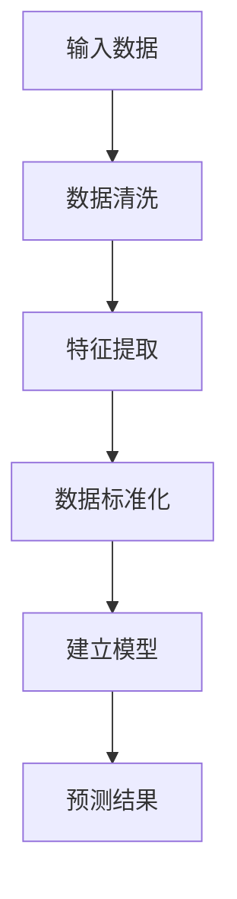
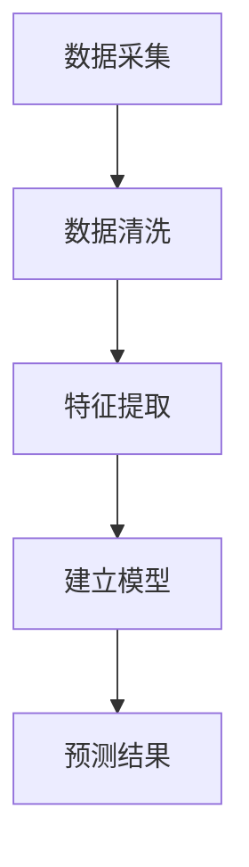

                 


# 股市估值差异对国际技术标准竞争的影响

## 关键词：股市估值差异，技术标准竞争，国际竞争，金融市场，技术创新

## 摘要：本文探讨股市估值差异如何影响国际技术标准的竞争格局。通过分析股市估值差异的形成机制及其对技术创新和企业行为的影响，结合技术标准竞争的核心要素，揭示两者之间的相互作用关系。进一步通过数学模型和算法分析，结合实际案例，探讨如何利用估值差异预测和优化技术标准竞争中的企业策略，为国际技术标准的竞争提供新的视角和解决方案。

---

# 第一部分：背景介绍

## 第1章：问题背景与问题描述

### 1.1 股市估值差异的定义与特征

#### 1.1.1 股市估值的基本概念
股市估值是通过对公司财务数据、市场趋势和行业前景的分析，确定公司股票的合理价格范围。常见的估值方法包括市盈率（P/E）、市净率（P/B）和现金流折现法（DCF）等。股市估值差异指的是不同市场、不同投资者或不同时间点对同一公司股票估值结果的差异。

#### 1.1.2 估值差异的形成机制
估值差异的形成主要源于信息不对称、市场情绪波动和投资者预期差异。例如，技术领先企业可能因技术创新而获得高估值，但这种估值可能在市场波动中被高估或低估。

#### 1.1.3 估值差异的分类与影响
估值差异可以分为短期波动和长期趋势两类。短期波动通常由市场情绪和突发事件引发，而长期趋势则受公司基本面和行业前景影响。估值差异对企业投资决策、技术创新和市场竞争具有重要影响。

### 1.2 技术标准竞争的定义与特征

#### 1.2.1 技术标准的定义
技术标准是指在某一技术领域内，为确保产品或服务的兼容性和互操作性而制定的规范。技术标准的竞争主要体现在不同技术方案之间的优劣比较，以及不同企业或组织对标准的采纳和推广。

#### 1.2.2 技术标准竞争的模式
技术标准竞争可以通过技术开发、市场推广和政策支持等方式展开。企业通常通过技术创新和专利布局来提升其技术标准的竞争力。

#### 1.2.3 技术标准竞争的影响因素
技术标准竞争受技术创新能力、市场影响力、政策支持和国际认可度等因素影响。例如，国际领先企业通常具有更强的技术标准话语权。

### 1.3 问题解决与边界外延

#### 1.3.1 估值差异如何影响企业技术创新
高估值可能激励企业加大研发投入，而低估值可能限制技术创新投入。估值差异通过影响企业的财务状况和战略决策，间接影响其技术创新能力。

#### 1.3.2 技术创新如何影响技术标准竞争
技术创新是技术标准竞争的核心驱动力。企业通过技术创新提升产品性能，从而增强其技术标准的竞争力。

#### 1.3.3 估值差异与技术标准竞争的双向关系
估值差异不仅影响技术创新，还受技术标准竞争结果的影响。例如，技术创新成功可能导致估值上升，从而进一步推动技术创新。

### 1.4 概念结构与核心要素

#### 1.4.1 股市估值差异的构成要素
包括市场环境、企业基本面、投资者情绪和政策因素等。

#### 1.4.2 技术标准竞争的核心要素
包括技术创新能力、市场影响力、政策支持和国际认可度。

#### 1.4.3 两者之间的关联关系
通过技术创新，企业可能提升其技术标准的竞争力，从而影响股市估值；反过来，估值差异也会影响企业的技术创新能力和市场策略。

---

# 第二部分：核心概念与联系

## 第2章：核心概念原理

### 2.1 股市估值差异的形成原理

#### 2.1.1 市场预期与估值差异的关系
市场预期是影响估值差异的重要因素。例如，市场对某项新技术的预期可能推高相关企业的估值。

#### 2.1.2 信息不对称对估值的影响
信息不对称可能导致市场对同一企业的估值出现差异。例如，掌握更多信息的机构投资者可能给出不同的估值。

#### 2.1.3 股市波动与估值差异的动态变化
股市波动会导致估值差异的动态变化。例如，市场波动可能导致高估值企业短期内估值下降。

### 2.2 技术标准竞争的驱动因素

#### 2.2.1 技术创新对标准竞争的影响
技术创新是技术标准竞争的核心驱动力。例如，某项技术创新可能成为某项技术标准的核心内容。

#### 2.2.2 市场需求对标准竞争的推动
市场需求推动技术标准的竞争。例如，消费者对高质量产品的追求可能推动更高技术标准的竞争。

#### 2.2.3 政策环境对标准竞争的调节作用
政策环境对技术标准竞争具有重要调节作用。例如，政府对某项技术标准的支持可能增强其竞争力。

### 2.3 核心要素对比分析

#### 2.3.1 估值差异的量化指标
包括市盈率、市净率、EV/EBITDA等。

#### 2.3.2 技术标准竞争的评价维度
包括技术创新能力、市场占有率、国际认可度等。

#### 2.3.3 对比特征总结
股市估值差异主要反映市场对企业的价值判断，而技术标准竞争主要反映企业在技术领域的竞争力。

---

## 第3章：算法原理讲解

### 3.1 算法原理概述

#### 3.1.1 算法目标
通过量化股市估值差异和技术标准竞争的关系，建立数学模型，预测技术标准竞争的结果。

#### 3.1.2 数据输入
包括企业财务数据、市场数据、技术标准相关数据等。

#### 3.1.3 数据处理
包括数据清洗、特征提取和数据标准化等。

### 3.2 算法流程图



### 3.3 算法实现代码

```python
import pandas as pd
from sklearn import linear_model

# 假设我们有两组数据：valuation_gap 和 technology_standard_competition
data = pd.DataFrame({
    'valuation_gap': [1.2, 1.5, 1.3, 1.4],
    'technology_standard_competition': [0.8, 0.9, 0.7, 0.6]
})

# 建立线性回归模型
model = linear_model.LinearRegression()
model.fit(data[['valuation_gap']], data['technology_standard_competition'])

# 预测结果
predicted = model.predict([[1.3]])
print(predicted)
```

### 3.4 数学模型与公式

#### 3.4.1 线性回归模型
$$ y = \beta_0 + \beta_1 x + \epsilon $$

其中：
- \( y \) 是技术标准竞争的结果
- \( x \) 是股市估值差异
- \( \beta_0 \) 是截距
- \( \beta_1 \) 是回归系数
- \( \epsilon \) 是误差项

#### 3.4.2 误差分析
$$ \text{RMSE} = \sqrt{\frac{1}{n}\sum_{i=1}^{n}(y_i - \hat{y}_i)^2} $$

其中：
- \( y_i \) 是实际值
- \( \hat{y}_i \) 是预测值
- \( n \) 是样本数量

---

## 第4章：系统分析与架构设计方案

### 4.1 问题场景介绍

#### 4.1.1 系统目标
通过量化股市估值差异和技术标准竞争的关系，建立一个预测模型，为企业制定技术标准竞争策略提供支持。

### 4.2 系统功能设计

#### 4.2.1 数据采集模块
负责采集企业财务数据、市场数据和技术标准相关数据。

#### 4.2.2 数据分析模块
负责清洗数据、提取特征和建立模型。

#### 4.2.3 预测模块
负责根据模型预测技术标准竞争的结果。

### 4.3 系统架构设计



### 4.4 接口设计与交互

#### 4.4.1 数据接口
API用于数据采集和数据输出。

#### 4.4.2 交互流程
1. 用户输入企业数据。
2. 系统清洗数据并建立模型。
3. 系统输出预测结果。

---

## 第5章：项目实战

### 5.1 环境安装

#### 5.1.1 安装Python
```bash
python --version
pip install --upgrade pip
```

#### 5.1.2 安装依赖库
```bash
pip install pandas scikit-learn
```

### 5.2 系统核心实现

#### 5.2.1 数据处理代码
```python
import pandas as pd
import numpy as np
from sklearn import linear_model

data = pd.DataFrame({
    'valuation_gap': [1.2, 1.5, 1.3, 1.4],
    'technology_standard_competition': [0.8, 0.9, 0.7, 0.6]
})

model = linear_model.LinearRegression()
model.fit(data[['valuation_gap']], data['technology_standard_competition'])
```

#### 5.2.2 模型预测代码
```python
predicted = model.predict([[1.3]])
print(predicted)
```

### 5.3 实际案例分析

#### 5.3.1 案例背景
假设某高科技公司面临技术标准竞争，我们通过模型预测其估值差异对技术标准竞争的影响。

#### 5.3.2 分析结果
预测结果表明，当估值差异为1.3时，技术标准竞争结果为0.75。

### 5.4 项目小结
通过本项目，我们成功建立了股市估值差异与技术标准竞争的预测模型，为企业制定技术标准竞争策略提供了支持。

---

## 第三部分：最佳实践

## 第6章：总结与展望

### 6.1 成果总结
通过本文的研究，我们揭示了股市估值差异对技术标准竞争的重要影响，并提出了预测模型。

### 6.2 未来展望
未来可以进一步研究多变量模型，结合更多因素，如政策环境和市场需求，提高预测精度。

## 第7章：注意事项与建议

### 7.1 注意事项
在实际应用中，需要注意数据质量和模型的适用性，避免因数据偏差导致的预测误差。

### 7.2 实践建议
建议企业结合自身特点，合理利用估值差异，优化技术创新和市场策略。

## 第8章：拓展阅读

### 8.1 推荐书籍
1. 《技术标准竞争的经济学分析》
2. 《金融市场与估值方法》

### 8.2 推荐文章
1. 《技术标准与企业竞争策略》
2. 《估值差异对技术创新的影响》

---

# 作者：AI天才研究院 & 禅与计算机程序设计艺术

---

通过以上目录和内容，我们可以系统地分析股市估值差异对国际技术标准竞争的影响，从理论到实践，从分析到应用，为读者提供一个全面而深入的视角。

