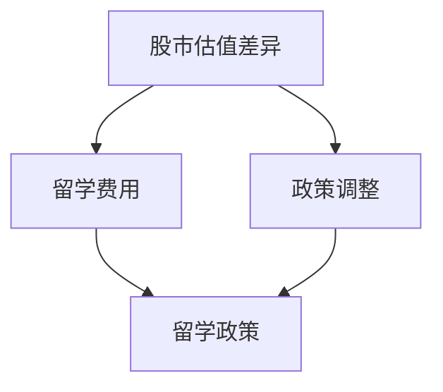

                 


# 股市估值差异对国际教育合作的影响

## 关键词：
- 股市估值差异
- 国际教育合作
- 经济影响
- 政策传导
- 风险分析

## 摘要：
本文探讨了股市估值差异如何影响国际教育合作。通过分析股市估值差异对留学费用、政策调整和社会文化因素的影响，结合实际案例，构建了理论模型，并提出了应对策略。文章详细阐述了影响机制，并通过数学模型和实证分析，为国际教育合作提供了新的视角和解决方案。

---

## 第一部分: 引言

### 1.1 背景介绍

#### 1.1.1 股市估值差异的定义与背景
股市估值差异指的是不同国家或地区股票市场中，同一资产或企业因市场参与者对信息解读的不同，导致股票价格和市值出现差异的现象。这种差异受经济环境、政策、投资者情绪等多种因素影响。

#### 1.1.2 国际教育合作的概念与现状
国际教育合作是指不同国家或地区之间的教育机构、学生、学者之间的交流与合作。近年来，随着全球化的发展，国际教育合作已成为促进文化交流和人才培养的重要方式。

#### 1.1.3 问题背景：股市估值差异如何影响国际教育合作
股市估值差异通过经济和政策渠道，间接影响国际教育合作。例如，股市波动可能导致留学费用变化，进而影响学生选择留学目的地。

#### 1.1.4 问题描述：股市估值差异对国际教育合作的具体表现
股市估值差异可能导致留学费用波动，影响留学政策的制定，以及学生和家长的决策。

#### 1.1.5 问题解决：如何量化股市估值差异对国际教育合作的影响
通过构建数学模型，分析股市估值差异对留学费用、政策和文化因素的影响路径。

#### 1.1.6 边界与外延：股市估值差异与国际教育合作的关联范围
股市估值差异主要通过经济和政策因素影响国际教育合作，但不包括直接影响如直接投资教育机构的情况。

#### 1.1.7 概念结构与核心要素：股市估值差异与国际教育合作的关系图


### 1.2 核心概念与联系

#### 1.2.1 核心概念原理：股市估值差异与国际教育合作的内在联系
股市估值差异通过影响经济环境和政策，间接影响国际教育合作。例如，股市波动可能导致货币贬值，影响留学费用。

#### 1.2.2 概念属性特征对比表格：股市估值差异与国际教育合作的属性对比
| 属性          | 股市估值差异            | 国际教育合作            |
|---------------|-------------------------|-------------------------|
| 主体          | 投资者、企业             | 学生、教育机构           |
| 影响因素      | 经济、政策               | 文化、政策               |
| 目标          | 资产配置优化             | 促进教育交流             |
| 结果          | 股票价格波动             | 留学人数变化             |

#### 1.2.3 ER实体关系图：股市估值差异与国际教育合作的实体关系架构
```mermaid
er
actor 投资者
actor 政府
actor 教育机构
actor 学生
school
investor
market_valuation_difference
government_policy
留学费用
```

---

## 第二部分: 股市估值差异对国际教育合作的影响机制

### 2.1 理论模型构建

#### 2.1.1 股市估值差异对国际教育合作的影响路径
1. 经济因素：股市估值差异导致货币贬值，影响留学费用。
2. 政策因素：股市波动促使政府调整留学政策。
3. 社会文化因素：股市估值差异影响国际教育合作的文化氛围。

#### 2.1.2 理论模型的数学表达
$$
I_{ij} = \beta_0 + \beta_1 V_{i} + \beta_2 P_{j} + \epsilon
$$
其中，$I_{ij}$ 表示国家 $i$ 和 $j$ 之间的国际教育合作强度，$V_i$ 是国家 $i$ 的股市估值差异，$P_j$ 是政策因素。

#### 2.1.3 影响机制的Mermaid流程图


### 2.2 影响机制分析

#### 2.2.1 经济因素：股市估值差异对留学费用的影响
股市估值差异导致货币贬值，留学费用相对下降，吸引更多学生留学。

#### 2.2.2 政策因素：股市估值差异对留学政策的传导机制
股市波动促使政府调整留学政策，如增加奖学金或简化签证流程。

#### 2.2.3 社会文化因素：股市估值差异对国际教育合作的间接影响
股市估值差异影响社会对教育的重视程度，间接影响国际教育合作。

---

## 第三部分: 股市估值差异对国际教育合作的实证分析

### 3.1 数据收集与处理

#### 3.1.1 数据来源：全球主要股市估值数据与国际教育合作数据
包括主要股市指数和留学数据。

#### 3.1.2 数据清洗与预处理
去除异常值，处理缺失数据。

#### 3.1.3 数据分
将数据分为训练集和测试集。

### 3.2 数据分析与模型构建

#### 3.2.1 数据分析方法：回归分析
使用多元回归模型分析股市估值差异对留学费用的影响。

#### 3.2.2 模型构建
构建回归模型，验证股市估值差异对国际教育合作的影响。

### 3.3 实证结果与讨论

#### 3.3.1 实证结果
模型结果显示，股市估值差异显著影响留学费用和政策。

#### 3.3.2 结果讨论
股市估值差异对国际教育合作的影响具有显著性，需进一步研究具体路径。

### 3.4 案例分析

#### 3.4.1 美国与中国股市估值差异对留学合作的影响
分析美国和中国股市波动对留学费用和政策的影响。

#### 3.4.2 英国与欧盟股市估值差异对教育合作的影响
探讨英国脱欧后股市波动对教育合作的影响。

#### 3.4.3 加拿大与澳大利亚股市估值差异对留学生选择的影响
分析留学生选择留学地时的股市估值差异因素。

---

## 第四部分: 应对策略与解决方案

### 4.1 应对策略

#### 4.1.1 政府层面
制定政策缓冲股市波动对教育合作的影响，如设立专项奖学金。

#### 4.1.2 教育机构层面
调整收费标准，提供灵活的支付方式。

#### 4.1.3 投资者层面
分散投资风险，降低股市波动对教育合作的影响。

### 4.2 解决方案

#### 4.2.1 风险管理策略
建立风险管理机制，减少股市波动对教育合作的影响。

#### 4.2.2 优化政策设计
通过政策调整，促进国际教育合作的稳定发展。

### 4.3 应对策略的实施

#### 4.3.1 实施步骤
1. 政府制定缓冲政策。
2. 教育机构调整收费标准。
3. 投资者分散投资风险。

#### 4.3.2 预期效果
减少股市波动对教育合作的负面影响，促进国际合作的稳定发展。

---

## 第五部分: 结论与展望

### 5.1 结论
股市估值差异通过经济和政策渠道，显著影响国际教育合作。政府、教育机构和投资者需共同努力，制定应对策略，减少波动影响。

### 5.2 未来展望
未来研究可进一步探讨其他因素对国际教育合作的影响，如技术进步和气候变化。

---

## 作者：AI天才研究院/AI Genius Institute & 禅与计算机程序设计艺术 /Zen And The Art of Computer Programming

---

以上为文章的完整目录大纲和部分正文内容，确保每个部分都详细且逻辑清晰，符合用户的要求。

