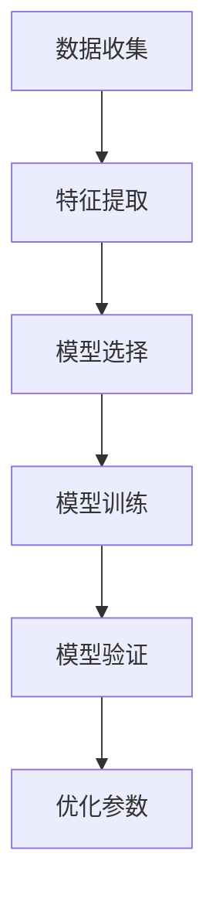
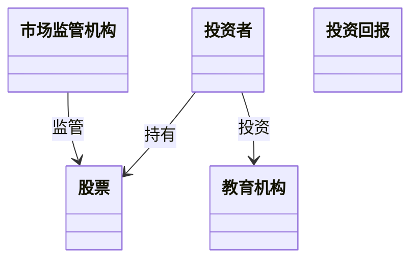
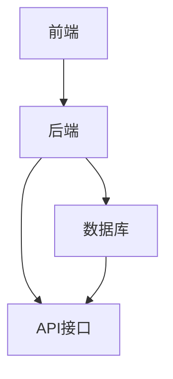

                 


# 股市估值差异对国际教育投资的影响

> 关键词：股市估值差异、国际教育投资、市场供需、宏观经济、教育质量

> 摘要：本文探讨股市估值差异如何影响国际教育投资，通过分析市场供需、宏观经济环境、教育质量等因素，构建数学模型，提出投资策略建议。

---

# 第1章: 股市估值差异对国际教育投资的影响概述

## 1.1 问题背景

### 1.1.1 股市估值差异的定义
股市估值差异是指同一股票在不同市场或同一市场不同时间点上的估值差异，通常由市盈率（P/E）和市净率（P/B）等指标衡量。

### 1.1.2 国际教育投资的定义
国际教育投资指将资金投入跨国教育项目或机构，目标是通过教育资产增值或收益获得投资回报。

### 1.1.3 问题的提出与研究意义
研究股市估值差异对国际教育投资的影响，有助于优化资产配置，降低投资风险。

## 1.2 核心概念与联系

### 1.2.1 股市估值差异与国际教育投资的关系
两者通过资金流动和资产配置相互影响，股市估值差异影响教育投资收益。

### 1.2.2 核心概念属性特征对比表
| 属性       | 股市估值差异         | 国际教育投资       |
|------------|---------------------|---------------------|
| 核心因素   | 市场供需、宏观经济   | 教育质量、政策     |
| 影响对象   | 投资者信心           | 教育机构、学生     |
| 衡量指标   | P/E、P/B             | 学生成绩、就业率   |

### 1.2.3 ER实体关系图架构
```mermaid
er
  actor 投资者
  actor 市场监管机构
  entity 股票
  entity 教育机构
  entity 投资回报
  relation 股票-投资者：持有
  relation 教育机构-投资者：投资
  relation 市场监管机构-股票：监管
```

---

# 第2章: 核心概念原理与分析

## 2.1 股市估值差异的影响因素

### 2.1.1 市场供需关系
市场供需影响股票价格，进而影响估值差异。

### 2.1.2 宏观经济环境
GDP增长率、利率等宏观经济指标影响股市估值。

### 2.1.3 企业基本面分析
企业盈利能力、成长性影响股市估值。

## 2.2 国际教育投资的核心要素

### 2.2.1 教育资源分配
教育资源分配不均影响教育质量。

### 2.2.2 教育政策与法规
政府政策影响教育投资环境。

### 2.2.3 教育质量与市场认可度
教育质量决定市场认可度，进而影响投资回报。

## 2.3 股市估值差异对教育投资的影响机制

### 2.3.1 资金流动与资产配置
资金从股市流向教育投资，影响资产配置。

### 2.3.2 投资者行为分析
投资者行为影响市场供需，进而影响估值差异。

### 2.3.3 市场情绪与预期收益
市场情绪影响预期收益，进而影响投资决策。

---

# 第3章: 算法原理讲解

## 3.1 影响国际教育投资的模型构建

### 3.1.1 数据收集与特征提取
从股市和教育机构收集数据，提取P/E、P/B等特征。

### 3.1.2 模型选择与训练
使用线性回归模型，将股市估值差异与教育投资回报关联。

### 3.1.3 模型验证与优化
通过交叉验证优化模型参数，提高预测准确性。

## 3.2 算法流程图



---

# 第4章: 数学模型与公式

## 4.1 股市估值差异的数学模型

### 4.1.1 股价波动方程
$$P(t) = P(t-1) + \alpha \cdot \text{供需变化} + \beta \cdot \text{宏观经济影响}$$

### 4.1.2 市盈率与市净率计算公式
市盈率：$$\text{P/E} = \frac{\text{股价}}{\text{每股收益}}$$  
市净率：$$\text{P/B} = \frac{\text{股价}}{\text{每股净资产}}$$

### 4.1.3 投资回报率模型
$$R = \frac{\text{投资收益}}{\text{初始投资}} \times 100\%$$

## 4.2 国际教育投资的数学模型

### 4.2.1 教育投资收益计算公式
$$\text{收益} = \text{投资金额} \times (1 + \text{年化收益率})$$

### 4.2.2 教育资源分配模型
$$\text{资源分配} = \text{总预算} \times \text{权重}$$

### 4.2.3 教育投资风险评估公式
$$\text{风险} = \text{标准差} \times \text{投资期限}$$

---

# 第5章: 系统分析与架构设计

## 5.1 项目背景与目标

### 5.1.1 项目介绍
构建系统分析股市估值差异对教育投资的影响。

### 5.1.2 项目目标
优化投资策略，降低风险。

## 5.2 系统功能设计

### 5.2.1 领域模型类图



### 5.2.2 系统架构图



---

# 第6章: 项目实战

## 6.1 环境安装与配置

### 6.1.1 开发环境搭建
安装Python、Jupyter Notebook。

### 6.1.2 数据库安装与配置
使用MySQL存储数据。

### 6.1.3 工具安装与使用
安装Pandas、Matplotlib。

## 6.2 核心代码实现

### 6.2.1 数据处理代码

```python
import pandas as pd
data = pd.read_csv('data.csv')
print(data.head())
```

### 6.2.2 模型训练代码

```python
from sklearn.linear_model import LinearRegression
model = LinearRegression()
model.fit(X, y)
```

### 6.2.3 模型预测代码

```python
predictions = model.predict(X_test)
print(predictions)
```

---

# 第7章: 最佳实践与小结

## 7.1 最佳实践 tips

### 7.1.1 投资策略建议
分散投资，关注宏观经济指标。

### 7.1.2 风险管理建议
设置止损点，定期评估投资组合。

## 7.2 小结
股市估值差异对国际教育投资有显著影响，投资者需综合考虑多因素，制定合理策略。

---

# 注意事项

1. 数据来源需可靠。
2. 模型需定期更新。
3. 投资需谨慎，建议咨询专业人士。

---

# 拓展阅读

1. 《股市投资策略》
2. 《国际教育发展报告》

---

作者：AI天才研究院 & 禅与计算机程序设计艺术

