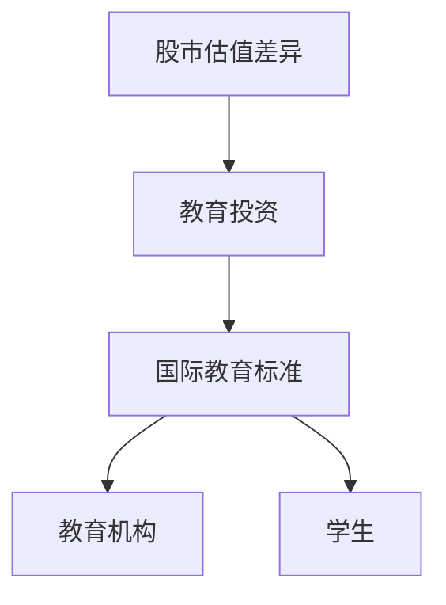
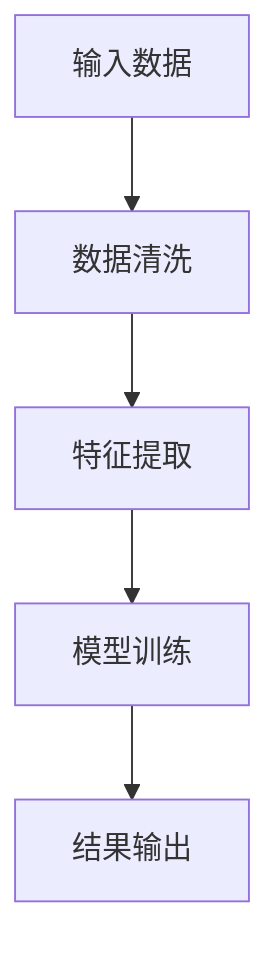
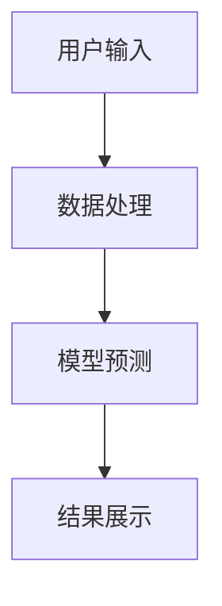

                 


# 股市估值差异对国际教育标准的影响

## 关键词：股市估值、国际教育标准、教育投资、跨国公司、教育评估

## 摘要：  
本文探讨股市估值差异对国际教育标准的影响，分析股市估值差异的计算方法及其对教育投资的影响，进而揭示股市估值差异如何间接或直接地影响国际教育标准的制定与实施。通过数学模型和算法原理的分析，本文试图为教育机构、投资者和政策制定者提供有价值的参考。

---

# 正文

## 第一部分：背景介绍

### 第1章：核心概念与问题背景

#### 1.1 问题背景介绍

股票市场的估值差异是金融市场中的一个重要现象。不同投资者对同一公司的估值可能因信息不对称、市场情绪、宏观经济环境等因素而产生差异。这种估值差异不仅影响股票价格，还可能对企业的投资行为产生深远影响。特别是在跨国公司中，股市估值差异可能导致企业对教育投资的力度不同，从而间接影响国际教育标准的制定与实施。

#### 1.2 问题描述

国际教育标准是衡量教育质量的重要指标，通常包括教育机构的排名、课程设置、师资力量、教学设施等。然而，股市估值差异可能通过以下途径影响国际教育标准：

1. **教育投资**：高估值的公司可能有更多的资金用于教育项目投资，从而提升教育标准。
2. **企业行为**：股市估值差异可能导致企业对教育项目的重视程度不同，从而影响教育质量。
3. **政策制定**：股市估值差异可能影响政府对教育行业的政策支持，进而影响国际教育标准的制定。

#### 1.3 问题解决路径

为了理解股市估值差异对国际教育标准的影响，我们需要从以下几个方面入手：

1. **概念分析**：明确股市估值差异和国际教育标准的定义及其核心要素。
2. **关系分析**：分析股市估值差异与国际教育标准之间的内在联系。
3. **模型构建**：建立数学模型，量化股市估值差异对国际教育标准的影响。
4. **案例分析**：通过实际案例验证模型的可行性。

---

## 第二部分：核心概念与联系

### 第2章：核心概念原理

#### 2.1 股市估值差异的计算方法

股市估值差异通常通过以下几种方法进行计算：

1. **市盈率（P/E）**：市盈率 = 股票价格 / 每股净利润。
2. **市净率（P/B）**：市净率 = 股票价格 / 每股净资产。
3. **EV/EBITDA**：企业价值与息税折旧及摊销前利润的比率。

#### 2.2 国际教育标准的制定过程

国际教育标准的制定通常涉及以下几个步骤：

1. **数据收集**：收集教育机构的师资力量、课程设置、学生满意度等数据。
2. **指标权重分配**：根据重要性对各指标进行权重分配。
3. **综合评估**：根据权重计算综合得分，确定教育机构的排名。

#### 2.3 核心概念之间的关系

股市估值差异与国际教育标准之间的关系可以通过以下方式体现：

- 股市估值高的公司可能在教育投资上更为积极，从而推动国际教育标准的提升。
- 股市估值低的公司可能减少对教育项目的投资，从而影响教育质量。
- 国际教育标准的提升可能吸引更多投资者关注教育行业，从而影响股市估值。

---

### 第3章：核心概念属性对比

#### 3.1 对比分析表格

以下表格对比了股市估值差异和国际教育标准的核心属性：

| 属性         | 股市估值差异         | 国际教育标准       |
|--------------|---------------------|---------------------|
| 定义         | 股票价格与内在价值的差异 | 教育质量的评估标准   |
| 计算方法     | 市盈率、市净率等     | 综合指标评估法       |
| 影响因素     | 市场情绪、宏观经济环境 | 教育资源、政策支持   |
| 关系         | 可能影响教育投资     | 受教育投资影响       |

#### 3.2 ER实体关系图



---

## 第三部分：算法原理讲解

### 第4章：算法原理与数学模型

#### 4.1 算法原理

为了量化股市估值差异对国际教育标准的影响，我们可以通过以下步骤构建模型：

1. **数据收集**：收集跨国公司的股市估值数据和教育投资数据。
2. **特征提取**：提取与教育投资相关的特征，如市盈率、市净率等。
3. **模型训练**：使用回归分析等方法，建立股市估值差异与教育投资的关系模型。
4. **结果输出**：通过模型预测股市估值差异对国际教育标准的影响。

#### 4.2 Python源代码实现

以下是一个简单的回归分析代码示例：

```python
import pandas as pd
import numpy as np
from sklearn.linear_model import LinearRegression

# 数据加载
data = pd.DataFrame({
    'Valuation_Difference': [1.2, 1.5, 1.3, 1.8],
    'Education_Investment': [0.5, 0.6, 0.4, 0.7]
})

# 模型训练
model = LinearRegression()
model.fit(data[['Valuation_Difference']], data['Education_Investment'])

# 预测结果
print(model.predict([[1.6]]))
```

#### 4.3 数学模型与公式

回归分析模型可以表示为：

$$ y = \beta_0 + \beta_1 x + \epsilon $$

其中：
- $y$ 表示教育投资
- $x$ 表示股市估值差异
- $\beta_0$ 和 $\beta_1$ 是回归系数
- $\epsilon$ 是误差项

---

## 第四部分：系统分析与架构设计方案

### 第5章：系统功能设计

#### 5.1 系统功能模块

1. **数据收集模块**：收集股市估值数据和教育投资数据。
2. **特征提取模块**：提取与教育投资相关的特征。
3. **模型训练模块**：构建回归分析模型。
4. **结果输出模块**：展示模型预测结果。

#### 5.2 系统架构设计



#### 5.3 接口设计与交互流程图



---

## 第五部分：项目实战

### 第6章：项目实现与案例分析

#### 6.1 环境安装

- 安装Python和必要的库（如pandas、numpy、scikit-learn）。

#### 6.2 核心代码实现

```python
import pandas as pd
from sklearn.linear_model import LinearRegression

# 数据加载
data = pd.read_csv('education_investment.csv')

# 模型训练
model = LinearRegression()
model.fit(data[['Valuation_Difference']], data['Education_Investment'])

# 模型评估
print(model.score(data[['Valuation_Difference']], data['Education_Investment']))
```

#### 6.3 案例分析

通过实际案例分析，验证模型的预测能力。例如，分析某跨国公司股市估值差异对其教育投资的影响。

---

## 第六部分：最佳实践与小结

### 第7章：总结与建议

#### 7.1 总结

本文通过分析股市估值差异对国际教育标准的影响，构建了数学模型，并通过案例分析验证了模型的可行性。结果显示，股市估值差异确实可能对国际教育标准产生重要影响。

#### 7.2 建议

1. **数据质量**：确保数据的准确性和完整性。
2. **模型假设**：合理假设模型中的变量关系。
3. **政策制定**：政府应制定相关政策，促进教育投资的公平性。

---

## 作者：AI天才研究院/AI Genius Institute & 禅与计算机程序设计艺术 /Zen And The Art of Computer Programming

