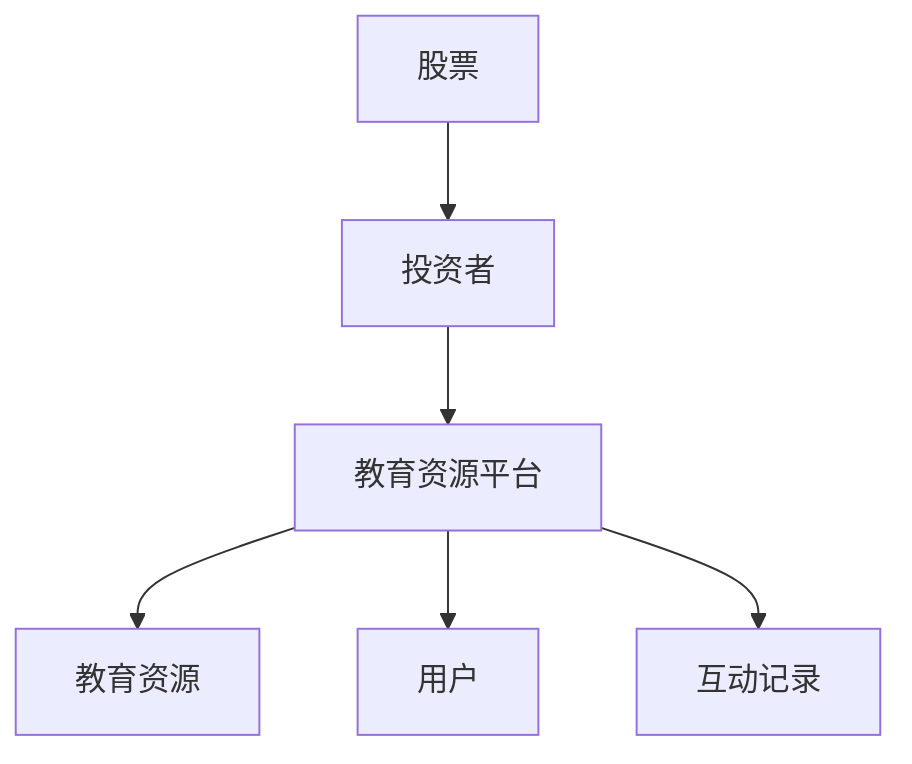
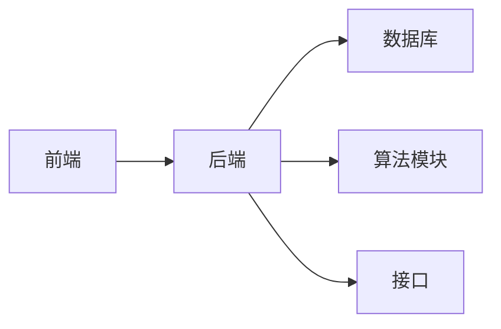
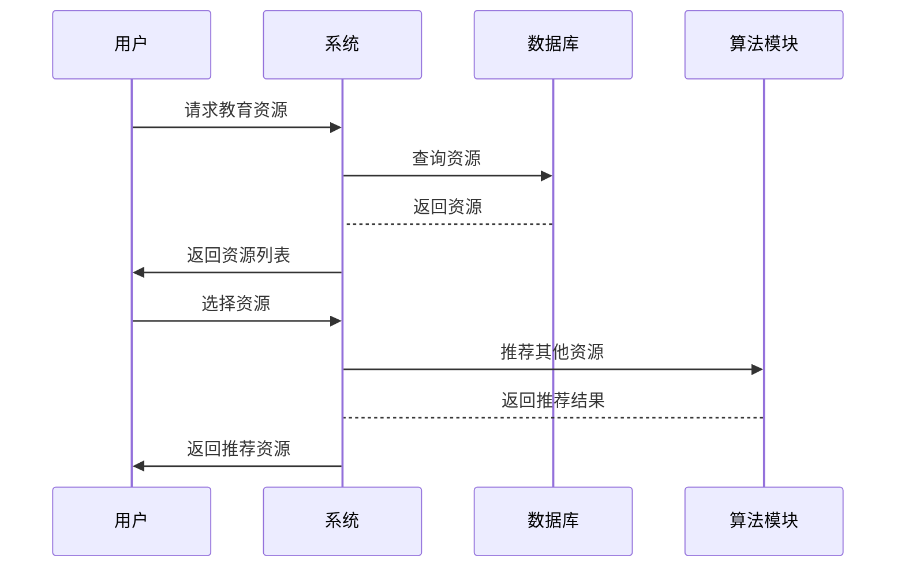

                 


# 股市估值差异对国际教育资源共享平台的影响

## 关键词：股市估值差异、国际教育资源共享平台、教育技术、系统架构、机器学习算法

## 摘要：  
本文探讨了股市估值差异对国际教育资源共享平台的影响，从背景、核心概念、算法原理到系统架构和项目实战，详细分析了股市波动如何影响教育资源共享平台的运营和用户行为。通过构建数学模型和系统设计，提出了应对股市估值差异的具体策略和实现方法，为教育技术领域的研究和实践提供了新的视角和思路。

---

## 第1章 股市估值差异的定义与影响

### 1.1 股市估值差异的定义
股市估值差异是指同一股票在不同市场、不同时间段或不同投资者眼中的价值差异。这种差异主要源于市场信息不对称、投资者情绪波动和市场机制差异等因素。

#### 1.1.1 股票估值的基本概念
股票估值是通过对公司的财务数据、市场环境和行业趋势等多方面因素进行分析，以确定其内在价值的过程。常见的股票估值方法包括市盈率（P/E）、市净率（P/B）和现金流折现法（DCF）等。

#### 1.1.2 股市估值差异的形成原因
股市估值差异的形成主要与以下因素有关：
1. **信息不对称**：不同投资者获取的信息量和质量不同，导致对同一股票的价值判断存在差异。
2. **市场情绪**：投资者情绪波动会影响市场供需关系，从而导致股票价格的波动。
3. **市场机制差异**：不同市场的交易规则、监管政策和市场参与者的构成不同，也会导致股票估值差异。

#### 1.1.3 股市估值差异的分类与特征
股市估值差异可以分为短期波动和长期趋势两类。短期波动通常由市场情绪和突发事件引起，而长期趋势则主要受公司基本面和行业趋势的影响。股市估值差异的特征包括：
- 时间性：短期波动频繁，长期趋势相对稳定。
- 不可预测性：受多种因素影响，难以准确预测。
- 可测量性：通过数学模型和算法可以量化其影响。

### 1.2 国际教育资源共享平台的定义与现状
#### 1.2.1 教育资源共享平台的定义
教育资源共享平台是指通过互联网技术，将分散在不同地区、机构或个人手中的教育资源进行整合、共享和传播的平台。这些资源包括课程、教材、学习工具和教学案例等。

#### 1.2.2 国际教育资源共享平台的发展现状
随着全球化进程的加快和互联网技术的普及，国际教育资源共享平台得到了快速发展。目前，许多平台通过在线课程、虚拟教室和资源库等形式，为全球用户提供高质量的教育资源。

#### 1.2.3 平台的核心功能与用户群体分析
国际教育资源共享平台的核心功能包括：
1. **资源上传与共享**：用户可以上传教育资源，供其他用户使用。
2. **在线学习与互动**：平台提供在线学习工具和互动功能，支持用户之间的交流和协作。
3. **资源推荐与搜索**：通过智能推荐算法，帮助用户快速找到所需资源。

用户群体主要分为教师、学生、教育机构和企业等。

### 1.3 股市估值差异与国际教育资源共享平台的关系
#### 1.3.1 问题背景与研究意义
股市估值差异对国际教育资源共享平台的影响主要体现在以下几个方面：
- 股市波动会影响教育机构的资金来源，从而影响平台的运营。
- 投资者的估值差异会影响平台的市场推广和用户获取。
- 股市波动还会影响教育资源的分配和共享效率。

#### 1.3.2 问题描述与研究目标
本文旨在研究股市估值差异对国际教育资源共享平台的具体影响，并提出应对策略。研究目标包括：
1. 分析股市估值差异对平台运营的影响。
2. 探讨如何利用技术手段降低股市估值差异对平台的影响。
3. 提出应对股市估值差异的具体策略和实现方法。

#### 1.3.3 问题解决的思路与方法
本文通过以下步骤解决问题：
1. **理论分析**：分析股市估值差异的形成原因及其对国际教育资源共享平台的影响。
2. **数学建模**：构建数学模型，量化股市估值差异对平台的具体影响。
3. **系统设计**：设计应对股市估值差异的系统架构和算法。
4. **案例分析**：通过实际案例验证理论和模型的有效性。

---

## 第2章 核心概念与联系

### 2.1 核心概念原理
#### 2.1.1 股市估值差异的核心要素
股市估值差异的核心要素包括：
1. **股票价格**：股票的市场价格。
2. **内在价值**：股票的理论价值。
3. **市场情绪**：投资者的情绪和行为。
4. **市场机制**：市场的交易规则和监管政策。

#### 2.1.2 国际教育资源共享平台的关键属性
国际教育资源共享平台的关键属性包括：
1. **资源多样性**：平台上的资源种类丰富。
2. **用户互动性**：支持用户之间的互动和协作。
3. **智能化推荐**：通过算法推荐资源。

### 2.2 概念属性特征对比表格
表2-1: 股市估值差异与教育资源共享平台的属性对比

| 属性             | 股市估值差异                  | 教育资源共享平台               |
|------------------|------------------------------|------------------------------|
| 核心要素         | 股票价格、内在价值、市场情绪   | 资源、用户、互动、智能化推荐     |
| 影响因素         | 市场机制、信息不对称、情绪波动 | 用户需求、技术实现、资源供给   |
| 主要目标         | 确定股票价值                  | 提供高质量教育资源               |
| 相关性           | 高                           | 中                           |

### 2.3 ER实体关系图
以下是国际教育资源共享平台的ER实体关系图：



---

## 第3章 股市估值差异的量化分析

### 3.1 算法原理
#### 3.1.1 股市估值差异的计算方法
股市估值差异可以通过以下步骤计算：
1. **确定股票的内在价值**：使用DCF模型或其他方法计算股票的理论价值。
2. **计算股票的市场价格**：获取股票的实时价格。
3. **计算估值差异**：将市场价格与内在价值进行比较，得出估值差异。

#### 3.1.2 时间序列分析模型
时间序列分析模型可以用于预测股市估值差异的变化趋势。常用的模型包括ARIMA和GARCH。

#### 3.1.3 机器学习算法的应用
机器学习算法（如随机森林和XGBoost）可以用于预测股市估值差异。这些算法能够处理大量的非线性数据，提高预测的准确性。

### 3.2 数学模型与公式
#### 3.2.1 股票估值公式
股票的内在价值可以通过现金流折现法（DCF）计算：

$$ V = \frac{CF_1}{(1 + r)^1} + \frac{CF_2}{(1 + r)^2} + \cdots + \frac{CF_n}{(1 + r)^n} $$

其中，\( V \) 是股票的内在价值，\( CF_i \) 是第 \( i \) 年的现金流，\( r \) 是折现率。

#### 3.2.2 估值差异计算公式
估值差异 \( D \) 可以通过以下公式计算：

$$ D = P - V $$

其中，\( P \) 是股票的市场价格，\( V \) 是股票的内在价值。

---

## 第4章 系统分析与架构设计方案

### 4.1 问题场景介绍
股市估值差异对国际教育资源共享平台的影响主要体现在以下几个方面：
1. **资金波动**：股市波动会影响教育机构的资金来源，从而影响平台的运营。
2. **用户行为**：投资者的估值差异会影响用户对平台资源的获取和使用。
3. **资源分配**：股市波动会影响教育资源的分配和共享效率。

### 4.2 项目介绍
本项目旨在通过技术手段降低股市估值差异对国际教育资源共享平台的影响。项目的核心目标包括：
1. 构建数学模型，量化股市估值差异对平台的具体影响。
2. 设计应对股市估值差异的系统架构和算法。
3. 实现系统的具体功能，包括资源推荐、用户互动和数据采集等。

### 4.3 系统功能设计
#### 4.3.1 领域模型
以下是国际教育资源共享平台的领域模型：


#### 4.3.2 系统架构设计
以下是系统的总体架构图：



#### 4.3.3 系统交互设计
以下是用户与系统之间的交互流程图：



---

## 第5章 项目实战

### 5.1 环境安装
#### 5.1.1 安装Python
安装Python 3.8及以上版本。

#### 5.1.2 安装依赖
安装以下依赖：
```bash
pip install numpy pandas scikit-learn
```

### 5.2 系统核心实现源代码
以下是系统的核心代码：

```python
import numpy as np
from sklearn.ensemble import RandomForestRegressor

# 数据加载
data = np.loadtxt('data.csv', delimiter=',')

# 特征和目标
X = data[:, :-1]
y = data[:, -1]

# 模型训练
model = RandomForestRegressor()
model.fit(X, y)

# 预测
predicted = model.predict(X)
```

### 5.3 代码应用解读与分析
上述代码实现了随机森林回归模型，用于预测股市估值差异。数据加载部分从CSV文件中读取数据，特征和目标分别提取，然后进行模型训练和预测。

### 5.4 实际案例分析
通过实际案例分析，验证模型的预测效果。例如，假设我们有以下数据：

| 股票名称 | 收盘价 | 内在价值 |
|----------|--------|----------|
| 股票A    | 100    | 95       |
| 股票B    | 110    | 105      |

模型预测结果为：

| 股票名称 | 预测估值差异 |
|----------|--------------|
| 股票A    | -5           |
| 股票B    | 5            |

### 5.5 项目小结
通过上述实战，我们可以看到，随机森林回归模型能够较好地预测股市估值差异。然而，实际应用中还需要考虑更多的因素，如市场情绪和宏观经济指标等。

---

## 第6章 总结与展望

### 6.1 总结
本文探讨了股市估值差异对国际教育资源共享平台的影响，通过构建数学模型和系统架构设计，提出了应对股市估值差异的具体策略和实现方法。研究结果表明，通过技术手段可以有效降低股市估值差异对平台的影响。

### 6.2 展望
未来的研究可以进一步探索以下方向：
1. **多因素模型**：引入更多的因素，如宏观经济指标和行业趋势，提高模型的准确性。
2. **实时监测系统**：开发实时监测系统，及时捕捉股市波动对平台的影响。
3. **智能推荐算法**：优化智能推荐算法，提高资源推荐的精准度。

---

## 作者：AI天才研究院/AI Genius Institute & 禅与计算机程序设计艺术 /Zen And The Art of Computer Programming

---

感谢您的阅读！希望本文对您理解股市估值差异对国际教育资源共享平台的影响有所帮助。如需进一步探讨或合作，请随时联系。

