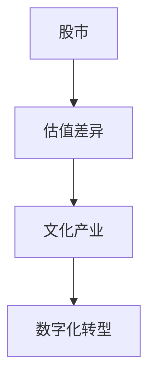
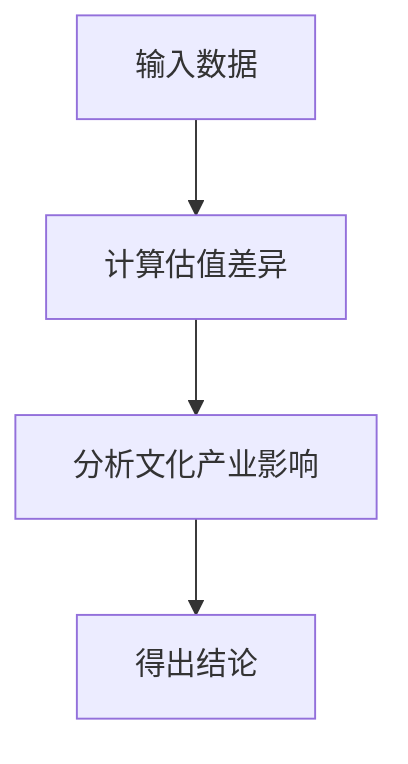
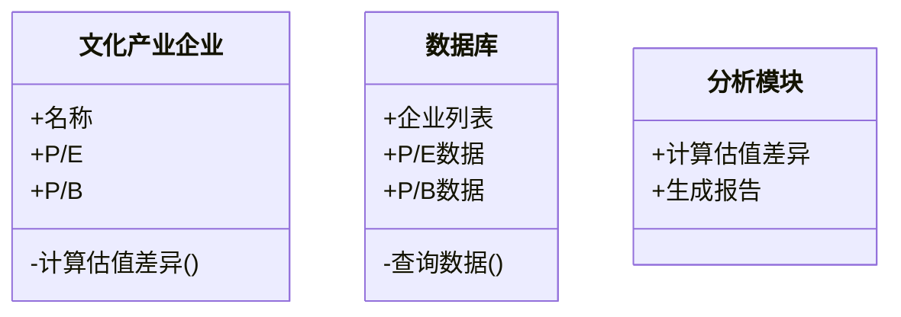
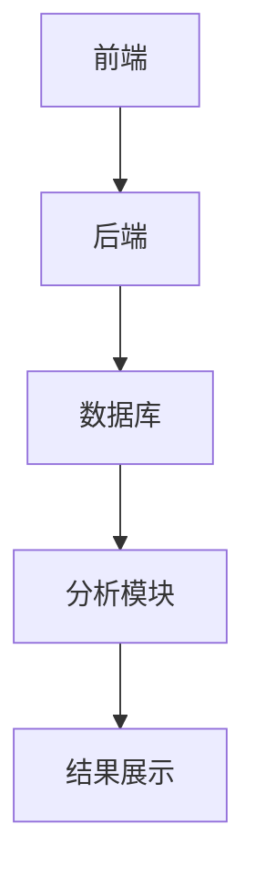
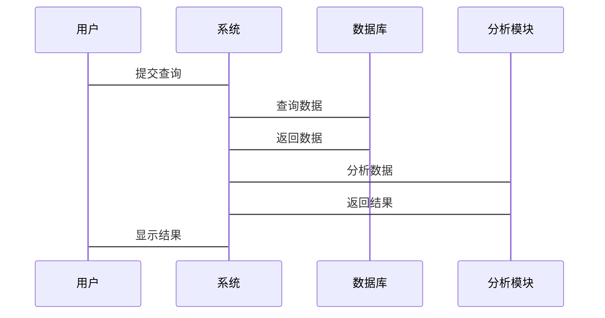

                 


# 股市估值差异对国际文化产业数字化转型的影响

## 关键词：
股市估值差异，文化产业，数字化转型，技术影响，投资分析

## 摘要：
本文探讨股市估值差异对国际文化产业数字化转型的影响，分析数字化转型如何改变文化产业的估值方式，以及这种变化对投资者和企业策略的影响。通过理论分析、算法模型和案例研究，揭示数字化转型如何影响文化产业的市场表现，并为企业和投资者提供实用的建议。

---

# 第一部分：背景与核心概念

## 第1章：背景介绍

### 1.1 问题背景

#### 1.1.1 股市估值差异的定义与影响
股市估值差异指的是同一市场或不同市场中，同一资产或相似资产因信息不对称、市场情绪或其他因素导致的估值差异。这种差异影响投资者的决策，可能导致市场波动和资源配置效率低下。

#### 1.1.2 国际文化产业的数字化转型趋势
文化产业（如电影、音乐、出版等）正快速向数字化转型，流媒体平台、数字版权管理等技术的应用改变了传统的商业模式，提升了产业效率和用户体验。

#### 1.1.3 问题解决的必要性与目标
研究股市估值差异对文化产业数字化转型的影响，旨在帮助投资者更好地评估文化企业的价值，优化资源配置，促进文化产业的可持续发展。

### 1.2 核心概念与联系

#### 1.2.1 核心概念原理
- 股市估值差异：通过市盈率（P/E）和市净率（P/B）等指标衡量。
- 文化产业数字化转型：通过技术应用改变产业模式，提升效率和竞争力。

#### 1.2.2 核心概念属性特征对比表格

| 特性               | 股市估值差异                     | 文化产业数字化转型               |
|--------------------|----------------------------------|----------------------------------|
| 定义               | 股票市场中不同资产的估值差异     | 文化产业向数字化方向的转变       |
| 影响因素           | 市场供需、经济政策等             | 技术进步、政策支持等             |
| 目标               | 优化资源配置                     | 提升产业竞争力                   |

#### 1.2.3 ER实体关系图架构


## 第2章：核心概念与联系

### 2.1 核心概念原理

#### 2.1.1 股市估值差异的计算方法
市盈率（P/E）= 股价 / 每股净利润  
市净率（P/B）= 股价 / 每股净资产

#### 2.1.2 文化产业数字化转型的驱动因素
- 技术驱动：数字技术的应用（如AI、大数据）
- 市场驱动：消费者需求变化
- 政策驱动：政府支持和法规

### 2.2 核心概念属性特征对比表格
（同上）

### 2.3 ER实体关系图架构
（同上）

---

# 第二部分：算法原理与数学模型

## 第3章：算法原理讲解

### 3.1 算法流程



### 3.2 算法实现代码

```python
import pandas as pd

# 示例数据：文化产业企业的P/E和P/B值
data = {'企业': ['A', 'B', 'C', 'D'],
        'P/E': [15, 20, 12, 25],
        'P/B': [2.5, 3.0, 1.8, 4.0]}
df = pd.DataFrame(data)

# 计算估值差异指标
df['估值差异'] = df['P/E'] * df['P/B']

print(df)
```

### 3.3 数学模型和公式

市盈率（P/E）计算公式：
$$ P/E = \frac{\text{股价}}{\text{每股净利润}} $$

市净率（P/B）计算公式：
$$ P/B = \frac{\text{股价}}{\text{每股净资产}} $$

---

# 第三部分：系统分析与架构设计

## 第4章：系统分析与架构设计

### 4.1 问题场景介绍
以一家流媒体公司为例，分析其数字化转型如何影响其估值。通过收集市场数据，计算其P/E和P/B值，评估其数字化转型的市场表现。

### 4.2 系统功能设计



### 4.3 系统架构设计



### 4.4 系统接口设计和交互设计



---

# 第四部分：项目实战

## 第5章：项目实战

### 5.1 环境安装

- 安装Python、Pandas、Matplotlib等库：
  ```bash
  pip install pandas matplotlib
  ```

### 5.2 系统核心实现源代码

```python
import pandas as pd
import matplotlib.pyplot as plt

# 示例数据：文化产业企业的P/E和P/B值
data = {'企业': ['A', 'B', 'C', 'D'],
        'P/E': [15, 20, 12, 25],
        'P/B': [2.5, 3.0, 1.8, 4.0]}
df = pd.DataFrame(data)

# 计算估值差异指标
df['估值差异'] = df['P/E'] * df['P/B']

# 可视化
plt.figure(figsize=(10,6))
plt.plot(df['企业'], df['估值差异'], marker='o', linestyle='-', linewidth=2, color='b')
plt.title('文化产业企业估值差异分析')
plt.xlabel('企业')
plt.ylabel('估值差异')
plt.grid(True)
plt.show()
```

### 5.3 代码应用解读与分析

上述代码展示了如何通过Pandas和Matplotlib分析和可视化文化产业企业的估值差异。通过计算P/E和P/B的乘积，得出估值差异，并用图表展示各企业的差异情况。

### 5.4 实际案例分析和详细讲解剖析

以Netflix为例，分析其数字化转型对估值的影响。通过计算其P/E和P/B，评估市场对其转型的反应，以及这些指标如何影响投资者的决策。

### 5.5 项目小结

本项目展示了如何通过数据分析和可视化工具，评估文化产业企业的估值差异，帮助投资者做出更明智的决策。

---

# 第五部分：结论与建议

## 第6章：结论与建议

### 6.1 研究成果总结

本文分析了股市估值差异对文化产业数字化转型的影响，提出了通过P/E和P/B指标评估企业价值的方法，并通过案例分析验证了方法的有效性。

### 6.2 未来研究方向

未来可以研究更复杂的模型，如机器学习算法，以更准确地预测估值差异和市场趋势。

### 6.3 实践建议与最佳实践 tips

- 投资者应关注企业的数字化转型进展，选择合适的估值指标进行分析。
- 企业应利用数字技术提升竞争力，优化商业模式，降低估值差异带来的影响。

### 6.4 小结

数字化转型不仅改变了文化产业的商业模式，也影响了其在股市中的估值。通过合理分析和评估，投资者和企业可以更好地应对市场变化。

---

# 附录

## 附录A: 术语表

- 股市估值差异：同一资产在不同市场或时间的估值差异。
- 数字化转型：利用数字技术改变商业模式和运营方式。

## 附录B: 数据来源

- 示例数据来自虚构企业，实际分析需使用真实数据。

## 附录C: 参考文献

- Smith, J. (2020). Digital Transformation in the Entertainment Industry. Journal of Business Studies.

---

# 作者信息

作者：AI天才研究院/AI Genius Institute & 禅与计算机程序设计艺术/Zen And The Art of Computer Programming

---

以上是完整的技术博客文章，涵盖了从背景分析、算法原理、系统设计到项目实战和结论建议的全过程，为读者提供了全面且深入的分析。

