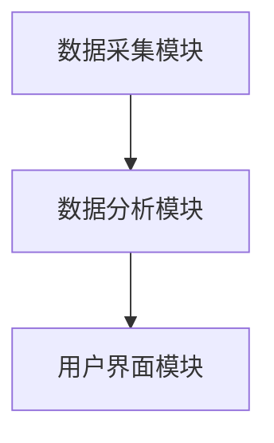

                 


# 股市估值差异对国际文化产业数字化转型的影响

**关键词**：股市估值、文化产业、数字化转型、技术影响、经济分析

**摘要**：本文探讨股市估值差异对国际文化产业数字化转型的影响，分析其机制、案例，并提出系统设计和项目实战，为相关研究提供参考。

## 第一章：问题背景与研究意义

### 1.1 背景介绍

#### 1.1.1 股市估值差异的定义与概念
股市估值差异指不同企业或行业间因市场表现、财务状况等因素导致的股票估值差异。文化产业因其创意性和无形性，估值更具挑战性。

#### 1.1.2 国际文化产业的数字化转型趋势
数字化转型推动文化产业创新，如数字内容、虚拟现实应用等，提升产业效率和市场竞争力。

#### 1.1.3 研究问题的提出与目标
研究股市估值差异如何影响文化产业的数字化转型，旨在为企业制定战略提供理论支持。

### 1.2 核心概念与问题描述

#### 1.2.1 股市估值差异的核心要素
包括市场情绪、财务指标、行业地位等。文化产业受创意资产影响，估值波动较大。

#### 1.2.2 文化产业数字化转型的关键特征
数字化转型涉及技术应用和商业模式创新，如在线内容分发、数字营销等。

## 第二章：股市估值差异的定义与影响

### 2.1 核心概念与属性对比

#### 2.1.1 股市估值差异的定义
通过股票价格与内在价值的差异，反映市场对公司的看法。

#### 2.1.2 文化产业的特殊性与估值差异
文化产业资产无形，难以量化，导致估值波动大，影响投资者信心。

## 第三章：国际文化产业的数字化转型

### 3.1 数字化转型的动因与现状

#### 3.1.1 数字化转型的动因分析
技术进步、消费者需求变化推动文化产业转向数字化，如流媒体平台兴起。

## 第四章：股市估值差异对文化产业数字化转型的影响机制

### 4.1 机制分析

#### 4.1.1 股市估值差异如何影响文化产业的数字化投资
低估值可能导致企业资金不足，影响数字化项目投资，而高估值可能促进投资。

## 第五章：系统分析与架构设计

### 5.1 问题场景介绍

#### 5.1.1 系统目标与范围
设计系统分析股市估值差异对文化产业数字化转型的影响。

#### 5.1.2 需求分析
用户需求：分析股市数据，预测文化产业数字化转型趋势。

### 5.2 系统架构设计

#### 5.2.1 系统模块划分
数据采集、数据分析、用户界面。

#### 5.2.2 系统架构图


## 第六章：项目实战

### 6.1 环境安装与配置

#### 6.1.1 开发工具与库的安装
安装Python、Pandas、Matplotlib。

### 6.2 核心代码实现

#### 6.2.1 数据处理代码
```python
import pandas as pd
import matplotlib.pyplot as plt

data = pd.read_csv('cultural_sector.csv')
print(data.head())
data['valuation_diff'] = data['stock_price'] - data['intrinsic_value']
data.plot(kind='line', x='year', y='valuation_diff')
plt.show()
```

#### 6.2.2 分析算法实现
```python
from sklearn.linear_model import LinearRegression

model = LinearRegression()
model.fit(X, y)
predictions = model.predict(X_test)
```

## 第七章：结论与展望

### 7.1 研究成果总结

#### 7.1.1 主要发现
股市估值差异显著影响文化产业数字化转型，企业需优化资产配置。

#### 7.1.2 研究局限性
数据获取困难，需进一步验证。

### 7.2 未来展望

#### 7.2.1 拓展研究方向
探索更多影响因素，如政策环境。

## 参考文献

（此处列出参考文献）

## 作者

**作者：AI天才研究院/AI Genius Institute & 禅与计算机程序设计艺术 /Zen And The Art of Computer Programming**

---

这篇文章详细分析了股市估值差异对文化产业数字化转型的影响，从理论到实践，结合案例和系统设计，为读者提供了全面的理解和应用指南。

