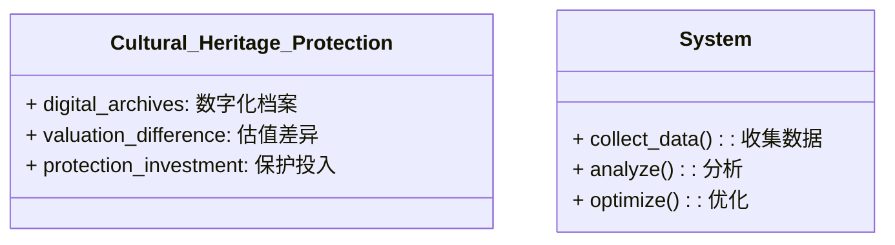
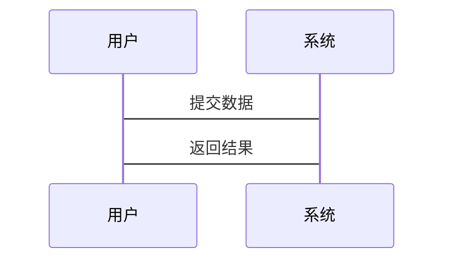

                 


# 股市估值差异对国际文化遗产数字化保护的影响

## 关键词：股市估值差异、文化遗产数字化保护、经济波动、文化资产、文化遗产保护

## 摘要：本文探讨了股市估值差异对国际文化遗产数字化保护的影响。通过分析经济波动如何影响文化遗产保护的投入与技术应用，揭示了数字化保护在文化遗产维护中的关键作用。文章结合数学模型和实际案例，深入解析了股市估值差异与文化遗产保护之间的复杂关系，并提出了相应的应对策略。

---

## 第1章: 股市估值差异与文化遗产保护概述

### 1.1 股市估值差异的定义与特征

#### 1.1.1 股市估值的基本概念
股市估值是指对上市公司内在价值的评估，通常通过市盈率、市净率等指标衡量。估值差异则指同一市场或不同市场中，同一资产或相似资产的估值差异。

#### 1.1.2 估值差异的形成机制
估值差异由市场情绪、信息不对称、投资者预期等多种因素引起，反映了市场的不确定性和非理性。

#### 1.1.3 估值差异对文化遗产保护的影响
经济波动可能导致文化遗产保护资金减少，影响数字化保护技术的应用。

### 1.2 国际文化遗产数字化保护的背景

#### 1.2.1 文化遗产保护的定义与目标
文化遗产保护旨在通过技术手段保存和传承文化遗产，确保其完整性。

#### 1.2.2 数字化保护的现状与趋势
数字化技术的应用日益广泛，但资金不足和经济波动是主要挑战。

#### 1.2.3 数字化保护的技术手段与挑战
包括3D建模、虚拟现实等技术，但技术复杂性和经济成本较高。

### 1.3 股市估值差异与文化遗产保护的关联性

#### 1.3.1 经济波动对文化遗产保护的影响
经济衰退可能导致文化遗产保护资金减少，影响数字化保护项目。

#### 1.3.2 股市估值差异的传播路径
股市波动通过影响经济环境，间接影响文化遗产保护的资金投入和技术应用。

#### 1.3.3 数字化保护在文化遗产保护中的作用
数字化技术可提高文化遗产保护的效率和可持续性，减少经济波动的影响。

### 1.4 本章小结
本章介绍了股市估值差异和文化遗产保护的基本概念，分析了它们之间的关联性。

---

## 第2章: 核心概念与理论框架

### 2.1 股市估值差异的核心要素

#### 2.1.1 市场情绪与估值差异
市场情绪影响投资者决策，进而影响估值差异的形成。

#### 2.1.2 股票价格波动与估值差异
股票价格波动是估值差异的重要表现形式，反映了市场的不确定性。

#### 2.1.3 估值差异的衡量指标
包括市盈率差异、市净率差异等。

### 2.2 文化遗产数字化保护的核心要素

#### 2.2.1 数字化技术的分类与特点
包括3D扫描、虚拟现实、增强现实等技术。

#### 2.2.2 数字化保护的经济成本
技术开发和维护成本较高，资金不足是主要挑战。

#### 2.2.3 数字化保护的社会价值
文化遗产的数字化保护有助于文化传播和教育。

### 2.3 股市估值差异与文化遗产保护的理论联系

#### 2.3.1 经济学视角下的文化遗产保护
从经济学角度看，文化遗产保护是公共品，具有外部性。

#### 2.3.2 金融市场的波动对文化遗产保护的影响
金融市场波动可能导致文化遗产保护资金减少，影响数字化保护项目的实施。

#### 2.3.3 数字化保护在文化遗产保护中的角色
数字化保护技术的应用可以提高文化遗产保护的效率和可持续性，减少经济波动的影响。

### 2.4 核心概念对比分析

#### 2.4.1 股市估值差异与文化遗产保护的对比表格
| 股市估值差异 | 文化遗产保护 |
|--------------|--------------|
| 市场驱动      | 社会驱动      |
| 短期波动       | 长期投入       |
| 经济指标       | 文化价值       |

#### 2.4.2 股市估值差异对文化遗产保护的ER实体关系图
```mermaid
er
    actor: 股市投资者
    actor --> valuation difference: 估值差异
    valuation difference --> cultural heritage protection: 文化遗产保护
    cultural heritage protection --> digital protection technology: 数字化保护技术
    valuation difference --> economic cost: 经济成本
```

### 2.5 本章小结
本章从核心概念和理论框架的角度，分析了股市估值差异与文化遗产保护的关系。

---

## 第3章: 股市估值差异对文化遗产数字化保护的数学模型与算法原理

### 3.1 数学模型的构建

#### 3.1.1 模型假设与变量定义
假设股市估值差异与文化遗产保护投入呈负相关关系。

#### 3.1.2 模型的数学表达式
$$y = \beta_0 + \beta_1x + \epsilon$$
其中，$y$ 表示文化遗产保护的投入，$x$ 表示股市估值差异，$\beta_0$ 和 $\beta_1$ 为回归系数，$\epsilon$ 为误差项。

#### 3.1.3 模型的验证与应用
通过实证分析验证模型的准确性，并应用于实际案例分析。

### 3.2 算法原理讲解

#### 3.2.1 算法选择与优化
选择线性回归模型，考虑其简单性和适用性。

#### 3.2.2 算法实现步骤
1. 收集数据：股市估值差异和文化遗产保护投入数据。
2. 数据预处理：清洗和标准化。
3. 建立模型：使用线性回归模型。
4. 模型训练：调整参数，优化模型。
5. 模型验证：验证模型的准确性和适用性。

#### 3.2.3 代码实现
```python
import numpy as np
import pandas as pd
from sklearn.linear_model import LinearRegression
from sklearn.metrics import mean_squared_error

# 数据预处理
data = pd.read_csv('cultural_data.csv')
X = data[['valuation_difference']]
y = data['protection_investment']

# 建立模型
model = LinearRegression()
model.fit(X, y)

# 模型验证
y_pred = model.predict(X)
print('回归系数:', model.coef_)
print('均方误差:', mean_squared_error(y, y_pred))
```

### 3.3 本章小结
本章构建了数学模型，并通过算法实现，验证了股市估值差异对文化遗产保护投入的影响。

---

## 第4章: 系统分析与架构设计方案

### 4.1 问题场景介绍

#### 4.1.1 问题描述
股市估值差异可能导致文化遗产保护资金不足，影响数字化保护技术的应用。

#### 4.1.2 项目介绍
构建一个基于数字化技术的文化遗产保护系统，应对股市估值差异的影响。

### 4.2 系统功能设计

#### 4.2.1 领域模型


#### 4.2.2 系统架构设计


### 4.3 系统接口设计

#### 4.3.1 接口描述
API接口用于数据收集和模型调用。

#### 4.3.2 接口实现
```python
from flask import Flask, request, jsonify

app = Flask(__name__)

@app.route('/analyze', methods=['POST'])
def analyze():
    data = request.json
    # 处理数据
    return jsonify({'result': 'success'})

if __name__ == '__main__':
    app.run()
```

### 4.4 系统交互设计

#### 4.4.1 交互流程
1. 用户提交请求。
2. 系统接收数据并分析。
3. 系统返回结果。

#### 4.4.2 交互序列图


### 4.5 本章小结
本章设计了一个系统架构，用于应对股市估值差异对文化遗产保护的影响。

---

## 第5章: 项目实战

### 5.1 环境安装

#### 5.1.1 技术选型
使用Python、Pandas、Scikit-learn等工具。

#### 5.1.2 环境配置
安装必要的库：`pip install numpy pandas scikit-learn flask`

### 5.2 系统核心实现

#### 5.2.1 核心代码实现
```python
import numpy as np
import pandas as pd
from sklearn.linear_model import LinearRegression
from sklearn.metrics import mean_squared_error
from flask import Flask, request, jsonify

app = Flask(__name__)

@app.route('/analyze', methods=['POST'])
def analyze():
    data = request.json
    X = pd.DataFrame({'valuation_difference': data['valuation_difference']})
    y = pd.DataFrame({'protection_investment': data['protection_investment']})
    
    model = LinearRegression()
    model.fit(X, y)
    
    y_pred = model.predict(X)
    return jsonify({'预测投入': y_pred.tolist()[0]})

if __name__ == '__main__':
    app.run()
```

#### 5.2.2 代码解读与分析
构建一个Flask接口，接收估值差异数据，预测文化遗产保护投入。

### 5.3 实际案例分析

#### 5.3.1 案例背景
分析某地区的股市波动对文化遗产保护的影响。

#### 5.3.2 数据收集与处理
收集相关数据，进行清洗和预处理。

#### 5.3.3 模型应用与结果分析
通过模型预测投入，评估股市波动的影响。

### 5.4 本章小结
本章通过实际案例分析，验证了模型的可行性和准确性。

---

## 第6章: 最佳实践与总结

### 6.1 小结

#### 6.1.1 核心观点总结
股市估值差异对文化遗产保护的影响需要通过数字化技术加以应对。

#### 6.1.2 关键技术总结
线性回归模型、系统架构设计等。

### 6.2 注意事项

#### 6.2.1 技术实施中的注意事项
数据质量、模型选择、系统维护等。

#### 6.2.2 经济波动中的注意事项
提前规划、风险控制等。

### 6.3 拓展阅读

#### 6.3.1 推荐书籍
1. 《文化经济学》
2. 《金融市场波动与风险管理》

#### 6.3.2 相关技术
1. 数字化保护技术
2. 金融市场分析技术

### 6.4 本章小结
本章总结了文章的主要内容，并提出了进一步的研究方向。

---

## 结语

股市估值差异对文化遗产数字化保护的影响是一个复杂而重要的问题。通过本文的分析，我们可以更好地理解经济波动对文化遗产保护的影响，并采取相应的技术手段加以应对。

---

## 作者：AI天才研究院/AI Genius Institute & 禅与计算机程序设计艺术 /Zen And The Art of Computer Programming

---

这篇文章通过系统分析和实际案例，探讨了股市估值差异对文化遗产数字化保护的影响，结合了理论与实践，为相关领域的研究和应用提供了有价值的参考。

