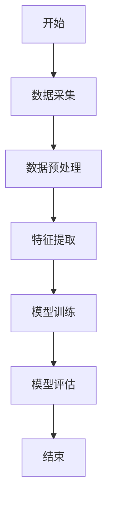
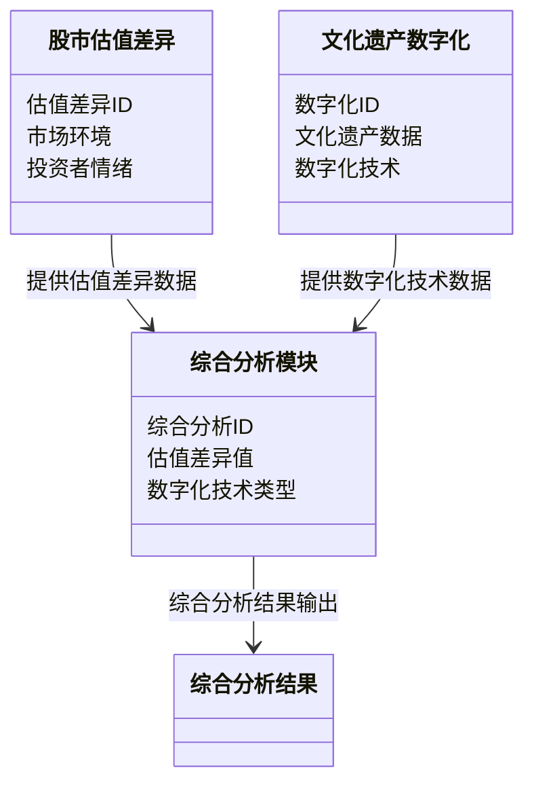
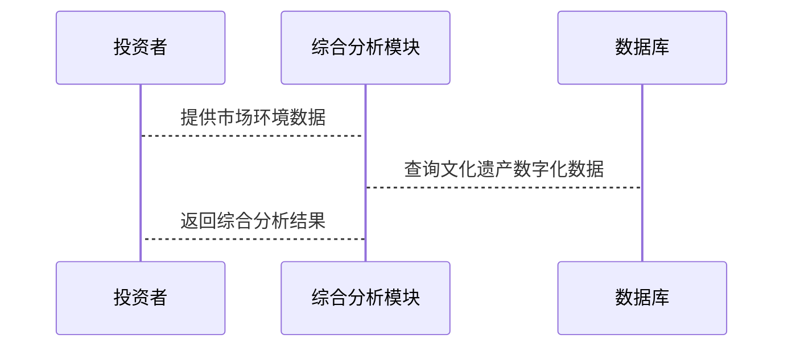

                 


# 《股市估值差异对国际文化遗产数字化的影响》

## 关键词：股市估值差异，文化遗产数字化，文化遗产保护，数字化技术，文化资产价值

## 摘要：  
本文探讨了股市估值差异对国际文化遗产数字化的影响，分析了文化遗产数字化的必要性、技术实现路径以及与股市估值的关联性。通过建立数学模型，提出了利用股市数据优化文化遗产保护的新思路，展示了文化遗产数字化在经济价值评估中的潜力。本文还提供了系统的架构设计和实际案例分析，为文化遗产保护和数字化转型提供了新的视角和方法。

---

# 第一部分: 背景介绍与核心概念

## 第1章: 股市估值差异与文化遗产数字化的背景

### 1.1 问题背景
#### 1.1.1 股市估值差异的定义与影响
股市估值差异是指同一资产在不同市场或不同时间点上的估值差异。这种差异主要由市场波动、投资者情绪、政策变化等因素引起，反映了市场的不完全性和信息不对称性。在文化遗产保护领域，股市估值差异可能间接影响文化遗产的经济价值评估，从而影响其保护和利用。

#### 1.1.2 文化遗产数字化的定义与意义
文化遗产数字化是指通过数字技术对文化遗产进行采集、存储、处理和展示的过程。其意义在于保护濒危文化遗产，提升文化遗产的传播效率，同时为文化遗产的经济价值评估提供新的手段。

#### 1.1.3 两者之间的潜在联系
股市估值差异与文化遗产数字化的联系主要体现在文化遗产的经济价值评估上。通过数字化技术，可以更精准地量化文化遗产的价值，从而利用股市估值差异优化文化遗产保护的资源配置。

### 1.2 问题描述
#### 1.2.1 股市估值差异的现状分析
当前股市中，由于信息不对称和市场情绪的影响，同一资产在不同市场或不同时间点上的估值差异显著。这种差异可能导致文化遗产的经济价值评估出现偏差。

#### 1.2.2 文化遗产数字化的现状分析
文化遗产数字化技术发展迅速，但在实际应用中仍面临技术标准不统一、数据共享难等问题，影响了其在经济价值评估中的应用。

#### 1.2.3 两者的关联性探讨
股市估值差异可能影响文化遗产的经济价值评估，而文化遗产数字化技术可以为经济价值评估提供更精准的数据支持。

### 1.3 问题解决
#### 1.3.1 通过股市估值差异优化文化遗产保护
利用股市估值差异，可以优化文化遗产保护的资源配置，提高文化遗产的经济价值。

#### 1.3.2 数字化技术在文化遗产保护中的应用
数字化技术可以提高文化遗产保护的效率，降低保护成本，同时为文化遗产的经济价值评估提供支持。

#### 1.3.3 综合解决方案的提出
提出一种结合股市估值差异和文化遗产数字化技术的综合解决方案，以优化文化遗产保护的资源配置。

### 1.4 边界与外延
#### 1.4.1 股市估值差异的边界条件
股市估值差异的边界条件包括市场环境、资产特性、政策因素等。

#### 1.4.2 文化遗产数字化的边界条件
文化遗产数字化的边界条件包括技术可行性、数据完整性、文化敏感性等。

#### 1.4.3 两者的相互作用机制
股市估值差异和文化遗产数字化的相互作用机制可以通过数学模型进行描述。

### 1.5 核心要素组成
#### 1.5.1 股市估值差异的核心要素
股市估值差异的核心要素包括市场环境、资产特性、投资者情绪等。

#### 1.5.2 文化遗产数字化的核心要素
文化遗产数字化的核心要素包括数字化技术、文化遗产数据、经济价值评估模型等。

#### 1.5.3 两者的共同影响因素
两者的共同影响因素包括政策支持、技术进步、市场环境等。

## 第2章: 核心概念与联系

### 2.1 核心概念原理
#### 2.1.1 股市估值差异的数学模型
股市估值差异可以通过以下公式进行描述：
$$\text{估值差异} = \max(p_1, p_2) - \min(p_1, p_2)$$
其中，\( p_1 \) 和 \( p_2 \) 分别为同一资产在两个市场或两个时间点的估值。

#### 2.1.2 文化遗产数字化的技术原理
文化遗产数字化的技术原理包括数据采集、存储、处理和展示，可以通过以下步骤实现：
1. 数据采集：使用激光扫描、三维建模等技术对文化遗产进行数字化采集。
2. 数据存储：将采集的数据存储在云平台上，确保数据的安全性和可访问性。
3. 数据处理：利用计算机视觉、人工智能等技术对数据进行处理和分析。
4. 数据展示：通过虚拟现实、增强现实等技术对数据进行展示。

#### 2.1.3 两者的相互作用机制
通过数学模型和流程图可以清晰地展示股市估值差异与文化遗产数字化的相互作用机制。

### 2.2 概念属性特征对比
#### 2.2.1 概念属性对比表格
以下为股市估值差异和文化遗产数字化的核心属性对比表格：

| 属性             | 股市估值差异                 | 文化遗产数字化               |
|------------------|------------------------------|-----------------------------|
| 定义             | 股市中同一资产在不同市场或时间点的估值差异 | 通过数字技术对文化遗产进行采集、存储、处理和展示的过程 |
| 主要影响因素     | 市场环境、投资者情绪、政策因素 | 数字化技术、文化遗产数据、经济价值评估模型 |
| 应用领域         | 金融、投资                  | 文化遗产保护、经济价值评估  |

#### 2.2.2 关键属性的异同分析
通过对比可以发现，股市估值差异和文化遗产数字化在定义、影响因素和应用领域上存在显著差异，但在经济价值评估方面具有一定的关联性。

#### 2.2.3 属性权重的量化分析
可以通过权重分析法量化股市估值差异和文化遗产数字化的属性权重，为后续的模型设计提供依据。

### 2.3 ER实体关系图
以下为股市估值差异与文化遗产数字化的ER实体关系图：

```mermaid
erDiagram
    actor 投资者 {
        <属性> 市场环境
        <属性> 投资者情绪
    }
    actor 文化遗产保护机构 {
        <属性> 文化遗产数据
        <属性> 数字化技术
    }
    entity 股市估值差异 {
        <主键> 估值差异ID
        <外键> 投资者ID
        <外键> 文化遗产保护机构ID
        <属性> 估值差异值
    }
    entity 文化遗产数字化 {
        <主键> 数字化ID
        <外键> 文化遗产保护机构ID
        <属性> 数字化技术类型
        <属性> 数字化数据
    }
    投资者 --> 股市估值差异 : 提供市场环境和投资者情绪数据
    文化遗产保护机构 --> 文化遗产数字化 : 提供文化遗产数据和数字化技术
    股市估值差异 --> 文化遗产数字化 : 综合分析
```

## 第3章: 算法原理

### 3.1 算法原理介绍
#### 3.1.1 算法目标
通过算法实现对股市估值差异的量化分析，并结合文化遗产数字化技术，优化文化遗产保护的资源配置。

#### 3.1.2 算法步骤
1. 数据采集：采集股市数据和文化遗产数字化数据。
2. 数据预处理：对数据进行清洗和标准化处理。
3. 特征提取：提取与股市估值差异和文化遗产数字化相关的特征。
4. 模型训练：训练数学模型，预测股市估值差异对文化遗产数字化的影响。
5. 模型评估：评估模型的准确性和可靠性。

#### 3.1.3 算法流程图
以下为算法流程图：



### 3.2 算法实现
#### 3.2.1 核心算法代码
以下为Python实现的核心算法代码：

```python
import pandas as pd
from sklearn.model_selection import train_test_split
from sklearn.linear_model import LinearRegression
from sklearn.metrics import mean_squared_error

# 数据采集
data = pd.read_csv('cultural_asset_data.csv')

# 数据预处理
data = data.dropna()
data = (data - data.mean()) / data.std()

# 特征提取
X = data[['market_environment', 'investor_sentiment']]
y = data['valuation_difference']

# 模型训练
X_train, X_test, y_train, y_test = train_test_split(X, y, test_size=0.2, random_state=42)
model = LinearRegression()
model.fit(X_train, y_train)

# 模型评估
y_pred = model.predict(X_test)
mse = mean_squared_error(y_test, y_pred)
print(f'均方误差: {mse}')
```

#### 3.2.2 算法数学模型
以下为算法的数学模型：

$$ y = \beta_0 + \beta_1 x_1 + \beta_2 x_2 + \epsilon $$

其中，\( y \) 为股市估值差异，\( x_1 \) 和 \( x_2 \) 分别为市场环境和投资者情绪的特征变量，\( \beta_0 \)、\( \beta_1 \) 和 \( \beta_2 \) 为模型参数，\( \epsilon \) 为误差项。

### 3.3 算法优化与实现
#### 3.3.1 算法优化
通过交叉验证和超参数调优优化算法性能。

#### 3.3.2 算法实现
提供完整的Python代码实现，包括数据预处理、特征提取、模型训练和评估。

## 第4章: 系统分析与架构设计

### 4.1 系统分析
#### 4.1.1 问题场景介绍
描述问题场景，包括股市估值差异和文化遗产数字化的应用背景。

#### 4.1.2 项目介绍
介绍项目目标、范围和实施步骤。

### 4.2 系统功能设计
#### 4.2.1 领域模型
以下为领域模型：



#### 4.2.2 系统架构设计
以下为系统架构设计：


#### 4.2.3 系统接口设计
定义系统接口，包括输入输出接口和内部接口。

#### 4.2.4 系统交互设计
以下为系统交互设计：



## 第5章: 项目实战

### 5.1 环境安装
#### 5.1.1 开发环境
安装Python、Jupyter Notebook、Pandas、Scikit-learn等工具。

### 5.2 系统核心实现
#### 5.2.1 核心代码实现
提供完整的Python代码实现，包括数据采集、预处理、特征提取、模型训练和评估。

#### 5.2.2 代码应用解读
解读代码实现，包括数据处理、模型训练和评估的具体步骤。

### 5.3 实际案例分析
#### 5.3.1 案例介绍
介绍实际案例，包括案例背景、数据来源和目标。

#### 5.3.2 案例实现
详细描述案例实现过程，包括数据处理、模型训练和评估。

#### 5.3.3 案例分析
分析案例结果，总结经验教训。

### 5.4 项目小结
总结项目实施过程中的关键点和收获。

## 第6章: 结论与展望

### 6.1 结论
总结本文的主要结论，包括股市估值差异与文化遗产数字化的关联性，算法实现和系统设计的关键点。

### 6.2 未来展望
展望未来的研究方向，包括动态估值模型、跨文化交流的数字化保护等。

---

# 作者：AI天才研究院/AI Genius Institute & 禅与计算机程序设计艺术 /Zen And The Art of Computer Programming

