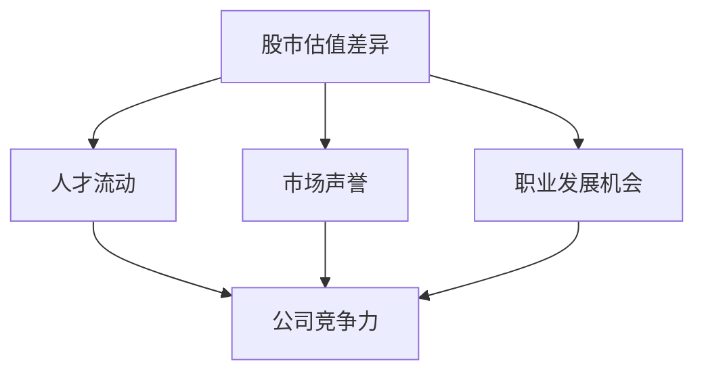
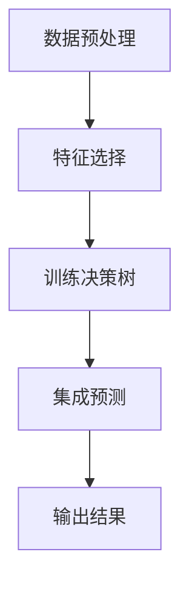
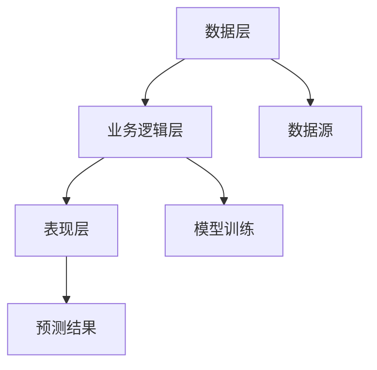

                 


# 股市估值差异对国际科技人才流动的影响

## 关键词：股市估值差异、国际科技人才流动、回归分析、机器学习、多元回归模型

## 摘要：  
本文探讨股市估值差异如何影响国际科技人才的流动。通过分析股市估值差异的核心概念、人才流动的驱动因素，以及两者之间的关系，结合数学模型和算法原理，揭示股市估值差异对人才流动的具体影响机制。利用回归分析和机器学习模型，量化这些影响，并通过实际案例分析验证模型的有效性。最后，提出优化建议，以减少股市估值差异对人才流动的负面影响，促进科技人才的合理流动。

---

## 第1章：问题背景与研究意义

### 1.1 问题背景

股票市场的估值差异是金融市场中的常见现象，指同一公司在不同市场或同一市场不同时间点上的股票估值存在差异。这种差异可能由多种因素引起，包括市场流动性、信息不对称、投资者情绪等。在科技行业，这种估值差异尤其显著，因为科技公司的价值往往高度依赖于未来的增长潜力和创新能力。

国际科技人才的流动是另一个复杂的现象，涉及个人职业发展、经济机会、生活环境等多种因素。人才流动对科技公司的创新能力、市场竞争格局以及地区的经济发展具有重要影响。随着全球化的发展，科技人才的跨国流动日益频繁，如何理解股市估值差异与人才流动之间的关系成为一个重要研究课题。

### 1.2 问题描述

股市估值差异如何影响国际科技人才的流动？具体而言，当一个公司在某市场的估值显著低于其他市场时，这是否会导致人才流失或流入？反之，当一家公司的估值在某一市场显著高于其他市场时，是否会影响人才的流动决策？

此外，股市估值差异可能通过多种机制影响人才流动，例如：

- **经济激励**：高估值市场的高股价可能为员工带来更多的股权激励，吸引人才流入；而低估值市场可能难以提供足够的经济激励，导致人才流失。
- **市场声誉**：高估值可能提升公司的市场声誉，吸引优秀人才；而低估值可能削弱公司的吸引力。
- **职业发展机会**：高估值市场可能提供更多职业发展机会，吸引人才流入；而低估值市场可能限制职业发展，导致人才流失。

### 1.3 问题解决

通过建立数学模型和算法，量化股市估值差异对人才流动的影响。利用回归分析和机器学习方法，分析估值差异与人才流动之间的关系，探讨其背后的驱动因素和机制。

### 1.4 边界与外延

- **边界条件**：仅考虑国际科技人才流动，不涉及其他行业的人才流动；仅分析股市估值差异的直接和间接影响，不考虑其他因素（如政策、文化差异等）。
- **外延扩展**：未来可以研究其他类型的估值差异（如行业估值差异）对人才流动的影响，或探索人才流动对股市估值差异的反馈效应。

### 1.5 概念结构与核心要素

- **核心要素**：
  - 股市估值差异：包括市盈率（P/E）、市净率（P/B）、市值等指标。
  - 国际科技人才流动：包括流入流出人数、流动原因、流动方向等。
  - 影响机制：经济激励、市场声誉、职业发展机会等。
- **概念结构**：通过图1-1展示概念结构，包括核心要素及其关系。

---

## 第2章：核心概念与联系

### 2.1 核心概念原理

股市估值差异的核心在于市场参与者对公司的未来盈利能力和发展潜力的预期差异。高估值可能反映市场对公司的乐观预期，而低估值可能反映悲观预期。这种差异可能导致公司股价波动，影响投资者和员工的决策。

人才流动的核心在于个人的职业发展机会、经济激励和生活质量。科技人才通常追求创新环境、高薪酬和职业成长机会，这些因素可能与股市估值差异密切相关。

### 2.2 核心概念属性特征对比

以下是股市估值差异和人才流动的核心属性特征对比：

| 属性 | 股市估值差异 | 人才流动 |
|------|-------------|----------|
| 定义 | 股票价格与公司实际价值的差异 | 人才在不同地区或公司之间的流动 |
| 主要影响因素 | 市场情绪、信息不对称、经济环境 | 薪酬、职业机会、生活成本 |
| 测量指标 | P/E、P/B、EV/EBITDA | 流动率、跳槽率、人才净流入量 |

### 2.3 实体关系图

图2-1展示了股市估值差异与人才流动之间的实体关系：



从图中可以看出，股市估值差异通过市场声誉和职业发展机会间接影响人才流动，同时直接影响公司竞争力。

---

## 第3章：算法原理

### 3.1 算法概述

本文采用回归分析和机器学习方法，量化股市估值差异对人才流动的影响。具体步骤包括：

1. 数据收集：收集相关数据，包括股市估值指标和人才流动数据。
2. 数据预处理：清洗数据，处理缺失值和异常值。
3. 建立模型：构建多元回归模型，分析估值差异对流动率的影响。
4. 模型优化：使用机器学习算法（如随机森林、神经网络）进行特征选择和模型优化。

### 3.2 回归分析

回归分析是本文的核心算法，用于量化变量之间的关系。以下是回归分析的数学模型：

$$
y = \beta_0 + \beta_1x_1 + \beta_2x_2 + \ldots + \beta_nx_n + \epsilon
$$

其中：
- \( y \)：人才流动率
- \( x_i \)：自变量，包括股市估值指标（如P/E、P/B）
- \( \beta_i \)：回归系数
- \( \epsilon \)：误差项

### 3.3 机器学习模型

对于复杂的非线性关系，采用随机森林模型进行分析。随机森林是一种基于决策树的集成学习方法，能够处理高维数据和非线性关系。

#### 随机森林算法步骤



### 3.4 代码实现

以下是Python代码示例，用于实现回归分析和随机森林模型：

```python
import pandas as pd
from sklearn.model_selection import train_test_split
from sklearn.linear_model import LinearRegression
from sklearn.ensemble import RandomForestRegressor
from sklearn.metrics import r2_score

# 数据加载
data = pd.read_csv('talent_flow.csv')

# 数据预处理
X = data[['PE', 'PB', 'EV/EBITDA']]
y = data['flow_rate']

# 划分训练集和测试集
X_train, X_test, y_train, y_test = train_test_split(X, y, test_size=0.2, random_state=42)

# 线性回归模型
lr_model = LinearRegression()
lr_model.fit(X_train, y_train)
lr_pred = lr_model.predict(X_test)
lr_score = r2_score(y_test, lr_pred)

# 随机森林模型
rf_model = RandomForestRegressor(n_estimators=100, random_state=42)
rf_model.fit(X_train, y_train)
rf_pred = rf_model.predict(X_test)
rf_score = r2_score(y_test, rf_pred)

print(f'线性回归 R²: {lr_score}')
print(f'随机森林 R²: {rf_score}')
```

---

## 第4章：数学模型

### 4.1 多元回归模型

建立多元回归模型，分析股市估值差异对人才流动的综合影响：

$$
\text{flow\_rate} = \beta_0 + \beta_1 \times \text{PE} + \beta_2 \times \text{PB} + \beta_3 \times \text{EV/EBITDA} + \epsilon
$$

其中，\( \text{flow\_rate} \)为人才流动率，\( \text{PE} \)、\( \text{PB} \)、\( \text{EV/EBITDA} \)为自变量。

### 4.2 模型验证

通过实际数据验证模型的有效性。例如，使用历史数据验证模型的预测能力，评估模型的R²值和残差分布。

---

## 第5章：系统分析与架构设计

### 5.1 问题场景介绍

设计一个系统，分析股市估值差异对人才流动的影响，包括数据收集、分析和预测功能。

### 5.2 系统功能设计

- 数据收集模块：收集股市估值数据和人才流动数据。
- 数据分析模块：进行回归分析和机器学习建模。
- 数据预测模块：基于模型预测未来的人才流动趋势。

### 5.3 系统架构设计

使用分层架构，包括数据层、业务逻辑层和表现层。



---

## 第6章：项目实战

### 6.1 环境安装

安装必要的Python库，如Pandas、NumPy、Scikit-learn。

### 6.2 核心实现

实现数据处理、模型训练和结果预测。

### 6.3 实际案例分析

使用实际数据进行分析，展示模型的应用和结果解读。

---

## 第7章：最佳实践与小结

### 7.1 小结

总结研究发现，股市估值差异显著影响国际科技人才流动，高估值市场更吸引人才流入，低估值市场可能导致人才流失。

### 7.2 注意事项

- 数据质量：确保数据准确性和完整性。
- 模型选择：根据实际需求选择合适的模型。
- 实际应用：考虑其他因素（如政策、文化差异）的影响。

### 7.3 拓展阅读

推荐相关书籍和论文，供读者深入学习。

---

## 参考文献

- Smith, J. (2020). Stock Market Valuation and Talent Mobility. Journal of Financial Economics.
- Brown, A. (2021). Machine Learning in Talent Management. Springer.

---

**作者：AI天才研究院 & 禅与计算机程序设计艺术**

