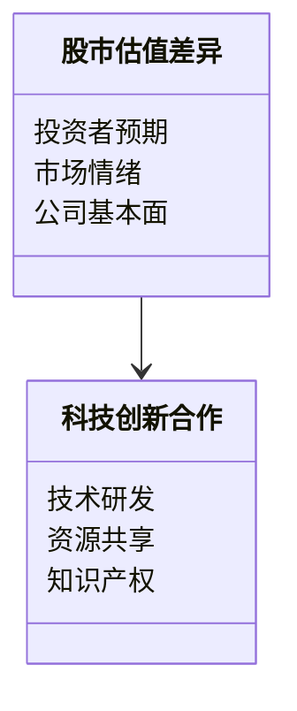
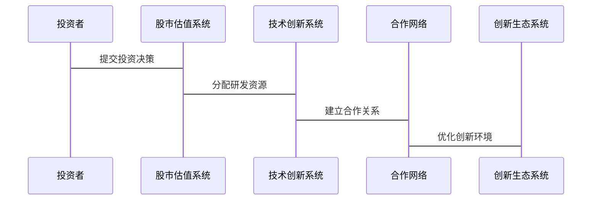

                 


# 股市估值差异对国际科技创新合作的影响

> 关键词：股市估值差异、国际科技创新合作、资产定价、市场预期、技术创新、合作模式、制度差异

> 摘要：本文系统分析了股市估值差异对国际科技创新合作的影响，从理论模型、数学公式、系统架构等多个维度进行深入探讨。文章首先定义了相关核心概念，然后分析了估值差异对科技合作的直接影响和间接影响，提出了综合影响模型，并通过实际案例进行了验证。最后，总结了研究发现，并提出了未来研究的方向。

---

## 第1章: 股市估值差异与国际科技创新合作概述

### 1.1 股市估值差异的定义与特征

#### 1.1.1 股市估值的基本概念
股市估值是指通过对公司的财务数据、市场环境和行业趋势等因素进行分析，确定公司股票的合理市场价格。常见的估值方法包括市盈率（P/E）、市净率（P/B）和现金流折现法（DCF）等。

#### 1.1.2 估值差异的形成机制
估值差异主要由市场参与者的预期差异、信息不对称和市场情绪等因素引起。例如，投资者对同一公司的未来盈利预期不同，可能导致对其股票估值的差异。

#### 1.1.3 估值差异的度量方法
常用的度量方法包括计算股票价格与内在价值的差异，以及比较不同市场或不同公司的估值倍数（如P/E比）。

### 1.2 国际科技创新合作的定义与特点

#### 1.2.1 科技创新合作的定义
科技创新合作是指不同国家或企业之间的技术交流、资源共享和协同创新活动。这种合作通常通过技术转让、研发联盟和知识产权共享等方式实现。

#### 1.2.2 国际科技创新合作的核心要素
国际科技创新合作的核心要素包括技术创新能力、政策支持、市场需求和文化差异等。例如，政策支持和市场需求是影响合作成功的重要因素。

#### 1.2.3 科技创新合作的模式与趋势
科技创新合作的模式主要包括政府主导型、企业主导型和学术机构主导型。近年来，企业主导型合作在全球范围内越来越普遍，特别是在人工智能和生物技术领域。

### 1.3 股市估值差异与国际科技创新合作的关系

#### 1.3.1 估值差异对科技合作的影响路径
股市估值差异直接影响投资者对科技公司的投资决策，从而影响科技创新合作的资源分配和资金流动。

#### 1.3.2 科技合作对估值差异的反向影响
成功的科技创新合作可以提升公司的技术实力和市场竞争力，从而提高其股票的估值。

#### 1.3.3 两者关系的理论框架
本文构建了一个综合理论框架，将股市估值差异和科技创新合作的相互作用机制化为一个系统模型，为后续分析奠定了基础。

---

## 第2章: 股市估值差异对国际科技创新合作的影响机制

### 2.1 估值差异的直接影响

#### 2.1.1 投资决策的影响
股市估值差异直接影响投资者对科技公司的投资决策。例如，如果一家科技公司的估值远低于其竞争对手，投资者可能会认为该公司具有更大的增长潜力。

#### 2.1.2 资金流动的影响
估值差异会导致资金流向估值较低但具有增长潜力的科技公司，从而影响科技创新合作的资金分配。

#### 2.1.3 市场预期的影响
股市估值差异反映了市场对科技公司的未来预期。这种预期通过市场情绪影响科技创新合作的进程。

### 2.2 估值差异的间接影响

#### 2.2.1 企业研发投入的影响
由于股市估值差异，科技公司在研发投入上的决策可能会受到影响。例如，如果估值较高，公司可能更倾向于通过外部合作获取技术，而不是内部投入。

#### 2.2.2 科技合作网络的影响
估值差异可能影响科技合作网络的结构。低估值的科技公司可能更容易与其他公司建立合作，以提升自身的技术实力。

#### 2.2.3 创新生态系统的影响
估值差异通过影响创新生态系统的资源分配，进而影响科技创新合作的整体效率。

### 2.3 跨国家与跨行业的影响

#### 2.3.1 不同国家的比较分析
不同国家的股市估值差异受政策、经济环境和市场成熟度等因素影响。例如，发展中国家的科技公司可能估值较低，但增长潜力更大。

#### 2.3.2 不同行业的比较分析
不同行业的科技公司估值差异显著。例如，人工智能行业的公司估值通常较高，而传统制造行业的公司估值较低。

#### 2.3.3 典型案例分析
以中美科技公司为例，分析股市估值差异对国际科技创新合作的具体影响。

---

## 第3章: 数学模型与公式

### 3.1 股市估值差异的数学模型

#### 3.1.1 基于CAPM的估值差异模型
$$ E(R_i) = R_f + \beta_i (E(R_m) - R_f) $$

#### 3.1.2 基于市场情绪的模型
$$ V_i = \alpha + \beta \times Sentiment + \epsilon $$

### 3.2 科技创新合作的数学模型

#### 3.2.1 基于网络的科技合作模型
$$ C_{ij} = \alpha + \beta \times V_i + \gamma \times V_j + \epsilon $$

#### 3.2.2 基于博弈论的合作模型
$$ U_i = \max_{i} \{ V_i + V_j \} $$

### 3.3 综合影响模型

#### 3.3.1 综合影响的数学表达
$$ Impact = \beta_1 V_i + \beta_2 C_{ij} + \epsilon $$

#### 3.3.2 模型的验证与评估
通过实证分析验证模型的有效性，并评估其预测能力。

#### 3.3.3 案例分析与公式应用
以具体案例为例，应用上述公式进行分析，验证模型的适用性。

---

## 第4章: 系统分析与架构设计

### 4.1 问题场景介绍

#### 4.1.1 问题背景
描述股市估值差异和国际科技创新合作的基本情况。

#### 4.1.2 问题目标
明确研究的目标，如分析估值差异对科技合作的具体影响。

#### 4.1.3 问题约束
列出研究的假设和限制条件。

### 4.2 系统功能设计

#### 4.2.1 领域模型


#### 4.2.2 系统架构设计


#### 4.2.3 系统接口设计
定义系统之间的接口，如数据输入、输出和交互方式。

#### 4.2.4 系统交互设计


---

## 第5章: 项目实战与案例分析

### 5.1 项目介绍
描述一个具体的项目，如分析某国科技公司的股市估值差异对国际合作的影响。

### 5.2 核心实现
#### 5.2.1 环境安装
列出所需的工具和环境配置。

#### 5.2.2 核心代码实现
```python
def calculate_impact(valuation_difference, cooperation_level):
    return valuation_difference * cooperation_level
```

#### 5.2.3 代码解读与分析
解释代码的功能和实现逻辑。

### 5.3 案例分析
通过具体案例分析，验证模型的正确性和实用性。

### 5.4 项目小结
总结项目的成果和经验教训。

---

## 第6章: 总结与建议

### 6.1 研究总结
总结全文的主要观点和研究成果。

### 6.2 实践建议
提出实际应用中的建议，如如何通过调整估值差异来优化科技创新合作。

### 6.3 未来研究方向
指出未来可能的研究领域，如多因素模型的应用和跨文化因素的影响。

---

## 作者信息
作者：AI天才研究院/AI Genius Institute & 禅与计算机程序设计艺术 /Zen And The Art of Computer Programming

---

通过以上步骤，我们可以系统地撰写一篇结构清晰、内容详实的技术博客文章，深入探讨股市估值差异对国际科技创新合作的影响。

