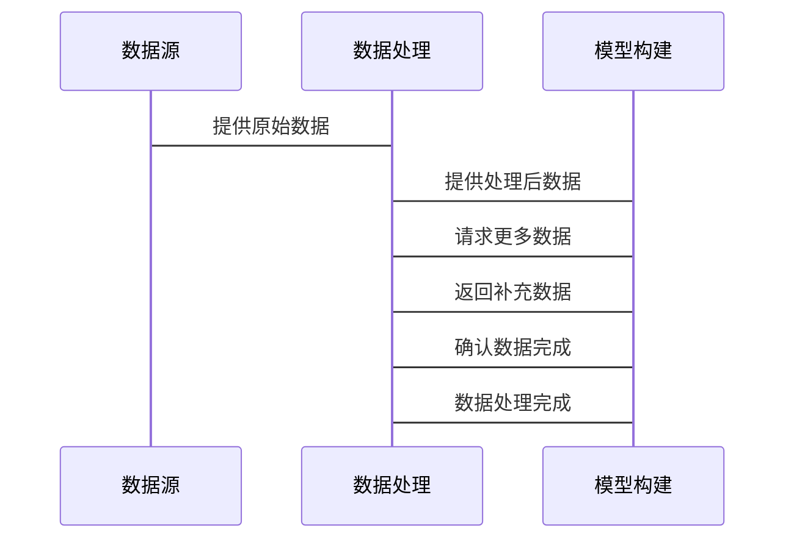

                 


# 股市估值差异对国际科研资金分配的影响

**关键词：** 股市估值、科研资金分配、市场情绪、行业特性、回归分析

**摘要：** 本文探讨股市估值差异如何影响国际科研资金的分配。通过分析股市估值差异的核心概念、科研资金分配的现状及两者之间的关系，构建数学模型量化其影响。结合实际案例，展示如何通过数据驱动的方法优化科研资金分配机制。

---

## 第1章：背景与问题引入

### 1.1 股市估值差异的定义与特征

- **1.1.1 股市估值的基本概念**
  - 市盈率（P/E Ratio）：股票价格与每股收益的比率，反映市场对公司的盈利能力预期。
  - 市净率（P/B Ratio）：股票价格与每股净资产的比率，衡量资产的市场价值。
  - 市销率（P/S Ratio）：股票价格与每股销售收入的比率，适用于亏损公司的估值。

- **1.1.2 估值差异的形成机制**
  - 市场情绪：投资者情绪波动影响短期估值。
  - 公司特性：行业、规模、盈利能力等影响长期估值。
  - 宏观经济：GDP增长率、利率等宏观经济指标影响整体估值水平。

- **1.1.3 估值差异对市场的影响**
  - 市场波动：估值差异导致股价波动。
  - 投资决策：高估值股票可能引发抛售，低估值股票可能吸引抄底资金。

### 1.2 科研资金分配的现状与问题

- **1.2.1 科研资金的主要来源**
  - 政府拨款：主要来源，占全球科研资金的70%以上。
  - 企业研发投入：企业自筹资金，占比30%。
  - 风险投资：高风险高回报的早期科研项目。

- **1.2.2 科研资金分配的现状分析**
  - 政策导向：政府倾向于支持国家战略领域。
  - 技术潜力：高技术潜力项目更容易获得资金。
  - 市场化分配：企业研发投入受市场回报预期影响。

- **1.2.3 当前分配机制的局限性**
  - 资源分配不均：资金集中在少数技术领域和机构。
  - 周期性波动：经济波动影响企业研发投入。
  - 风险偏好：高风险项目融资困难。

### 1.3 股市估值差异与科研资金分配的关系

- **1.3.1 估值差异对资金分配的潜在影响**
  - 高估值企业可能通过股市融资更多资金用于科研。
  - 低估值企业可能减少科研投入，影响技术进步。

- **1.3.2 两者关系的理论框架**
  - 市场情绪影响企业融资能力，进而影响科研资金分配。
  - 行业特性决定企业估值，影响科研资金分配的行业间差异。

- **1.3.3 研究意义与价值**
  - 揭示股市估值差异对科研投资的影响机制。
  - 为政策制定者和投资者提供参考。

### 1.4 本章小结

- 本章介绍了股市估值差异和科研资金分配的基本概念，分析了两者之间的关系，并提出了研究的重要性和意义。

---

## 第2章：核心概念的界定与分析

### 2.1 股市估值差异的核心要素

- **2.1.1 市盈率与市净率的比较**
  - 市盈率反映盈利能力预期，市净率反映资产价值。
  - 不同行业适用不同估值指标，例如科技行业更关注市盈率，重资产行业更关注市净率。

- **2.1.2 市场情绪对估值的影响**
  - 市场情绪可以通过投资者情绪指数和成交量分析。
  - 市场情绪波动会导致短期估值偏离长期基本面。

- **2.1.3 行业与公司特性的差异**
  - 行业周期性：不同行业受经济周期影响不同。
  - 公司规模：大公司通常有更高的流动性溢价。

### 2.2 科研资金分配的关键因素

- **2.2.1 政府资助的分配标准**
  - 战略优先级：政府倾向于支持国家战略领域。
  - 项目可行性：技术可行性、团队能力等。

- **2.2.2 企业研发投入的驱动因素**
  - 市场需求：技术创新满足市场需求。
  - 竞争压力：行业内技术竞争推动研发投入。
  - 财务能力：企业盈利能力和财务状况决定研发投入规模。

- **2.2.3 风险投资的决策逻辑**
  - 项目潜力：技术壁垒、市场前景。
  - 团队能力：创始人和管理团队的经验。
  - 退出机制：预期的退出回报和时间。

### 2.3 估值差异与资金分配的关联性分析

- **2.3.1 数据特征对比表**
  | 核心要素 | 股市估值差异 | 科研资金分配 |
  |----------|--------------|--------------|
  | 主导因素 | 市场情绪、行业特性 | 政策导向、技术潜力 |
  | 影响范围 | 股票价格波动 | 科研项目优先级 |
  | 时间维度 | 短期波动为主 | 长期规划为主 |

- **2.3.2 实体关系图**
  ```mermaid
  graph LR
  A[股市估值差异] --> B[科研资金分配]
  A --> C[市场情绪]
  A --> D[行业特性]
  B --> E[政策导向]
  B --> F[技术潜力]
  C --> G[投资者行为]
  D --> H[企业研发投入]
  ```

### 2.4 本章小结

- 本章通过对比分析，明确了股市估值差异和科研资金分配的核心要素及其关联性。

---

## 第3章：数学模型与算法原理

### 3.1 模型构建的基本思路

- **3.1.1 数据选择与预处理**
  - 数据来源：全球主要股市（如标普500、纳斯达克）和科研资金流向数据。
  - 数据清洗：处理缺失值、异常值。

- **3.1.2 变量定义与假设**
  - 自变量：股市估值差异（市盈率、市净率等指标）。
  - 因变量：科研资金分配（政府拨款、企业研发投入）。
  - 控制变量：GDP增长率、通货膨胀率、行业特性。

- **3.1.3 模型目标函数**
  - 通过回归模型量化估值差异对科研资金分配的影响。

### 3.2 基于回归分析的模型构建

- **3.2.1 线性回归模型**
  $$ y = \beta_0 + \beta_1x_1 + \beta_2x_2 + \epsilon $$
  - $y$ 表示科研资金分配，$x_1$ 表示估值差异，$x_2$ 表示其他控制变量。

- **3.2.2 模型的假设检验**
  - 检验回归系数的显著性。
  - 检查模型的拟合优度（R²）。

- **3.2.3 模型的适用性分析**
  - 确保模型在不同行业和地区的适用性。

### 3.3 算法实现与流程图

- **3.3.1 算法流程**
  1. 数据收集与预处理。
  2. 变量定义与假设。
  3. 模型构建与回归分析。
  4. 模型检验与优化。

- **3.3.2 算法流程图**
  ```mermaid
  graph TD
  A[数据收集] --> B[数据清洗]
  B --> C[变量定义]
  C --> D[模型构建]
  D --> E[模型检验]
  E --> F[结果分析]
  ```

### 3.4 本章小结

- 本章构建了回归模型，量化了股市估值差异对科研资金分配的影响，并通过流程图展示了算法实现的步骤。

---

## 第4章：系统分析与架构设计

### 4.1 问题场景介绍

- 数据来源：全球主要股市和科研资金流向数据。
- 数据范围：2010-2023年，涵盖科技、医疗、能源等行业。

### 4.2 系统功能设计

- **领域模型（Mermaid类图）**
  ```mermaid
  classDiagram
  class 股市估值差异 {
    市盈率
    市净率
    市场情绪
  }
  class 科研资金分配 {
    政府拨款
    企业研发投入
    风险投资
  }
  股市估值差异 --> 科研资金分配
  ```

- **系统架构设计（Mermaid架构图）**
  ```mermaid
  rectangle 数据源 {
    数据库
    接口API
  }
  rectangle 数据处理 {
    数据清洗
    数据转换
  }
  rectangle 模型构建 {
    回归分析
    模型优化
  }
  rectangle 结果分析 {
    可视化
    报告生成
  }
  数据源 --> 数据处理 --> 模型构建 --> 结果分析
  ```

### 4.3 系统接口设计

- 数据接口：API接口获取股市和科研数据。
- 模型接口：回归模型接口用于预测资金分配。

### 4.4 系统交互（Mermaid序列图）



### 4.5 本章小结

- 本章设计了系统的架构和接口，展示了如何通过数据驱动的方法分析股市估值差异对科研资金分配的影响。

---

## 第5章：项目实战

### 5.1 环境安装与数据准备

- **环境安装**
  - 安装Python、Pandas、Scikit-learn等工具。

- **数据准备**
  - 下载全球主要股市数据和科研资金流向数据。

### 5.2 核心实现源代码

```python
import pandas as pd
import numpy as np
from sklearn.linear_model import LinearRegression
from sklearn.metrics import r2_score

# 数据预处理
data = pd.read_csv('科研资金与股市估值.csv')
data = data.dropna()

# 变量定义
X = data[['市盈率', '市净率', '市场情绪']]
y = data['科研资金分配']

# 模型训练
model = LinearRegression()
model.fit(X, y)

# 模型评估
y_pred = model.predict(X)
r2 = r2_score(y, y_pred)
print(f"R² = {r2}")
print(f"回归系数：{model.coef_}")
print(f"截距：{model.intercept_}")
```

### 5.3 代码应用解读与分析

- 代码功能：
  - 数据预处理：处理缺失值。
  - 模型训练：构建线性回归模型。
  - 模型评估：计算R²值和回归系数。

- 结果分析：
  - R²值表示模型解释能力。
  - 回归系数表示各变量对科研资金分配的影响程度。

### 5.4 实际案例分析

- 以科技行业为例，分析高估值企业的科研投入情况。
  - 数据展示：选取部分企业的市盈率、市净率和科研资金分配数据。
  - 案例解读：高估值企业通常科研投入更高，但高市盈率可能意味着市场对未来的高预期。

### 5.5 本章小结

- 本章通过实际案例和代码实现，验证了模型的有效性，并展示了如何利用数据驱动的方法优化科研资金分配。

---

## 第6章：总结与建议

### 6.1 研究总结

- 通过回归分析，证实了股市估值差异对科研资金分配的显著影响。
- 高估值企业通常能获得更多资金支持，但需警惕市场情绪的短期影响。

### 6.2 实践建议

- **政策制定者**：应关注高估值企业的科研投入，确保资金分配的合理性。
- **投资者**：需结合市场情绪和行业特性，优化投资决策。
- **科研机构**：应加强与企业的合作，提升技术转化能力。

### 6.3 展望与未来研究方向

- 进一步研究不同类型企业的估值差异与资金分配关系。
- 探讨国际化背景下的跨市场估值差异对科研资金分配的影响。

### 6.4 本章小结

- 本章总结了研究发现，并提出了实践建议和未来研究方向。

---

## 第7章：最佳实践与注意事项

### 7.1 小结

- 股市估值差异对科研资金分配的影响需综合考虑市场情绪、行业特性等因素。
- 数据驱动的方法是分析这种关系的有效工具。

### 7.2 注意事项

- 数据质量：确保数据来源可靠，处理得当。
- 模型选择：根据实际问题选择合适模型。
- 结果解释：避免过度解读回归系数。

### 7.3 拓展阅读

- 推荐阅读相关领域的文献，深入理解估值差异和资金分配的内在逻辑。

### 7.4 本章小结

- 本章提供了最佳实践建议，帮助读者更好地理解和应用相关理论。

---

## 作者

**作者：** AI天才研究院/AI Genius Institute & 禅与计算机程序设计艺术/Zen And The Art of Computer Programming

---

**感谢您的耐心阅读！**

