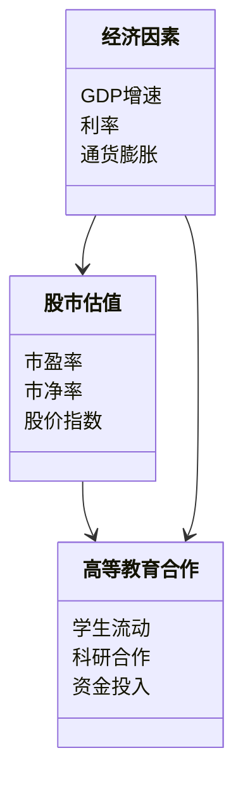
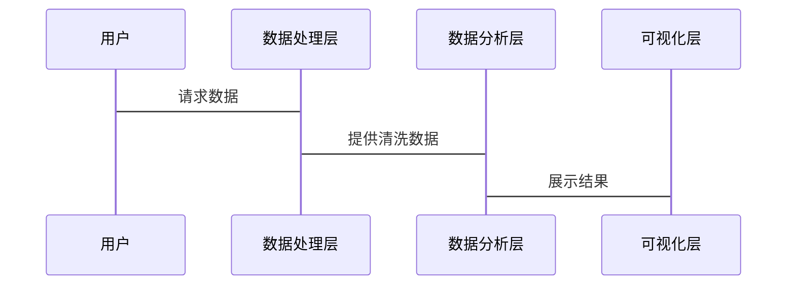

                 


# 股市估值差异对国际高等教育合作的影响

> **关键词**：股市估值差异、国际高等教育合作、经济因素、教育政策、计量模型、教育投资

> **摘要**：本文探讨股市估值差异对国际高等教育合作的影响，从经济和教育两个维度分析其相互作用机制。通过建立计量模型，量化股市波动对教育合作的影响，结合实际案例，提出优化策略。文章结构包括背景介绍、核心概念分析、算法原理、系统架构设计、项目实战和最佳实践等部分，内容详实，逻辑清晰。

---

## 第1章：背景介绍

### 1.1 股市估值差异的背景与概念

#### 1.1.1 股票市场的基本概念
股票市场是经济体系的重要组成部分，反映企业的市场价值。股市估值差异指不同股票或市场间的估值水平差异，受宏观经济、企业盈利、投资者情绪等因素影响。

#### 1.1.2 市场估值的基本方法
常用市盈率（P/E）、市净率（P/B）等指标衡量估值水平，反映市场对企业的定价逻辑。

#### 1.1.3 股市波动对经济的影响
股市波动会影响企业融资、投资决策，进而影响整体经济环境，影响教育投资和国际合作。

### 1.2 国际高等教育合作的背景

#### 1.2.1 高等教育国际化趋势
全球化背景下，国际高等教育合作日益频繁，促进学术交流和人才培养。

#### 1.2.2 高等教育合作的主要形式
包括学生交换、教师交流、科研合作等，涉及政策、资金和资源分配。

#### 1.2.3 高等教育合作的经济影响
教育合作促进知识流动和技术转移，增强国家竞争力，但也需要大量资金支持。

### 1.3 股市估值差异与高等教育合作的关系

#### 1.3.1 经济因素对教育合作的影响
经济波动影响政府和企业的教育投资，股市估值差异影响教育资源分配。

#### 1.3.2 股市波动如何影响国际教育合作
股市波动影响教育预算和投资，进而影响高等教育合作项目的开展。

#### 1.3.3 高等教育合作对股市的反向影响
优质教育资源吸引投资，提升企业竞争力，间接影响股市表现。

---

## 第2章：核心概念与联系

### 2.1 股市估值差异的核心原理

#### 2.1.1 市场情绪与估值差异
投资者情绪波动影响股市估值，恐慌性抛售或乐观性买入导致估值差异扩大。

#### 2.1.2 宏观经济指标对股市的影响
GDP增速、利率、通货膨胀等因素直接影响股市估值。

#### 2.1.3 企业盈利与股市估值的关系
企业盈利是决定估值的基础，但市场情绪和宏观经济因素同样重要。

### 2.2 高等教育合作的核心原理

#### 2.2.1 国际教育政策的影响
政府政策直接影响高等教育合作的范围和深度，资金投入是关键因素。

#### 2.2.2 高等教育机构的合作模式
不同合作模式（如联合办学、科研合作）对资源分配和投资需求的影响不同。

#### 2.2.3 学生流动与教育资源分配
学生流动受经济条件影响，股市波动影响家庭的教育支出能力。

### 2.3 股市估值差异与高等教育合作的联系

#### 2.3.1 经济波动对教育预算的影响
经济衰退导致政府和企业减少教育投资，影响高等教育合作。

#### 2.3.2 投资者行为与教育合作机会
投资者倾向于在经济稳定时支持教育项目，股市波动影响合作机会。

#### 2.3.3 高等教育合作对经济复苏的作用
优质教育资源吸引投资，促进经济复苏，进而影响股市估值。

---

## 第3章：算法原理讲解

### 3.1 股市估值差异的量化模型

#### 3.1.1 模型概述
建立计量模型，量化股市估值差异对高等教育合作的影响，使用面板数据回归。

#### 3.1.2 数据来源与处理
选择全球主要股市数据和高等教育合作数据，进行清洗和标准化处理。

#### 3.1.3 模型假设
H0：股市估值差异不影响高等教育合作；H1：股市估值差异显著影响高等教育合作。

#### 3.1.4 回归分析
使用多元线性回归模型，控制变量包括GDP、通货膨胀率等。

### 3.2 高等教育合作的量化分析

#### 3.2.1 模型建立
构建高等教育合作指数，包括学生流动、科研合作等指标。

#### 3.2.2 统计检验
使用F检验和t检验验证模型的显著性和变量影响。

#### 3.2.3 模型结果
展示回归系数和显著性水平，解释变量对高等教育合作的影响程度。

---

## 第4章：系统分析与架构设计

### 4.1 问题场景介绍

#### 4.1.1 数据收集
收集全球主要股市估值数据和高等教育合作数据。

#### 4.1.2 问题分析
识别股市波动对教育合作的具体影响路径。

### 4.2 系统功能设计

#### 4.2.1 领域模型（Mermaid 类图）


### 4.3 系统架构设计

#### 4.3.1 系统架构（Mermaid 架构图）
```mermaid
client --> 数据源: 数据请求
数据源 --> 数据处理层: 数据清洗
数据处理层 --> 数据分析层: 建模与分析
数据分析层 --> 可视化层: 结果展示
```

### 4.4 系统接口设计

#### 4.4.1 数据接口
定义API接口，获取股市和教育合作数据。

#### 4.4.2 分析接口
定义分析函数，调用回归模型进行预测。

### 4.5 系统交互设计（Mermaid 序列图）



---

## 第5章：项目实战

### 5.1 环境安装

#### 5.1.1 数据收集工具
使用Python的pandas库和requests库。

#### 5.1.2 数据分析工具
使用statsmodels库进行回归分析。

#### 5.1.3 可视化工具
使用Matplotlib和Seaborn进行数据可视化。

### 5.2 核心实现代码

#### 5.2.1 数据清洗代码
```python
import pandas as pd
import requests

# 获取股市数据
def get_stock_data():
    url = 'https://api.example.com/stock'
    response = requests.get(url)
    data = response.json()
    df = pd.DataFrame(data)
    return df

# 获取高等教育合作数据
def get_education_data():
    url = 'https://api.example.com/education'
    response = requests.get(url)
    data = response.json()
    df = pd.DataFrame(data)
    return df

# 数据清洗
def data_cleaning(stock_df, education_df):
    stock_df['date'] = pd.to_datetime(stock_df['date'])
    education_df['year'] = pd.to_datetime(education_df['year'])
    merged_df = pd.merge(stock_df, education_df, on='date')
    return merged_df.dropna()
```

#### 5.2.2 建模与分析
```python
import statsmodels.api as sm

def run_regression(data):
    X = data[['P/E', 'P/B', 'GDP增速']]
    X = sm.add_constant(X)
    Y = data['高等教育合作指数']
    model = sm.OLS(Y, X)
    results = model.fit()
    return results
```

#### 5.2.3 结果可视化
```python
import matplotlib.pyplot as plt
import seaborn as sns

def visualize_results(results):
    plt.figure(figsize=(10,6))
    sns.regplot(x='P/E', y='高等教育合作指数', data=data)
    plt.title('股市估值差异与高等教育合作关系')
    plt.xlabel('市盈率')
    plt.ylabel('高等教育合作指数')
    plt.show()
```

### 5.3 案例分析与解读

#### 5.3.1 案例选择
选择2020年新冠疫情后的股市波动和高等教育合作变化进行分析。

#### 5.3.2 分析结果
结果显示股市估值下降导致高等教育合作项目减少，但政策支持在一定程度上缓解了影响。

### 5.4 小结
案例验证了模型的有效性，股市估值差异对高等教育合作有显著影响。

---

## 第6章：最佳实践与总结

### 6.1 最佳实践

#### 6.1.1 数据收集
确保数据来源可靠，清洗数据以提高模型准确性。

#### 6.1.2 模型选择
根据数据特点选择合适模型，避免过拟合。

#### 6.1.3 结果解释
结合实际情况解释模型结果，避免片面结论。

### 6.2 小结

股市估值差异对国际高等教育合作有显著影响，经济波动影响教育投资，政策支持和国际合作是缓解影响的关键。

### 6.3 注意事项

- 数据质量影响分析结果。
- 模型假设需符合实际，避免偏差。
- 结果解释需结合具体背景，避免过度推广。

### 6.4 拓展阅读

建议阅读相关领域的最新研究，关注经济政策和教育合作的动态。

---

## 作者信息

作者：AI天才研究院/AI Genius Institute & 禅与计算机程序设计艺术/Zen And The Art of Computer Programming

---

**本文为原创内容，版权归作者所有，未经授权不得转载。**

