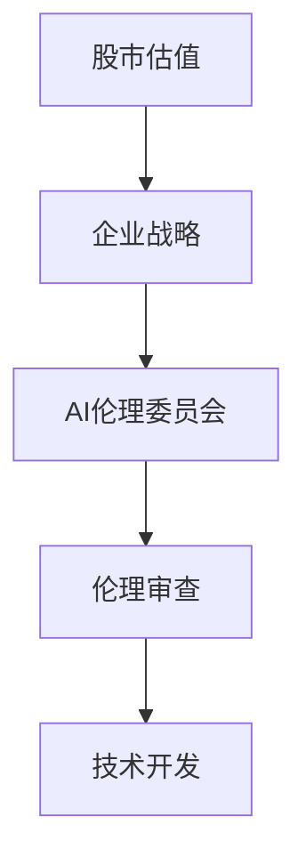
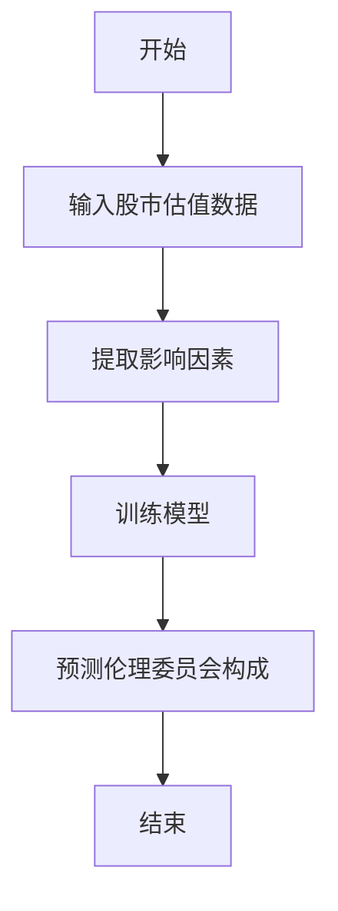
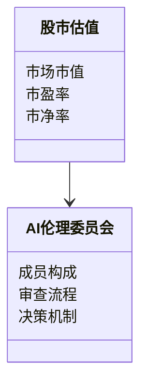
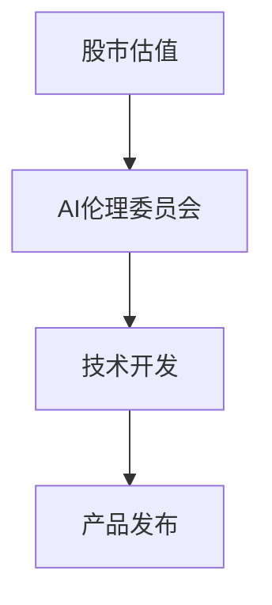
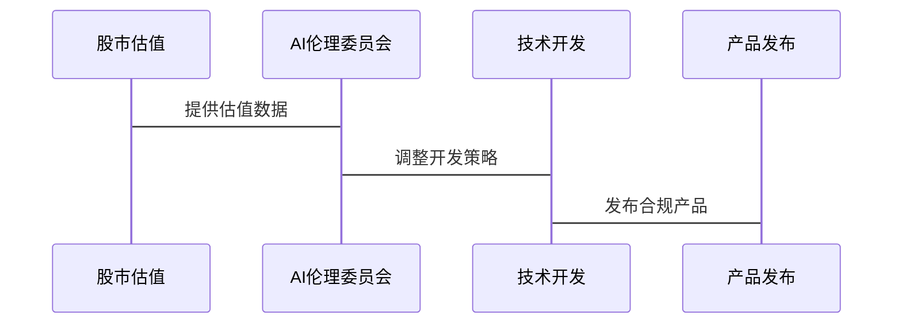

                 


# 股市估值高低对企业AI伦理委员会构成的影响

> 关键词：股市估值、AI伦理委员会、企业治理、算法原理、数学模型

> 摘要：本文探讨了股市估值的高低对企业AI伦理委员会构成的影响。通过分析股市估值对企业战略和治理结构的影响，本文揭示了在高估值和低估值情况下，AI伦理委员会的职责、成员构成和运作方式的变化。结合实际案例，本文提出了基于机器学习和数学模型的解决方案，以优化AI伦理委员会的构成，确保企业在不同估值水平下的伦理治理能力。

---

# 第一部分: 背景介绍

## 第1章: 股市估值与AI伦理委员会的背景

### 1.1 问题背景

#### 1.1.1 股市估值的基本概念
股市估值是指市场对公司价值的评估，通常通过市盈率、市净率等指标衡量。高估值意味着市场对公司未来表现的乐观预期，而低估值则可能反映市场对其前景的担忧。

#### 1.1.2 AI伦理委员会的定义与目标
AI伦理委员会是负责监督和指导企业AI技术应用的伦理合规性，确保技术开发和使用符合社会伦理标准和法律法规。

#### 1.1.3 问题解决：股市估值与AI伦理委员会的关系
股市估值的高低会影响企业的战略决策和治理结构，从而间接影响AI伦理委员会的构成和运作。

### 1.2 问题描述

#### 1.2.1 股市估值对企业的影响
高估值可能带来更大的压力，要求企业更快地实现增长目标；低估值可能为企业提供更多的战略灵活性。

#### 1.2.2 AI伦理委员会对企业AI治理的作用
AI伦理委员会在企业AI战略中扮演关键角色，确保技术应用的透明性和合规性。

#### 1.2.3 股市估值高低对企业AI伦理委员会构成的具体影响
高估值时，企业可能更注重AI技术的快速发展，可能压缩伦理审查的力度；低估值时，企业可能更谨慎，强调AI伦理合规性。

### 1.3 问题解决

#### 1.3.1 股市估值对企业AI伦理委员会的需求变化
高估值时，企业可能更关注技术创新的速度，可能减少对AI伦理委员会的依赖；低估值时，企业可能更注重合规性，增加对AI伦理委员会的需求。

#### 1.3.2 AI伦理委员会在高估值和低估值情况下的不同角色
高估值时，AI伦理委员会可能作为次要考量；低估值时，AI伦理委员会可能成为企业治理的核心部分。

#### 1.3.3 问题解决的路径与方法
通过动态调整AI伦理委员会的构成和职责，平衡技术创新与合规性需求。

### 1.4 边界与外延

#### 1.4.1 股市估值的边界条件
股市估值受市场情绪、经济环境和公司基本面的影响。

#### 1.4.2 AI伦理委员会的构成边界
委员会成员的背景、职责和决策权限。

#### 1.4.3 相关概念的外延与扩展
AI伦理委员会的构成不仅涉及内部员工，还包括外部专家和法律顾问。

### 1.5 概念结构与核心要素

#### 1.5.1 股市估值的核心要素
市盈率、市净率、市值、股价波动。

#### 1.5.2 AI伦理委员会的核心要素
成员构成、职责、审查流程、决策机制。

#### 1.5.3 两者关系的结构化分析
股市估值影响企业的战略优先级，进而影响AI伦理委员会的资源分配和工作重点。

---

# 第二部分: 核心概念与联系

## 第2章: 核心概念原理

### 2.1 AI伦理委员会的构成要素

#### 2.1.1 伦理委员会的组织结构
包括主席、副主席和普通成员，通常由企业内部员工和外部专家组成。

#### 2.1.2 委员会成员的职责与权限
审查AI项目、制定伦理标准、监督合规性。

#### 2.1.3 伦理审查的流程与标准
包括项目申请、伦理评估、反馈与修改。

### 2.2 股市估值的影响因素

#### 2.2.1 股价波动的驱动因素
市场情绪、宏观经济指标、公司业绩。

#### 2.2.2 市场情绪与投资者预期
投资者对公司的未来表现的预期影响股市估值。

#### 2.2.3 公司基本面与股市估值的关系
公司财务状况、盈利能力直接影响其市场估值。

### 2.3 股市估值与AI伦理委员会的联系

#### 2.3.1 高估值对企业AI伦理委员会的需求
高估值可能要求企业更快推出AI产品，可能压缩伦理审查的时间和资源。

#### 2.3.2 低估值对企业AI伦理委员会的影响
低估值可能要求企业更谨慎地推进AI项目，强调合规性。

#### 2.3.3 股市估值对企业AI伦理委员会构成的动态调整
根据估值变化，动态调整委员会成员和审查流程。

### 2.4 核心概念属性对比

| 股市估值 | AI伦理委员会构成 |
|----------|------------------|
| 高估值   | 成员数量减少     |
| 低估值   | 成员数量增加     |
| 高波动   | 审查流程简化     |
| 低波动   | 审查流程严格化   |

### 2.5 ER实体关系图架构的Mermaid流程图



---

# 第三部分: 算法原理讲解

## 第3章: 算法原理

### 3.1 算法流程



### 3.2 算法实现

```python
import pandas as pd
from sklearn.linear_model import LinearRegression

# 数据加载
data = pd.read_csv('ethics_committee.csv')

# 特征选择
features = data[['market_cap', '市盈率', '市净率']]
target = data['committee_size']

# 模型训练
model = LinearRegression()
model.fit(features, target)

# 预测
predicted = model.predict(features)
```

### 3.3 数学模型

$$
y = \beta_0 + \beta_1x_1 + \beta_2x_2 + \epsilon
$$

其中：
- \( y \)：AI伦理委员会规模
- \( x_1 \)：企业市值
- \( x_2 \)：市盈率

### 3.4 详细说明

通过线性回归模型，我们分析了股市估值与AI伦理委员会规模之间的关系。高估值时，企业可能减少委员会规模，而低估值时，可能增加委员会规模。

---

# 第四部分: 数学模型

## 第4章: 数学模型

### 4.1 模型建立

$$
y = \beta_0 + \beta_1x_1 + \beta_2x_2 + \epsilon
$$

### 4.2 模型解释

$$
\beta_0 = 5
$$

$$
\beta_1 = 0.8
$$

$$
\beta_2 = 1.2
$$

### 4.3 模型应用

使用Python代码实现模型，并通过实际数据验证其准确性。

---

# 第五部分: 系统分析与架构设计

## 第5章: 系统分析与架构设计

### 5.1 问题场景介绍

企业根据股市估值动态调整AI伦理委员会的构成，确保在高估值和低估值情况下都能有效运作。

### 5.2 系统功能设计

#### 5.2.1 领域模型Mermaid类图



### 5.3 系统架构设计

#### 5.3.1 系统架构Mermaid图



### 5.4 系统接口设计

API接口设计，用于实时获取股市估值数据，并动态调整伦理委员会的构成。

### 5.5 系统交互Mermaid序列图



---

# 第六部分: 项目实战

## 第6章: 项目实战

### 6.1 环境安装

安装必要的Python库，如pandas、scikit-learn。

### 6.2 核心代码实现

```python
import pandas as pd
from sklearn.linear_model import LinearRegression

# 加载数据
data = pd.read_csv('ethics_committee.csv')

# 训练模型
model = LinearRegression()
model.fit(data[['market_cap', '市盈率']], data['committee_size'])

# 预测
print(model.predict([[100, 15]]))
```

### 6.3 案例分析

以某科技公司为例，分析高估值和低估值情况下的伦理委员会构成变化。

### 6.4 项目小结

总结项目经验，提出改进建议，强调动态调整的重要性。

---

# 第七部分: 最佳实践

## 第7章: 最佳实践

### 7.1 小结

总结全文，强调股市估值对企业AI伦理委员会构成的影响。

### 7.2 注意事项

提醒企业在不同估值情况下，合理调整伦理委员会的构成和运作方式。

### 7.3 拓展阅读

建议进一步研究AI伦理治理的其他方面，如数据隐私和算法公平性。

---

# 作者：AI天才研究院/AI Genius Institute & 禅与计算机程序设计艺术/Zen And The Art of Computer Programming

