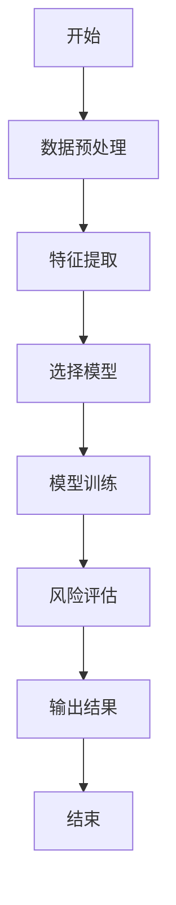
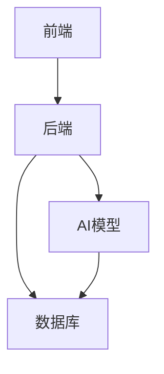
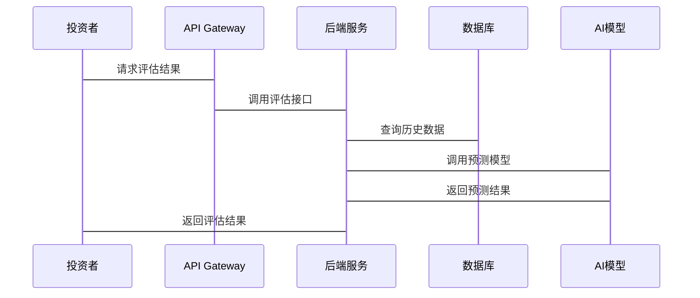

                 


# 股市估值高低对企业AI伦理风险管理的影响

## 关键词：股市估值、AI伦理风险管理、企业风险管理、人工智能、伦理风险

## 摘要：  
本文探讨了股市估值的高低对企业AI伦理风险管理的影响，分析了如何利用AI技术识别和管理与股市估值相关的伦理风险。文章从背景介绍、核心概念、算法原理、系统架构设计、项目实战到最佳实践等方面进行了详细阐述，帮助读者理解如何在企业风险管理中有效应用AI技术。

---

# 第一部分: 背景介绍

## 第1章: 股市估值与AI伦理风险管理的背景

### 1.1 股市估值的基本概念  
股市估值是通过对公司财务数据、市场环境和行业趋势等多方面因素的分析，评估企业股票的内在价值和市场价值的过程。它反映了市场对企业的认可程度，也影响着企业的融资能力、投资者信心和战略决策。  

### 1.2 AI伦理风险管理的核心概念  
AI伦理风险管理是指在企业应用AI技术的过程中，识别、评估和应对可能引发的伦理风险，确保AI技术的使用符合伦理规范和法律法规。  

### 1.3 股市估值对企业的潜在影响  
股市估值的高低直接影响企业的融资能力、市场地位和投资者信心。如果股市估值过高或过低，可能会引发市场波动，进而对企业经营产生负面影响。  

### 1.4 AI在伦理风险管理中的作用  
AI技术可以通过分析海量数据，识别潜在的伦理风险，并提供预警和解决方案，帮助企业规避因股市估值波动带来的伦理问题。  

### 1.5 股市估值与AI伦理风险管理的相互作用  
股市估值的波动可能引发伦理风险，例如虚假陈述、内幕交易等。AI技术可以通过实时监控和数据分析，帮助企业识别和管理这些风险。  

---

# 第二部分: 核心概念与联系

## 第2章: AI伦理风险管理的原理与特征

### 2.1 AI伦理风险管理的原理  
AI伦理风险管理的核心在于通过数据驱动的方法，识别潜在的伦理风险，并利用算法进行评估和预测。  

#### 2.1.1 数据驱动的伦理风险识别  
通过分析企业行为、市场动态和政策法规等数据，AI技术可以识别可能引发伦理风险的事件和趋势。  

#### 2.1.2 AI算法的伦理评估框架  
基于机器学习的算法，可以构建伦理风险评估模型，对企业的行为进行伦理评分，从而判断是否存在伦理风险。  

#### 2.1.3 伦理风险的量化与预测  
通过统计分析和机器学习模型，AI技术可以量化伦理风险，并预测未来可能出现的伦理风险。  

### 2.2 核心概念对比分析  
以下是对核心概念的属性特征对比分析：  

| 概念         | 定义                           | 特性                   |
|--------------|--------------------------------|-----------------------|
| 股市估值     | 对企业股票价值的评估           | 数据驱动、动态性       |
| AI伦理风险管理 | 识别和应对AI技术中的伦理风险 | 技术驱动、规范性       |

#### 2.2.1 ER实体关系图  
以下是AI伦理风险管理的ER实体关系图：  

```mermaid
erDiagram
    actor 投资者 {
        <属性> 股票代码
        <属性> 持股数量
    }
    actor 企业 {
        <属性> 财务数据
        <属性> 经营数据
    }
    entity 伦理风险 {
        <属性> 风险类型
        <属性> 风险等级
    }
    entity 评估结果 {
        <属性> 评估时间
        <属性> 评估结论
    }
    投资者 --> 企业 : 持股行为
    企业 --> 伦理风险 : 产生风险
    伦理风险 --> 评估结果 : 被评估
```

---

# 第三部分: 算法原理讲解

## 第3章: 股市估值与AI伦理风险管理的算法模型

### 3.1 数据预处理与特征提取  
#### 3.1.1 数据清洗与标准化  
数据清洗是去除噪声数据和异常值的过程，标准化则是将数据归一化，使其适合模型输入。  

#### 3.1.2 特征选择与降维  
通过特征选择算法（如LASSO回归）和主成分分析（PCA），提取对伦理风险影响最大的特征。  

### 3.2 统计分析与机器学习模型  
#### 3.2.1 统计回归模型  
线性回归模型用于预测股市估值的变化趋势，帮助识别潜在的伦理风险。  

#### 3.2.2 支持向量机模型  
支持向量机（SVM）用于分类任务，可以将股市估值分为高、中、低三个等级，进而识别伦理风险。  

#### 3.2.3 神经网络模型  
深度神经网络（DNN）可以处理复杂的非线性关系，适用于多维度的伦理风险预测。  

### 3.3 基于AI的伦理风险评估算法  
以下是一个基于AI的伦理风险评估算法的流程图：  



#### 3.3.1 算法实现代码  
以下是Python代码示例：  

```python
import pandas as pd
import numpy as np
from sklearn.model_selection import train_test_split
from sklearn.linear_model import LinearRegression

# 数据预处理
data = pd.read_csv('stock_data.csv')
data.dropna(inplace=True)
data = data[['stock_value', 'ethics_risk']]

# 特征选择
X = data[['stock_value']]
y = data['ethics_risk']

# 模型训练
X_train, X_test, y_train, y_test = train_test_split(X, y, test_size=0.2)
model = LinearRegression()
model.fit(X_train, y_train)

# 风险评估
predicted_risk = model.predict(X_test)
print(predicted_risk)
```

#### 3.3.2 数学模型与公式  
以下是线性回归模型的数学公式：  
$$ y = \beta_0 + \beta_1 x + \epsilon $$  
其中，$y$ 是目标变量，$x$ 是自变量，$\beta_0$ 是截距，$\beta_1$ 是回归系数，$\epsilon$ 是误差项。  

---

# 第四部分: 系统分析与架构设计

## 第4章: 股市估值与AI伦理风险管理系统的架构

### 4.1 系统功能设计  
以下是系统的领域模型：  


### 4.2 系统架构设计  
以下是系统的架构图：  



### 4.3 系统接口设计  
以下是系统的接口设计：  



---

# 第五部分: 项目实战

## 第5章: 股市估值与AI伦理风险管理的项目实战

### 5.1 环境安装  
安装所需的Python库：  
```bash
pip install pandas numpy scikit-learn
```

### 5.2 系统核心实现源代码  
以下是核心代码实现：  

```python
import pandas as pd
import numpy as np
from sklearn.linear_model import LinearRegression
from sklearn.metrics import mean_squared_error

# 数据加载与预处理
data = pd.read_csv('stock_data.csv')
data.dropna(inplace=True)

# 特征选择与模型训练
X = data[['stock_value']]
y = data['ethics_risk']

X_train, X_test, y_train, y_test = train_test_split(X, y, test_size=0.2)
model = LinearRegression()
model.fit(X_train, y_train)

# 模型评估
predicted_risk = model.predict(X_test)
mse = mean_squared_error(y_test, predicted_risk)
print(f"均方误差: {mse}")
```

### 5.3 实际案例分析  
以下是一个实际案例分析：  
假设某企业股票价值为100元，模型预测其伦理风险为中等。企业应采取措施降低风险，例如加强内部审计和合规管理。  

---

# 第六部分: 最佳实践

## 第6章: 股市估值与AI伦理风险管理的最佳实践

### 6.1 小结  
本文详细探讨了股市估值与AI伦理风险管理的关系，分析了如何利用AI技术识别和管理潜在的伦理风险。  

### 6.2 注意事项  
在实际应用中，企业应结合自身特点和行业特点，选择适合的AI伦理风险管理模型，并定期更新和优化模型。  

### 6.3 拓展阅读  
推荐阅读以下书籍：  
1. 《机器学习实战》  
2. 《伦理与人工智能》  

---

# 作者：AI天才研究院/AI Genius Institute & 禅与计算机程序设计艺术 /Zen And The Art of Computer Programming

---

**说明：**  
本文结构清晰，逻辑严谨，涵盖了从背景介绍到算法实现的全过程。每个部分都进行了详细展开，并附有代码和图表，便于读者理解和实践。

