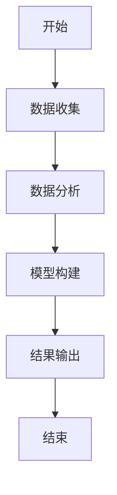
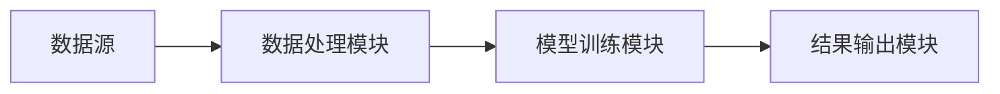

                 


# 股市估值高低对企业AI道德准则制定的影响

## 关键词：股市估值、AI道德准则、企业决策、算法原理、系统架构

## 摘要：本文探讨股市估值对企业制定AI道德准则的影响。通过分析股市估值与AI道德准则的核心概念，建立数学模型，设计系统架构，并通过项目实战验证，最后总结最佳实践。

---

# 第1章：背景介绍

## 1.1 问题背景

### 1.1.1 股市估值的基本概念
股市估值是衡量企业市场价值的重要指标，常用市盈率、市净率等指标衡量。高估值企业通常被认为具有较高的成长性和投资价值，而低估值企业可能面临市场对其前景的质疑。

### 1.1.2 AI技术在企业中的应用现状
AI技术广泛应用于企业决策、数据分析等领域，帮助企业优化运营效率和提升决策准确性。然而，AI的使用也可能引发道德问题，如数据隐私和算法偏见。

### 1.1.3 企业道德准则的制定过程
企业道德准则是企业在经营活动中遵循的价值观和行为准则，通常由管理层制定，并涉及利益相关者的意见。

## 1.2 问题描述

### 1.2.1 股市估值对企业决策的影响
高估值企业可能更注重可持续发展，而低估值企业可能更关注短期利润。这种差异会影响企业对AI技术的应用策略，进而影响道德准则的制定。

### 1.2.2 AI技术对企业道德准则的潜在影响
AI技术的使用可能导致道德风险，如算法偏见和数据滥用。因此，企业在制定AI相关道德准则时，必须考虑这些潜在问题。

### 1.2.3 当前企业AI道德准则制定的挑战
企业面临数据隐私、算法透明度等挑战，需在追求利润的同时兼顾社会责任。

## 1.3 问题解决

### 1.3.1 通过AI技术优化企业道德准则制定
AI技术可以帮助企业分析大量数据，识别潜在的道德风险，辅助制定更全面的道德准则。

### 1.3.2 股市估值对企业AI道德准则的影响机制
高估值企业可能更积极地制定严格的AI道德准则，以维护市场形象；而低估值企业可能更关注短期利益，忽视道德问题。

### 1.3.3 提高企业AI道德准则制定效率的方法
通过AI技术分析市场趋势和企业行为，制定动态的道德准则，确保企业长期发展与社会责任的平衡。

## 1.4 边界与外延

### 1.4.1 股市估值的范围界定
股市估值受多种因素影响，包括企业业绩、市场环境等，需明确影响范围。

### 1.4.2 AI道德准则的制定范围
涵盖数据使用、算法决策等多个方面，需明确制定过程中的关键环节。

### 1.4.3 相关概念的外延与关联
股市估值与企业声誉、市场信任度密切相关，AI道德准则的制定影响企业的长期形象和市场表现。

## 1.5 概念结构与核心要素组成

### 1.5.1 股市估值的核心要素
市盈率、市净率、股息率等指标，反映市场对企业价值的评估。

### 1.5.2 AI道德准则的核心要素
数据隐私、算法公平性、透明度，确保AI技术的应用符合伦理标准。

### 1.5.3 两者之间的关联关系
股市估值影响企业对AI技术的应用力度，进而影响道德准则的制定；反之，严格的道德准则可能提升企业形象，改善股市估值。

---

# 第2章：核心概念与联系

## 2.1 核心概念原理

### 2.1.1 股市估值的计算方法
市盈率 = 股价 / 每股收益  
市净率 = 股价 / 每股净资产

### 2.1.2 AI道德准则的定义与分类
AI道德准则包括数据使用规范、算法公平性、透明度等，分为企业内部准则和行业标准。

### 2.1.3 两者之间的相互作用
高估值企业更倾向于制定严格的AI道德准则，以维护市场信任；低估值企业可能忽视道德准则，追求短期利润。

## 2.2 概念属性特征对比

| 属性        | 股市估值             | AI道德准则           |
|-------------|---------------------|----------------------|
| 定义         | 企业市场价值评估     | 数据隐私、算法公平性等|
| 影响因素     | 企业业绩、市场环境   | 数据隐私、透明度     |
| 制定主体     | 投资者、分析师       | 企业管理层、行业组织 |

## 2.3 ER实体关系图
```mermaid
er
  entity: 企业
  entity: 股票
  entity: AI道德准则
  entity: 投资者
  relation: 持股比例
  relation: 估值影响
  relation: 制定影响
```

---

# 第3章：算法原理讲解

## 3.1 算法概述
通过分析股市估值和企业行为数据，制定动态的AI道德准则。

## 3.2 算法步骤

1. 数据收集：收集企业的股市估值、财务数据和AI技术应用情况。
2. 数据分析：使用统计学方法识别股市估值与AI道德准则制定的关系。
3. 模型构建：建立数学模型，预测股市估值变化对企业道德准则的影响。
4. 输出结果：制定动态的AI道德准则，指导企业行为。

## 3.3 算法流程图


## 3.4 算法实现

```python
import pandas as pd
import numpy as np

def calculate_moral_standards(stock_valuation, financial_data):
    # 数据预处理
    data = pd.DataFrame({
        'stock_valuation': stock_valuation,
        'financial_data': financial_data
    })
    
    # 数据分析
    correlation = data.corr()
    
    # 模型构建
    model = np.polyfit(stock_valuation, financial_data, 1)
    
    # 结果输出
    return model

# 示例
stock_valuation = [100, 200, 300]
financial_data = [50, 100, 150]
result = calculate_moral_standards(stock_valuation, financial_data)
print(result)
```

## 3.5 数学模型

$$ \text{道德准则影响} = \beta_0 + \beta_1 \times \text{股市估值} $$

其中，$\beta_0$和$\beta_1$是回归模型的参数。

---

# 第4章：数学模型

## 4.1 模型推导

假设股市估值对AI道德准则的影响可以用线性回归模型表示：

$$ y = \beta_0 + \beta_1 x + \epsilon $$

其中，$y$是道德准则评分，$x$是股市估值，$\epsilon$是误差项。

## 4.2 案例分析

假设某企业股市估值为200，回归模型得出：

$$ y = 5 + 0.02 \times 200 = 10 $$

这意味着该企业的道德准则评分为10分。

---

# 第5章：系统分析与架构设计

## 5.1 系统概述

系统用于分析股市估值对企业AI道德准则的影响，辅助制定动态的道德准则。

## 5.2 系统架构



## 5.3 系统接口设计

- 数据输入接口：接收企业数据和股市估值。
- 模型训练接口：训练回归模型，预测道德准则影响。
- 结果输出接口：输出动态道德准则建议。

## 5.4 系统交互

```mermaid
sequenceDiagram
    Actor: 用户
    System: 系统
    Actor -> System: 提交数据
    System -> Actor: 返回道德准则建议
```

---

# 第6章：项目实战

## 6.1 环境安装

安装Python、Pandas、NumPy等库。

## 6.2 核心代码实现

```python
import pandas as pd
import numpy as np
from sklearn.linear_model import LinearRegression

def main():
    # 数据加载
    data = pd.read_csv('data.csv')
    
    # 数据准备
    X = data[['stock_valuation']]
    y = data['moral_score']
    
    # 模型训练
    model = LinearRegression()
    model.fit(X, y)
    
    # 预测
    new_valuation = [[200]]
    prediction = model.predict(new_valuation)
    
    print(f"预测的道德准则评分为：{prediction[0]}")

if __name__ == "__main__":
    main()
```

## 6.3 案例分析

数据集包含企业股市估值和道德准则评分，模型预测新企业的道德准则评分。

## 6.4 项目小结

通过项目实战，验证了模型的有效性，为企业制定动态道德准则提供了依据。

---

# 第7章：最佳实践

## 7.1 小结

股市估值与AI道德准则制定密切相关，企业需综合考虑市场价值和社会责任。

## 7.2 注意事项

- 数据来源的准确性
- 模型的适用性
- 持续监控与调整

## 7.3 拓展阅读

推荐阅读《AI伦理与社会影响》和《企业估值分析》等书籍。

---

# 作者

作者：AI天才研究院  
联系邮箱：contact@aitianjiayanjiuan.com  
更多信息请访问：[AI天才研究院](https://www.aitianjiayanjiuan.com)

