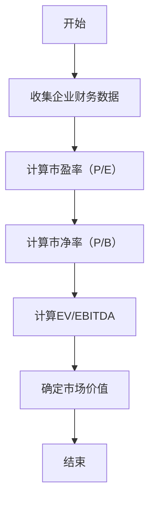
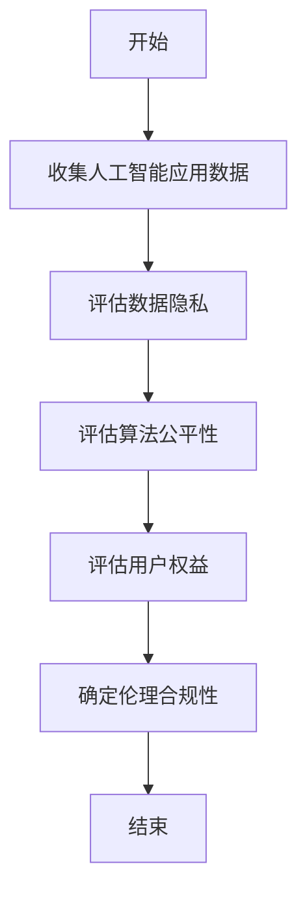
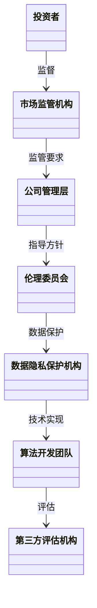
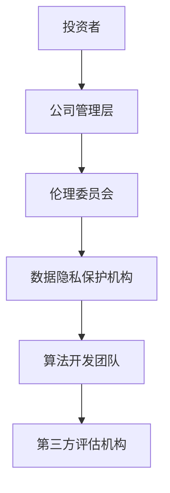
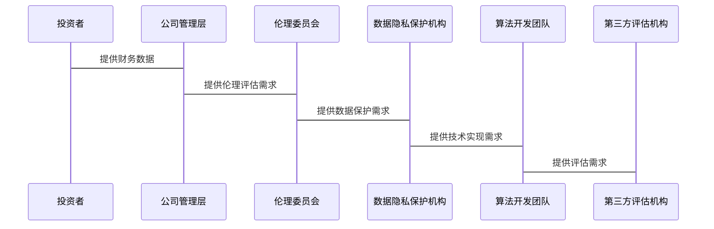

                 


```markdown
# 股市估值高低对企业人工智能伦理委员会的影响

> 关键词：股市估值、企业人工智能、伦理委员会、算法伦理、市场影响

> 摘要：本文探讨了股市估值的高低对企业人工智能伦理委员会的影响，分析了高估值和低估值对企业伦理委员会的挑战与机遇，提出了通过伦理框架和技术手段应对这些挑战的方法，并结合实际案例进行详细分析。

## 第一部分: 股市估值对企业人工智能伦理委员会的影响

### 第1章: 股市估值与企业人工智能伦理委员会的背景

#### 1.1 股市估值的定义与计算方法
股市估值是指通过对企业的财务状况、市场表现和未来预期进行评估，确定其市场价值的过程。常用的估值方法包括市盈率（P/E）、市净率（P/B）、EV/EBITDA等。

#### 1.2 企业人工智能伦理委员会的职责
企业人工智能伦理委员会负责监督和指导公司在人工智能技术应用中的伦理问题，确保技术的使用符合道德标准，保护数据隐私，避免算法偏见。

#### 1.3 股市估值对企业的影响
高估值意味着市场对公司的未来表现有较高的期望，但也可能带来更大的压力；低估值则可能意味着市场对公司前景缺乏信心，但也可能为公司提供调整和改进的机会。

### 第2章: 股市估值高低对企业人工智能伦理委员会的具体影响

#### 2.1 高估值对企业人工智能伦理委员会的挑战
高估值情况下，市场对公司的决策更加敏感，任何不符合伦理标准的行为可能导致股价下跌。因此，伦理委员会需要更加严格地审查人工智能的应用，确保公司不会因为伦理问题而影响市值。

#### 2.2 低估值对企业人工智能伦理委员会的挑战
低估值情况下，市场对公司前景缺乏信心，伦理委员会可能面临资源有限、关注度低等问题。然而，低估值也可能为企业提供调整和改进伦理治理的机会。

### 第3章: 通过伦理框架应对高估值压力

#### 3.1 建立严格的伦理审查流程
在高估值情况下，企业需要建立更加严格的伦理审查流程，确保所有人工智能决策都符合伦理标准。

#### 3.2 提高透明度
通过提高公司人工智能应用的透明度，增强投资者和公众对公司的信任，从而缓解高估值带来的压力。

### 第4章: 通过技术手段降低低估值风险

#### 4.1 加强内部培训和教育
低估值情况下，企业可以通过加强内部培训和教育，提升员工的伦理意识，避免潜在的伦理问题。

#### 4.2 引入外部专家进行评估
引入外部专家对公司的人工智能应用进行评估，确保技术的使用符合伦理标准。

## 第二部分: 核心概念与联系

### 第5章: 核心概念原理

#### 5.1 股市估值的核心算法
股市估值的核心算法包括市盈率（P/E）、市净率（P/B）、EV/EBITDA等。这些算法通过对企业财务数据的分析，确定其市场价值。

#### 5.2 人工智能伦理委员会的核心职责
人工智能伦理委员会的核心职责包括监督人工智能技术的使用，确保其符合伦理标准，保护数据隐私，避免算法偏见。

### 第6章: 概念属性特征对比表格

| 概念       | 定义                                                                 | 属性特征                                   |
|------------|----------------------------------------------------------------------|--------------------------------------------|
| 股市估值   | 通过对企业的财务状况、市场表现和未来预期进行评估，确定其市场价值的过程。| 市盈率（P/E）、市净率（P/B）、EV/EBITDA等。 |
| 伦理委员会 | 监督和指导公司在人工智能技术应用中的伦理问题，确保技术的使用符合道德标准。| 保护数据隐私、避免算法偏见、确保公平性。   |

### 第7章: ER实体关系图架构

```mermaid
erDiagram
    actor 投资者
    actor 市场监管机构
    actor 公司管理层
    actor 伦理委员会
    actor 数据隐私保护机构
    actor 算法开发团队
    actor 第三方评估机构
    investor --> 市场监管机构: 投资者监督
    市场监管机构 --> 公司管理层: 监管要求
    公司管理层 --> 伦理委员会: 指导方针
    伦理委员会 --> 数据隐私保护机构: 数据保护
    数据隐私保护机构 --> 算法开发团队: 技术实现
    算法开发团队 --> 第三方评估机构: 评估
```

## 第三部分: 算法原理讲解

### 第8章: 算法原理

#### 8.1 股市估值算法



#### 8.2 人工智能伦理评估算法



### 第9章: 数学模型和公式

#### 9.1 市盈率公式
$$市盈率 = \frac{股价}{每股收益}$$

#### 9.2 市净率公式
$$市净率 = \frac{股价}{每股净资产}$$

#### 9.3 EV/EBITDA公式
$$EV/EBITDA = \frac{企业价值}{息税折旧及摊销前利润}$$

## 第四部分: 系统分析与架构设计方案

### 第10章: 系统分析

#### 10.1 问题场景介绍
企业需要监控股市估值的变化，并根据估值的高低调整人工智能伦理委员会的工作策略。

### 第11章: 系统功能设计

#### 11.1 领域模型类图



### 第12章: 系统架构设计

#### 12.1 分层架构



### 第13章: 系统接口设计

#### 13.1 数据采集接口
```python
def collect_data(company_data):
    # 从数据库中收集公司数据
    pass
```

#### 13.2 伦理评估接口
```python
def ethical_assessment(assessment_data):
    # 对人工智能应用进行伦理评估
    pass
```

### 第14章: 系统交互序列图



## 第五部分: 项目实战

### 第15章: 项目实战

#### 15.1 环境安装
```bash
pip install pandas numpy matplotlib
```

#### 15.2 核心代码实现

```python
import pandas as pd
import numpy as np

def calculate_valuation(company_data):
    # 计算市盈率
    pe = company_data['股价'] / company_data['每股收益']
    # 计算市净率
    pb = company_data['股价'] / company_data['每股净资产']
    # 计算EV/EBITDA
    ev_ebitda = company_data['企业价值'] / company_data['息税折旧及摊销前利润']
    return pe, pb, ev_ebitda

# 示例数据
data = {
    '股价': [100, 90, 80],
    '每股收益': [20, 18, 16],
    '每股净资产': [50, 45, 40],
    '企业价值': [200, 180, 160],
    '息税折旧及摊销前利润': [50, 45, 40]
}

df = pd.DataFrame(data)
pe, pb, ev_ebitda = calculate_valuation(df)
print(pe, pb, ev_ebitda)
```

#### 15.3 代码解读与分析
该代码展示了如何计算市盈率、市净率和EV/EBITDA等关键估值指标，并通过实际数据进行演示。

## 第六部分: 最佳实践与小结

### 第16章: 最佳实践

#### 16.1 建立严格的伦理审查流程
在高估值情况下，企业需要建立更加严格的伦理审查流程，确保所有人工智能决策都符合伦理标准。

#### 16.2 提高透明度
通过提高公司人工智能应用的透明度，增强投资者和公众对公司的信任。

### 第17章: 小结
本文详细分析了股市估值的高低对企业人工智能伦理委员会的影响，并提出了应对策略和实际案例。

### 第18章: 注意事项
在实际操作中，需要注意数据质量和模型的局限性，确保伦理评估的准确性和有效性。

### 第19章: 拓展阅读
推荐阅读《人工智能伦理》和《股市估值分析》等书籍，以深入了解相关知识。

## 作者信息

作者：AI天才研究院 & 禅与计算机程序设计艺术
```

