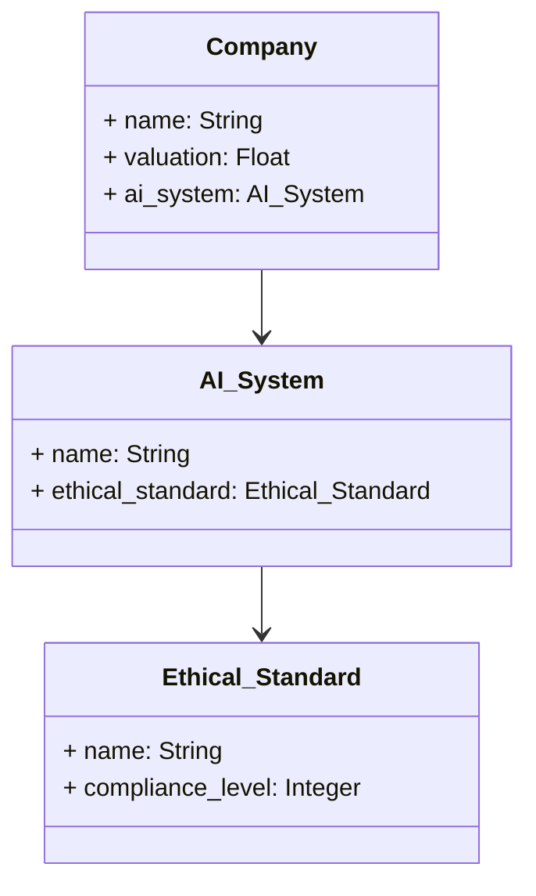
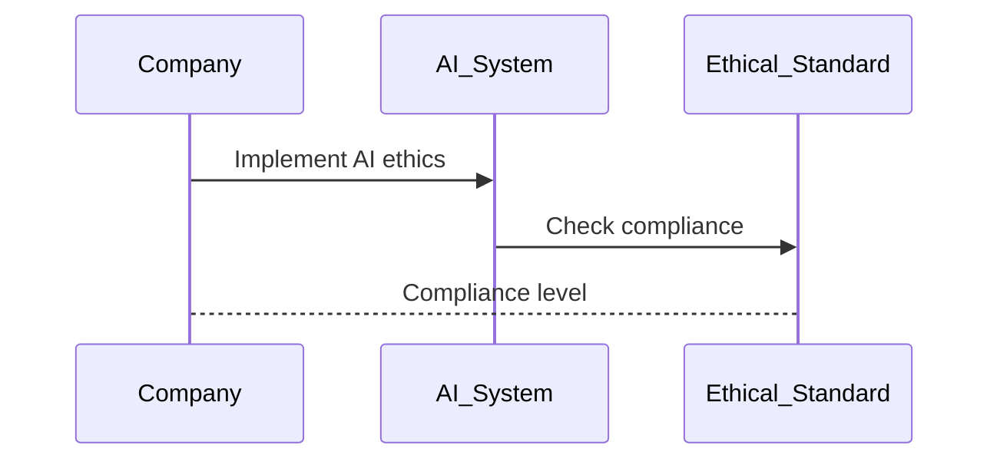
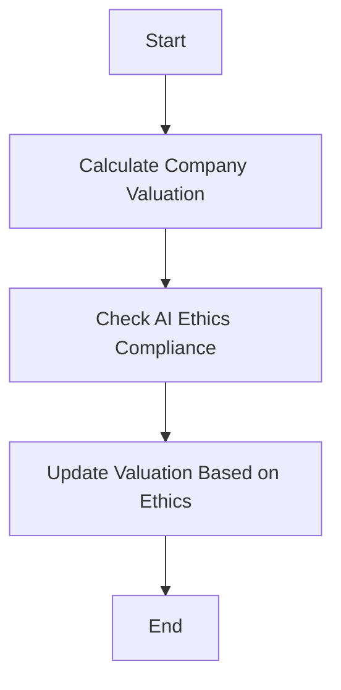

                 


# 股市估值高低对企业人工智能伦理标准的影响

> 关键词：股市估值，企业人工智能，伦理标准，算法模型，市场影响

> 摘要：本文探讨了股市估值的高低对企业在人工智能领域伦理标准的影响，分析了高估值和低估值企业在这方面的差异，并提出了相应的应对策略和未来展望。

---

## 第1章: 股市估值与企业人工智能伦理标准的背景介绍

### 1.1 股市估值的基本概念

#### 1.1.1 股市估值的核心定义

股市估值是指通过对公司财务状况、市场表现、行业地位等多方面因素的分析，对企业的内在价值进行评估的过程。常用的估值方法包括市盈率（P/E）、市净率（P/B）、EV/EBITDA等。

#### 1.1.2 股市估值的计算方法

以市盈率为例，计算公式为：
$$市盈率 = 股价 / 每股收益（EPS）$$

#### 1.1.3 股市估值对企业的影响

高估值意味着市场对企业未来表现的看好，而低估值则可能反映出市场对其前景的不确定性或悲观情绪。

### 1.2 企业人工智能伦理标准的核心概念

#### 1.2.1 人工智能伦理的基本定义

人工智能伦理标准旨在确保AI系统的开发和应用符合道德规范，避免潜在的伦理风险。

#### 1.2.2 企业人工智能伦理标准的属性特征对比表格

| 属性      | 高估值企业 | 低估值企业 |
|-----------|------------|------------|
| 投资力度   | 高          | 低          |
| 伦理合规   | 严格        | 松散        |
| 技术创新   | 快速        | 缓慢        |

#### 1.2.3 人工智能伦理的ER实体关系图

```mermaid
erDiagram
    company --|{-> has} ai_system
    ai_system --|{-> follows} ethical_standard
    ethical_standard --|{-> enforced_by} regulatory_body
```

### 1.3 股市估值与人工智能伦理标准的关联性

#### 1.3.1 股市估值与企业行为的关系

高估值企业通常在技术研发和合规方面投入更多，而低估值企业可能在成本控制和短期利润上更关注。

#### 1.3.2 人工智能伦理标准对企业估值的影响

严格的伦理标准可能提升企业形象，从而提高估值，反之，伦理问题可能导致估值下降。

#### 1.3.3 两者关系的边界与外延

股市估值是市场对企业的综合评价，而人工智能伦理标准是企业行为的一部分，两者相互影响。

### 1.4 本章小结

本章介绍了股市估值和人工智能伦理标准的基本概念，分析了两者之间的关联性，为后续章节的深入分析奠定了基础。

---

## 第2章: 股市估值高低对企业人工智能伦理标准的影响机制

### 2.1 股市估值对企业人工智能伦理的影响路径

#### 2.1.1 高估值企业的伦理压力

高估值企业面临更大的投资者期望，可能在伦理合规上投入更多资源，以维护企业形象。

#### 2.1.2 低估值企业的伦理挑战

低估值企业可能在伦理合规上投入不足，容易引发潜在的伦理风险，进一步影响企业估值。

### 2.2 人工智能伦理标准对股市估值的影响路径

#### 2.2.1 伦理合规对投资者信心的影响

严格的伦理合规能够增强投资者信心，从而提高企业估值。

#### 2.2.2 伦理风险对股价波动的影响

伦理问题可能导致股价短期波动，进而影响企业估值。

### 2.3 股市估值与人工智能伦理标准的相互作用

#### 2.3.1 高估值企业的人工智能伦理实践

高估值企业通常会采用更先进的技术，同时在伦理标准上更为严格，以确保合规。

#### 2.3.2 低估值企业的人工智能伦理困境

低估值企业可能因为资源有限，难以在伦理合规上投入足够的资源，导致潜在风险。

### 2.4 本章小结

本章分析了股市估值高低对企业人工智能伦理标准的具体影响，揭示了两者之间的相互作用机制。

---

## 第3章: 股市估值与人工智能伦理标准的系统分析

### 3.1 系统分析框架

#### 3.1.1 问题场景介绍

本章以高估值和低估值企业的AI伦理实践为研究对象，构建分析框架。

#### 3.1.2 系统功能设计



#### 3.1.3 系统架构设计


### 3.2 系统接口设计

#### 3.2.1 股市估值接口

```python
class Company:
    def calculate_valuation(self):
        pass
```

#### 3.2.2 人工智能伦理标准接口

```python
class AI_System:
    def check_ethical_compliance(self):
        pass
```

### 3.3 系统交互设计

#### 3.3.1 股市估值与伦理标准的交互流程



### 3.4 本章小结

本章通过系统分析，构建了股市估值与人工智能伦理标准的分析框架，为后续的算法设计奠定了基础。

---

## 第4章: 股市估值与人工智能伦理标准的算法原理

### 4.1 算法原理概述

#### 4.1.1 股市估值预测算法

使用回归分析预测公司估值。

#### 4.1.2 人工智能伦理评估算法

基于伦理标准对AI系统进行评分。

### 4.2 算法流程图



### 4.3 算法实现代码示例

#### 4.3.1 股市估值预测代码

```python
def predict_valuation(company_financials):
    # 使用回归模型预测估值
    return model.predict(company_financials)
```

#### 4.3.2 人工智能伦理评估代码

```python
def assess_ethics(ethical_assessment):
    # 评估伦理合规性
    return compliance_score
```

### 4.4 本章小结

本章详细介绍了股市估值与人工智能伦理标准的算法原理，展示了如何通过算法模型进行预测和评估。

---

## 第5章: 股市估值与人工智能伦理标准的项目实战

### 5.1 项目介绍

#### 5.1.1 项目目标

分析高估值和低估值企业在人工智能伦理实践中的差异。

#### 5.1.2 项目环境安装

安装必要的数据处理和建模工具，如Python、Pandas、Scikit-learn。

### 5.2 系统核心实现

#### 5.2.1 股市估值预测模型实现

```python
import pandas as pd
from sklearn.linear_model import LinearRegression

model = LinearRegression()
```

#### 5.2.2 人工智能伦理评估实现

```python
def evaluate_compliance(assessment):
    # 评估伦理合规性
    return compliance_level
```

### 5.3 项目实战案例分析

#### 5.3.1 案例分析

分析某高估值科技公司在AI伦理实践中的做法，对比低估值公司的做法，揭示高估

