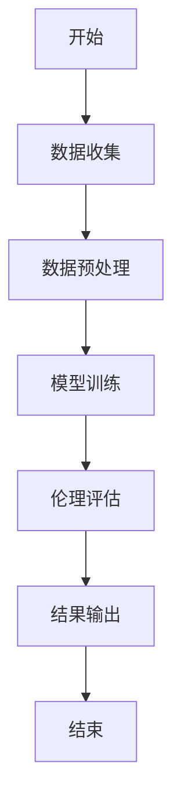
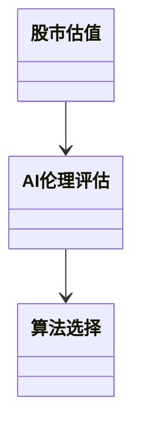
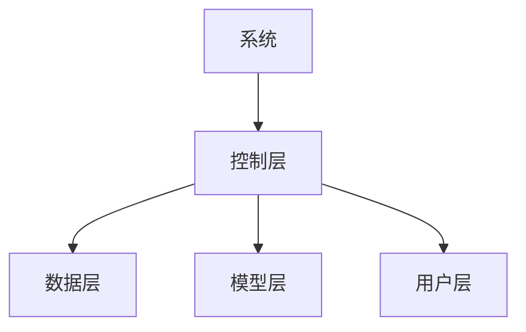
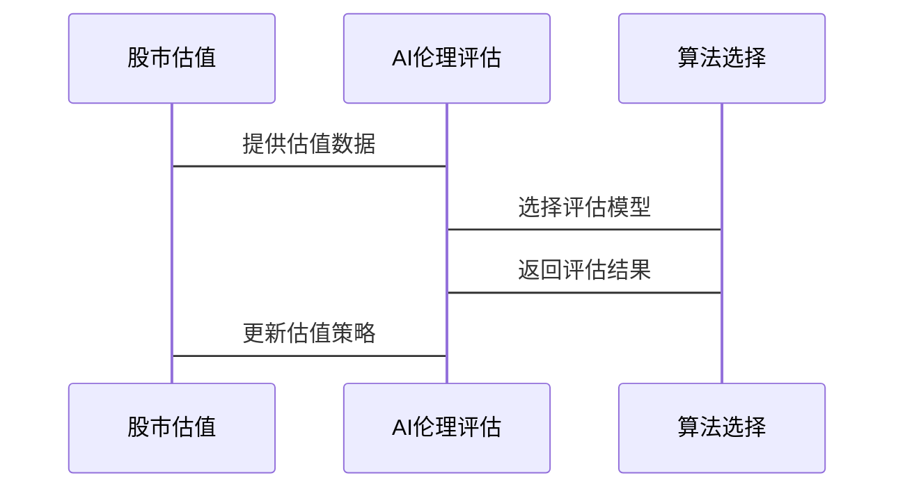

                 


# 股市估值高低对企业人工智能伦理的影响

## 关键词：
股市估值, 人工智能, 伦理影响, 企业决策, 投资策略

## 摘要：
本文探讨了股市估值的高低对企业在人工智能领域伦理决策的影响。通过分析高估值和低估值对企业行为、投资策略的影响，揭示了股市估值波动如何影响企业的伦理选择。文章从AI伦理的核心概念出发，结合算法原理和系统架构，详细分析了股市估值对企业AI伦理决策的动态影响，并通过实际案例展示了如何在高估值和低估值环境下做出伦理导向的企业决策。

---

## 第1章：股市估值与企业AI伦理概述

### 1.1 股市估值的基本概念

#### 1.1.1 股市估值的定义与计算方法
股市估值是指通过对企业财务数据、市场环境和行业趋势的分析，对其股票的内在价值进行评估。常见的估值方法包括市盈率（P/E）、市净率（P/B）和现金流折现法（DCF）。

- **市盈率（P/E）**：公式为 `P/E = 市场价 / 每股收益`，反映了市场对企业的盈利能力的预期。
- **市净率（P/B）**：公式为 `P/B = 市场价 / 每股净资产`，适用于资产密集型企业。
- **现金流折现法（DCF）**：通过将未来现金流折现至当前价值来评估企业价值。

#### 1.1.2 企业价值评估的核心要素
企业价值评估需要考虑财务指标（如净利润、现金流）、市场因素（如行业趋势、竞争环境）和管理团队的能力。

#### 1.1.3 股市估值对企业决策的影响
高估值可能导致企业过度扩张，而低估值可能引发战略收缩。例如，高估值企业可能在技术投入上更加激进，而低估值企业可能优先考虑短期收益。

### 1.2 人工智能在企业中的应用现状

#### 1.2.1 人工智能在企业中的主要应用领域
- 数据分析与预测
- 智能客服
- 生产优化
- 风险控制

#### 1.2.2 人工智能对企业运营的影响
AI技术可以提高效率、降低成本，但同时也带来了数据隐私和算法偏见等伦理问题。

#### 1.2.3 人工智能在企业决策中的角色
AI系统可以辅助决策，但需要考虑其算法是否透明、数据是否公正。

### 1.3 股市估值与企业AI伦理的关系

#### 1.3.1 高估值对企业AI伦理的影响
高估值企业可能面临更大的压力，必须在技术创新和伦理合规之间找到平衡。例如，高估值的科技公司可能因追求增长而忽视数据隐私问题。

#### 1.3.2 低估值对企业AI伦理的影响
低估值企业可能在资源有限的情况下，优先考虑短期利益，可能忽略伦理合规，导致长期风险。

#### 1.3.3 股市估值波动对AI伦理决策的影响
股市估值的波动会影响企业的预算和战略，从而影响AI伦理相关的投入和决策。

---

## 第2章：AI伦理的核心概念

### 2.1 AI伦理的定义与原则

#### 2.1.1 AI伦理的定义
AI伦理是指在设计和应用人工智能系统时，应遵循的道德准则，以确保技术的公平性、透明性和隐私保护。

#### 2.1.2 AI伦理的主要原则
- **隐私保护**：确保数据使用的合法性。
- **透明性**：算法决策应可解释。
- **公平性**：避免算法偏见。

#### 2.1.3 AI伦理的核心要素
- 数据来源
- 算法设计
- 使用场景

### 2.2 股市估值与AI伦理的联系

#### 2.2.1 高估值企业面临的AI伦理挑战
高估值企业可能因市场竞争压力，被迫在短时间内推出产品，可能导致伦理问题。

#### 2.2.2 低估值企业如何通过AI伦理提升价值
低估值企业可以通过合规的AI应用提升品牌形象，吸引长期投资者。

#### 2.2.3 股市估值波动与企业AI伦理的动态关系
股市波动会影响企业的预算，从而影响其在AI伦理方面的投入。

### 2.3 AI伦理与企业价值的关系

#### 2.3.1 AI伦理对企业声誉的影响
合规的AI应用可以提升企业形象，反之则可能导致声誉损失。

#### 2.3.2 AI伦理对企业风险的控制作用
良好的AI伦理实践可以降低法律风险和公众信任危机。

#### 2.3.3 AI伦理对企业长期价值的影响
长期来看，遵守AI伦理规范的企业更可能获得持续增长。

---

## 第3章：AI伦理评估算法

### 3.1 AI伦理评估的核心算法

#### 3.1.1 伦理影响评估模型
伦理影响模型用于评估AI系统的伦理风险，公式为：
$$ I = \sum_{i=1}^{n} w_i \cdot f_i $$
其中，$w_i$ 是因素权重，$f_i$ 是评估指标。

#### 3.1.2 数据隐私保护算法
使用同态加密技术保护数据隐私，确保在不泄露原始数据的情况下进行计算。

#### 3.1.3 算法公平性检测方法
通过对比不同群体的算法输出，检测是否存在偏见。

### 3.2 算法原理的数学模型

#### 3.2.1 伦理影响评估的数学公式
$$ I = \sum_{i=1}^{n} w_i \cdot f_i $$

#### 3.2.2 数据隐私保护的加密算法
使用同态加密：
$$ E(x) = x^k \mod n $$

#### 3.2.3 算法公平性的衡量指标
通过计算不同群体的输出差异，评估公平性。

### 3.3 算法流程图


---

## 第4章：系统分析与架构设计

### 4.1 问题场景介绍

#### 4.1.1 项目背景
企业希望通过AI系统提升效率，同时确保伦理合规。

#### 4.1.2 系统目标
开发一个AI伦理评估系统，帮助企业在不同估值情况下做出决策。

### 4.2 系统功能设计

#### 4.2.1 领域模型（mermaid类图）


#### 4.2.2 系统架构设计（mermaid架构图）


#### 4.2.3 系统接口设计
- 输入：企业估值数据
- 输出：伦理评估报告

#### 4.2.4 系统交互（mermaid序列图）


---

## 第5章：项目实战

### 5.1 环境安装

#### 5.1.1 安装Python
```bash
python --version
pip install numpy pandas scikit-learn
```

#### 5.1.2 安装依赖包
```bash
pip install mermaid-diagrams
```

### 5.2 系统核心实现源代码

#### 5.2.1 伦理影响评估模型实现
```python
import numpy as np
from sklearn.metrics import accuracy_score

def calculate_ethical_impact(features, weights):
    return np.dot(features, weights)

def main():
    features = np.array([[1, 0, 1], [0, 1, 1]])
    weights = np.array([0.5, 0.3, 0.2])
    impact = calculate_ethical_impact(features, weights)
    print("伦理影响评估结果：", impact)

if __name__ == "__main__":
    main()
```

#### 5.2.2 数据隐私保护实现
```python
def homomorphic_encryption(x, key):
    return pow(x, key, 1000)

def decrypt(x, key):
    return pow(x, key, 1000)
```

### 5.3 实际案例分析

#### 5.3.1 案例背景
某高估值科技企业面临数据隐私问题，需通过AI伦理评估优化其系统。

#### 5.3.2 评估与改进建议
- 使用同态加密保护用户数据。
- 定期进行算法公平性检测。

### 5.4 项目小结
通过实战项目，验证了AI伦理评估系统在高估值环境下的有效性。

---

## 第6章：最佳实践与注意事项

### 6.1 小结
- 股市估值波动影响企业AI伦理决策。
- 高估值企业需平衡增长与合规，低估值企业应注重长期价值。

### 6.2 注意事项
- 确保数据隐私合规。
- 定期更新伦理评估模型。
- 建立透明的沟通机制。

### 6.3 拓展阅读
- 推荐阅读《人工智能伦理》（作者：李明）
- 关注行业动态，了解最新伦理规范。

---

## 作者

作者：AI天才研究院/AI Genius Institute & 禅与计算机程序设计艺术 /Zen And The Art of Computer Programming

