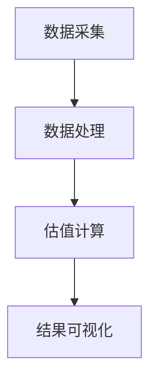

                 


# 股市估值高低对企业品牌价值的影响

## 关键词：股市估值，品牌价值，企业价值，股价波动，品牌影响力

## 摘要：股市估值是衡量企业价值的重要指标，而品牌价值是企业核心竞争力的关键因素。本文从股市估值与品牌价值的定义与关系入手，深入分析两者之间的相互影响，探讨股市估值高低对企业品牌价值的影响因素，并结合实际案例，提出品牌价值评估的系统方法和最佳实践策略。

---

## 第1章 股市估值与品牌价值的背景与核心概念

### 1.1 股市估值的基本概念

#### 1.1.1 股票估值的定义与意义
股票估值是指通过对企业财务状况、市场地位、盈利能力等多方面因素的分析，对企业的市值进行估计的过程。股票估值不仅是投资者决策的重要依据，也是企业自身价值的体现。

#### 1.1.2 市场估值的主要方法
- 市盈率（P/E）：市盈率 = 股价 / 每股净利润。
- 市净率（P/B）：市净率 = 股价 / 每股净资产。
- 现金流量折现法：通过现金流折现模型（DCF）对企业未来现金流进行折现，评估企业价值。

#### 1.1.3 股市估值与企业价值的关系
股市估值是企业市场价值的外在表现，企业价值则是股市估值的内在基础。股市估值的高低反映了市场对企业价值的认可程度。

---

### 1.2 品牌价值的核心概念

#### 1.2.1 品牌价值的定义与内涵
品牌价值是指品牌在市场中所能带来的经济收益和竞争优势。品牌价值不仅包括品牌知名度、品牌忠诚度，还包括品牌在市场中的溢价能力。

#### 1.2.2 品牌价值的衡量标准
- 品牌知名度：品牌在目标市场中的认知度和影响力。
- 品牌忠诚度：消费者对品牌的偏好和忠诚程度。
- 品牌溢价能力：品牌产品或服务的定价能力。

#### 1.2.3 品牌价值对企业的影响
品牌价值直接影响企业的市场地位、销售能力和抗风险能力。强大的品牌价值能够为企业带来更高的市场份额和更强的议价能力。

---

### 1.3 股市估值与品牌价值的关联性

#### 1.3.1 股市估值与品牌价值的相互作用
股市估值的高低反映了市场对企业品牌价值的认可程度，而品牌价值的提升又能反过来推动股市估值的增长。

#### 1.3.2 品牌价值对企业市值的影响
强大的品牌价值能够提升企业的市场地位，吸引更多投资者，从而推高企业的市值。

#### 1.3.3 股市估值对企业品牌价值的反馈机制
股市估值的波动能够影响企业的市场形象和品牌声誉，进而影响品牌价值。

---

## 第2章 股市估值高低对企业品牌价值的影响因素

### 2.1 宏观经济环境的影响

#### 2.1.1 经济周期对股市估值的影响
经济周期的波动直接影响股市的整体表现。在经济繁荣时期，股市估值普遍较高；而在经济衰退时期，股市估值可能大幅下降。

#### 2.1.2 宏观政策对品牌价值的影响
政府的宏观政策（如货币政策、财政政策）直接影响企业的经营环境和市场表现，从而影响品牌价值。

#### 2.1.3 国际经济环境的传导效应
国际经济环境的变化通过汇率波动、国际贸易等因素影响企业的经营状况，进而影响品牌价值。

---

### 2.2 行业竞争格局的影响

#### 2.2.1 行业集中度与品牌价值的关系
行业集中度高意味着市场竞争激烈，品牌价值的提升需要更大的投入和创新能力。

#### 2.2.2 行业发展趋势对企业估值的影响
行业发展趋势（如技术革新、市场需求变化）直接影响企业的盈利能力，从而影响股市估值。

#### 2.2.3 竞争对手品牌策略对企业的影响
竞争对手的品牌策略直接影响市场的竞争格局，进而影响企业的品牌价值和股市估值。

---

### 2.3 企业自身因素的影响

#### 2.3.1 企业财务状况对品牌价值的影响
企业的财务状况（如盈利能力、资产负债情况）直接影响市场对企业的估值。

#### 2.3.2 企业创新能力对股市估值的影响
企业的创新能力决定了其在市场中的竞争力，创新能力越强，品牌价值和股市估值越高。

#### 2.3.3 企业社会责任与品牌价值的关系
企业社会责任的履行能够提升企业的社会形象和品牌声誉，从而增强品牌价值。

---

## 第3章 股市估值与品牌价值的核心概念与联系

### 3.1 核心概念的原理分析

#### 3.1.1 股市估值的计算方法
股票的内在价值可以通过DCF模型计算，公式为：
$$ V = \frac{CF}{(r - g)} $$
其中，\( CF \) 为未来现金流，\( r \) 为贴现率，\( g \) 为增长率。

#### 3.1.2 品牌价值的评估模型
品牌价值的评估可以使用以下公式：
$$ BV = \text{销售收入} \times \text{品牌溢价} \times \text{品牌忠诚度} $$

#### 3.1.3 两者之间的互动机制
股市估值的高低反映了市场对企业品牌价值的认可，而品牌价值的提升能够推动股市估值的增长。

---

### 3.2 核心概念的对比分析

#### 3.2.1 品牌价值与企业利润的对比
| 对比维度 | 品牌价值 | 企业利润 |
|----------|----------|----------|
| 计算方式 | 品牌溢价 × 销售收入 | 净利润 |
| 影响因素 | 品牌知名度、忠诚度 | 营销成本、生产成本 |

#### 3.2.2 股市估值与品牌认知度的对比
| 对比维度 | 股市估值 | 品牌认知度 |
|----------|----------|------------|
| 反映内容 | 市场对企业的整体估值 | 市场对品牌的认知程度 |
| 影响因素 | 市场情绪、企业财务状况 | 品牌推广、品牌历史 |

#### 3.2.3 品牌影响力与股价波动的对比
| 对比维度 | 品牌影响力 | 股价波动 |
|----------|------------|----------|
| 时间跨度 | 长期影响 | 短期波动 |
| 影响因素 | 品牌战略、市场推广 | 宏观经济、行业动态 |

---

## 第4章 股市估值与品牌价值的算法原理

### 4.1 算法原理概述

#### 4.1.1 股市估值的计算公式
$$ V = \frac{E}{P/E} $$
其中，\( E \) 为净利润，\( P/E \) 为市盈率。

#### 4.1.2 品牌价值的评估公式
$$ BV = \frac{P}{(P/E) \times \text{行业平均P/E}} $$
其中，\( P \) 为企业的市场价值，\( P/E \) 为企业的市盈率。

---

## 第5章 股市估值与品牌价值的系统分析与架构设计

### 5.1 系统功能设计

#### 5.1.1 功能模块
- 数据采集模块：收集企业的财务数据和市场数据。
- 估值计算模块：根据模型计算股市估值和品牌价值。
- 可视化分析模块：将结果以图表形式展示。

#### 5.1.2 功能流程图


---

## 第6章 股市估值与品牌价值的项目实战

### 6.1 环境安装与数据准备

#### 6.1.1 环境安装
安装Python和相关库（如Pandas、Matplotlib）。

#### 6.1.2 数据准备
收集某企业的财务数据和市场数据。

---

### 6.2 核心代码实现

#### 6.2.1 数据处理代码
```python
import pandas as pd

# 假设df是包含财务数据和市场数据的DataFrame
df = pd.read_csv('data.csv')
```

#### 6.2.2 股市估值计算代码
```python
def calculate_market_value(df):
    # 假设df包含'PE'和'Earnings'两列
    df['Market Value'] = df['PE'] * df['Earnings']
    return df

market_value_df = calculate_market_value(df)
```

#### 6.2.3 品牌价值评估代码
```python
def calculate_brand_value(df):
    # 假设df包含'Revenue'和'Brand Premium'两列
    df['Brand Value'] = df['Revenue'] * df['Brand Premium']
    return df

brand_value_df = calculate_brand_value(df)
```

---

## 第7章 股市估值与品牌价值的最佳实践

### 7.1 小结
股市估值和品牌价值是企业价值的重要组成部分，两者相互影响，相互促进。企业需要通过提升品牌价值来增强市场竞争力，同时关注宏观经济和行业动态，优化自身财务状况。

### 7.2 注意事项
- 品牌价值的提升需要长期投入，不能急于求成。
- 股市估值受多种因素影响，需要结合实际情况进行分析。

### 7.3 拓展阅读
- 《企业价值评估》
- 《品牌管理与价值提升》

---

## 作者：AI天才研究院/AI Genius Institute & 禅与计算机程序设计艺术 /Zen And The Art of Computer Programming

