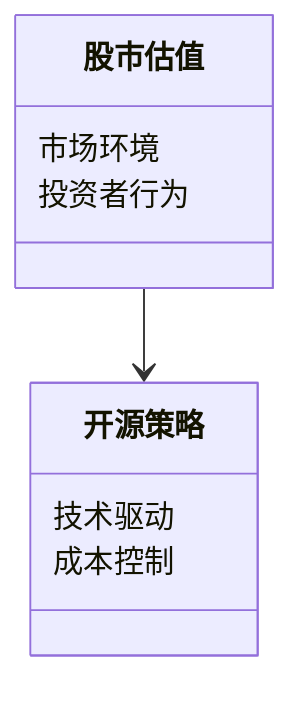
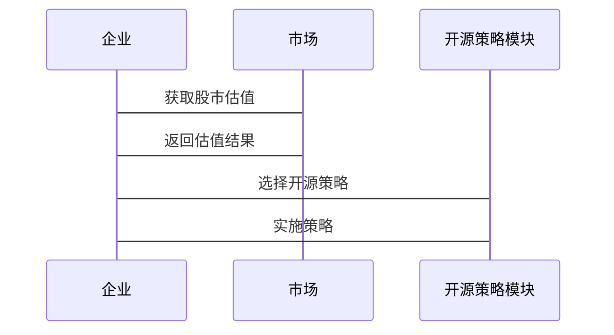

                 

# 股市估值高低对企业开源策略的影响

## 关键词：
股市估值，开源策略，企业战略，市场环境，技术驱动

## 摘要：
股市估值的高低对企业开源策略的选择和实施有着深远的影响。高估值市场可能促使企业采取技术驱动型开源策略，而低估值市场则可能推动企业采用成本控制型开源策略。本文通过分析不同估值环境下的开源策略，结合实际案例和数学模型，探讨企业如何优化开源策略以应对市场变化。

---

# 目录大纲：《股市估值高低对企业开源策略的影响》

## 第一部分：背景介绍

### 第1章：股市估值与开源策略概述

#### 1.1 股市估值的基本概念
- 股市估值的定义与计算方法
- 开源策略的定义与分类
- 当前股市环境分析
- 开源技术在企业中的应用现状

## 第二部分：股市估值对企业开源策略的影响

### 第2章：高估值市场下开源策略的影响

#### 2.1 高估值市场的特点
- 高估值市场的特征分析
- 投资者行为对开源策略的影响

#### 2.2 高估值市场下的开源策略调整
- 技术驱动型开源策略
- 成本控制型开源策略

### 第3章：低估值市场下开源策略的影响

#### 3.1 低估值市场的特点
- 低估值市场的特征分析
- 投资者行为对开源策略的影响

#### 3.2 低估值市场下的开源策略调整
- 风险规避型开源策略
- 创新驱动型开源策略

## 第三部分：开源策略的实施路径

### 第4章：开源策略的选择与实施

#### 4.1 开源策略的选择标准
- 技术可行性分析
- 成本效益分析

#### 4.2 开源策略的实施步骤
- 项目评估与规划
- 项目实施与监控

## 第四部分：案例分析

### 第5章：高估值市场下的开源策略案例

#### 5.1 案例背景分析
- 企业概况
- 市场环境

#### 5.2 案例分析与启示
- 开源策略的实施效果
- 经验总结

### 第6章：低估值市场下的开源策略案例

#### 6.1 案例背景分析
- 企业概况
- 市场环境

#### 6.2 案例分析与启示
- 开源策略的实施效果
- 经验总结

## 第五部分：总结与展望

### 第7章：总结与未来趋势

#### 7.1 全书总结
- 核心观点回顾
- 关键结论总结

#### 7.2 未来趋势与建议
- 开源策略的发展趋势
- 企业应对策略建议

## 附录：数学模型与系统架构

### 附录A：股市估值与开源策略的数学模型

#### A.1 股市估值计算模型
$$ V = P/E $$

#### A.2 开源策略选择模型
$$ S = \alpha \cdot T + \beta \cdot C $$

### 附录B：系统架构设计图

#### B.1 领域模型类图

#### B.2 系统交互序列图

---

## 作者：AI天才研究院 & 禅与计算机程序设计艺术

---

通过以上目录结构，文章将详细探讨股市估值对企业开源策略的影响，结合理论分析和实际案例，为企业制定开源策略提供科学依据和实践指导。

