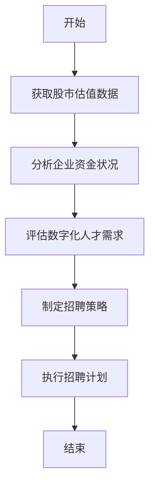
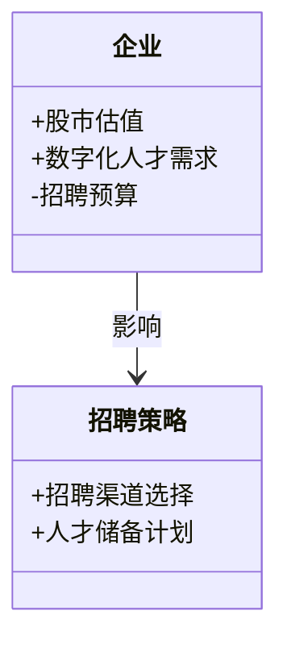
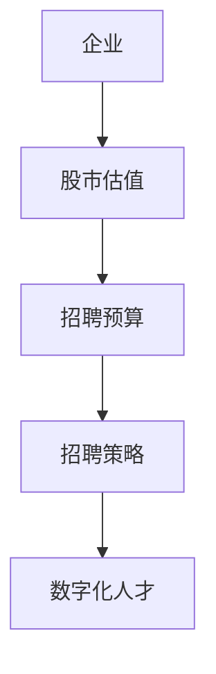
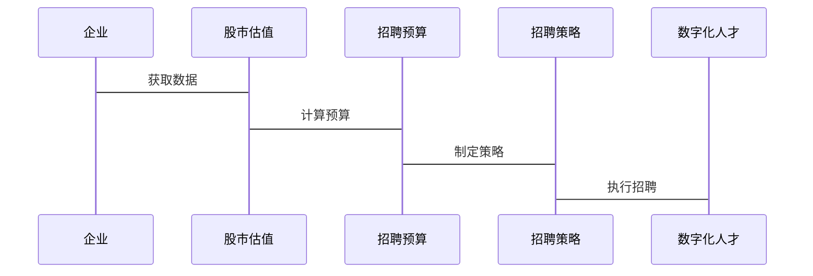

                 


# 股市估值高低对企业数字化人才招聘策略的影响

## 关键词：股市估值、数字化人才、招聘策略、企业战略、数据可视化

## 摘要：股市估值的波动直接影响企业的资金状况和战略决策，进而影响数字化人才的招聘策略。本文从股市估值的核心原理出发，分析其对数字化人才需求的影响，探讨企业在不同市场环境下如何优化招聘策略。通过实际案例分析和数据可视化，本文提供实用的优化建议，助力企业在复杂市场环境中吸引和留住优秀数字化人才。

---

## 第1章：股市估值与数字化人才招聘的关联性

### 1.1 问题背景与问题描述

#### 股市波动对企业的影响
股市估值的波动直接影响企业的资金状况。当股市估值上升时，企业通常有更多资金用于发展和扩张；而当股市估值下降时，企业可能需要缩减开支，包括招聘预算。

#### 数字化人才的重要性
数字化人才是企业数字化转型的核心驱动力。他们具备数据科学、人工智能、软件开发等技能，能够推动企业创新和竞争力提升。

#### 问题解决与边界分析
股市估值通过影响企业的资金和信心，间接影响招聘策略。企业可能在高估值时增加招聘，吸引顶尖人才；在低估值时调整招聘节奏，优化成本。

---

## 第2章：核心概念的原理与特征

### 2.1 股市估值的核心原理

#### 股市估值的定义与计算
股市估值是市场对企业的价值评估，通常通过市盈率（P/E）或市净率（P/B）等指标衡量。高估值意味着市场对企业前景乐观，低估值则反之。

#### 股市估值对企业的影响
高估值时，企业可能有更多的资金进行扩张，包括招聘；低估值时，企业可能优先考虑成本控制，调整招聘策略。

### 2.2 数字化人才的核心特征

#### 数字化人才的分类
- 技术型人才：如数据科学家、软件工程师。
- 业务型人才：如数字化项目经理、业务分析师。
- 综合型人才：具备技术与业务双重能力。

#### 人才需求的增长趋势
随着数字化转型的深入，企业对数字化人才的需求持续增长，尤其是高端技术人才和复合型人才。

### 2.3 招聘策略的构成要素

#### 招聘预算
预算直接决定招聘规模和速度。高估值时，企业可能增加预算；低估值时，可能调整或缩减预算。

#### 招聘渠道
包括内部招聘、猎头招聘、校园招聘等。高估值时，企业可能选择更广泛的渠道；低估值时，可能更依赖内部资源或成本较低的渠道。

#### 人才储备
企业可能在高估值时储备更多人才，以应对未来业务增长；在低估值时，注重现有员工的培养和留用。

---

## 第3章：算法原理与数学模型

### 3.1 算法原理

#### 股市估值与招聘预算的关系
企业可以根据股市估值动态调整招聘预算。例如，使用线性回归模型预测招聘预算：
$$ \text{招聘预算} = k \times \text{股市估值} + b $$

#### 算法流程图


---

## 第4章：系统分析与架构设计

### 4.1 问题场景介绍

#### 问题场景
某科技公司面临股市估值波动，需要调整招聘策略。高估值时，他们计划扩大技术团队；低估值时，优先内部培养和优化招聘流程。

### 4.2 系统功能设计

#### 领域模型类图


### 4.3 系统架构图



### 4.4 系统接口与交互

#### 系统交互序列图


---

## 第5章：项目实战

### 5.1 环境安装

#### 数据可视化工具
使用Python的Matplotlib或Tableau进行数据可视化。

#### 算法实现工具
使用Python的Scikit-learn进行机器学习模型的实现。

### 5.2 核心代码实现

#### 数学模型实现
```python
import pandas as pd
import numpy as np

# 示例数据
data = {'股市估值': [100, 150, 120, 80, 90],
        '招聘预算': [50, 70, 60, 40, 45]}
df = pd.DataFrame(data)

# 线性回归模型
from sklearn.linear_model import LinearRegression
model = LinearRegression()
model.fit(df[['股市估值']], df['招聘预算'])
print(model.coef_)
```

#### 数据可视化
```python
import matplotlib.pyplot as plt

plt.scatter(df['股市估值'], df['招聘预算'])
plt.xlabel('股市估值')
plt.ylabel('招聘预算')
plt.title('股市估值与招聘预算关系')
plt.show()
```

### 5.3 实际案例分析

#### 案例分析
某科技公司在高估值时，招聘预算增加30%，吸引顶尖技术人才；在低估值时，优化招聘流程，减少外部招聘，注重内部培养。

---

## 第6章：总结与最佳实践

### 6.1 小结

股市估值直接影响企业的资金状况，进而影响数字化人才的招聘策略。企业需要根据市场环境动态调整招聘策略，合理分配资源，优化招聘流程。

### 6.2 注意事项

- **实时监控市场动态**：及时调整招聘策略。
- **数据驱动决策**：利用数据分析工具优化招聘流程。
- **人才保留策略**：在低估值时，注重内部培养和员工留存。

### 6.3 拓展阅读

- 《数据驱动的招聘策略》
- 《企业数字化转型中的人才管理》
- 《股市波动与企业战略调整》

---

## 作者：AI天才研究院 & 禅与计算机程序设计艺术

---

以上为完整的技术博客文章大纲及内容，欢迎读者根据实际需求进行调整和补充。

