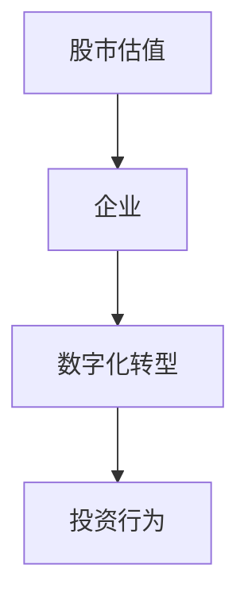
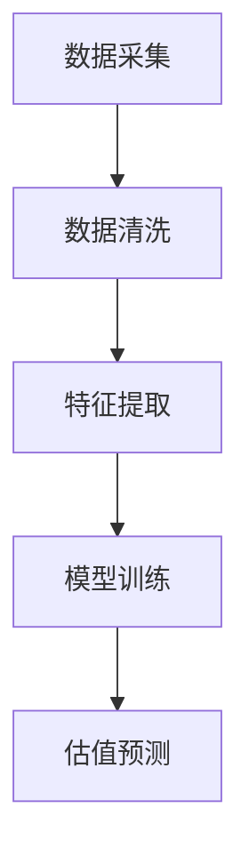
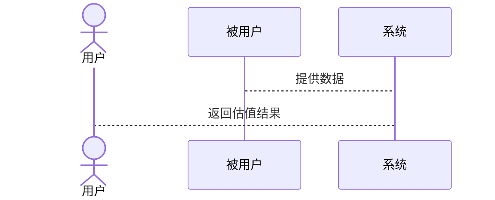

                 


# 股市估值高低对企业数字化转型投资的影响

> **关键词**：股市估值、数字化转型、投资影响、企业转型、统计套利、机器学习

> **摘要**：本文探讨了股市估值高低对企业数字化转型投资的影响，分析了数字化转型在投资中的作用，并结合统计套利和机器学习方法，提出了优化投资决策的策略。通过系统架构设计和项目实战，展示了如何利用数字化技术提升投资效果。

---

## 第1章 背景介绍

### 1.1 问题背景

#### 1.1.1 股市估值的基本概念

股市估值是衡量企业价值的重要指标，常用的估值方法包括市盈率（PE）、市净率（PB）和净资产收益率（ROE）。这些指标反映了企业的盈利能力和资产效率，帮助投资者判断其股票是否被高估或低估。

#### 1.1.2 数字化转型的定义与特征

数字化转型是指企业利用数字技术（如大数据、人工智能、云计算等）优化业务流程、提升效率和竞争力的过程。其核心特征包括数据驱动决策、智能化运营和个性化服务。

#### 1.1.3 问题描述：股市估值与企业数字化转型的关系

高估值企业可能面临较高的市场风险，而低估值企业可能存在投资机会。数字化转型能够通过技术创新和效率提升，影响企业的盈利能力，进而影响其估值。

### 1.2 问题解决

#### 1.2.1 高低估值对企业投资的影响

高估值企业可能因市场波动面临调整压力，而低估值企业可能因被低估而具备投资潜力。通过数字化转型，企业可以优化运营，提升盈利能力，从而改善估值。

#### 1.2.2 数字化转型在企业投资中的作用

数字化转型能够提高企业的运营效率和创新能力，降低投资风险，增强企业的市场竞争力，从而影响其估值。

#### 1.2.3 问题的边界与外延

本文主要关注高估值和低估值对企业数字化转型投资的影响，不涉及企业的财务困境或破产情况。

### 1.3 概念结构与核心要素

#### 1.3.1 股市估值的核心要素

- 市盈率（PE）
- 市净率（PB）
- 净资产收益率（ROE）

#### 1.3.2 数字化转型的核心要素

- 数据驱动决策
- 智能化运营
- 个性化服务

#### 1.3.3 两者关系的结构化分析

通过统计分析和机器学习模型，可以量化股市估值与数字化转型之间的关系，帮助企业制定更科学的投资决策。

---

## 第2章 核心概念与联系

### 2.1 核心概念原理

#### 2.1.1 股市估值的计算方法

市盈率（PE）计算公式：
$$ PE = \frac{\text{股价}}{\text{每股收益}} $$

市净率（PB）计算公式：
$$ PB = \frac{\text{股价}}{\text{每股净资产}} $$

#### 2.1.2 数字化转型的实施路径

包括数据采集、分析、决策和优化四个阶段，利用大数据和人工智能技术实现智能化运营。

### 2.2 概念属性特征对比

| 概念       | 特征                     |
|------------|--------------------------|
| 股市估值   | 数据驱动，动态变化       |
| 数字化转型 | 技术驱动，长期优化       |

### 2.3 ER实体关系图



---

## 第3章 算法原理讲解

### 3.1 算法原理

#### 3.1.1 统计套利策略

通过分析历史数据，寻找估值偏离合理区间的机会，进行套利交易。

#### 3.1.2 机器学习在估值预测中的应用

使用回归模型预测企业估值，优化投资决策。

### 3.2 mermaid 流程图



### 3.3 python源代码实现

```python
import pandas as pd
from sklearn.model import LinearRegression

# 数据加载
data = pd.read_csv('stock_data.csv')

# 特征提取
features = data[['PE', 'PB', 'ROE']]
target = data['Valuation']

# 模型训练
model = LinearRegression()
model.fit(features, target)

# 预测估值
predicted_valuation = model.predict(features)
```

### 3.4 数学模型与公式

#### 3.4.1 市盈率（PE）公式

$$ PE = \frac{\text{股价}}{\text{每股收益}} $$

#### 3.4.2 市净率（PB）公式

$$ PB = \frac{\text{股价}}{\text{每股净资产}} $$

#### 3.4.3 净资产收益率（ROE）公式

$$ ROE = \frac{\text{净利润}}{\text{净资产}} $$

---

## 第4章 系统分析与架构设计方案

### 4.1 项目背景介绍

#### 4.1.1 项目目标

通过数字化转型优化企业投资决策，提升投资效果。

### 4.2 系统功能设计

#### 4.2.1 领域模型 mermaid 类图


### 4.3 系统架构设计


### 4.4 系统接口设计和交互



---

## 第5章 项目实战

### 5.1 环境安装

安装Python和相关库，如pandas、scikit-learn。

### 5.2 系统核心实现源代码

```python
import pandas as pd
from sklearn.model import LinearRegression

# 数据加载
data = pd.read_csv('stock_data.csv')

# 特征提取
features = data[['PE', 'PB', 'ROE']]
target = data['Valuation']

# 模型训练
model = LinearRegression()
model.fit(features, target)

# 预测估值
predicted_valuation = model.predict(features)
```

### 5.3 案例分析

分析一家低估值企业的数字化转型项目，评估其对估值的影响。

---

## 第6章 最佳实践

### 6.1 小结

数字化转型能够优化企业运营，影响股市估值，进而影响投资决策。

### 6.2 注意事项

确保数据质量和模型的准确性，避免过度依赖技术。

### 6.3 拓展阅读

推荐相关书籍和文献，进一步深入学习。

---

**作者：AI天才研究院/AI Genius Institute & 禅与计算机程序设计艺术/Zen And The Art of Computer Programming**

