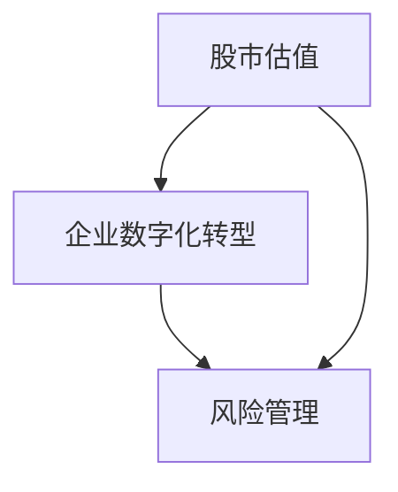
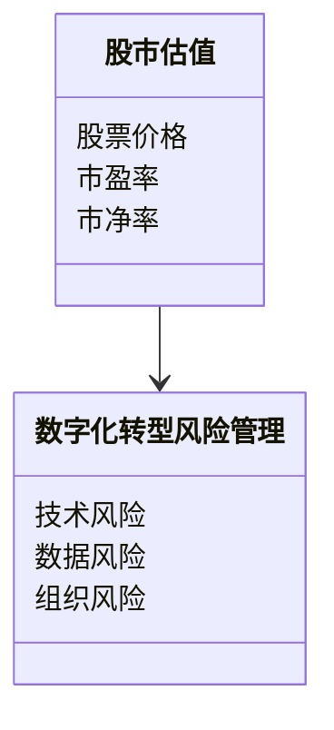
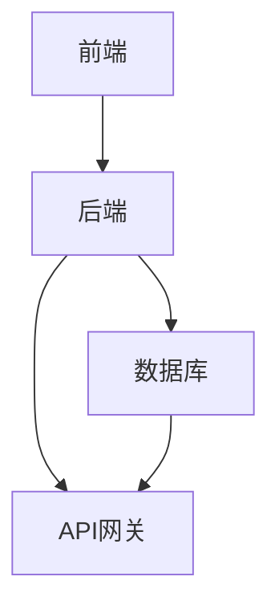
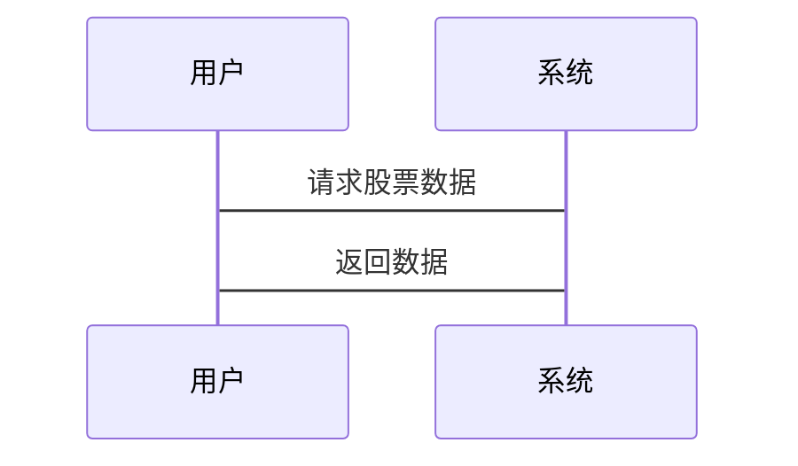

                 


# 股市估值高低对企业数字化转型风险管理的影响

## 关键词：
- 股市估值
- 数字化转型
- 风险管理
- 企业战略
- 机器学习
- 股票预测
- 数字化风险

## 摘要：
本文深入探讨了股市估值对企业数字化转型风险管理的影响。通过分析股市估值的核心原理、数字化转型风险管理的必要性及其两者之间的关联，结合算法原理、系统架构设计和实际案例，详细阐述了如何利用技术手段优化企业风险管理。本文不仅提供了理论支持，还通过Python代码和数学模型，展示了如何在实际中应用这些方法，帮助企业应对数字化转型中的风险挑战。

---

## 第一部分: 股市估值与企业数字化转型风险管理的背景

### 第1章: 股市估值与企业数字化转型风险管理的背景

#### 1.1 股市估值的基本概念
##### 1.1.1 股票内在价值的计算方法
股票的内在价值是基于企业财务状况、行业竞争地位等因素的综合评估。常用的方法包括现金流折现法（DCF）、市盈率（P/E）和市净率（P/B）等。例如，DCF模型通过预测未来现金流并折现，计算出股票的公允价值。

##### 1.1.2 企业数字化转型的定义与特点
企业数字化转型是指利用信息技术手段（如大数据、人工智能、云计算等）对企业业务流程、组织结构和商业模式进行重构。其特点是数据驱动、智能化和灵活性。

##### 1.1.3 股市估值与企业数字化转型的关联性
股市估值反映了市场对企业的信心和未来盈利能力的预期。企业数字化转型通过提升效率和创新能力，直接影响企业的财务表现，从而影响股市估值。

#### 1.2 数字化转型风险管理的必要性
##### 1.2.1 数字化转型中的主要风险类型
数字化转型面临的技术风险、数据安全风险、组织变革风险等。例如，技术选型不当可能导致项目失败，数据泄露可能引发法律问题。

##### 1.2.2 股市估值对企业数字化转型风险管理的影响
股市估值的高低直接影响企业的融资能力，高估值企业更容易获得资金支持，从而能够更好地应对转型中的风险。

##### 1.2.3 数字化转型风险管理的边界与外延
风险管理的边界包括技术、数据、组织等方面，外延则涉及外部市场、政策法规等外部因素。

#### 1.3 本章小结
本章通过介绍股市估值和数字化转型的基本概念，阐述了两者之间的关联性，并强调了风险管理在数字化转型中的重要性。

---

## 第二部分: 股市估值与企业数字化转型风险管理的核心概念

### 第2章: 股市估值与企业数字化转型风险管理的核心概念

#### 2.1 股市估值的核心原理
##### 2.1.1 股票内在价值的计算方法
使用DCF模型计算股票内在价值。例如，假设一家企业未来5年的自由现金流分别为100、120、140、160、180万元，折现率设为10%，计算其现值总和。

##### 2.1.2 市场情绪对企业估值的影响
市场情绪通过影响投资者的心理预期，间接影响股市估值。例如，市场乐观时，高市盈率现象普遍。

##### 2.1.3 股市估值与企业财务状况的关系
财务状况良好的企业通常具有较高的股市估值。例如，ROE（净资产收益率）高的企业，通常市盈率较高。

#### 2.2 数字化转型风险管理的核心原理
##### 2.2.1 数字化转型中的主要风险点
包括技术风险（如系统故障）、数据风险（如数据泄露）和组织风险（如员工适应性差）。

##### 2.2.2 风险评估与管理的流程
包括风险识别、评估、应对和监控四个阶段。

##### 2.2.3 数字化转型风险管理与企业战略的关系
风险管理是企业战略的重要组成部分，通过降低风险，企业能够更好地实现数字化转型目标。

#### 2.3 核心概念属性特征对比表
| 核心概念 | 属性特征 |
|----------|----------|
| 股市估值 | 客观性、动态性、主观性 |
| 数字化转型风险管理 | 系统性、预防性、动态性 |

#### 2.4 核心概念的ER实体关系图


#### 2.5 本章小结
本章通过对比股市估值和数字化转型风险管理的核心概念，强调了它们在企业战略中的重要性。

---

## 第三部分: 股市估值对企业数字化转型风险管理的算法原理

### 第3章: 股市估值对企业数字化转型风险管理的算法原理

#### 3.1 股市估值预测算法
##### 3.1.1 基于机器学习的股市估值预测
使用随机森林算法预测股票价格。例如，通过训练模型，预测某只股票未来的价格走势。

##### 3.1.2 随机森林算法在股市估值预测中的应用
随机森林通过投票机制进行预测，能够有效处理高维数据。

##### 3.1.3 神经网络算法的实现与优化
使用LSTM（长短期记忆网络）模型预测股票价格，能够捕捉时间序列中的长期依赖关系。

#### 3.2 数字化转型风险管理的算法原理
##### 3.2.1 风险评估模型的构建
基于层次分析法（AHP）构建风险评估模型，确定各风险因素的权重。

##### 3.2.2 基于贝叶斯网络的风险管理算法
贝叶斯网络通过概率推理，评估不同风险事件的影响程度。

##### 3.2.3 风险缓解策略的优化算法
使用遗传算法优化风险缓解策略，找到最优的组合方案。

#### 3.3 算法实现的Python代码示例
```python
import pandas as pd
from sklearn.ensemble import RandomForestRegressor

# 加载数据
data = pd.read_csv('stock_data.csv')

# 特征和目标变量
X = data[['PE', 'PB', 'ROE']]
y = data['Price']

# 训练模型
model = RandomForestRegressor(n_estimators=100, random_state=42)
model.fit(X, y)

# 预测
y_pred = model.predict(X)
```

#### 3.4 数学模型与公式
##### 3.4.1 多元回归模型
$$ y = \beta_0 + \beta_1x_1 + \beta_2x_2 + ... + \beta_nx_n + \epsilon $$

##### 3.4.2 贝叶斯网络模型
$$ P(X|E) = \frac{P(E|X)P(X)}{P(E)} $$

#### 3.5 本章小结
本章通过机器学习算法和数学模型，展示了如何利用技术手段优化企业风险管理。

---

## 第四部分: 股市估值对企业数字化转型风险管理的系统分析

### 第4章: 股市估值对企业数字化转型风险管理的系统分析

#### 4.1 系统功能设计
##### 4.1.1 领域模型设计
使用mermaid类图展示领域模型。



##### 4.1.2 系统架构设计
使用mermaid架构图展示系统架构。



##### 4.1.3 系统接口设计
使用mermaid序列图展示系统接口设计。



#### 4.2 本章小结
本章通过系统分析，展示了如何从整体架构出发，优化企业风险管理。

---

## 第五部分: 股市估值对企业数字化转型风险管理的项目实战

### 第5章: 股市估值对企业数字化转型风险管理的项目实战

#### 5.1 项目介绍
##### 5.1.1 项目背景
某企业计划进行数字化转型，希望通过技术手段降低转型风险。

#### 5.2 项目实战
##### 5.2.1 环境安装
安装Python、机器学习库等环境。

##### 5.2.2 核心代码实现
使用Python代码实现风险评估模型。

```python
import pandas as pd
from sklearn.metrics import accuracy_score

# 加载数据
data = pd.read_csv('risk_data.csv')

# 特征和目标变量
X = data[['技术风险', '数据风险', '组织风险']]
y = data['风险等级']

# 划分训练集和测试集
X_train, X_test = X.iloc[:700], X.iloc[700:]
y_train, y_test = y.iloc[:700], y.iloc[700:]

# 训练模型
from sklearn.ensemble import RandomForestClassifier
model = RandomForestClassifier(n_estimators=100, random_state=42)
model.fit(X_train, y_train)

# 预测
y_pred = model.predict(X_test)

# 评估
print(accuracy_score(y_test, y_pred))
```

##### 5.2.3 代码解读与分析
通过代码实现风险评估模型，并评估模型的准确性。

#### 5.3 项目小结
本章通过实际案例，展示了如何利用技术手段优化企业风险管理。

---

## 第六部分: 股市估值对企业数字化转型风险管理的最佳实践

### 第6章: 股市估值对企业数字化转型风险管理的最佳实践

#### 6.1 小结
通过本文的分析，企业应重视股市估值和数字化转型风险管理的关联性。

#### 6.2 注意事项
在实际应用中，需注意数据质量和模型的可解释性。

#### 6.3 拓展阅读
推荐阅读《股票技术分析实战》和《风险管理与企业战略》。

---

## 作者：AI天才研究院/AI Genius Institute & 禅与计算机程序设计艺术 /Zen And The Art of Computer Programming

