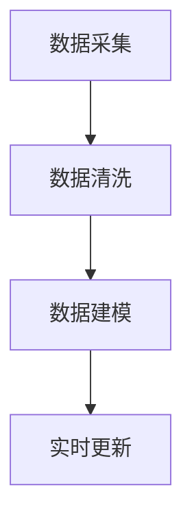

                 


```markdown
# 股市估值高低对企业数字孪生技术应用的影响

> 关键词：股市估值，数字孪生技术，企业价值评估，数据驱动，投资决策，技术应用

> 摘要：本文探讨了股市估值的高低对企业应用数字孪生技术的影响。通过分析数字孪生技术的核心概念、算法原理及其在股市估值中的应用，本文旨在揭示数字孪生技术如何优化企业价值评估和投资决策。文章从背景介绍、技术原理、影响分析、系统架构和项目实战等多个角度展开，为企业在数字孪生技术应用中的策略提供深入的理论支持和实践指导。

---

## 第1章 股市估值与数字孪生技术的背景介绍

### 1.1 股市估值的基本概念
#### 1.1.1 股市估值的定义与核心要素
股市估值是指对上市公司股票价值的评估，通常基于财务指标、市场环境和企业战略等多重因素。

#### 1.1.2 股市估值的主要方法
- 市盈率法
- 市净率法
- 现金流折现法

#### 1.1.3 股市估值对企业经营的影响
股市估值直接影响企业的市场资本化程度和投资者信心。

### 1.2 数字孪生技术的定义与特点
#### 1.2.1 数字孪生技术的定义
数字孪生技术是通过数据建模和实时更新，创建物理实体的虚拟副本。

#### 1.2.2 数字孪生技术的核心属性
- 实时性
- 可视化
- 可交互性

#### 1.2.3 数字孪生技术与传统技术的区别
通过对比表格展示数字孪生技术与传统技术在数据处理、模型构建和实时更新方面的差异。

### 1.3 股市估值与数字孪生技术的关联性
#### 1.3.1 数字孪生技术在股市估值中的应用场景
- 数据分析与预测
- 模拟与仿真
- 实时监控与反馈

#### 1.3.2 数字孪生技术对股市估值的影响
- 提高估值的准确性
- 降低估值的风险
- 提升估值的效率

#### 1.3.3 股市估值与数字孪生技术的边界与外延
通过对比分析，明确数字孪生技术在股市估值中的适用范围和限制。

### 1.4 本章小结
总结股市估值与数字孪生技术的背景关系，为后续章节奠定基础。

---

## 第2章 数字孪生技术的核心概念与原理

### 2.1 数字孪生技术的核心要素
#### 2.1.1 数据采集与处理
- 数据来源：传感器、数据库、外部API
- 数据清洗与预处理

#### 2.1.2 数字模型构建
- 模型选择：基于物理规律的模型、统计模型、机器学习模型
- 模型训练与优化

#### 2.1.3 实时数据更新与分析
- 数据流的实时处理
- 动态模型调整

### 2.2 数字孪生技术的实现原理
#### 2.2.1 数据流的处理流程


#### 2.2.2 数字模型的构建方法
- 物理模型：基于物理规律的模型
- 统计模型：回归分析、时间序列分析
- 机器学习模型：神经网络、随机森林

#### 2.2.3 实时数据更新的机制
- 基于事件驱动的更新
- 基于时间驱动的更新

### 2.3 数字孪生技术的系统架构
#### 2.3.1 数据采集层
- 传感器数据采集
- 外部数据接口

#### 2.3.2 数据处理层
- 数据清洗与预处理
- 数据融合与集成

#### 2.3.3 数字模型层
- 模型训练与部署
- 模型监控与维护

#### 2.3.4 用户交互层
- 数据可视化
- 人机交互界面

### 2.4 本章小结
详细阐述数字孪生技术的核心概念和实现原理，为后续应用分析奠定基础。

---

## 第3章 股市估值的影响因素与数字孪生技术的应用

### 3.1 股市估值的主要影响因素
#### 3.1.1 财务指标
- 营业收入、净利润、资产负债率等

#### 3.1.2 市场环境
- 宏观经济、行业趋势、政策法规

#### 3.1.3 企业战略
- 发展规划、研发投入、管理团队

### 3.2 数字孪生技术在股市估值中的应用
#### 3.2.1 数据分析与预测
- 基于数字孪生的预测模型
- 数据驱动的投资决策

#### 3.2.2 模拟与仿真
- 企业经营情景模拟
- 市场波动仿真

#### 3.2.3 实时监控与反馈
- 实时市场数据监控
- 模型实时更新与反馈

### 3.3 数字孪生技术对股市估值的优化作用
#### 3.3.1 提高估值的准确性
- 数据全面性与模型准确性
- 多维度数据融合

#### 3.3.2 降低估值的风险
- 模拟不同市场情景
- 及时发现潜在风险

#### 3.3.3 提升估值的效率
- 自动化数据处理
- 智能化模型优化

### 3.4 本章小结
分析数字孪生技术如何优化股市估值的准确性、风险和效率。

---

## 第4章 数字孪生技术对企业价值评估的影响

### 4.1 企业价值评估的基本方法
#### 4.1.1 股权自由现金流模型
- 公式：$FCF = 营业收入 - 资本支出 - 折旧$

#### 4.1.2 折现现金流模型
- 公式：$Value = \sum_{t=1}^{n} \frac{CF_t}{(1+r)^t}$$

#### 4.1.3 相对估值法
- 市盈率法、市净率法

### 4.2 数字孪生技术在企业价值评估中的应用
#### 4.2.1 数据驱动的估值模型
- 基于机器学习的估值模型
- 时间序列分析模型

#### 4.2.2 数字孪生技术对企业经营数据的整合
- 多源数据融合
- 数据实时更新

#### 4.2.3 数字孪生技术对估值模型的优化
- 模型参数优化
- 实时反馈机制

### 4.3 数字孪生技术对企业价值的影响
#### 4.3.1 提高企业经营效率
- 实时监控与优化
- 资源配置优化

#### 4.3.2 优化资源配置
- 数据驱动的决策支持
- 资产管理优化

#### 4.3.3 提升企业抗风险能力
- 风险预警与应对
- 情景模拟与预案

### 4.4 本章小结
总结数字孪生技术如何优化企业价值评估和提升企业经营能力。

---

## 第5章 数字孪生技术的算法原理与数学模型

### 5.1 数据分析与预测的算法原理
#### 5.1.1 时间序列分析
- ARIMA模型
- LSTM网络

#### 5.1.2 机器学习模型
- 线性回归
- 支持向量机
- 随机森林

### 5.2 数学模型的构建与优化
#### 5.2.1 基于CAPM模型的企业价值评估
- 公式：$R_i = R_f + \beta_i (R_m - R_f)$

#### 5.2.2 基于数字孪生的预测模型
- 预测公式：$P_t = a \cdot P_{t-1} + b \cdot F_t + c \cdot T_t$
  其中，$F_t$为财务指标，$T_t$为市场趋势。

### 5.3 算法实现与优化
#### 5.3.1 Python实现示例
```python
import pandas as pd
from sklearn.ensemble import RandomForestRegressor

# 数据加载与预处理
data = pd.read_csv('stock_data.csv')
features = data[['revenue', 'profit', 'market_trend']]
target = data['valuation']

# 模型训练
model = RandomForestRegressor(n_estimators=100)
model.fit(features, target)

# 模型预测
new_data = pd.DataFrame({'revenue': [1000000], 'profit': [200000], 'market_trend': [1.05]})
prediction = model.predict(new_data)
print(f'预测估值为：{prediction[0]}')
```

#### 5.3.2 模型优化
- 超参数调整
- 特征选择
- 模型集成

### 5.4 本章小结
详细阐述数字孪生技术中的算法原理与数学模型，展示其在股市估值中的具体应用。

---

## 作者：AI天才研究院 & 禅与计算机程序设计艺术
```

