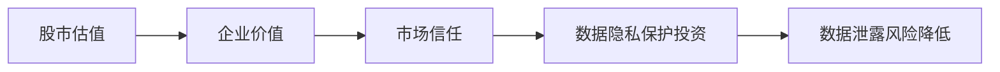
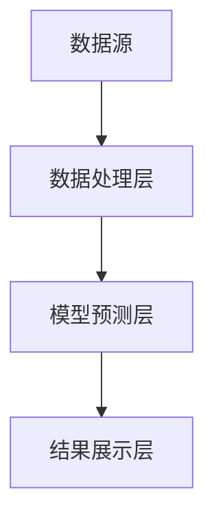

                 


```markdown
# 股市估值高低对企业数据隐私保护投资的影响

## 关键词：股市估值，数据隐私保护，企业投资，风险管理，数据泄露，财务影响，技术架构

## 摘要：  
本文探讨了股市估值的高低对企业在数据隐私保护方面的投资决策的影响。通过分析股市估值的核心概念、数据隐私保护的重要性，以及两者之间的相互关系，文章揭示了企业如何在股市估值的驱动下优化数据隐私保护的投资策略。通过实际案例分析和系统架构设计，本文提出了如何利用数据分析和机器学习模型量化股市估值对数据隐私保护的影响，为企业制定有效策略提供了实践指导。

---

## 第一部分：背景介绍

### 第1章：股市估值与数据隐私保护的核心概念

#### 1.1 股市估值的定义与计算方法
股市估值是衡量企业市场价值的重要指标，常用的计算方法包括市盈率（P/E）和市净率（P/B）。市盈率 = 股价 / 每股收益，市净率 = 股价 / 每股净资产。

#### 1.2 数据隐私保护的定义与实现方式
数据隐私保护是指保护个人或企业数据不被未经授权的访问和泄露。实现方式包括数据加密、访问控制和隐私计算技术。

#### 1.3 股市估值与数据隐私保护的关系
股市估值直接影响企业的财务健康和市场信任，而数据隐私保护则是维护市场信任的关键因素。高估值企业更可能在数据隐私保护上投入更多资源，以维护品牌形象和合规性。

#### 1.4 本章小结
本章介绍了股市估值和数据隐私保护的基本概念，并分析了两者之间的相互影响。

---

## 第二部分：核心概念与联系

### 第2章：股市估值与数据隐私保护的核心概念分析

#### 2.1 股市估值的核心概念
- 股市估值的数学模型：市盈率和市净率。
- 关键属性：稳定性、波动性、市场信任度。

#### 2.2 数据隐私保护的核心概念
- 数据隐私保护的技术手段：加密、访问控制、匿名化。
- 数据隐私保护的法律框架：GDPR、CCPA。

#### 2.3 股市估值与数据隐私保护的相互作用
通过Mermaid流程图展示两者的相互作用：



---

## 第三部分：算法原理讲解

### 第3章：数据分析与机器学习模型

#### 3.1 数据分析方法
使用回归分析预测股市估值与数据隐私保护投资的关系：

$$ \text{投资} = \beta_0 + \beta_1 \times \text{市盈率} + \epsilon $$

#### 3.2 机器学习模型
使用随机森林模型预测数据泄露风险：

```python
import pandas as pd
from sklearn.ensemble import RandomForestRegressor

# 数据准备
data = pd.read_csv('data.csv')
X = data[['市盈率', '市净率']]
y = data['数据泄露风险']

# 模型训练
model = RandomForestRegressor(n_estimators=100)
model.fit(X, y)

# 预测
print(model.predict(X))
```

#### 3.3 模型解释
通过特征重要性分析，市盈率和市净率对数据泄露风险的影响最大。

---

## 第四部分：系统分析与架构设计

### 第4章：系统架构设计

#### 4.1 项目背景
企业需要通过数据隐私保护提升市场信任，进而影响股市估值。

#### 4.2 系统功能设计
- 数据收集：获取企业财务数据和市场数据。
- 数据处理：清洗和预处理数据。
- 模型预测：预测数据泄露风险和投资回报。

#### 4.3 系统架构图



---

## 第五部分：项目实战

### 第5章：环境安装与代码实现

#### 5.1 环境安装
安装必要的库：
```bash
pip install pandas scikit-learn mermaid
```

#### 5.2 核心代码实现
```python
import pandas as pd
from sklearn.model_selection import train_test_split
from sklearn.metrics import accuracy_score

# 数据加载与处理
data = pd.read_csv('data.csv')
X = data.drop('数据泄露风险', axis=1)
y = data['数据泄露风险']

# 数据分割
X_train, X_test, y_train, y_test = train_test_split(X, y, test_size=0.2)

# 模型训练
from sklearn.ensemble import RandomForestClassifier
model = RandomForestClassifier()
model.fit(X_train, y_train)

# 模型预测
y_pred = model.predict(X_test)

# 评估
print("准确率:", accuracy_score(y_test, y_pred))
```

#### 5.3 案例分析
以某互联网企业为例，分析数据泄露风险与股市估值的关系，调整数据隐私保护投资策略。

---

## 第六部分：最佳实践与总结

### 第6章：总结与展望

#### 6.1 本章小结
企业应根据股市估值合理分配数据隐私保护投资，利用数据分析和机器学习优化策略。

#### 6.2 注意事项
- 数据隐私保护需结合企业实际需求。
- 模型需定期更新以应对市场变化。

#### 6.3 拓展阅读
建议阅读相关书籍和论文，深入学习数据隐私保护和股市估值的关联。

---

## 作者：AI天才研究院/AI Genius Institute & 禅与计算机程序设计艺术 /Zen And The Art of Computer Programming
```

