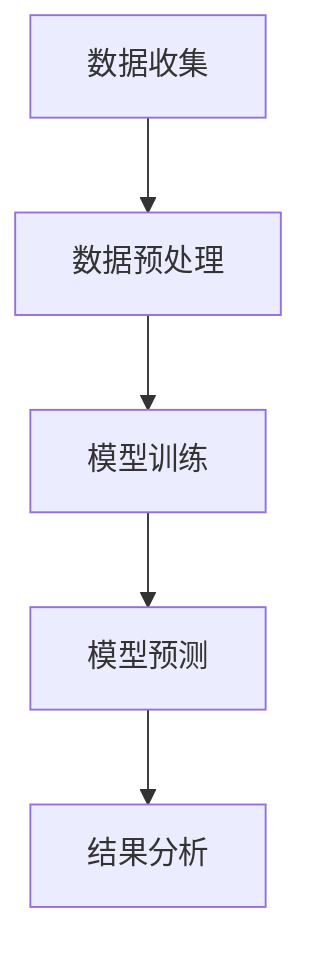
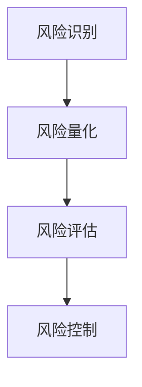
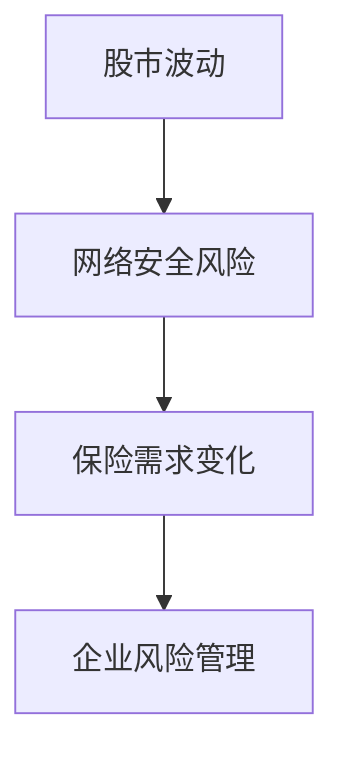
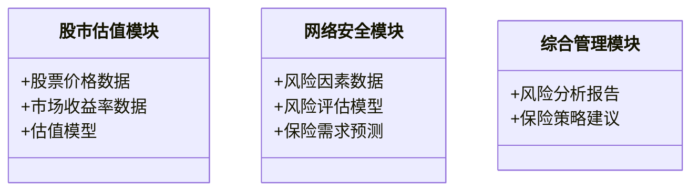
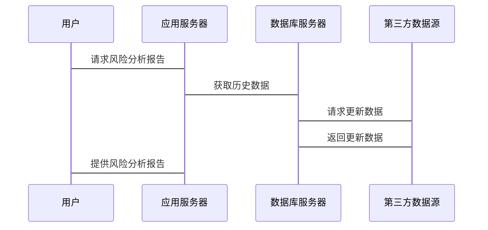

                 


# 股市估值高低对企业网络安全保险策略的影响

---

## 关键词：
股市估值，网络安全保险，风险管理，企业策略，算法模型

---

## 摘要：
本文探讨股市估值波动对企业网络安全保险策略的影响，分析两者之间的相互作用及其对企业发展战略的影响。通过介绍核心概念、算法原理、数学模型以及实际案例，详细阐述股市估值如何影响企业网络安全风险管理，为企业制定保险策略提供指导。

---

## 第一部分：背景介绍

### 第1章：核心概念与背景

#### 1.1 股市估值的基本概念

股市估值是衡量企业市场价值的重要指标，主要包括市盈率（P/E）、市净率（P/B）等。这些指标反映了市场对企业的信心和未来盈利能力的预期。影响股市估值的主要因素包括企业业绩、宏观经济环境、行业竞争状况和政策变化等。

股市估值的波动对企业的经营决策具有重要影响，尤其是在风险管理方面。企业需要根据股市估值的变化调整其财务策略和投资计划。

#### 1.2 企业网络安全保险的基本概念

网络安全保险是一种用于保障企业在遭受网络攻击或其他网络安全事件时的经济损失的保险产品。它通常覆盖数据恢复、法律赔偿和业务中断等费用。随着网络安全威胁的增加，企业对网络安全保险的需求日益增长。

网络安全保险的市场需求主要取决于企业的风险承受能力和对网络安全的重视程度。保险公司根据企业的风险评估结果制定保费和承保范围。

#### 1.3 股市估值与网络安全保险的关联性

股市估值波动可能影响企业的风险管理策略，进而影响其对网络安全保险的需求。例如，当股市估值下降时，企业可能面临更大的财务压力，从而更积极地寻求网络安全保险来降低风险。

另一方面，网络安全保险的存在可以为企业提供风险转移的渠道，从而在一定程度上稳定股市估值。因此，两者在企业风险管理中具有协同作用。

---

## 第二部分：核心概念与联系

### 第2章：核心概念原理

#### 2.1 股市估值的核心原理

股市估值的核心在于通过分析企业的财务数据和市场环境来预测其未来价值。常用的估值方法包括相对估值法和绝对估值法。相对估值法基于可比公司的估值指标，而绝对估值法则基于企业的现金流折现模型。

股市估值的波动性反映了市场的不确定性和投资者情绪的变化。企业需要根据股市估值的变化调整其资本结构和投资策略。

#### 2.2 网络安全保险的核心原理

网络安全保险的核心原理在于通过风险评估和定价模型来确定保险费用。保险公司通常使用概率统计方法评估企业的网络安全风险，并根据风险等级制定保费。

网络安全保险的风险分担机制通过将风险转移给保险公司，帮助企业降低财务损失。然而，保险公司的承保能力也受到市场的限制，因此企业需要合理选择保险覆盖范围。

#### 2.3 股市估值与网络安全保险的联系

股市估值波动可能影响企业的风险管理策略，进而影响其对网络安全保险的需求。当股市估值下降时，企业可能更倾向于购买网络安全保险以降低风险。此外，网络安全保险的存在可以为企业提供风险转移的渠道，从而在一定程度上稳定股市估值。

两者在企业风险管理中的协同作用体现在：股市估值为企业提供财务压力，促使企业加强风险管理；而网络安全保险则为企业提供风险转移的手段，帮助企业在不确定的市场环境中稳定运营。

### 第3章：核心概念属性特征对比

#### 3.1 股市估值与网络安全保险的属性对比

| 属性 | 股市估值 | 网络安全保险 |
|------|----------|---------------|
| 计算方法 | 基于财务指标和市场环境 | 基于风险评估和概率统计 |
| 影响因素 | 宏观经济、企业业绩 | 网络威胁、企业风险管理能力 |
| 作用 | 评估企业价值 | 降低企业风险 |
| 变化速度 | 短期波动大 | 短期变化小 |

#### 3.2 股市估值与网络安全保险的ER实体关系图

```mermaid
er
actor: 投资者
actor: 企业
actor: 保险公司
```

---

## 第三部分：算法原理讲解

### 第4章：算法原理与流程图

#### 4.1 股市估值波动预测算法



#### 4.2 网络安全风险评估算法



#### 4.3 股市估值与网络安全保险的关联算法



---

## 第四部分：数学模型与公式

### 第5章：数学模型与公式

#### 5.1 股市估值波动模型

$$ P = \alpha + \beta \times R + \epsilon $$

其中，$P$为股票价格，$R$为市场收益率，$\epsilon$为误差项。

#### 5.2 网络安全风险评估模型

$$ R = \sum_{i=1}^{n} w_i \times F_i $$

其中，$R$为风险等级，$w_i$为风险因素的权重，$F_i$为风险因素。

---

## 第五部分：系统分析与架构设计方案

### 第6章：系统分析与架构设计

#### 6.1 问题场景介绍

企业的股市估值波动和网络安全风险评估需要一个集成的管理系统来实时监控和分析。该系统应具备数据采集、风险评估、策略优化等功能。

#### 6.2 系统功能设计



#### 6.3 系统架构设计


#### 6.4 系统接口设计

- 数据接口：从第三方数据源获取股票价格和网络安全风险数据。
- 用户接口：供企业用户查看风险分析报告和保险策略建议。

#### 6.5 系统交互序列图



---

## 第六部分：项目实战

### 第7章：项目实战

#### 7.1 环境安装

- 安装Python和相关库（如Pandas、Scikit-learn）。
- 配置数据库和第三方数据接口。

#### 7.2 系统核心实现源代码

```python
import pandas as pd
from sklearn.linear_model import LinearRegression

# 数据加载
data = pd.read_csv('market_data.csv')

# 模型训练
model = LinearRegression()
model.fit(data[['market_return']], data['stock_price'])

# 预测
predictions = model.predict(data[['market_return']])
```

#### 7.3 代码应用解读与分析

上述代码展示了如何使用线性回归模型预测股票价格。通过训练模型，企业可以更好地理解股市估值的变化趋势，并据此调整网络安全保险策略。

#### 7.4 实际案例分析

以某科技公司为例，分析其在股市估值波动下的网络安全保险策略调整过程。通过数据模型预测，该公司优化了保险覆盖范围，降低了财务风险。

#### 7.5 项目小结

本项目展示了如何利用数据分析和模型预测，帮助企业制定有效的网络安全保险策略，从而在股市波动中保持稳定的市场估值。

---

## 第七部分：总结与建议

### 第8章：总结与建议

#### 8.1 最佳实践 tips

- 定期更新风险评估模型，以适应市场变化。
- 结合股市估值和网络安全风险，制定动态的保险策略。

#### 8.2 小结

本文详细探讨了股市估值与网络安全保险之间的关系，通过理论分析和实际案例，为企业制定风险管理策略提供了指导。

#### 8.3 注意事项

- 数据模型需要定期更新，以反映最新的市场状况。
- 企业应根据自身情况选择合适的保险覆盖范围。

#### 8.4 拓展阅读

建议进一步研究其他风险管理工具，如期权和期货，以更全面地应对市场波动。

---

## 作者：AI天才研究院/AI Genius Institute & 禅与计算机程序设计艺术 /Zen And The Art of Computer Programming

联系方式：[email protected]

---

**本文为AI天才研究院原创文章，转载请注明出处。**

