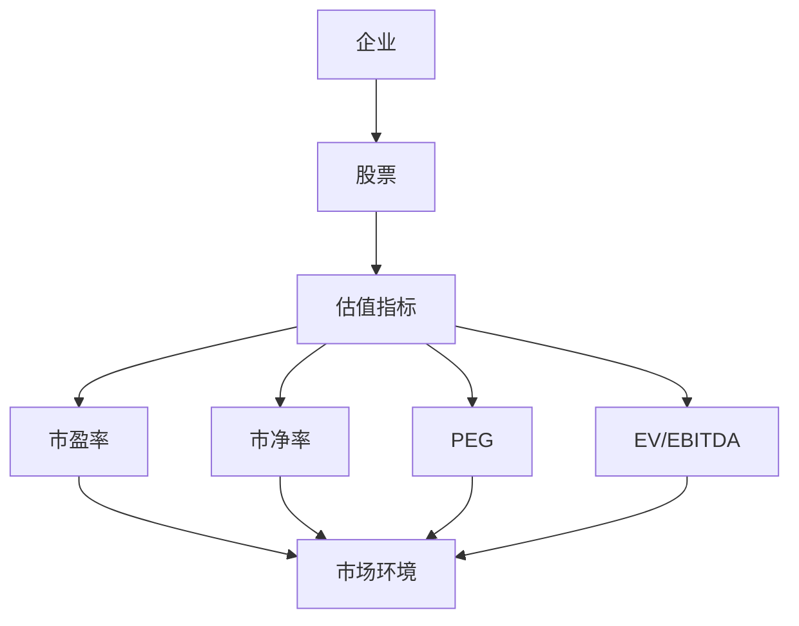
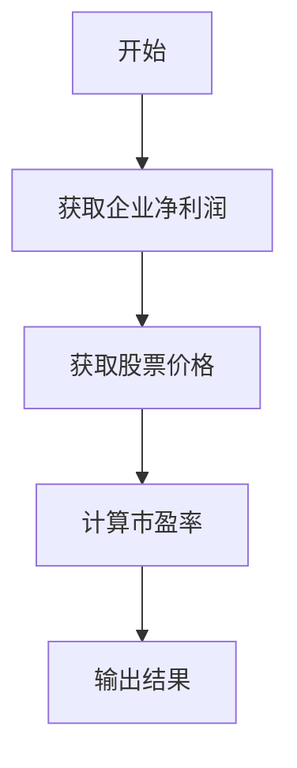
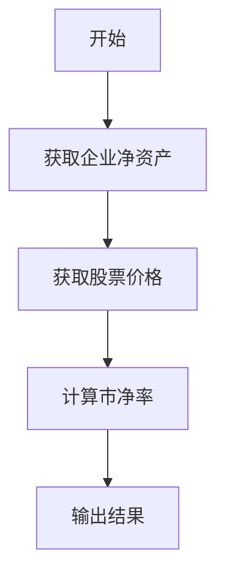
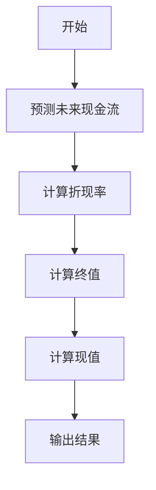
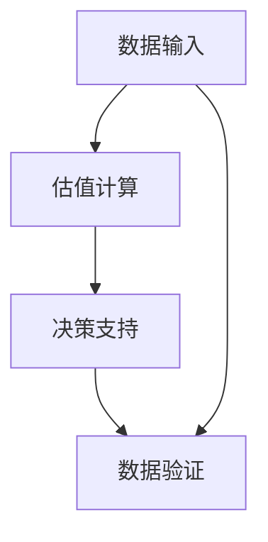

                 


# 股市估值高低对企业融资决策的影响

## 关键词：股市估值、企业融资决策、市盈率、市净率、现金流折现法

## 摘要：本文深入探讨了股市估值高低对企业融资决策的影响，通过分析常见估值指标（如市盈率、市净率等）的核心概念、算法原理及数学模型，结合实际案例，系统地阐述了股市估值如何影响企业的融资成本、融资方式和融资规模。文章还通过Python代码实现、mermaid流程图和数学公式等技术手段，全面解析了股市估值对企业融资决策的内在逻辑和实际应用。

---

## 第1章: 股市估值与企业融资决策的背景介绍

### 1.1 股市估值的核心概念

#### 1.1.1 股市估值的基本定义
股市估值是指通过对企业的财务数据和市场环境进行分析，确定企业股票的合理价格或价值范围。常见的估值方法包括市盈率（PE）、市净率（PB）、现金流折现法（DCF）等。

#### 1.1.2 企业融资决策的基本概念
企业融资决策是指企业在不同融资渠道（如银行贷款、发行债券、股权融资等）之间选择最优融资方式的过程。融资决策的核心在于在风险和成本之间找到平衡点。

#### 1.1.3 股市估值与企业融资决策的关系
股市估值是连接企业内在价值和市场定价的桥梁。高估值意味着市场对企业价值的高预期，低估值则可能反映出市场对企业的悲观看法。因此，股市估值直接影响企业的融资成本和融资能力。

---

### 1.2 股市估值对企业融资决策的影响机制

#### 1.2.1 估值高低对企业融资成本的影响
高估值通常意味着企业股票价格较高，投资者愿意以更高的价格购买，但这也可能导致企业的融资成本上升。例如，通过增发新股融资时，高估值可能吸引更多投资者，但稀释现有股东权益。

#### 1.2.2 估值高低对企业融资方式的选择
低估值可能使企业更倾向于通过债务融资，因为债务融资的成本通常较低，且不会稀释股权。而高估值可能使企业更倾向于股权融资，因为市场对企业股票的需求较高。

#### 1.2.3 估值高低对企业融资规模的决定作用
高估值通常意味着企业可以通过发行更多股票筹集更多资金，但同时也可能引发市场对过度融资的担忧，影响股价表现。低估值可能限制企业的融资规模，因为市场对企业股票的需求较低。

---

## 第2章: 股市估值的核心概念与联系

### 2.1 股市估值的主要指标

#### 2.1.1 市盈率（PE）
市盈率是股票价格与每股净利润的比率，公式为：
$$PE = \frac{Price}{Earnings}$$
市盈率反映了市场对企业盈利能力的预期，高市盈率可能意味着高成长性，但同时也可能意味着高风险。

#### 2.1.2 市净率（PB）
市净率是股票价格与每股净资产的比率，公式为：
$$PB = \frac{Price}{Book\ Value}$$
市净率适用于重资产行业，如银行、房地产等，低市净率可能意味着企业资产被低估。

#### 2.1.3 市盈率相对盈利增长比率（PEG）
PEG是市盈率与企业净利润增长率的比率，公式为：
$$PEG = \frac{PE}{Growth\ Rate}$$
PEG用于衡量市盈率与企业成长性的匹配程度，低PEG可能意味着企业被低估。

#### 2.1.4 企业价值/息税折旧及摊销前利润（EV/EBITDA）
EV/EBITDA是企业价值与息税折旧及摊销前利润的比率，公式为：
$$EV/EBITDA = \frac{EV}{EBITDA}$$
EV/EBITDA适用于不同行业和财务杠杆的企业，低EV/EBITDA可能意味着企业资产被低估。

---

### 2.2 估值指标的对比分析

#### 2.2.1 各估值指标的属性特征对比表

| 估值指标   | 公式               | 适用场景                     | 优点                           | 缺点                           |
|------------|--------------------|------------------------------|--------------------------------|--------------------------------|
| 市盈率（PE）| $$PE = \frac{Price}{Earnings}$$ | 高成长性企业                 | 反映盈利能力                   | 高市盈率可能过高                 |
| 市净率（PB）| $$PB = \frac{Price}{Book\ Value}$$ | 重资产行业                   | 反映资产价值                   | 低市净率可能低估                 |
| PEG        | $$PEG = \frac{PE}{Growth\ Rate}$$ | 成长型企业                   | 结合成长性与市盈率             | 计算复杂                       |
| EV/EBITDA  | $$EV/EBITDA = \frac{EV}{EBITDA}$$ | 不同行业                     | 跨行业比较                     | 需要估算企业价值               |

#### 2.2.2 估值指标的适用场景分析
- 市盈率适用于高成长性企业，如科技公司。
- 市净率适用于重资产行业，如房地产、银行。
- PEG适用于成长型企业，如初创期的科技公司。
- EV/EBITDA适用于不同行业和财务杠杆的企业。

---

### 2.3 股市估值的ER实体关系图



---

## 第3章: 股市估值算法原理讲解

### 3.1 常见估值算法的流程图

#### 3.1.1 市盈率法的mermaid流程图



#### 3.1.2 市净率法的mermaid流程图



#### 3.1.3 现金流折现法的mermaid流程图



### 3.2 估值算法的Python实现

#### 3.2.1 市盈率法的Python代码实现

```python
def calculate_pe(earnings, price):
    return price / earnings

# 示例：计算某公司的市盈率
earnings = 1.5  # 每股净利润（元）
price = 30.0    # 股票价格（元）
pe = calculate_pe(earnings, price)
print(f"市盈率为：{pe:.2f}")
```

#### 3.2.2 市净率法的Python代码实现

```python
def calculate_pb(book_value, price):
    return price / book_value

# 示例：计算某公司的市净率
book_value = 5.0  # 每股净资产（元）
price = 30.0      # 股票价格（元）
pb = calculate_pb(book_value, price)
print(f"市净率为：{pb:.2f}")
```

#### 3.2.3 现金流折现法的Python代码实现

```python
def calculate_dcf(cash_flows, discount_rate, terminal_value):
    dcf = sum(cash_flow / (1 + discount_rate)**t for t, cash_flow in enumerate(cash_flows))
    dcf += terminal_value / (1 + discount_rate)**len(cash_flows)
    return dcf

# 示例：计算某公司的DCF
cash_flows = [10, 15, 20]  # 每期现金流（万元）
discount_rate = 0.10       # 折现率（10%）
terminal_value = 50         # 终值（万元）
dcf = calculate_dcf(cash_flows, discount_rate, terminal_value)
print(f"DCF为：{dcf:.2f} 万元")
```

---

## 第4章: 股市估值的数学模型与公式

### 4.1 常见估值指标的数学公式

#### 4.1.1 市盈率公式
$$PE = \frac{Price}{Earnings}$$

#### 4.1.2 市净率公式
$$PB = \frac{Price}{Book\ Value}$$

#### 4.1.3 现金流折现模型公式
$$DCF = \sum_{t=1}^{n} \frac{CF_t}{(1+r)^t} + \frac{TV}{(1+r)^n}$$
其中：
- $CF_t$ 表示第 $t$ 年的现金流
- $r$ 表示折现率
- $TV$ 表示终值
- $n$ 表示预测期数

---

### 4.2 估值模型的详细讲解与举例

#### 4.2.1 市盈率法的详细讲解与实例
假设某公司每股净利润为1.5元，股票价格为30元，则市盈率为：
$$PE = \frac{30}{1.5} = 20$$
市盈率为20，表明市场对公司股票的估值较高，可能反映公司具有较高的成长性。

#### 4.2.2 现金流折现法的详细讲解与实例
假设某公司未来三年的现金流分别为10万元、15万元、20万元，终值为50万元，折现率为10%。则DCF为：
$$DCF = \frac{10}{1.1} + \frac{15}{1.1^2} + \frac{20}{1.1^3} + \frac{50}{1.1^3}$$
计算结果为：
$$DCF ≈ 9.09 + 11.36 + 13.73 + 36.36 ≈ 70.54 万元$$

---

## 第5章: 股市估值的系统分析与架构设计

### 5.1 股市估值系统的功能

#### 5.1.1 系统功能模块
- 数据输入模块：获取企业的财务数据和市场数据。
- 估值计算模块：根据不同的估值方法计算企业股票的合理价值。
- 决策支持模块：根据估值结果提供融资决策建议。

#### 5.1.2 系统架构设计



---

## 总结

股市估值是企业融资决策的重要影响因素。通过合理运用市盈率、市净率、现金流折现法等估值指标，企业可以更好地制定融资策略。高估值可能带来更多的融资机会，但也可能增加融资成本；低估值可能限制融资规模，但也可能提供潜在的投资机会。在实际应用中，企业需要综合考虑市场环境、财务状况和行业特点，制定最优的融资决策。

作者：AI天才研究院/AI Genius Institute & 禅与计算机程序设计艺术 /Zen And The Art of Computer Programming

