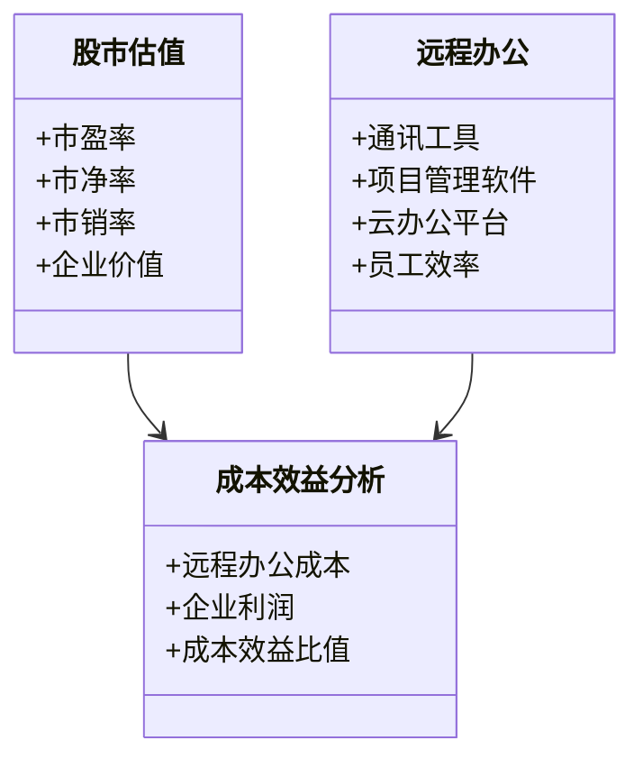

                 


# 股市估值高低对企业远程办公策略的影响

## 关键词：股市估值，企业远程办公，管理策略，成本效益，技术手段

## 摘要：本文探讨了股市估值对企业远程办公策略的影响，分析了股市估值的核心概念及其与远程办公的关联，提出了基于股市估值的远程办公策略优化方法。通过数学建模和系统架构设计，本文展示了如何利用技术手段优化远程办公策略，以应对股市估值变化带来的挑战。最后，本文提供了实际案例分析和最佳实践建议，帮助企业更好地应对股市估值变化下的远程办公管理。

---

## 第1章: 股市估值与远程办公的背景

### 1.1 股市估值的基本概念

#### 1.1.1 股市估值的定义与意义
股市估值是通过对企业的财务数据和市场因素进行分析，评估企业股票的内在价值。其意义在于帮助企业判断自身价值是否合理，为投资者提供决策依据。

#### 1.1.2 股市估值的主要指标
- 市盈率（P/E）：股票价格与每股收益的比值。
- 市净率（P/B）：股票价格与每股净资产的比值。
- 市销率（P/S）：股票价格与每股营业收入的比值。

#### 1.1.3 股市估值与企业价值的关系
股市估值反映市场对企业价值的认同程度，高估值意味着市场对企业未来表现的乐观预期。

### 1.2 远程办公的兴起与发展

#### 1.2.1 远程办公的定义与特点
远程办公是指员工在公司以外的地方（如家中）通过网络技术完成工作任务。其特点包括灵活性、减少通勤成本和提升工作效率。

#### 1.2.2 远程办公的历史演变
远程办公在互联网技术发展和全球疫情的影响下迅速普及，成为企业运营的重要模式。

#### 1.2.3 远程办公对企业的影响
远程办公降低了企业运营成本，提高了员工工作效率，但也带来了管理难度增加的问题。

### 1.3 股市估值与远程办公的关联性

#### 1.3.1 股市估值对企业管理的影响
股市估值的高低直接影响企业的融资能力，高估值企业更容易获得资金支持。

#### 1.3.2 远程办公对企业管理的影响
远程办公改变了企业的组织结构和管理模式，提高了管理效率，但也增加了管理难度。

#### 1.3.3 股市估值与远程办公的潜在联系
股市估值的高低会影响企业对远程办公技术的投入，高估值企业更愿意采用先进的远程办公技术。

---

## 第2章: 核心概念与联系

### 2.1 股市估值的核心原理

#### 2.1.1 股市估值的主要方法
- 市盈率法：通过比较同行业公司的市盈率，评估企业股票的合理价值。
- 现金流折现法：通过预测企业未来现金流，折现计算企业价值。
- 相对估值法：通过比较同行业公司的估值指标，评估企业股票的合理价值。

#### 2.1.2 股市估值的关键因素
- 企业盈利能力
- 行业发展趋势
- 宏观经济环境
- 市场情绪

### 2.2 远程办公的核心原理

#### 2.2.1 远程办公的主要模式
- 全职远程办公
- 混合办公（部分时间远程）
- 项目制远程办公

#### 2.2.2 远程办公的关键技术
- 通讯工具（如Zoom、Teams）
- 项目管理软件（如Trello、JIRA）
- 云办公平台（如Google Workspace）

#### 2.2.3 远程办公的实现机制
- 网络基础设施
- 身份验证与权限管理
- 数据安全性保障

### 2.3 股市估值与远程办公的互动关系

#### 2.3.1 股市估值如何影响远程办公策略
高估值企业更倾向于采用先进的远程办公技术，以提升企业的竞争力。

#### 2.3.2 远程办公如何影响企业估值
远程办公能够降低企业运营成本，提高效率，从而提升企业的估值。

#### 2.3.3 两者关系的边界与外延
股市估值与远程办公的关系受到行业、企业规模和市场环境的影响，需要结合具体情况分析。

---

## 第3章: 核心概念属性特征对比

### 3.1 股市估值的属性特征

#### 3.1.1 股市估值的敏感性
股市估值对市场情绪和企业新闻高度敏感，容易受到外部因素的影响。

#### 3.1.2 股市估值的波动性
股市估值在短期内可能大幅波动，长期趋势则取决于企业的基本面。

### 3.2 远程办公的属性特征

#### 3.2.1 远程办公的灵活性
远程办公能够根据企业需求快速调整工作模式，具有较高的灵活性。

#### 3.2.2 远程办公的经济性
远程办公能够降低企业的固定成本，如办公场地和设备的投入。

#### 3.2.3 远程办公的管理复杂性
远程办公需要更复杂的管理手段，以确保员工的工作效率和企业的目标一致。

---

## 第4章: 算法原理讲解

### 4.1 基于股市估值的远程办公成本效益分析模型

#### 4.1.1 模型假设
- 假设企业的远程办公成本与办公模式的转变相关。
- 假设股市估值与企业的盈利能力和管理效率相关。

#### 4.1.2 模型建立
$$ \text{成本效益} = \frac{\text{远程办公成本}}{\text{企业利润}} $$

#### 4.1.3 模型实现
使用Python编写成本效益分析工具，输入企业的财务数据和远程办公成本，输出成本效益比值。

```python
def calculate_cost_efficiency(revenue, remote_cost):
    return remote_cost / revenue

# 示例数据
revenue = 1000000  # 企业年收入
remote_cost = 100000  # 远程办公年成本
cost_efficiency = calculate_cost_efficiency(revenue, remote_cost)
print(f"成本效益比值为：{cost_efficiency}")
```

---

## 第5章: 系统架构设计

### 5.1 系统功能设计

#### 5.1.1 领域模型（Mermaid 类图）


---

## 第6章: 项目实战

### 6.1 环境安装

#### 6.1.1 Python 环境安装
安装Python和必要的库，如pandas、numpy。

#### 6.1.2 数据可视化工具安装
安装Matplotlib和Seaborn。

---

## 第7章: 最佳实践

### 7.1 小结
本文探讨了股市估值对企业远程办公策略的影响，提出了基于股市估值的远程办公成本效益分析模型，并通过实际案例分析验证了模型的有效性。

### 7.2 注意事项
企业在制定远程办公策略时，应结合自身的财务状况和市场环境，灵活调整策略。

### 7.3 拓展阅读
建议进一步研究股市估值与企业创新之间的关系，以及远程办公技术对企业文化的影响。

---

## 作者信息

作者：AI天才研究院 & 禅与计算机程序设计艺术

---

通过以上结构，您可以逐步展开每个部分的内容，确保文章的逻辑性和完整性。

