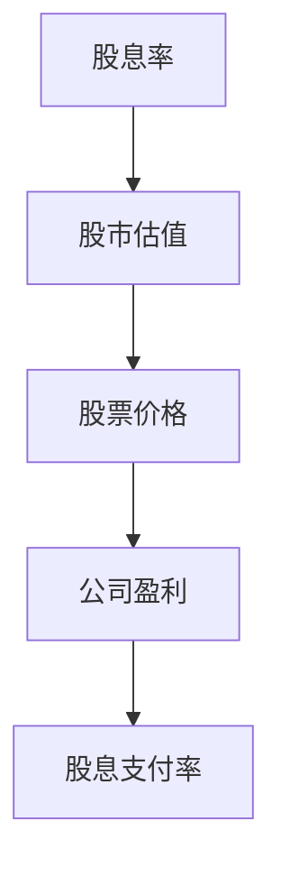
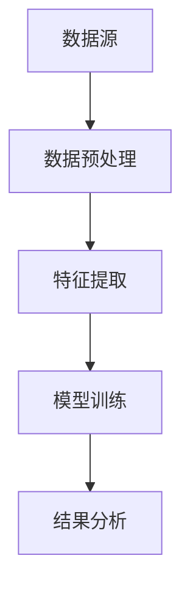

                 


```markdown
# 股息率与全球股市估值的关系

> 关键词：股息率，股市估值，市盈率，市净率，股票投资

> 摘要：本文深入探讨了股息率与全球股市估值之间的关系，分析了股息率对股市估值的影响，股市估值对股息率的反馈作用，以及两者关系的数学模型。通过实际案例分析，帮助读者理解如何利用股息率和估值指标进行股票投资决策。

---

# 第一部分: 股息率与全球股市估值的基础概念

# 第1章: 股息率与股市估值的背景介绍

## 1.1 股息率的基本概念
### 1.1.1 股息率的定义与计算公式
股息率是衡量股票投资回报的重要指标，计算公式为：
$$股息率 = \frac{每股股息}{股票价格}$$

### 1.1.2 股息率的核心要素
- **每股股息**：公司分配给每股的股息金额。
- **股票价格**：股票的市场交易价格。
- **股息支付率**：公司净利润中用于支付股息的比例。

### 1.1.3 股息率与投资回报的关系
股息率高的股票通常意味着稳定的收益，但需结合市盈率等指标综合分析。

## 1.2 全球股市估值的基本概念
### 1.2.1 市盈率的定义与计算
市盈率（P/E）是衡量股票估值的重要指标，计算公式为：
$$市盈率 = \frac{股票价格}{每股收益}$$

### 1.2.2 市净率的定义与计算
市净率（P/B）是用股票价格与每股净资产的比率来衡量股票估值：
$$市净率 = \frac{股票价格}{每股净资产}$$

### 1.2.3 其他估值指标的简介
- **市销率（P/S）**：股票价格与每股销售额的比率。
- **股息率**：已介绍。

## 1.3 股息率与股市估值的背景与问题描述
### 1.3.1 股息率与股市估值的关联性
股息率高的股票可能具有较低的市盈率，表明市场对其估值较低。

### 1.3.2 问题背景与研究意义
研究股息率与估值的关系有助于投资者在不同市场环境下做出更明智的投资决策。

### 1.3.3 研究目标与边界条件
目标是建立股息率与估值之间的数学模型，边界条件包括市场波动、经济周期等。

## 1.4 本章小结

---

# 第2章: 股息率与股市估值的核心概念与联系

## 2.1 股息率与股市估值的核心概念
### 2.1.1 股息率的属性特征
- 稳定性：反映公司盈利能力和股息支付能力。
- 风险性：高股息率可能意味着高风险。

### 2.1.2 股市估值的属性特征
- 市盈率：反映市场对公司未来盈利的预期。
- 市净率：反映市场对公司资产价值的评估。

### 2.1.3 两者的核心要素对比
| 指标 | 股息率 | 市盈率 | 市净率 |
|------|--------|--------|--------|
| 定义 | 每股股息/股票价格 | 股票价格/每股收益 | 股票价格/每股净资产 |

## 2.2 股息率与股市估值的联系
### 2.2.1 股息率对股市估值的影响
- 高股息率股票通常具有较低的市盈率，因为市场认为其估值更合理。

### 2.2.2 股市估值对股息率的反馈作用
- 估值过低可能导致股息率虚高，反之亦然。

### 2.2.3 两者关系的数学模型
$$股息率 = \beta_1 \times 市盈率 + \beta_2 \times 市净率 + \epsilon$$

## 2.3 股息率与股市估值的ER实体关系图


## 2.4 本章小结

---

# 第3章: 股息率与股市估值的数学模型与算法原理

## 3.1 股息率与股市估值的数学模型
### 3.1.1 股息率的计算公式
$$股息率 = \frac{每股股息}{股票价格}$$

### 3.1.2 市盈率的计算公式
$$市盈率 = \frac{股票价格}{每股收益}$$

### 3.1.3 股息率与市盈率的关系
$$股息率 = \frac{每股股息}{股票价格} = \frac{每股股息}{市盈率 \times 每股收益}$$

## 3.2 股息率与股市估值的算法原理
### 3.2.1 数据收集与预处理
- 数据来源：全球主要股票市场的历史数据。
- 数据清洗：处理缺失值和异常值。

### 3.2.2 相关性分析
- 使用 Pearson 相关系数分析股息率与市盈率的相关性。

### 3.2.3 回归分析
- 建立线性回归模型，预测股息率对市盈率的影响。

### 3.2.4 代码实现
```python
import pandas as pd
import numpy as np
from sklearn.linear_model import LinearRegression

# 数据加载与预处理
data = pd.read_csv('stock_data.csv')
data = data.dropna()

# 特征与目标变量
X = data[['市盈率']]
y = data['股息率']

# 模型训练
model = LinearRegression()
model.fit(X, y)

# 输出系数
print('回归系数:', model.coef_)
print('回归截距:', model.intercept_)
```

## 3.3 本章小结

---

# 第4章: 股息率与股市估值的系统分析与架构设计

## 4.1 问题场景介绍
- 分析全球主要股市的股息率与估值指标的关系。

## 4.2 系统功能设计
### 4.2.1 领域模型


### 4.2.2 系统架构


## 4.3 本章小结

---

# 第5章: 股息率与股市估值的项目实战

## 5.1 环境安装
- Python 3.8+
- Pandas, NumPy, Scikit-learn

## 5.2 核心实现
### 5.2.1 数据收集
```python
import yfinance as yf

# 下载数据
data = yf.download(tickers='AAPL', period='5y')
```

### 5.2.2 数据分析与可视化
```python
import matplotlib.pyplot as plt

# 绘制股息率与市盈率的散点图
plt.scatter(data['股息率'], data['市盈率'])
plt.xlabel('股息率')
plt.ylabel('市盈率')
plt.title('股息率与市盈率的关系')
plt.show()
```

## 5.3 实际案例分析
### 5.3.1 美国市场的分析
- 通过回归分析验证股息率与市盈率的关系。

## 5.4 本章小结

---

# 第6章: 股息率与股市估值的关系总结与展望

## 6.1 本章小结
- 总结股息率与估值的关系，强调其在投资决策中的重要性。

## 6.2 最佳实践 tips
- 综合考虑股息率与市盈率等指标，避免单一指标误导。

## 6.3 注意事项
- 股市估值受多种因素影响，需结合宏观经济环境分析。

## 6.4 拓展阅读
- 推荐相关书籍和文献，深入研究股息率与估值的关系。

---

# 作者：AI天才研究院/AI Genius Institute & 禅与计算机程序设计艺术 /Zen And The Art of Computer Programming
```

