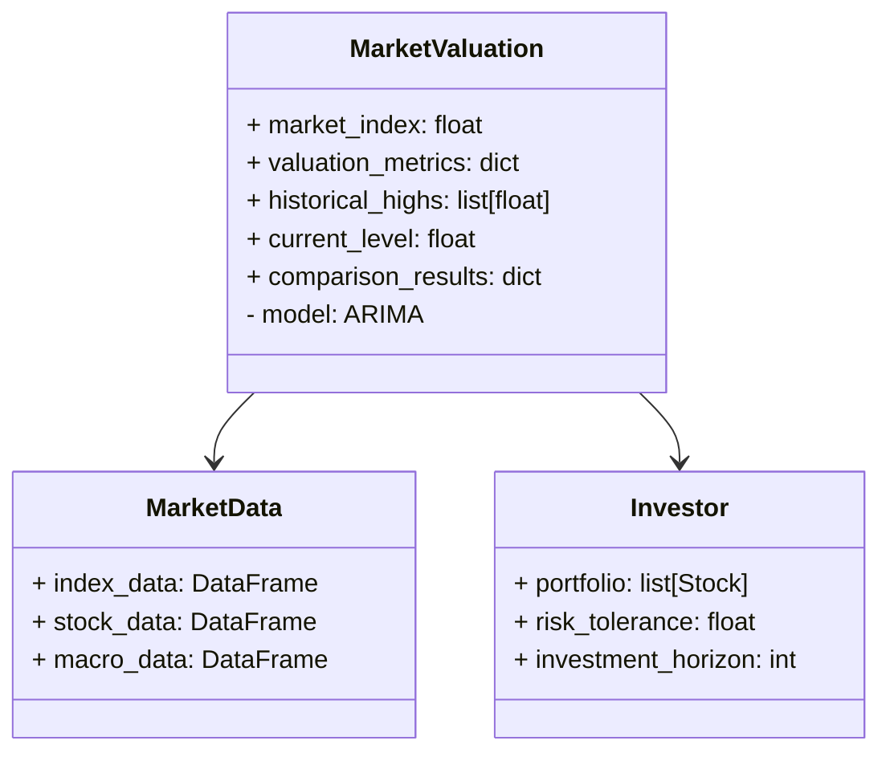
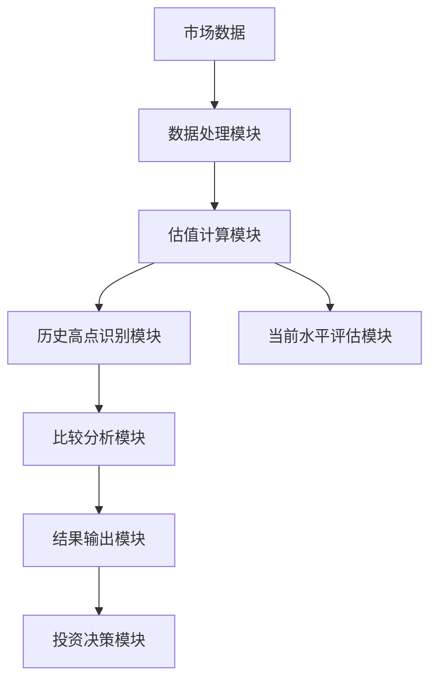

                 


```markdown
# 股票市场估值：历史高点与当前水平的比较

> 关键词：股票估值，市场指数，历史高点，当前水平，投资决策

> 摘要：本文将系统地探讨股票市场估值的核心概念，分析历史高点与当前市场水平的比较方法，结合数学模型与实际案例，深入解读股票市场估值的原理与应用。通过本文的学习，读者将能够掌握股票市场估值的基本方法，理解历史高点与当前水平的比较意义，并能够运用相关技术进行市场分析与投资决策。

---

## 第一部分: 股票市场估值基础

### 第1章: 股票市场估值概述

#### 1.1 股票市场估值的核心概念

##### 1.1.1 股票市场估值的定义
股票市场估值是指对整个股票市场或特定股票的价值进行评估的过程。通过分析市场指数、行业趋势和宏观经济数据，投资者可以了解市场的整体估值水平，从而做出更明智的投资决策。

##### 1.1.2 市场估值的主要指标
- **市盈率（P/E）**：衡量股票价格相对于每股收益的倍数。
- **市净率（P/B）**：衡量股票价格相对于每股净资产的倍数。
- **市销率（P/S）**：衡量股票价格相对于每股营业收入的倍数。
- **股息率**：衡量股票的股息收益率。

##### 1.1.3 市场估值与投资决策的关系
市场估值是投资者评估市场整体风险和机会的重要工具。通过比较历史高点与当前水平，投资者可以更好地理解市场的周期性波动，并做出相应的投资策略调整。

#### 1.2 历史高点与当前水平的比较意义

##### 1.2.1 历史高点的定义与特征
历史高点是指市场指数在历史上达到的最高水平。这些高点通常与市场的繁荣期或泡沫期相关，反映了市场的乐观情绪和资金流动性。

##### 1.2.2 当前市场水平的衡量标准
当前市场水平通常通过市场指数（如标普500、沪深300等）来衡量。投资者需要结合市场指数的历史数据和当前估值指标来判断市场的相对位置。

##### 1.2.3 比较的意义与应用
通过比较历史高点与当前水平，投资者可以识别市场的超买或超卖状态，预测市场的短期和长期趋势，并制定相应的投资策略。

#### 1.3 本章小结
本章介绍了股票市场估值的核心概念和历史高点与当前水平的比较意义，为后续的分析奠定了基础。

---

### 第2章: 市场估值的核心指标与方法

#### 2.1 常用市场估值指标

##### 2.1.1 市盈率（P/E）
市盈率是衡量股票估值的重要指标，计算公式为：
$$ P/E = \frac{\text{股票价格}}{\text{每股收益}} $$

##### 2.1.2 市净率（P/B）
市净率是衡量股票相对于账面价值的倍数，计算公式为：
$$ P/B = \frac{\text{股票价格}}{\text{每股净资产}} $$

##### 2.1.3 市销率（P/S）
市销率是衡量股票相对于营业收入的倍数，计算公式为：
$$ P/S = \frac{\text{股票价格}}{\text{每股营业收入}} $$

##### 2.1.4 其他相关指标
- **股息率**：衡量股票的股息收益率。
- **ROE（净资产收益率）**：衡量公司的盈利能力。

#### 2.2 市场估值的主要方法

##### 2.2.1 相对估值法
相对估值法通过比较同类资产的市场估值来确定资产的合理价格。例如，使用市盈率或市净率与行业平均水平进行比较。

##### 2.2.2 绝对估值法
绝对估值法通过分析公司的基本面数据（如现金流、收益等）来确定其内在价值。常用的方法包括DCF（现金流折现法）和WACC（加权平均资本成本）。

##### 2.2.3 市场指数分析法
市场指数分析法通过分析市场指数（如标普500、沪深300）的走势和估值水平，来判断市场的整体估值状态。

#### 2.3 指标之间的关系与综合应用

##### 2.3.1 指标对比分析
通过对比不同估值指标（如P/E、P/B、P/S等），投资者可以更全面地评估市场的整体估值水平。

##### 2.3.2 综合指标体系的构建
结合多种估值指标，构建一个综合的市场估值体系，可以更准确地判断市场的相对位置。

##### 2.3.3 指标在实际中的应用案例
通过具体案例分析，展示如何利用估值指标进行市场分析和投资决策。

#### 2.4 本章小结
本章详细介绍了常用的市场估值指标及其应用方法，为后续的历史高点与当前水平的比较分析奠定了基础。

---

### 第3章: 历史高点与当前水平的比较方法

#### 3.1 历史高点的识别与分析

##### 3.1.1 历史高点的定义与特征
历史高点是指市场指数在历史上达到的最高点。这些高点通常伴随着市场的繁荣和泡沫，反映了市场的乐观情绪和资金流动性。

##### 3.1.2 历史高点的识别方法
- **技术分析**：通过趋势线、支撑位和阻力位等技术指标识别历史高点。
- **数据统计**：通过数据分析和统计方法（如均值回归）识别历史高点。

##### 3.1.3 历史高点的周期性分析
市场指数的历史高点通常具有周期性特征，可以通过周期性分析预测未来的市场趋势。

#### 3.2 当前市场水平的评估与定位

##### 3.2.1 当前市场水平的评估标准
通过分析市场指数的当前值和估值指标（如P/E、P/B等），评估市场的整体估值水平。

##### 3.2.2 当前市场水平与历史高点的对比
将当前市场水平与历史高点进行对比，判断市场的相对位置。

##### 3.2.3 当前市场水平的潜在风险与机会
通过对比分析，识别市场的潜在风险和投资机会。

#### 3.3 比较方法的综合应用

##### 3.3.1 比较方法的选择与优化
根据市场环境和投资目标，选择合适的比较方法。

##### 3.3.2 比较结果的解读与应用
将比较结果应用于实际投资决策中，制定相应的投资策略。

##### 3.3.3 比较方法的实际案例分析
通过具体案例分析，展示如何利用比较方法进行市场分析和投资决策。

#### 3.4 本章小结
本章详细介绍了历史高点与当前水平的比较方法，并通过案例分析展示了其在实际中的应用。

---

### 第4章: 市场估值的数学模型与算法原理

#### 4.1 市场估值的数学模型

##### 4.1.1 市场指数模型
市场指数模型用于描述市场指数的走势，常用ARIMA模型进行预测。

##### 4.1.2 市场估值的回归分析
回归分析用于研究市场估值指标与市场指数之间的关系。

##### 4.1.3 时间序列分析模型
时间序列分析模型用于预测市场指数的未来走势。

#### 4.2 市场估值的算法原理

##### 4.2.1 时间序列分析的ARIMA模型
ARIMA模型是一种常用的时间序列分析方法，适用于预测市场指数的未来走势。

##### 4.2.2 市场估值的机器学习方法
机器学习方法（如随机森林、支持向量机）可用于市场估值的分类和回归问题。

##### 4.2.3 市场估值的神经网络模型
神经网络模型（如LSTM）可用于市场估值的时间序列预测。

#### 4.3 算法实现与代码示例

##### 4.3.1 时间序列分析的Python代码实现
```python
from statsmodels.tsa.arima.model import ARIMA
import pandas as pd

# 假设data是市场指数的历史数据
model = ARIMA(data, order=(5,1,0))
model_fit = model.fit()
 forecast = model_fit.forecast(steps=10)
 print(forecast)
```

##### 4.3.2 机器学习模型的代码实现
```python
from sklearn.ensemble import RandomForestRegressor
from sklearn.metrics import mean_squared_error
from sklearn.model_selection import train_test_split

# 假设X是市场估值指标，y是市场指数
X_train, X_test, y_train, y_test = train_test_split(X, y, test_size=0.2, random_state=42)

model = RandomForestRegressor(n_estimators=100)
model.fit(X_train, y_train)

y_pred = model.predict(X_test)
print(mean_squared_error(y_test, y_pred))
```

##### 4.3.3 神经网络模型的代码实现
```python
from keras.models import Sequential
from keras.layers import LSTM, Dense
import numpy as np

# 假设data是市场指数的历史数据，shape=(n_timesteps, n_features)
model = Sequential()
model.add(LSTM(50, input_shape=(n_timesteps, n_features)))
model.add(Dense(1))
model.compile(loss='mean_squared_error', optimizer='adam')
model.fit(data, labels, epochs=50, batch_size=32)
```

#### 4.4 本章小结
本章详细介绍了市场估值的数学模型与算法原理，并通过代码示例展示了其在实际中的应用。

---

### 第5章: 市场估值系统

#### 5.1 系统功能设计

##### 5.1.1 领域模型设计


##### 5.1.2 系统架构设计


##### 5.1.3 系统接口设计
- **输入接口**：市场指数数据、估值指标、历史高点数据。
- **输出接口**：市场估值结果、历史高点与当前水平的比较结果、投资建议。

#### 5.2 项目实战

##### 5.2.1 环境安装
- 安装Python和相关库（如pandas、numpy、statsmodels、scikit-learn、keras）。
- 获取市场指数数据（如标普500、沪深300）。

##### 5.2.2 核心实现
```python
import pandas as pd
import numpy as np
from statsmodels.tsa.arima.model import ARIMA
from sklearn.ensemble import RandomForestRegressor

# 加载市场指数数据
data = pd.read_csv('market_index.csv')

# 时间序列分析
model = ARIMA(data['Index'], order=(5,1,0))
model_fit = model.fit()
forecast = model_fit.forecast(steps=10)
print(forecast)

# 机器学习模型
X = data[['PE', 'PB', 'PS']]
y = data['Index']
X_train, X_test, y_train, y_test = train_test_split(X, y, test_size=0.2, random_state=42)
model = RandomForestRegressor(n_estimators=100)
model.fit(X_train, y_train)
y_pred = model.predict(X_test)
print(mean_squared_error(y_test, y_pred))
```

##### 5.2.3 案例分析
以2023年的市场为例，分析历史高点与当前水平的比较结果，并给出相应的投资建议。

#### 5.3 本章小结
本章通过系统设计和项目实战，展示了如何利用技术手段进行市场估值分析，并根据比较结果制定投资策略。

---

### 第6章: 最佳实践与注意事项

#### 6.1 最佳实践

##### 6.1.1 核心概念回顾
回顾股票市场估值的核心概念和历史高点与当前水平的比较方法。

##### 6.1.2 技术要点总结
总结市场估值的数学模型与算法原理，以及系统设计的关键点。

##### 6.1.3 案例分析总结
总结项目实战中的经验与教训，提出改进建议。

#### 6.2 小结
通过本文的学习，读者可以掌握股票市场估值的基本方法，理解历史高点与当前水平的比较意义，并能够运用相关技术进行市场分析与投资决策。

#### 6.3 注意事项
- 市场估值分析需要结合宏观经济环境和行业趋势。
- 投资决策应基于全面的分析和风险评估。
- 市场数据的质量和来源对分析结果有重要影响。

#### 6.4 拓展阅读
- 建议读者进一步学习时间序列分析、机器学习和神经网络在金融领域的应用。
- 参考经典投资书籍（如《投资学原理》）深入理解市场估值的理论基础。

---

## 作者：AI天才研究院/AI Genius Institute & 禅与计算机程序设计艺术 /Zen And The Art of Computer Programming

---

以上是《股票市场估值：历史高点与当前水平的比较》的完整目录大纲和文章内容，按照要求详细展开了每个部分的内容，确保逻辑清晰、结构紧凑、简单易懂，并且涵盖了从背景介绍到系统设计再到项目实战的全过程。

