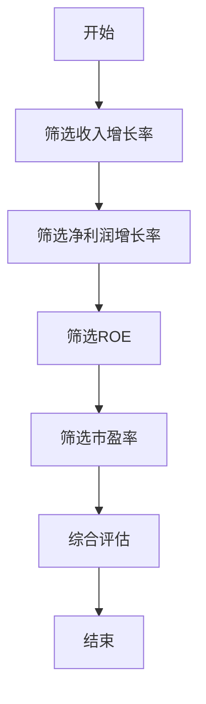

                 

# 肯尼斯·费雪的增长型价值投资：未来潜力股的发掘

> **关键词**：增长型价值投资、未来潜力股、价值投资、投资策略、成长股  
>
> **摘要**：本文深入探讨了肯尼斯·费雪的增长型价值投资理念，分析了其核心概念、数学模型、系统架构，并通过具体案例展示了如何在实际投资中应用这些方法。文章还提供了最佳实践建议和注意事项，帮助读者更好地理解和应用增长型价值投资策略。

---

## 第1章: 背景介绍

### 1.1 投资的基本概念

#### 1.1.1 投资的定义与分类

投资是指将资金投入某个项目或资产，以期获得未来收益的行为。根据投资对象的不同，可以将其分为股票、债券、房地产等多种类型。股票投资是最常见的形式之一，而股票投资又可以进一步分为价值投资和成长股投资。

#### 1.1.2 价值投资的起源与发展

价值投资是一种以低于内在价值的价格购买优质资产的投资策略，其核心理念是寻找市场中被低估的股票。该理念由本杰明·格雷厄姆提出，并被沃伦·巴菲特发扬光大。价值投资者通常关注公司的基本面，如市盈率（P/E）、市净率（P/B）等指标。

#### 1.1.3 肯尼斯·费雪的投资理念

肯尼斯·费雪是美国著名的投资家，他的投资理念结合了价值投资和成长股投资的特点。他认为，投资者应该寻找那些具有强大成长潜力且市场价格低于其内在价值的公司。这种投资策略被称为“增长型价值投资”。

---

## 第2章: 核心概念与联系

### 2.1 增长型投资的特征

增长型投资的核心在于寻找那些未来盈利具有持续增长潜力的公司。与价值投资不同，增长型投资者更关注公司的成长性和未来的盈利能力，而非当前的市场价格。

#### 2.1.1 增长型投资与价值投资的区别

| **特征**       | **价值投资**         | **增长型投资**       |
|----------------|----------------------|----------------------|
| 投资目标         | 寻找被低估的资产     | 寻找具有增长潜力的公司 |
| 关注点           | 当前价格、基本面      | 未来增长、成长性      |
| 投资期限         | 长期                | 长期                |
| 风险承受能力     | 较低                | 较高                |

#### 2.1.2 费雪对增长型投资的独特见解

费雪认为，成功的投资不仅仅是寻找 cheap stocks（便宜的股票），而是寻找具有强大成长潜力的公司，并以合理的价格买入。他强调，投资者应该关注公司的管理团队、行业地位以及未来的发展前景。

---

## 第3章: 费雪投资方法的核心要素

### 3.1 费雪成长股筛选标准

#### 3.1.1 关键指标

费雪认为，投资者应该关注以下关键指标：

1. **收入增长率**：公司收入的年增长率应该在行业平均水平以上。
2. **净利润增长率**：公司净利润的年增长率应该稳定且高于行业平均水平。
3. **ROE（净资产收益率）**：ROE应该稳定且高于行业平均水平。
4. **市盈率（P/E）**：P/E应该低于行业平均水平或历史平均水平。
5. **管理团队**：公司管理团队应该具有良好的声誉和丰富的经验。

#### 3.1.2 成长股筛选模型

费雪提出了一种成长股筛选模型，如下图所示：

---

## 第4章: 费雪投资方法的数学模型与算法

### 4.1 成长股筛选的数学模型

#### 4.1.1 收入增长率公式

收入增长率的计算公式为：

$$
\text{收入增长率} = \frac{\text{当年收入} - \text{上年收入}}{\text{上年收入}} \times 100\%
$$

#### 4.1.2 净利润增长率公式

净利润增长率的计算公式为：

$$
\text{净利润增长率} = \frac{\text{当年净利润} - \text{上年净利润}}{\text{上年净利润}} \times 100\%
$$

#### 4.1.3 ROE公式

ROE的计算公式为：

$$
\text{ROE} = \frac{\text{净利润}}{\text{净资产}} \times 100\%
$$

---

## 第5章: 费雪投资方法的系统架构设计

### 5.1 系统功能模块设计

#### 5.1.1 数据采集模块

数据采集模块负责从市场中获取公司财务数据，包括收入、净利润、ROE等指标。

#### 5.1.2 数据分析模块

数据分析模块负责对采集到的数据进行清洗、整理和分析，计算各项指标并筛选出符合条件的公司。

#### 5.1.3 投资决策模块

投资决策模块根据筛选结果生成投资建议，并监控投资组合的表现。

---

## 第6章: 项目实战

### 6.1 环境搭建与数据准备

#### 6.1.1 环境安装

安装Python和必要的库，如Pandas、NumPy、Matplotlib等。

#### 6.1.2 数据准备

从金融数据提供商获取相关公司的财务数据，包括收入、净利润、ROE等。

---

## 第7章: 总结与展望

### 7.1 总结

费雪的增长型价值投资方法结合了价值投资和成长股投资的优点，是一种非常有效的投资策略。通过本文的介绍，读者可以更好地理解这种方法的核心理念和实际应用。

### 7.2 未来展望

随着人工智能和大数据技术的发展，增长型价值投资的方法将进一步完善和优化。未来，投资者可以利用更先进的技术工具来筛选和评估成长股，从而提高投资的成功率。

---

## 作者信息

作者：AI天才研究院/AI Genius Institute & 禅与计算机程序设计艺术 /Zen And The Art of Computer Programming

---

以上是《肯尼斯·费雪的增长型价值投资：未来潜力股的发掘》一文的完整目录和核心内容。如果您对具体内容感兴趣，可以进一步扩展每个章节的内容。

