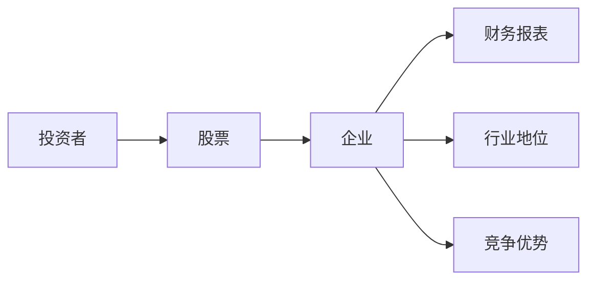
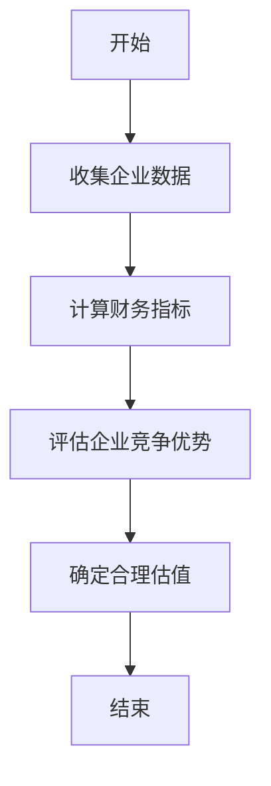

                 


# 《肯尼斯·费雪的增长型价值股：寻找未来的赢家》

## 关键词：增长型价值股，肯尼斯·费雪，投资策略，股票分析，价值投资，企业估值，财务指标

## 摘要：  
《肯尼斯·费雪的增长型价值股：寻找未来的赢家》一书深入探讨了价值投资的核心理念，特别是如何识别和投资于具有长期增长潜力的企业。本书结合了肯尼斯·费雪的经典投资策略，分析了增长型价值股的特点，并提供了系统的选股方法和数学模型。通过对企业的财务指标、竞争优势和行业地位的详细分析，本书为投资者提供了寻找未来赢家的实用指南。

---

## 第一部分：背景介绍

### 第1章：投资哲学与价值股概述

#### 1.1 价值投资的定义与核心理念
- **1.1.1 价值投资的起源与发展**  
  价值投资是一种以低于内在价值的价格购买优质股票的投资策略，起源于20世纪初。本杰明·格雷厄姆和戴维·多德是这一理念的奠基人，而肯尼斯·费雪则是其重要继承者。价值投资的核心在于寻找市场低估的股票，通过长期持有实现超额收益。

- **1.1.2 肯尼斯·费雪的投资理念**  
  费雪认为，投资成功的关键在于选择那些具有强大竞争优势、稳固行业地位和持续增长潜力的企业。他强调企业盈利能力和股东权益回报的重要性，提倡通过深入研究企业基本面来寻找投资机会。

- **1.1.3 价值投资与成长投资的对比**  
  价值投资注重安全边际，即以低于内在价值的价格买入；而成长投资则更关注企业的成长潜力。费雪的投资策略结合了两者的优势，注重在合理估值的基础上选择具有成长性的企业。

#### 1.2 增长型价值股的定义与特点
- **1.2.1 什么是增长型价值股**  
  增长型价值股是指那些既有成长潜力，又暂时被市场低估的股票。这类股票通常具有较高的盈利能力、良好的财务状况和明确的市场定位。

- **1.2.2 增长型价值股的核心特征**  
  - **高ROE（净资产收益率）**：表明企业能够高效利用股东资产创造利润。  
  - **稳定的盈利能力**：企业能够在不同经济周期中保持稳定的收益。  
  - **合理的估值**：市盈率、市净率等估值指标低于行业平均水平。  
  - **竞争优势明显**：企业在行业内具有独特的竞争优势，如技术壁垒、品牌影响力等。

- **1.2.3 增长型价值股与普通价值股的区别**  
  增长型价值股不仅关注企业的估值，还强调企业的成长性。普通价值股更注重安全边际，而增长型价值股则更看重企业的未来增长潜力。

#### 1.3 肯尼斯·费雪的投资策略
- **1.3.1 费雪的投资三步曲**  
  1. **识别具有强大竞争优势的企业**：选择那些在行业内具有领先地位，能够持续创新和适应市场变化的企业。  
  2. **评估企业的财务状况**：通过分析企业的财务报表，确定企业的盈利能力、资产负债情况和现金流健康状况。  
  3. **寻找市场低估的机会**：当企业的内在价值高于市场价格时，买入并长期持有。

- **1.3.2 费雪的选股标准**  
  - **高ROE**：费雪认为，ROE是衡量企业盈利能力的重要指标，通常选择ROE超过15%的企业。  
  - **稳定的盈利增长**：企业过去几年的收入和利润应保持稳定增长。  
  - **合理的估值**：市盈率低于行业平均水平，或市净率低于行业平均水平。  
  - **强大的竞争优势**：企业在市场中具有独特的竞争优势，如品牌、技术、成本优势等。

- **1.3.3 费雪的成功案例分析**  
  以可口可乐为例，费雪通过分析其强大的品牌优势、稳定的现金流和合理的估值，判断其具有长期增长潜力，并长期持有该股票，最终获得了丰厚的回报。

---

### 第2章：价值股分析的核心概念与联系

#### 2.1 核心概念与原理
- **2.1.1 财务指标分析**  
  财务指标是评估企业基本面的重要工具，主要包括：  
  - **ROE（净资产收益率）**：衡量企业利用股东资产创造利润的能力。  
  - **净利润率**：衡量企业的盈利能力。  
  - **资产负债率**：衡量企业的财务健康状况。  
  - **现金流**：衡量企业的财务流动性。

- **2.1.2 企业竞争优势分析**  
  企业竞争优势是判断企业是否具有长期增长潜力的关键因素，主要包括：  
  - **技术壁垒**：企业是否拥有独特的技术或专利。  
  - **品牌影响力**：企业的品牌是否在目标市场中具有强大的影响力。  
  - **成本优势**：企业是否能够以更低的成本生产产品或服务。  
  - **市场定位**：企业在市场中的定位是否稳固。

- **2.1.3 行业地位与发展趋势**  
  行业地位决定了企业的未来发展空间。投资者需要分析企业所处行业的市场规模、增长潜力、竞争格局等，以判断企业的长期发展是否具备可持续性。

#### 2.2 核心概念对比分析
- **2.2.1 股票估值方法对比**  
  - **相对估值法**：如市盈率、市净率等，适用于同行业内的横向比较。  
  - **内在价值法**：如现金流折现法，适用于评估单个企业的内在价值。  

- **2.2.2 增长型与防御型股票的对比**  
  - **增长型股票**：具有较高的成长潜力，适合长期投资。  
  - **防御型股票**：在经济衰退时表现相对稳定，适合风险厌恶型投资者。  

- **2.2.3 费雪选股标准与其它投资策略的对比**  
  - **格雷厄姆的价值投资**：注重安全边际，寻找被市场低估的股票。  
  - **彼得·林奇的成长投资**：注重企业的成长潜力，寻找具有竞争优势的企业。  
  - **费雪的投资策略**：结合了两者的优势，注重企业的成长性和估值的合理性。

#### 2.3 实体关系图


---

### 第3章：增长型价值股的数学模型与算法原理

#### 3.1 股票估值的数学模型
- **3.1.1 费雪模型**  
  $$ \text{合理股价} = \text{每股收益} \times \text{合理市盈率} $$  
  其中，合理市盈率通常基于行业的平均水平或企业的未来增长潜力来确定。

- **3.1.2 投资回报率模型**  
  $$ ROI = \frac{\text{净利润}}{\text{投入资本}} $$  
  ROI（投资回报率）是衡量企业投资效率的重要指标，ROI越高，企业的盈利能力越强。

#### 3.2 算法原理
- **3.2.1 算法流程图**  


- **3.2.2 Python代码实现**  
  ```python
  def calculate_fair_price(company_data):
      # 计算每股收益
      earnings_per_share = company_data['净利润'] / company_data['总股本']
      # 计算合理市盈率（假设行业平均市盈率为15，给予10%的溢价）
      fair_pe = 15 * 1.1
      # 计算合理股价
      fair_price = earnings_per_share * fair_pe
      return fair_price

  # 示例数据
  company_data = {
      '净利润': 100,
      '总股本': 10,
      '行业平均PE': 15
  }

  fair_price = calculate_fair_price(company_data)
  print(f"合理股价：{fair_price}")
  ```

- **3.2.3 案例分析**  
  假设某企业的净利润为100万元，总股本为10万股，行业平均PE为15。根据上述模型，计算出的合理股价为：  
  $$ \text{每股收益} = 10 \text{元} $$  
  $$ \text{合理股价} = 10 \times 15 \times 1.1 = 165 \text{元} $$  
  该企业当前股价为150元，低于合理股价，具有投资价值。

---

## 总结  
《肯尼斯·费雪的增长型价值股：寻找未来的赢家》通过系统的分析和实用的数学模型，为投资者提供了寻找未来赢家的指南。通过深入研究企业的基本面、竞争优势和行业地位，结合合理的估值方法，投资者可以更好地识别具有长期增长潜力的增长型价值股，实现稳健的投资回报。

---

## 作者：AI天才研究院/AI Genius Institute & 禅与计算机程序设计艺术 /Zen And The Art of Computer Programming

