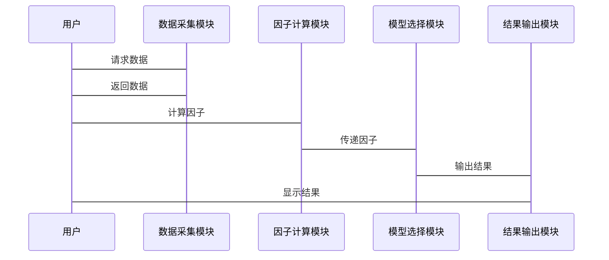

                 


# 肯尼斯·费雷尔的多因子选股模型

> 关键词：多因子选股，因子分析，数学模型，系统设计，Python实现

> 摘要：多因子选股模型是一种基于多个因子（如价值、成长、动量等）来评估股票的投资策略。本文详细分析了多因子选股模型的核心概念、数学原理、系统架构以及实际应用案例，帮助读者全面理解并掌握这一选股方法。

---

## # 引言

在金融投资领域，选股模型是投资者用来筛选优质股票的重要工具。传统的选股方法往往依赖单一的因子（如市盈率、市净率等）进行评估，这种方法在实际应用中存在诸多局限性。为了克服这些问题，多因子选股模型应运而生。多因子模型通过结合多个因子，从多个维度对股票进行综合评估，从而提高选股的准确性和稳定性。

本文将详细介绍多因子选股模型的核心概念、数学原理、系统架构以及实际应用案例，帮助读者全面理解并掌握这一选股方法。

---

## # 第2章: 多因子选股模型的核心概念

### 2.1 多因子选股模型的定义与特点

多因子选股模型是一种基于多个因子对股票进行综合评估的投资策略。与传统的单一因子选股模型相比，多因子模型具有以下特点：

- **多维度评估**：通过多个因子（如价值因子、动量因子、质量因子等）对股票进行综合评估。
- **稳定性高**：结合多个因子可以降低单一因子的波动性，提高选股的稳定性。
- **适应性强**：适用于不同市场环境和投资策略。

### 2.2 多因子模型的因子分析

因子是多因子模型的核心，常见的因子包括：

| 因子类型 | 定义 | 示例 |
|----------|------|------|
| 价值因子 | 反映股票的估值水平 | 市盈率（P/E）、市净率（P/B） |
| 成长因子 | 反映公司的成长能力 | 营收增长率、净利润增长率 |
| 动量因子 | 反映股票价格的动量效应 | 过去12个月的收益率 |
| 流动性因子 | 反映股票的流动性 | 日均成交量、换手率 |

### 2.3 多因子模型的构建框架

多因子模型的构建通常包括以下几个步骤：

1. **因子选择**：根据投资策略选择合适的因子。
2. **因子标准化**：对因子进行标准化处理，消除量纲的影响。
3. **因子权重分配**：根据因子的重要性分配权重。
4. **综合评分**：将因子评分加权求和，得出综合评分。
5. **股票筛选**：根据综合评分筛选出符合条件的股票。

### 2.4 多因子模型的核心要素

多因子模型的核心要素包括：

- **因子池**：用于评估股票的多个因子。
- **因子权重**：因子在综合评分中的权重。
- **评分标准**：评分的计算方法和筛选标准。

---

## # 第3章: 多因子选股模型的数学模型与算法

### 3.1 多因子模型的数学公式

多因子模型的综合评分公式如下：

$$
\text{综合评分} = \sum_{i=1}^{n} w_i \cdot f_i
$$

其中，\( w_i \) 是因子 \( f_i \) 的权重，\( n \) 是因子的总数。

### 3.2 常见的多因子模型

#### 3.2.1 Fama-French三因子模型

Fama-French三因子模型是多因子模型的经典代表，其公式如下：

$$
R_i = R_f + \beta_i (R_m - R_f) + 0.3 \cdot SMB + 0.3 \cdot HML + \epsilon_i
$$

其中：
- \( R_i \) 是股票 \( i \) 的超额收益。
- \( R_f \) 是无风险利率。
- \( R_m \) 是市场收益。
- \( SMB \) 是小市值因子。
- \( HML \) 是低流动性因子。
- \( \epsilon_i \) 是误差项。

#### 3.2.2 CAPM模型

CAPM（资本资产定价模型）是单因子模型，公式如下：

$$
R_i = R_f + \beta_i (R_m - R_f)
$$

其中：
- \( R_i \) 是股票 \( i \) 的预期收益。
- \( R_f \) 是无风险利率。
- \( \beta_i \) 是股票 \( i \) 的beta系数。
- \( R_m \) 是市场预期收益。

### 3.3 多因子模型的Python实现

以下是一个简单的多因子选股模型的Python代码示例：

```python
import pandas as pd
import numpy as np

# 示例数据：假设我们有一个包含多个因子的DataFrame
data = pd.DataFrame({
    'P/E': [15, 20, 12, 18],
    'Revenue_Growth': [0.2, 0.15, 0.25, 0.1],
    'Momentum': [0.1, 0.05, 0.15, 0.08]
})

# 定义因子权重
weights = {'P/E': 0.3, 'Revenue_Growth': 0.4, 'Momentum': 0.3}

# 计算综合评分
data['Score'] = data.apply(lambda x: 
    weights['P/E'] * x['P/E'] + 
    weights['Revenue_Growth'] * x['Revenue_Growth'] + 
    weights['Momentum'] * x['Momentum'], axis=1)

# 筛选综合评分最高的股票
data = data.sort_values('Score', ascending=False)
print(data)
```

---

## # 第4章: 多因子选股模型的系统分析与架构设计

### 4.1 系统功能设计

多因子选股系统的功能模块包括：

- 数据采集模块：从数据库中获取股票数据。
- 因子计算模块：计算各个因子的值。
- 模型选择模块：选择合适的多因子模型。
- 结果输出模块：输出筛选出的股票列表。

### 4.2 系统架构设计

以下是系统的架构图：


### 4.3 系统交互设计

以下是系统的交互流程图：



---

## # 第5章: 多因子选股模型的项目实战

### 5.1 项目环境安装

要运行以下代码，需要安装以下Python库：

- `pandas`
- `numpy`
- `scikit-learn`

安装命令：

```bash
pip install pandas numpy scikit-learn
```

### 5.2 核心实现代码

以下是多因子选股模型的实现代码：

```python
import pandas as pd
from sklearn.linear_model import LinearRegression

# 示例数据：股票的因子值和目标收益
data = pd.DataFrame({
    'P/E': [15, 20, 12, 18],
    'Revenue_Growth': [0.2, 0.15, 0.25, 0.1],
    'Momentum': [0.1, 0.05, 0.15, 0.08],
    'Target_Return': [0.15, 0.1, 0.2, 0.12]
})

# 训练多因子回归模型
model = LinearRegression()
model.fit(data[['P/E', 'Revenue_Growth', 'Momentum']], data['Target_Return'])

# 预测目标收益
data['Predicted_Return'] = model.predict(data[['P/E', 'Revenue_Growth', 'Momentum']])

# 筛选符合条件的股票
threshold = 0.12
data['Selected'] = data['Predicted_Return'] > threshold

print(data)
```

### 5.3 项目小结

通过上述代码，我们可以实现一个多因子选股模型，利用回归分析预测目标收益，并根据预测结果筛选出符合条件的股票。

---

## # 第6章: 总结与展望

### 6.1 最佳实践

- **因子选择**：选择与投资目标相关的因子。
- **模型优化**：根据实际效果调整模型参数。
- **数据质量**：确保数据的准确性和完整性。

### 6.2 小结

多因子选股模型通过结合多个因子，从多个维度对股票进行综合评估，是一种高效的投资策略。本文详细介绍了多因子选股模型的核心概念、数学模型、系统架构以及实际应用案例，帮助读者全面理解并掌握这一选股方法。

### 6.3 注意事项

- **数据风险**：数据质量对模型效果有重要影响。
- **模型风险**：模型可能无法完全适应所有市场环境。

### 6.4 拓展阅读

- 《多因子投资组合优化》
- 《Fama-French三因子模型的实证研究》
- 《机器学习在量化投资中的应用》

---

## # 作者

作者：AI天才研究院 & 禅与计算机程序设计艺术

