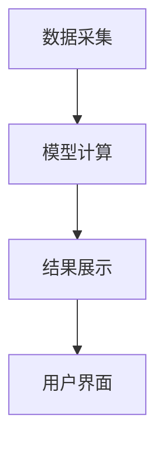
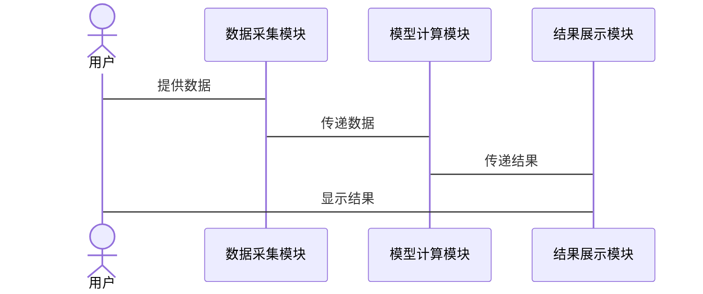

                 


# 肯尼斯费雪的创新驱动增长理论

---

## 关键词：创新驱动增长，经济增长，肯尼斯·费雪，创新理论，经济学

---

## 摘要：  
肯尼斯·费雪的创新驱动增长理论是现代经济学中的一个重要理论，它强调创新在经济增长中的核心作用。本文将从理论背景、核心概念、数学模型、系统架构设计、项目实战等多个角度，全面分析和解读这一理论。通过案例分析和实际应用，本文将帮助读者理解创新如何驱动经济增长，并为企业和社会提供实践指导。

---

## 第1章: 背景介绍

### 1.1 经济增长的传统理论与局限性
经济增长的传统理论主要依赖于资本积累、劳动力投入和生产效率的提升。然而，这些理论在解释现代经济的快速发展时显得力不从心，尤其是面对技术进步和创新的推动时，传统理论难以捕捉其本质。

### 1.2 创新在现代经济中的重要性
创新是推动现代经济增长的核心动力。无论是技术创新、管理创新还是商业模式创新，都在为企业和社会创造新的价值和机会。创新不仅提高了生产效率，还催生了新的产业和市场。

### 1.3 费雪理论的提出背景与意义
肯尼斯·费雪在20世纪提出的创新驱动增长理论，正是基于对当时经济环境中创新作用的深刻洞察。他指出，创新不仅是经济增长的催化剂，更是经济结构优化和升级的关键因素。

---

## 第2章: 创新驱动增长的核心概念与联系

### 2.1 创新与经济增长的关系
创新与经济增长之间存在密切的正相关关系。通过创新，企业能够提高生产效率，降低成本，从而在市场竞争中占据优势地位。

### 2.2 费雪理论的核心假设
费雪理论假设创新是经济增长的核心动力，而创新的扩散和应用则是推动经济发展的关键过程。

### 2.3 创新与资源分配的关系
创新不仅需要资源的投入，还需要合理的资源配置。通过优化资源配置，创新的潜力才能得到充分发挥。

---

## 第3章: 费雪理论的数学模型与算法原理

### 3.1 数学模型的建立
基于费雪理论，我们建立一个简单的经济增长模型：

$$ Y = A \cdot L \cdot K^{α} $$

其中：
- $Y$ 表示总产出
- $A$ 表示技术进步水平（创新的核心体现）
- $L$ 表示劳动力投入
- $K$ 表示资本投入
- $α$ 为资本的边际产出弹性

### 3.2 算法实现
通过Python代码实现上述模型：

```python
def calculate_growth(A, L, K, alpha):
    return A * L * (K ** alpha)

# 示例参数
A = 2  # 技术进步水平
L = 100  # 劳动力投入
K = 50  # 资本投入
alpha = 0.3  # 资本的边际产出弹性

# 计算产出
output = calculate_growth(A, L, K, alpha)
print("产出:", output)
```

### 3.3 模型解释
通过上述代码，我们可以看到，技术进步水平 $A$ 对产出的影响是线性的，而资本投入 $K$ 的影响则是非线性的。这表明，创新（通过 $A$ 反映）在经济增长中起着至关重要的作用。

---

## 第4章: 系统架构设计

### 4.1 系统功能设计
为了实现创新驱动增长的理论，我们设计了一个简单的系统架构，包括以下几个模块：
1. 数据采集模块：采集劳动力、资本、技术创新等数据。
2. 模型计算模块：基于费雪理论进行经济增长预测。
3. 结果展示模块：以可视化的方式展示计算结果。

### 4.2 系统架构图


### 4.3 系统交互流程图


---

## 第5章: 项目实战

### 5.1 环境安装
为了运行以下代码，需要安装Python和必要的库（如Matplotlib）。

### 5.2 核心实现代码
```python
import matplotlib.pyplot as plt

def calculate_growth(A, L, K, alpha):
    return A * L * (K ** alpha)

# 参数设置
A = 2
L = 100
K = 50
alpha = 0.3

# 计算不同资本投入下的产出
K_values = range(30, 70)
outputs = [calculate_growth(A, L, k, alpha) for k in K_values]

# 可视化结果
plt.plot(K_values, outputs)
plt.xlabel('资本投入 (K)')
plt.ylabel('产出 (Y)')
plt.title('创新驱动增长模型')
plt.show()
```

### 5.3 代码解读
上述代码通过绘制资本投入与产出的关系图，直观地展示了创新（通过 $A$）对经济增长的推动作用。随着资本投入的增加，产出增长的速度逐渐放缓，这验证了边际产出递减的规律。

---

## 第6章: 最佳实践

### 6.1 小结
费雪的创新驱动增长理论为我们提供了一个分析经济增长的新视角。通过创新，企业和社会能够实现资源的优化配置，推动经济的可持续发展。

### 6.2 注意事项
在实际应用中，需要注意创新的外部性和路径依赖问题。政府和企业需要共同努力，营造良好的创新环境。

### 6.3 未来趋势
随着人工智能和大数据技术的发展，创新的作用将更加显著。未来的研究可以进一步探索数字技术对经济增长的驱动作用。

### 6.4 拓展阅读
推荐阅读《经济增长的来源》（Paul Romer）和《创新与增长的理论》（Kenneth Arrow）等经典著作，以深入理解创新与经济增长的关系。

---

## 作者：AI天才研究院 & 禅与计算机程序设计艺术

