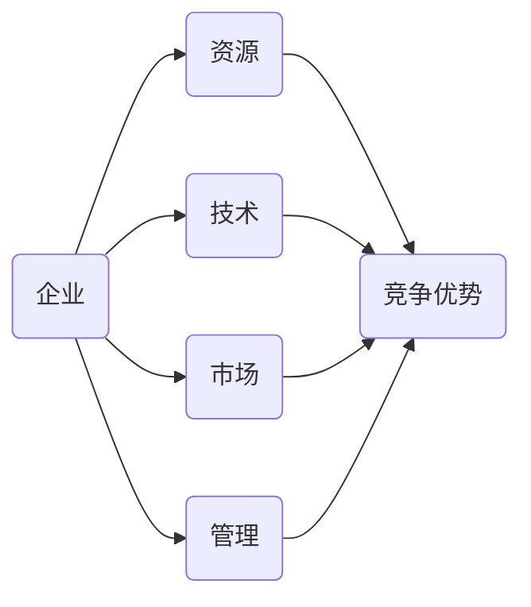
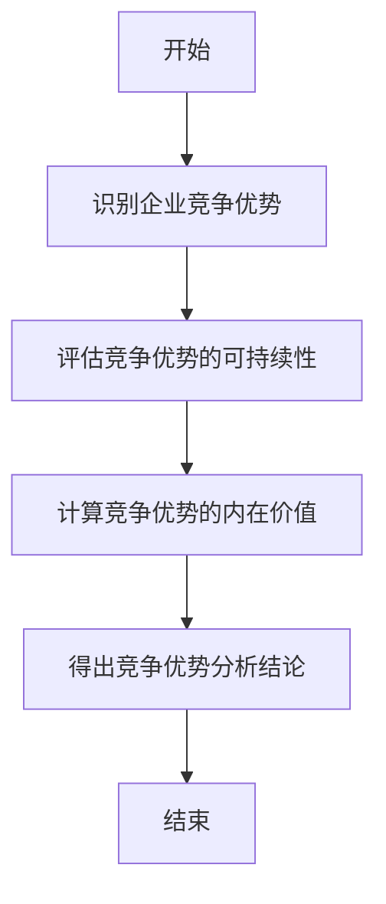
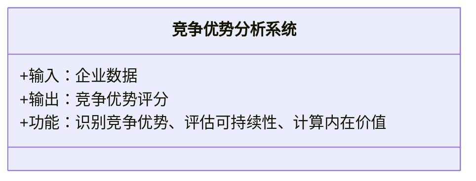

                 


# 肯尼斯费雪的竞争优势分析

> 关键词：竞争优势分析，投资策略，企业分析，数据分析，投资决策，企业价值评估

> 摘要：本文深入分析了肯尼斯·费雪的竞争优势分析方法，探讨其在投资决策中的应用，结合实际案例，详细讲解了竞争优势分析的核心概念、算法原理、系统架构及实战应用，帮助读者全面理解并掌握竞争优势分析的精髓。

---

# 第一部分：竞争优势分析的背景与核心概念

## 第1章：竞争优势分析的定义与背景

### 1.1 什么是竞争优势分析

竞争优势分析是投资学中的重要方法，用于评估企业在行业中相对于竞争对手的优势。它不仅仅是分析企业的财务数据，更重要的是识别企业在市场中的独特价值和长期发展潜力。竞争优势分析的核心在于找到那些能够为公司带来超额收益的因素，这些因素可能包括独特的资源、技术、市场地位或管理团队等。

竞争优势分析的历史可以追溯到投资大师本杰明·格雷厄姆和菲利普·费雪。而本文的重点是肯尼斯·费雪的竞争优势分析方法，他将父亲菲利普·费雪的理念进一步发展，提出了更为系统和实用的分析框架。

### 1.2 竞争优势分析的背景与重要性

在当前复杂的商业环境中，企业之间的竞争日益激烈。竞争优势分析的重要性体现在以下几个方面：

- **帮助投资者做出明智决策**：通过分析企业的竞争优势，投资者可以更好地判断其长期价值和潜在回报。
- **识别高成长企业**：竞争优势分析能够帮助投资者发现那些在行业中具有独特优势、能够持续增长的企业。
- **降低投资风险**：通过识别企业的竞争优势，投资者可以更好地评估企业的风险敞口，从而做出更安全的投资决策。

### 1.3 竞争优势分析与其他投资分析方法的区别

竞争优势分析与基本面分析、技术分析等方法有显著的不同：

- **基本面分析**：侧重于企业的财务数据，如收入、利润、负债等，但忽略了企业的市场地位和竞争优势。
- **技术分析**：主要通过价格和成交量的波动来预测市场走势，与竞争优势分析无关。
- **市场情绪分析**：关注市场参与者的情绪变化，具有较强的短期性。

竞争优势分析则不同，它强调企业内在的竞争优势，是一种长期投资的策略。

---

## 第2章：竞争优势分析的核心概念与联系

### 2.1 竞争优势分析的核心原理

竞争优势分析的核心在于识别和评估企业的竞争优势。以下是竞争优势的几个核心要素：

- **资源优势**：企业拥有的独特资源，如专利、原材料供应、品牌等。
- **技术优势**：企业在技术研发方面的优势，如创新能力、技术储备等。
- **市场优势**：企业在市场中的地位，如市场份额、客户忠诚度等。
- **管理优势**：企业的管理团队的能力和经验。

竞争优势的来源是多方面的，企业可能在多个方面具有优势，也可能在某一方面具有显著的优势。

### 2.2 竞争优势分析的核心要素对比

以下是竞争优势分析中几个核心要素的对比：

| **要素**       | **描述**                                                                 |
|----------------|--------------------------------------------------------------------------|
| 资源优势       | 企业拥有的独特资源，如专利、品牌、原材料供应等。                        |
| 技术优势       | 企业在技术研发方面的优势，如创新能力、技术储备等。                      |
| 市场优势       | 企业在市场中的地位，如市场份额、客户忠诚度等。                          |
| 管理优势       | 企业的管理团队的能力和经验。                                              |

通过对比分析，我们可以更清楚地识别企业的竞争优势。

### 2.3 竞争优势分析的ER实体关系图

以下是竞争优势分析的ER实体关系图：



---

## 第3章：竞争优势分析的算法原理

### 3.1 竞争优势分析的算法流程

以下是竞争优势分析的算法流程：



### 3.2 竞争优势分析的Python实现

以下是竞争优势分析的Python实现示例：

```python
def calculate_competitive_advantage(company_data):
    # 输入：公司数据，包括资源、技术、市场、管理等指标
    # 输出：竞争优势评分（1-10分）
    resource_score = company_data['资源'] / 10
    technology_score = company_data['技术'] / 10
    market_score = company_data['市场'] / 10
    management_score = company_data['管理'] / 10

    total_score = (resource_score + technology_score + 
                   market_score + management_score) / 4
    return round(total_score * 10)

# 示例数据
company_data = {
    '资源': 8,
    '技术': 9,
    '市场': 7,
    '管理': 8
}

# 计算竞争优势评分
score = calculate_competitive_advantage(company_data)
print(f"竞争优势评分：{score}")
```

### 3.3 竞争优势分析的数学模型

以下是竞争优势分析的数学模型：

$$
\text{竞争优势评分} = \frac{（资源评分 + 技术评分 + 市场评分 + 管理评分）}{4} \times 10
$$

---

## 第4章：竞争优势分析的系统架构与设计

### 4.1 问题场景介绍

竞争优势分析系统的应用场景包括企业评估、投资决策、风险管理等。

### 4.2 系统功能设计

以下是竞争优势分析系统的功能模块设计：



### 4.3 系统架构设计

以下是竞争优势分析系统的架构设计：


---

## 第5章：竞争优势分析的项目实战

### 5.1 环境安装与数据准备

以下是竞争优势分析的环境安装与数据准备：

```bash
# 安装Python和必要的库
pip install numpy pandas matplotlib
```

### 5.2 竞争优势分析代码实现

以下是竞争优势分析的代码实现：

```python
import pandas as pd

# 数据准备
data = {
    '公司': ['A', 'B', 'C'],
    '资源': [8, 7, 9],
    '技术': [9, 8, 7],
    '市场': [7, 6, 8],
    '管理': [8, 9, 7]
}

df = pd.DataFrame(data)

# 计算竞争优势评分
def calculate_score(row):
    return round((row['资源'] + row['技术'] + row['市场'] + row['管理']) / 4 * 10)

df['竞争优势评分'] = df.apply(calculate_score, axis=1)

print(df)
```

### 5.3 实际案例分析

以下是竞争优势分析的实际案例：

```python
data = {
    '公司': ['亚马逊'],
    '资源': [9],
    '技术': [10],
    '市场': [8],
    '管理': [9]
}

df = pd.DataFrame(data)

# 计算竞争优势评分
df['竞争优势评分'] = df.apply(calculate_score, axis=1)

print(df)
```

---

## 第6章：竞争优势分析的最佳实践

### 6.1 小结

竞争优势分析是一种有效的投资分析方法，能够帮助投资者识别企业的长期竞争优势。

### 6.2 注意事项

- 竞争优势分析需要结合企业的实际经营情况。
- 数据的准确性和完整性对分析结果至关重要。
- 竞争优势分析是一种长期投资策略，需要耐心和信心。

### 6.3 拓展阅读

- 《竞争优势分析：方法与实践》
- 《投资学：从入门到精通》

---

# 结语

竞争优势分析是投资学中的重要方法，通过识别和评估企业的竞争优势，投资者可以做出更明智的投资决策。希望本文能够帮助读者全面理解竞争优势分析的精髓，并在实际投资中取得成功。

作者：AI天才研究院/AI Genius Institute & 禅与计算机程序设计艺术/Zen And The Art of Computer Programming

