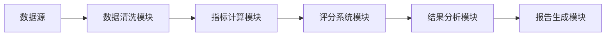
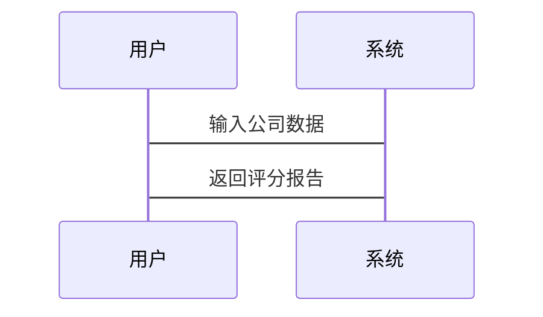

                 


# 肯尼斯费雪的长期增长型公司特征

## 关键词：长期增长型公司、投资特征、财务指标、竞争优势、管理团队

## 摘要：长期增长型公司是指那些能够在较长的时间内持续增长并为股东创造超额收益的企业。本文将从财务指标、市场地位、竞争优势、管理团队等多个维度，详细分析长期增长型公司的特征，并结合具体案例和数学模型，探讨如何识别和评估这些公司。通过本文的分析，投资者可以更好地理解长期增长型公司的内在逻辑，并在实际投资中应用这些特征。

---

# 第一部分: 长期增长型公司的定义与背景

## 第1章: 长期增长型公司的定义与背景

### 1.1 长期增长型公司的定义

长期增长型公司是指那些在较长的时间周期内，能够持续实现收入和利润增长，并且具备强大竞争优势和市场地位的企业。这类公司通常具有稳定的财务状况、优秀的管理团队以及清晰的增长战略。

#### 1.1.1 长期增长型公司的核心概念

长期增长型公司的核心概念包括以下几点：
- **持续增长能力**：公司能够在不同经济周期中保持收入和利润的增长。
- **竞争优势**：公司具备独特的竞争优势，能够在行业中长期占据领先地位。
- **管理团队**：公司拥有经验丰富、能力强的管理团队，能够制定和执行有效的战略。

#### 1.1.2 长期增长型公司的历史发展

长期增长型公司并非一个新的概念。历史上，许多伟大的企业，如苹果、微软和谷歌，都符合长期增长型公司的特征。这些公司通过不断创新和扩展市场，实现了长期的增长。

#### 1.1.3 长期增长型公司与传统投资理念的区别

与传统的短期投资理念不同，长期增长型公司关注的是企业的长期价值创造能力。短期投资更注重股价的波动，而长期增长型公司投资更关注企业的基本面和长期发展潜力。

### 1.2 长期增长型公司的背景与现状

#### 1.2.1 当前市场环境对长期增长型公司的影响

当前，全球经济的不确定性增加，市场波动加剧。在这种背景下，长期增长型公司因其稳定的财务状况和持续的增长能力，成为投资者的首选。

#### 1.2.2 投资者对长期增长型公司的需求

投资者对长期增长型公司的需求主要体现在以下方面：
- **稳定回报**：长期增长型公司能够为投资者提供稳定的回报。
- **抗风险能力**：在市场波动中，长期增长型公司通常表现更为稳定。

#### 1.2.3 长期增长型公司的未来发展趋势

随着技术的进步和市场的变化，长期增长型公司将继续通过创新和优化管理来保持增长。未来，具备数字化转型能力的企业将更具竞争优势。

---

# 第二部分: 长期增长型公司的核心特征

## 第2章: 长期增长型公司的核心特征

### 2.1 财务指标分析

#### 2.1.1 净利润增长率

净利润增长率是衡量公司盈利能力的重要指标。长期增长型公司通常具有较高的净利润增长率。

#### 2.1.2 营业收入增长率

营业收入增长率反映了公司主营业务的扩展能力。长期增长型公司通常具有稳定的营业收入增长。

#### 2.1.3 净资产收益率（ROE）

净资产收益率是衡量公司投资回报能力的重要指标。长期增长型公司通常具有较高的ROE。

#### 2.1.4 现金流稳定性

现金流是公司运营的重要保障。长期增长型公司通常具有稳定的现金流。

### 2.2 市场地位与竞争优势

#### 2.2.1 市场份额

市场份额是衡量公司市场地位的重要指标。长期增长型公司通常具有较高的市场份额。

#### 2.2.2 技术创新与研发能力

技术创新是公司保持竞争优势的关键。长期增长型公司通常具有强大的研发能力。

#### 2.2.3 产品差异化与品牌影响力

产品差异化和品牌影响力是公司吸引客户的重要因素。长期增长型公司通常具有强大的品牌影响力。

#### 2.2.4 行业壁垒与竞争优势

行业壁垒是公司防止竞争对手进入的重要因素。长期增长型公司通常具有较高的行业壁垒。

### 2.3 管理团队与治理结构

#### 2.3.1 管理团队的稳定性与能力

管理团队的稳定性与能力是公司持续增长的重要保障。长期增长型公司通常具有经验丰富且稳定的管理团队。

#### 2.3.2 公司治理结构的透明度

公司治理结构的透明度是衡量公司治理能力的重要指标。长期增长型公司通常具有透明的治理结构。

#### 2.3.3 股东权益保护机制

股东权益保护机制是公司治理的重要组成部分。长期增长型公司通常具有完善的股东权益保护机制。

#### 2.3.4 企业社会责任与可持续发展

企业社会责任与可持续发展是公司长期增长的重要因素。长期增长型公司通常积极履行社会责任。

---

## 第3章: 长期增长型公司的竞争优势分析

### 3.1 技术创新与研发投入

技术创新是公司保持竞争优势的关键。长期增长型公司通常具有强大的研发能力。

#### 3.1.1 技术创新的核心作用

技术创新是公司保持竞争优势的核心作用。通过技术创新，公司能够不断推出新产品，满足市场需求。

#### 3.1.2 研发投入与公司竞争力的关系

研发投入与公司竞争力密切相关。长期增长型公司通常具有较高的研发投入。

#### 3.1.3 技术创新的案例分析

以苹果公司为例，其持续的技术创新使其成为全球最具竞争力的企业之一。

### 3.2 市场扩展与全球化布局

市场扩展与全球化布局是公司增长的重要策略。长期增长型公司通常具有全球化布局。

#### 3.2.1 全球化战略的重要性

全球化战略是公司扩大市场的重要策略。通过全球化布局，公司能够实现更大的增长。

#### 3.2.2 市场扩展的策略与风险

市场扩展的策略与风险是公司全球化布局的重要考虑因素。长期增长型公司通常能够有效管理市场扩展的风险。

#### 3.2.3 全球化布局的案例分析

以微软公司为例，其全球化布局使其成为全球最大的软件公司之一。

### 3.3 成本控制与运营效率

成本控制与运营效率是公司提高竞争力的重要手段。长期增长型公司通常具有高效的运营能力。

#### 3.3.1 成本控制的优化方法

成本控制的优化方法是公司提高竞争力的重要手段。长期增长型公司通常能够有效优化成本。

#### 3.3.2 运营效率的提升策略

运营效率的提升策略是公司提高竞争力的重要手段。长期增长型公司通常具有高效的运营能力。

#### 3.3.3 成本控制与运营效率的案例分析

以亚马逊公司为例，其高效的运营能力使其成为全球最大的电商平台之一。

---

## 第4章: 长期增长型公司的财务健康状况

### 4.1 财务指标的综合评估

#### 4.1.1 净利润与营业收入的匹配性

净利润与营业收入的匹配性是衡量公司财务健康状况的重要指标。长期增长型公司通常具有良好的匹配性。

#### 4.1.2 现金流与财务杠杆的关系

现金流与财务杠杆的关系是衡量公司财务健康状况的重要指标。长期增长型公司通常具有稳定的现金流。

#### 4.1.3 资产负债表的健康状况

资产负债表的健康状况是衡量公司财务健康状况的重要指标。长期增长型公司通常具有健康的资产负债表。

### 4.2 财务风险与预警指标

#### 4.2.1 财务风险的识别方法

财务风险的识别方法是衡量公司财务健康状况的重要手段。长期增长型公司通常能够有效识别和管理财务风险。

#### 4.2.2 财务预警指标的设置

财务预警指标的设置是衡量公司财务健康状况的重要手段。长期增长型公司通常具有完善的财务预警机制。

#### 4.2.3 财务风险的案例分析

以雷曼兄弟为例，其财务风险最终导致了公司的破产。

---

## 第5章: 长期增长型公司的管理与治理

### 5.1 管理团队的领导力

#### 5.1.1 领导力对企业发展的影响

领导力对企业发展的影响是衡量公司管理能力的重要因素。长期增长型公司通常具有强大的领导力。

#### 5.1.2 管理团队的战略决策能力

管理团队的战略决策能力是衡量公司管理能力的重要因素。长期增长型公司通常具有清晰的战略决策能力。

#### 5.1.3 管理团队的稳定性与创新能力

管理团队的稳定性和创新能力是衡量公司管理能力的重要因素。长期增长型公司通常具有稳定的管理团队和创新能力。

### 5.2 公司治理结构的透明度

#### 5.2.1 公司治理结构的透明度

公司治理结构的透明度是衡量公司治理能力的重要指标。长期增长型公司通常具有透明的治理结构。

#### 5.2.2 股东权益保护机制

股东权益保护机制是公司治理的重要组成部分。长期增长型公司通常具有完善的股东权益保护机制。

#### 5.2.3 企业社会责任与可持续发展

企业社会责任与可持续发展是公司长期增长的重要因素。长期增长型公司通常积极履行社会责任。

---

## 第6章: 长期增长型公司的数学模型与算法

### 6.1 数学模型的构建

#### 6.1.1 长期增长型公司评分系统

长期增长型公司评分系统是衡量公司长期增长潜力的重要工具。通过构建评分系统，投资者可以更好地识别和评估长期增长型公司。

#### 6.1.2 评分系统的核心指标

评分系统的核心指标包括净利润增长率、营业收入增长率、净资产收益率（ROE）和现金流稳定性。

#### 6.1.3 评分系统的权重分配

评分系统的权重分配是根据指标的重要性进行的。净利润增长率和营业收入增长率通常具有较高的权重。

### 6.2 算法的实现

#### 6.2.1 算法的实现步骤

算法的实现步骤包括数据收集、数据清洗、指标计算、评分系统构建和结果分析。

#### 6.2.2 算法的Python实现

以下是算法的Python实现示例：

```python
import pandas as pd

# 数据收集
data = pd.read_csv('company_data.csv')

# 数据清洗
data.dropna()

# 指标计算
data['净利润增长率'] = data['净利润'].pct_change()
data['营业收入增长率'] = data['营业收入'].pct_change()
data['ROE'] = data['净利润'] / data['净资产']
data['现金流稳定性'] = data['现金流'].std()

# 评分系统构建
weights = {'净利润增长率': 0.3, '营业收入增长率': 0.3, 'ROE': 0.2, '现金流稳定性': 0.2}
scores = data[['净利润增长率', '营业收入增长率', 'ROE', '现金流稳定性']] * weights
total_score = scores.sum(axis=1)

# 结果分析
data['长期增长型公司评分'] = total_score
data.to_csv('long_term_growth_scores.csv', index=False)
```

#### 6.2.3 算法的数学模型

以下是评分系统的数学模型：

$$
\text{总评分} = w_1 \times \text{净利润增长率} + w_2 \times \text{营业收入增长率} + w_3 \times \text{ROE} + w_4 \times \text{现金流稳定性}
$$

其中，$w_1, w_2, w_3, w_4$ 是各个指标的权重。

---

## 第7章: 长期增长型公司的系统分析与架构设计

### 7.1 系统分析

#### 7.1.1 问题场景介绍

问题场景是识别和评估长期增长型公司。为了实现这一目标，我们需要构建一个完整的系统。

#### 7.1.2 项目介绍

项目介绍是关于长期增长型公司的识别和评估系统。该系统将帮助投资者更好地识别和评估长期增长型公司。

### 7.2 系统架构设计

#### 7.2.1 系统架构设计

以下是系统架构设计的Mermaid图：



#### 7.2.2 系统功能设计

系统功能设计包括数据清洗、指标计算、评分系统、结果分析和报告生成。

### 7.3 系统接口设计

#### 7.3.1 系统接口设计

系统接口设计包括数据输入接口、数据输出接口和用户界面接口。

#### 7.3.2 系统交互设计

系统交互设计是用户与系统之间的交互流程。以下是系统交互的Mermaid图：



---

## 第8章: 长期增长型公司的项目实战

### 8.1 环境安装

#### 8.1.1 安装必要的库

以下是安装必要的库的命令：

```bash
pip install pandas matplotlib seaborn
```

### 8.2 系统核心实现

#### 8.2.1 数据清洗与预处理

以下是数据清洗与预处理的代码：

```python
import pandas as pd

data = pd.read_csv('company_data.csv')
data.dropna()
data = data[~data['行业'].isnull()]
```

#### 8.2.2 指标计算与分析

以下是指标计算与分析的代码：

```python
import pandas as pd
import matplotlib.pyplot as plt

data = pd.read_csv('company_data.csv')

# 净利润增长率
data['净利润增长率'] = data['净利润'].pct_change()

# 营业收入增长率
data['营业收入增长率'] = data['营业收入'].pct_change()

# 净资产收益率
data['ROE'] = data['净利润'] / data['净资产']

# 现金流稳定性
data['现金流稳定性'] = data['现金流'].std()

data.to_csv('processed_data.csv', index=False)
```

#### 8.2.3 评分系统实现

以下是评分系统实现的代码：

```python
import pandas as pd

data = pd.read_csv('processed_data.csv')

weights = {'净利润增长率': 0.3, '营业收入增长率': 0.3, 'ROE': 0.2, '现金流稳定性': 0.2}
scores = data[list(weights.keys())].multiply(weights.values())
total_score = scores.sum(axis=1)

data['总评分'] = total_score
data.to_csv('final_scores.csv', index=False)
```

### 8.3 案例分析

#### 8.3.1 案例分析

以下是案例分析的示例：

```python
import pandas as pd
import matplotlib.pyplot as plt

data = pd.read_csv('final_scores.csv')

# 绘制评分分布图
plt.hist(data['总评分'], bins=10)
plt.title('长期增长型公司评分分布图')
plt.xlabel('评分')
plt.ylabel('数量')
plt.show()
```

---

## 第9章: 长期增长型公司的最佳实践

### 9.1 小结

长期增长型公司是指那些能够在较长的时间内持续增长并为股东创造超额收益的企业。本文从财务指标、市场地位、竞争优势、管理团队等多个维度，详细分析了长期增长型公司的特征，并结合具体案例和数学模型，探讨了如何识别和评估这些公司。

### 9.2 注意事项

在实际投资中，投资者需要注意以下几点：
- **风险控制**：长期增长型公司并非完全没有风险，投资者需要关注公司的财务健康状况。
- **市场变化**：市场环境的变化可能会影响公司的增长潜力，投资者需要及时调整投资策略。
- **长期视角**：长期增长型公司的投资需要长期视角，投资者需要耐心等待公司的成长。

### 9.3 拓展阅读

以下是拓展阅读的推荐书籍：
- 《巴菲特的长期投资策略》
- 《彼得·林奇的投资哲学》
- 《投资最重要的事情》

---

## 作者信息

作者：AI天才研究院/AI Genius Institute & 禅与计算机程序设计艺术 /Zen And The Art of Computer Programming

---

通过本文的分析，读者可以更好地理解长期增长型公司的内在逻辑，并在实际投资中应用这些特征。希望本文能够为投资者提供有价值的参考和指导。

