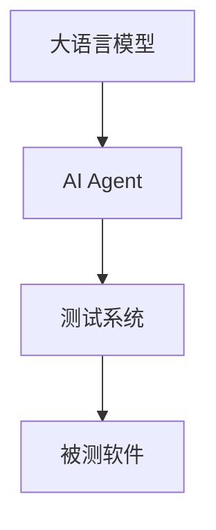

                 


# 自动化测试AI Agent：LLM在软件质量保证中的应用

> 关键词：自动化测试，LLM，AI Agent，软件质量保证，大语言模型，AI驱动测试

> 摘要：随着人工智能技术的快速发展，大语言模型（LLM）在软件开发和测试领域的应用日益广泛。本文深入探讨了LLM在自动化测试中的潜力，结合AI Agent的概念，分析了其在软件质量保证中的具体应用。通过详细的算法原理、系统设计和项目实战，展示了如何利用LLM提升测试效率和质量。

---

## 第一部分: 自动化测试与AI Agent的背景介绍

### 第1章: 自动化测试与AI Agent概述

#### 1.1 自动化测试的基本概念

- **1.1.1 什么是自动化测试**

  自动化测试是指通过工具和脚本自动执行测试用例，以验证软件的功能、性能和兼容性。与手动测试相比，自动化测试能够提高效率、降低成本，并支持频繁迭代的开发模式。

- **1.1.2 自动化测试的分类**

  - 单元测试：针对单个模块或函数的测试。
  - 集成测试：验证模块之间的接口和协作。
  - �界面前端测试：模拟用户操作，测试界面的响应。
  - 性能测试：评估系统在高负载下的表现。
  - 回归测试：在代码修改后，重新测试受影响的功能。

- **1.1.3 自动化测试的优缺点**

  - **优点**：提高效率，减少人工干预，支持持续集成和持续交付（CI/CD）。
  - **缺点**：测试用例设计复杂，维护成本高，难以覆盖所有场景。

#### 1.2 AI Agent的基本概念

- **1.2.1 什么是AI Agent**

  AI Agent是一种智能体，能够感知环境、自主决策并执行任务。它具备学习、推理和自适应能力，能够在复杂环境中完成复杂的任务。

- **1.2.2 AI Agent的核心特点**

  - **自主性**：能够独立决策。
  - **反应性**：能够实时感知环境并做出反应。
  - **目标导向**：基于目标驱动行为。
  - **学习能力**：能够通过经验改进性能。

- **1.2.3 AI Agent与传统自动化测试的区别**

  AI Agent不仅仅是工具，它具备自主决策能力，能够根据测试结果动态调整测试策略。

#### 1.3 LLM在软件质量保证中的应用

- **1.3.1 LLM的基本概念**

  LLM（Large Language Model）是基于深度学习的自然语言处理模型，能够理解和生成人类语言。它通过大量数据训练，具备强大的文本生成和理解能力。

- **1.3.2 LLM在软件测试中的潜力**

  - **测试用例生成**：根据需求文档生成测试用例。
  - **测试脚本优化**：自动优化测试脚本，提高执行效率。
  - **测试结果分析**：自动分析测试结果，识别潜在问题。

- **1.3.3 LLM与自动化测试的结合**

  LLM可以作为AI Agent的核心，通过自然语言处理能力，实现测试用例生成、脚本优化和结果分析的自动化。

#### 1.4 本章小结

本章介绍了自动化测试和AI Agent的基本概念，分析了LLM在软件质量保证中的潜力，并探讨了其与自动化测试的结合方式。

---

## 第二部分: LLM的核心概念与原理

### 第2章: LLM的核心概念与原理

#### 2.1 LLM的训练过程

- **2.1.1 数据预处理**

  数据预处理是训练LLM的关键步骤，包括数据清洗、分词和特征提取。

  ```mermaid
  graph TD
      Data-Preprocessing[数据预处理] --> Tokenization[分词]
      Tokenization --> Embedding[嵌入]
      Embedding --> Training[训练]
  ```

- **2.1.2 模型训练**

  LLM的训练过程包括前向传播和反向传播。通过优化损失函数，调整模型参数，使模型能够生成符合预期的输出。

  损失函数定义为：

  $$\text{loss} = -\sum_{i=1}^{n} \text{log} p(x_i|x_{<i})$$

  其中，$x_i$ 表示输入序列中的第 $i$ 个元素，$p(x_i|x_{<i})$ 是在已知前 $i-1$ 个元素的条件下，生成第 $i$ 个元素的概率。

- **2.1.3 模型调优**

  调优过程包括超参数调整和模型剪裁。超参数调整旨在优化模型性能，模型剪裁则是在保持性能的前提下，减少模型大小以提高推理速度。

#### 2.2 LLM的推理过程

- **2.2.1 输入处理**

  输入处理包括文本分词、嵌入生成和上下文解析。

- **2.2.2 模型推理**

  模型推理是LLM生成输出的关键步骤，包括解码和生成。

  解码过程如下：

  $$z = \text{decode}(x, y_{<t})$$

  其中，$x$ 是输入，$y_{<t}$ 是生成的序列，$z$ 是输出。

- **2.2.3 输出处理**

  输出处理包括结果解析、格式化和反馈优化。

#### 2.3 LLM与自动化测试的结合

- **2.3.1 测试用例生成**

  LLM可以根据需求文档生成测试用例，减少人工编写测试用例的时间和成本。

  例如，输入“测试登录功能”，LLM可以生成以下测试用例：

  1. 用户未登录时，点击“登录”按钮，跳转到登录页面。
  2. 用户输入正确的用户名和密码，点击登录，跳转到主页。
  3. 用户输入错误的密码，显示错误提示。

- **2.3.2 测试脚本优化**

  LLM可以通过分析测试结果，优化测试脚本的执行顺序和覆盖范围。

  例如，LLM可以识别冗余的测试用例，自动删除重复的测试步骤，提高测试效率。

- **2.3.3 测试结果分析**

  LLM可以自动分析测试结果，识别潜在问题并生成修复建议。

  例如，输入“测试用例执行失败”，LLM可以分析错误日志，生成可能的解决方案。

#### 2.4 核心概念对比表

| 概念       | 描述                                                                 |
|------------|----------------------------------------------------------------------|
| LLM        | 大语言模型，用于生成和理解人类语言的AI模型。                         |
| 自动化测试  | 通过工具自动执行测试用例，减少人工干预。                           |
| AI Agent   | 具有自主决策能力的智能体，能够执行复杂任务。                        |

#### 2.5 实体关系图（Mermaid）



---

## 第三部分: LLM在自动化测试中的算法原理

### 第3章: LLM的算法原理

#### 3.1 LLM的训练过程

- **3.1.1 数据预处理**

  数据预处理包括数据清洗、分词和特征提取。

  ```mermaid
  graph TD
      Data-Preprocessing[数据预处理] --> Tokenization[分词]
      Tokenization --> Embedding[嵌入]
      Embedding --> Training[训练]
  ```

- **3.1.2 模型训练**

  模型训练过程包括前向传播和反向传播。通过优化损失函数，调整模型参数，使模型能够生成符合预期的输出。

  损失函数定义为：

  $$\text{loss} = -\sum_{i=1}^{n} \text{log} p(x_i|x_{<i})$$

  其中，$x_i$ 表示输入序列中的第 $i$ 个元素，$p(x_i|x_{<i})$ 是在已知前 $i-1$ 个元素的条件下，生成第 $i$ 个元素的概率。

- **3.1.3 模型调优**

  调优过程包括超参数调整和模型剪裁。超参数调整旨在优化模型性能，模型剪裁则是在保持性能的前提下，减少模型大小以提高推理速度。

#### 3.2 LLM的推理过程

- **3.2.1 输入处理**

  输入处理包括文本分词、嵌入生成和上下文解析。

- **3.2.2 模型推理**

  模型推理是LLM生成输出的关键步骤，包括解码和生成。

  解码过程如下：

  $$z = \text{decode}(x, y_{<t})$$

  其中，$x$ 是输入，$y_{<t}$ 是生成的序列，$z$ 是输出。

- **3.2.3 输出处理**

  输出处理包括结果解析、格式化和反馈优化。

#### 3.3 LLM在自动化测试中的具体应用

- **测试用例生成**

  LLM可以根据需求文档生成测试用例，减少人工编写测试用例的时间和成本。

  例如，输入“测试登录功能”，LLM可以生成以下测试用例：

  1. 用户未登录时，点击“登录”按钮，跳转到登录页面。
  2. 用户输入正确的用户名和密码，点击登录，跳转到主页。
  3. 用户输入错误的密码，显示错误提示。

- **测试脚本优化**

  LLM可以通过分析测试结果，优化测试脚本的执行顺序和覆盖范围。

  例如，LLM可以识别冗余的测试用例，自动删除重复的测试步骤，提高测试效率。

- **测试结果分析**

  LLM可以自动分析测试结果，识别潜在问题并生成修复建议。

  例如，输入“测试用例执行失败”，LLM可以分析错误日志，生成可能的解决方案。

#### 3.4 数学模型与公式

- **损失函数**

  损失函数定义为：

  $$\text{loss} = -\sum_{i=1}^{n} \text{log} p(x_i|x_{<i})$$

  其中，$x_i$ 表示输入序列中的第 $i$ 个元素，$p(x_i|x_{<i})$ 是在已知前 $i-1$ 个元素的条件下，生成第 $i$ 个元素的概率。

- **解码过程**

  解码过程如下：

  $$z = \text{decode}(x, y_{<t})$$

  其中，$x$ 是输入，$y_{<t}$ 是生成的序列，$z$ 是输出。

---

## 第四部分: 系统分析与架构设计

### 第4章: 系统分析与架构设计

#### 4.1 问题场景介绍

- **测试需求分析**

  在实际开发中，测试人员需要编写大量测试用例，且测试用例的覆盖范围和质量直接影响软件质量。传统自动化测试工具依赖人工编写测试脚本，难以满足快速迭代的需求。

- **问题描述**

  随着软件复杂度的增加，测试用例的数量和复杂性也在增加，传统自动化测试工具难以应对复杂的测试场景，且测试用例的维护成本高。

- **问题解决**

  引入LLM作为AI Agent，能够自动生成和优化测试用例，提高测试效率和质量。

#### 4.2 系统功能设计

- **功能模块**

  - **测试用例生成模块**：根据需求文档生成测试用例。
  - **测试脚本优化模块**：优化测试脚本的执行顺序和覆盖范围。
  - **测试结果分析模块**：自动分析测试结果，识别潜在问题。

- **领域模型（Mermaid类图）**

  ```mermaid
  classDiagram
      class LLM {
          generateTestCases();
          optimizeTestScripts();
          analyzeTestResults();
      }
      class AI-Agent {
          receiveInput();
          processRequest();
          returnOutput();
      }
      class Test-System {
          executeTestCases();
          reportResults();
      }
      class Software {
          receiveTestCases();
          execute();
          returnResults();
      }
      LLM --> AI-Agent
      AI-Agent --> Test-System
      Test-System --> Software
  ```

- **系统架构设计（Mermaid架构图）**

  ```mermaid
  architecture
      LLM-Server
      AI-Agent-Client
      Test-System
      Software-UT
      [LLM API]
  ```

- **系统接口设计**

  - **LLM API**

    ```python
    class LLM_API:
        def generate_test_cases(self, input):
            pass
        def optimize_test_scripts(self, input):
            pass
        def analyze_test_results(self, input):
            pass
    ```

- **系统交互设计（Mermaid序列图）**

  ```mermaid
  sequenceDiagram
      participant LLM_API
      participant AI-Agent
      participant Test-System
      LLM_API -> AI-Agent: receive input
      AI-Agent -> LLM_API: process request
      LLM_API -> Test-System: execute test cases
      Test-System -> LLM_API: return results
      LLM_API -> AI-Agent: provide output
  ```

#### 4.3 本章小结

本章通过分析问题场景，设计了系统的功能模块和架构，并通过类图和序列图展示了系统的交互过程。

---

## 第五部分: 项目实战

### 第5章: 项目实战

#### 5.1 环境安装与配置

- **安装依赖**

  - Python 3.8+
  - TensorFlow 2.0+
  - PyTorch 1.8+
  - Hugging Face Transformers库

  ```bash
  pip install tensorflow torch transformers
  ```

#### 5.2 核心代码实现

- **LLM测试用例生成**

  ```python
  from transformers import AutoTokenizer, AutoModelForCausalLM
  model_name = "gpt2"
  tokenizer = AutoTokenizer.from_pretrained(model_name)
  model = AutoModelForCausalLM.from_pretrained(model_name)
  
  def generate_test_cases(input_text):
      inputs = tokenizer.encode(input_text, return_tensors="pt")
      outputs = model.generate(inputs, max_length=100, num_return_sequences=3)
      test_cases = [tokenizer.decode(output) for output in outputs]
      return test_cases
  
  test_cases = generate_test_cases("测试登录功能")
  print(test_cases)
  ```

- **测试脚本优化**

  ```python
  import subprocess

  def optimize_test_scripts(test_script_path):
      # 使用LLM分析测试脚本并生成优化建议
      # 这里简化为示例，实际需要集成LLM API
      pass

  optimize_test_scripts("test_script.py")
  ```

- **测试结果分析**

  ```python
  def analyze_test_results(result_log):
      # 使用LLM分析测试结果日志
      # 示例中简化为输出日志内容
      with open(result_log, "r") as f:
          print(f.read())
  
  analyze_test_results("test_results.log")
  ```

#### 5.3 代码应用解读与分析

- **测试用例生成模块**

  该模块通过LLM生成测试用例，减少了人工编写测试用例的时间。生成的测试用例可以根据需求文档自动调整，覆盖更多的测试场景。

- **测试脚本优化模块**

  该模块通过分析测试结果，优化测试脚本的执行顺序和覆盖范围。优化后的测试脚本能够提高测试效率，减少重复测试。

- **测试结果分析模块**

  该模块通过LLM分析测试结果，识别潜在问题并生成修复建议。这可以帮助开发人员快速定位问题，提高软件质量。

#### 5.4 实际案例分析与详细讲解

- **案例背景**

  某电商系统需要测试其登录功能。传统方法需要测试人员编写多个测试用例，且测试用例的质量和覆盖范围难以保证。

- **解决方案**

  引入LLM作为AI Agent，生成测试用例并优化测试脚本。

- **实施过程**

  1. 输入需求：“测试登录功能”。
  2. LLM生成测试用例。
  3. AI Agent优化测试脚本。
  4. 执行测试并分析结果。
  5. 输出测试报告和修复建议。

- **案例结果**

  测试用例生成效率提高，测试脚本执行时间缩短，潜在问题被及时发现和修复。

#### 5.5 本章小结

本章通过具体案例，展示了如何利用LLM实现自动化测试的各个环节，并分析了其在实际项目中的应用效果。

---

## 第六部分: 总结与展望

### 第6章: 总结与展望

#### 6.1 本章总结

- **主要成果**

  本文深入探讨了LLM在自动化测试中的应用，提出了基于AI Agent的测试方法，涵盖了测试用例生成、脚本优化和结果分析的全过程。

- **创新点**

  将LLM与自动化测试结合，提出了AI驱动的测试方法，能够显著提高测试效率和质量。

#### 6.2 未来展望

- **技术发展**

  随着LLM技术的不断进步，其在自动化测试中的应用将更加广泛。未来的LLM将具备更强的推理能力和更高的生成质量。

- **研究方向**

  - 更高效的LLM训练方法。
  - 更智能的测试用例生成策略。
  - 更精准的测试结果分析算法。

- **挑战与机遇**

  LLM在自动化测试中的应用面临数据隐私、模型性能和计算成本等挑战，同时也带来了提高软件质量保证效率的机遇。

#### 6.3 小结

本文通过详细的分析和实践，展示了LLM在自动化测试中的巨大潜力，并为未来的研究方向提供了参考。

---

## 第七部分: 附录

### 附录A: LLM训练代码示例

```python
from transformers import AutoTokenizer, AutoModelForCausalLM
import torch

model_name = "gpt2"
tokenizer = AutoTokenizer.from_pretrained(model_name)
model = AutoModelForCausalLM.from_pretrained(model_name)

inputs = tokenizer.encode("测试登录功能", return_tensors="pt")
outputs = model.generate(inputs, max_length=100, num_return_sequences=3)
test_cases = [tokenizer.decode(output) for output in outputs]
print(test_cases)
```

### 附录B: 测试结果分析代码示例

```python
import subprocess

def analyze_test_results(result_log):
    with open(result_log, "r") as f:
        print(f.read())

analyze_test_results("test_results.log")
```

---

## 作者：AI天才研究院（AI Genius Institute） & 禅与计算机程序设计艺术（Zen And The Art of Computer Programming）

---

**文章总结：** 本文系统地探讨了LLM在自动化测试中的应用，从理论到实践，详细介绍了如何利用AI Agent提升软件质量保证的效率和效果。通过具体案例和代码实现，展示了LLM在测试用例生成、脚本优化和结果分析中的巨大潜力。

