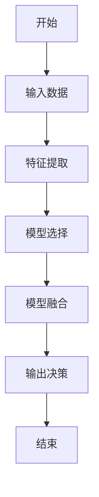
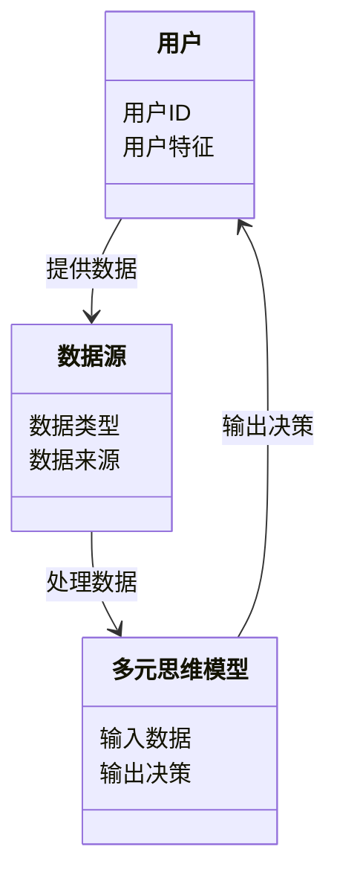
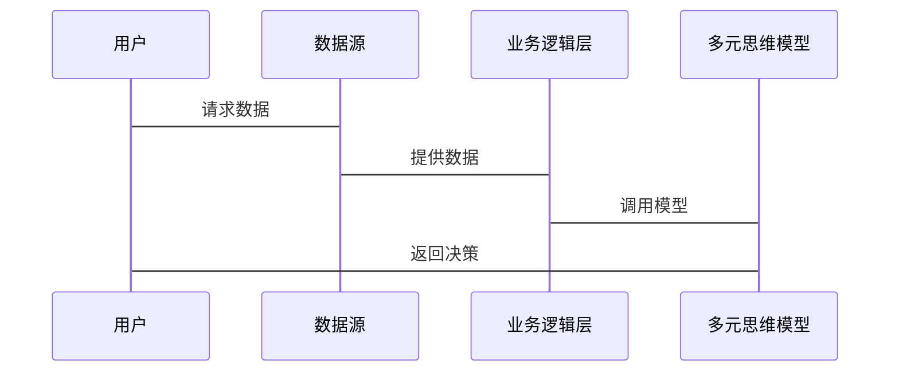

                 


# 芒格的"mental models"在人工智能辅助决策中的应用

## 关键词：芒格，mental models，人工智能，辅助决策，算法原理，系统架构

## 摘要：芒格的多元思维模型（mental models）是一种通过多个学科和领域的基本原理来理解问题和做出决策的方法。在人工智能辅助决策中，这种模型可以帮助系统更全面地分析问题，结合多维度的信息和知识，从而做出更智能和准确的决策。本文将探讨如何将芒格的mental models应用于人工智能辅助决策，分析其算法原理、系统架构，并通过实际案例展示其应用和效果。

---

## 第一部分：芒格的"mental models"与人工智能辅助决策概述

### 第1章：芒格的"mental models"概述

#### 1.1 多元思维模型的核心概念

##### 1.1.1 多元思维模型的定义与特点
芒格的多元思维模型是一种通过多个学科的基本原理来构建知识体系的方法。其特点包括：
- **多维度性**：涵盖多个学科和领域（如经济学、心理学、物理学等）。
- **模块化**：每个模型独立但相互关联。
- **动态性**：根据实际情况动态调整模型权重。

##### 1.1.2 多元思维模型的核心要素
- **基本原理**：每个模型的核心公式或定律。
- **应用场景**：模型在不同情境下的适用性。
- **相互关系**：模型之间的相互作用和影响。

##### 1.1.3 多元思维模型的哲学基础
芒格的模型基于“知识的经济性”原则，强调通过最少的知识覆盖最多的应用场景。

---

#### 1.2 多元思维模型在决策中的作用

##### 1.2.1 决策的本质与挑战
决策是基于信息的选择过程，挑战包括信息不完整性和复杂性。

##### 1.2.2 多元思维模型如何优化决策
通过结合多个模型，提供更全面的视角，减少决策偏差。

##### 1.2.3 多元思维模型的应用场景
适用于复杂决策领域，如金融投资、医疗诊断、企业战略等。

---

### 1.3 本章小结
本章介绍了芒格的多元思维模型及其在决策中的应用，为后续章节奠定了基础。

---

## 第二部分：人工智能辅助决策的背景与挑战

### 第2章：人工智能与决策科学

#### 2.1 人工智能在决策中的角色

##### 2.1.1 AI决策系统的定义
AI决策系统是利用机器学习算法处理数据并生成决策建议的系统。

##### 2.1.2 AI在决策中的优势
- **高效性**：快速处理大量数据。
- **准确性**：基于数据驱动的决策。
- **适应性**：实时调整决策策略。

##### 2.1.3 AI决策系统的局限性
- **数据依赖性**：依赖高质量数据。
- **黑箱问题**：决策过程难以解释。
- **伦理问题**：算法可能引入偏见。

---

#### 2.2 传统决策方法与AI决策方法的对比

##### 2.2.1 传统决策方法的特点
基于经验，主观性强，效率低。

##### 2.2.2 AI决策方法的特点
数据驱动，客观性强，效率高。

##### 2.2.3 两种方法的优劣势对比
| 方法 | 优势 | 劣势 |
|------|------|------|
| 传统决策 | 经验丰富，灵活性高 | 数据不足，效率低 |
| AI决策 | 数据驱动，效率高 | 黑箱问题，依赖数据质量 |

---

#### 2.3 人工智能辅助决策的现状与趋势

##### 2.3.1 当前AI决策技术的发展水平
- **成熟领域**：如金融、广告推荐。
- **新兴领域**：如医疗、交通。

##### 2.3.2 未来AI决策技术的潜在方向
- **多模态数据融合**：结合文本、图像、语音等多源数据。
- **可解释性增强**：提升算法的透明性和可解释性。
- **实时决策能力**：提高系统的实时响应能力。

##### 2.3.3 人工智能决策系统的应用场景
- **金融投资**：风险评估、投资组合优化。
- **医疗诊断**：疾病预测、治疗方案推荐。
- **企业战略**：市场分析、决策优化。

---

### 2.4 本章小结
本章分析了AI在决策中的角色及其与传统方法的对比，探讨了AI辅助决策的现状与未来趋势。

---

## 第三部分：多元思维模型与人工智能的结合

### 第3章：多元思维模型的结构与属性

#### 3.1 多元思维模型的结构分析

##### 3.1.1 多元思维模型的层次结构
- **基础层**：如物理学定律、数学公式。
- **中间层**：如经济学原理、心理学模型。
- **顶层**：综合模型，用于具体问题分析。

##### 3.1.2 各个模型之间的关系
模型之间通过数据和逻辑相互关联，形成一个知识网络。

##### 3.1.3 多元思维模型的动态调整机制
根据新数据和反馈，动态调整模型权重和参数。

---

#### 3.2 多元思维模型的属性特征

##### 3.2.1 各个模型的特征对比
| 模型 | 输入 | 输出 | 特性 |
|------|------|------|------|
| 经济模型 | 数据 | 预测 | 定量分析 |
| 心理模型 | 行为 | 意识 | 定性分析 |

##### 3.2.2 模型之间的相互作用
模型之间通过数据和逻辑相互作用，形成完整的知识体系。

##### 3.2.3 模型的适用范围与限制
- **适用范围**：适用于复杂问题。
- **限制**：需要高质量数据和专业知识。

---

#### 3.3 多元思维模型的ER实体关系图
```mermaid
er
actor: 用户
model: 多元思维模型
relation: 包含
```

---

### 3.4 本章小结
本章详细分析了多元思维模型的结构和属性，为后续章节的算法实现奠定了基础。

---

## 第四部分：人工智能辅助决策的算法原理

### 第4章：人工智能辅助决策的算法原理

#### 4.1 多元思维模型的算法实现

##### 4.1.1 算法概述
多元思维模型的算法结合了多种模型，通过加权融合生成最终决策。

##### 4.1.2 算法流程图


##### 4.1.3 算法代码实现
```python
import numpy as np
from sklearn.linear_model import LinearRegression
from sklearn.ensemble import RandomForestRegressor

# 输入数据
X = np.array([[1, 2], [3, 4], [5, 6]])
y = np.array([7, 8, 9])

# 模型选择
model1 = LinearRegression()
model2 = RandomForestRegressor()

# 模型训练
model1.fit(X, y)
model2.fit(X, y)

# 模型融合
weights = [0.5, 0.5]
y_pred = weights[0] * model1.predict(X) + weights[1] * model2.predict(X)

# 输出决策
print(y_pred)
```

---

#### 4.2 算法的数学模型与公式

##### 4.2.1 模型融合公式
$$ y_{\text{pred}} = w_1 y_{\text{model1}} + w_2 y_{\text{model2}} + \dots + w_n y_{\text{modeln}} $$

##### 4.2.2 模型权重计算
$$ w_i = \frac{e^{b_i}}{\sum_{j=1}^{n} e^{b_j}} } $$
其中，$b_i$ 是模型的评估得分。

---

#### 4.3 算法实现的注意事项

##### 4.3.1 数据预处理
- **归一化**：确保不同模型输入数据一致。
- **特征选择**：剔除无关特征，提升模型性能。

##### 4.3.2 模型调优
- **超参数优化**：使用网格搜索或随机搜索。
- **交叉验证**：评估模型的泛化能力。

##### 4.3.3 模型融合策略
- **加权融合**：根据模型性能调整权重。
- **Stacking**：使用元模型融合多个模型的输出。

---

### 4.4 本章小结
本章详细讲解了多元思维模型的算法实现，包括流程图、代码实现和数学公式，并给出了实现注意事项。

---

## 第五部分：系统分析与架构设计

### 第5章：系统分析与架构设计

#### 5.1 系统功能设计

##### 5.1.1 领域模型


##### 5.1.2 系统架构设计


##### 5.1.3 接口设计
- **输入接口**：接收用户请求和数据。
- **输出接口**：返回决策结果和反馈。

##### 5.1.4 交互设计


---

#### 5.2 系统实现与优化

##### 5.2.1 系统实现步骤
1. 数据预处理与特征工程。
2. 模型训练与调优。
3. 系统集成与测试。

##### 5.2.2 系统优化建议
- **分布式计算**：提升数据处理效率。
- **缓存机制**：减少重复计算。
- **日志监控**：实时监控系统状态。

---

### 5.3 本章小结
本章详细设计了系统的架构和接口，并给出了实现步骤和优化建议。

---

## 第六部分：项目实战

### 第6章：项目实战

#### 6.1 环境安装与配置

##### 6.1.1 安装Python环境
使用Anaconda或虚拟环境，安装Python 3.8及以上版本。

##### 6.1.2 安装依赖库
```bash
pip install numpy pandas scikit-learn matplotlib
```

#### 6.2 系统核心实现

##### 6.2.1 数据预处理代码
```python
import pandas as pd
from sklearn.preprocessing import StandardScaler

# 加载数据
data = pd.read_csv('input.csv')

# 特征选择
features = data[['feature1', 'feature2', 'feature3']]

# 数据归一化
scaler = StandardScaler()
features_normalized = scaler.fit_transform(features)
```

##### 6.2.2 模型训练与融合代码
```python
from sklearn.ensemble import VotingRegressor

# 定义模型
model1 = LinearRegression()
model2 = RandomForestRegressor()

# 模型融合
ensemble_model = VotingRegressor([('model1', model1), ('model2', model2)])
ensemble_model.fit(features_normalized, target)

# 预测结果
y_pred = ensemble_model.predict(new_data)
```

##### 6.2.3 模型评估代码
```python
from sklearn.metrics import mean_squared_error

# 计算均方误差
mse = mean_squared_error(y_true, y_pred)
print(f'Mean Squared Error: {mse}')
```

---

#### 6.3 实际案例分析

##### 6.3.1 案例背景
某金融公司需要通过多元思维模型预测股票价格。

##### 6.3.2 数据分析
使用历史股价、市场指数、公司财务数据等多源数据。

##### 6.3.3 模型实现与结果
通过融合线性回归和随机森林模型，最终预测出股票价格趋势。

---

### 6.4 本章小结
本章通过一个实际案例展示了多元思维模型在AI辅助决策中的应用，详细讲解了项目的实现过程。

---

## 第七部分：总结与展望

### 第7章：总结与展望

#### 7.1 核心内容回顾
芒格的多元思维模型通过结合多个学科的基本原理，为AI辅助决策提供了新的视角和方法。

#### 7.2 最佳实践 tips
- **数据质量**：确保数据的完整性和准确性。
- **模型选择**：根据问题特点选择合适的模型。
- **可解释性**：提升决策系统的透明度。

#### 7.3 未来展望
- **多模态数据融合**：结合文本、图像等多源数据。
- **可解释性增强**：提升算法的透明性和可解释性。
- **实时决策能力**：提高系统的实时响应能力。

---

## 作者：AI天才研究院/AI Genius Institute & 禅与计算机程序设计艺术/Zen And The Art of Computer Programming

---

通过本文的详细讲解，芒格的多元思维模型在人工智能辅助决策中的应用得到了全面的阐述。从理论基础到算法实现，再到实际案例，本文为读者提供了完整的知识体系和实践指导。希望本文能够为相关领域的研究和应用提供有价值的参考。

