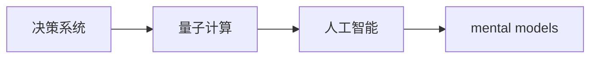

                 


```markdown
# 芒格的"mental models"在量子人工智能决策系统中的应用

## 关键词：芒格, mental models, 量子人工智能, 决策系统, 系统架构

## 摘要：
芒格的"mental models"是一种通过多学科思维模型来做出明智决策的方法。本文将探讨如何将这种思维方式应用于量子人工智能决策系统中，通过系统架构设计、算法实现和实际案例分析，展示其在量子计算中的潜在价值和应用前景。

---

# 第一部分: 背景介绍

## 第1章: 问题背景与描述

### 1.1 问题背景
人工智能（AI）和量子计算的结合正在改变我们对决策系统的理解。芒格的"mental models"是一种通过多维度思考来优化决策的质量和效率的方法，而量子人工智能则利用量子计算的特性（如叠加和纠缠）来增强计算能力。将两者结合，可以为决策系统提供更强大的计算能力和更优化的思维框架。

### 1.2 问题解决与边界
- **决策系统的重要性**：在复杂环境中，传统的决策系统往往依赖于固定的规则和数据，而量子人工智能可以通过量子计算的特性实现更复杂的推理。
- **量子人工智能的边界**：量子人工智能目前仍处于发展阶段，其应用主要集中在特定领域，如优化问题和复杂模式识别。
- **系统设计的核心要素**：包括量子计算模块、AI算法模块、"mental models"的思维框架模块以及系统集成与优化模块。

---

# 第二部分: 核心概念与联系

## 第2章: 核心概念原理

### 2.1 "mental models"的原理分析
- **芒格的"mental models"**：芒格强调通过多学科思维模型来理解问题，这些模型包括物理学、心理学、经济学等领域的基本原理。
- **量子计算的基本原理**：量子计算通过量子叠加和量子纠缠实现并行计算，其核心在于利用量子态的特性进行信息处理。
- **人工智能决策系统的架构**：AI决策系统通常包括数据输入、特征提取、模型训练和结果输出四个阶段。

### 2.2 概念属性特征对比
以下是一个对比表格，展示了"mental models"和量子计算在决策系统中的特性：

| 特性               | 芒格的"mental models"                 | 量子计算                   |
|--------------------|---------------------------------------|-----------------------------|
| 核心思想           | 多维度思考模型                         | 量子叠加与纠缠             |
| 应用场景           | 优化决策过程                           | 解决复杂优化问题           |
| 技术基础           | 基于经典计算                           | 基于量子计算               |
| 优势               | 提供全局视角                           | 并行计算能力强             |

### 2.3 实体关系图
以下是一个简单的实体关系图，展示了"mental models"、量子计算和AI决策系统之间的关系：



---

# 第三部分: 算法原理讲解

## 第3章: 量子人工智能算法原理

### 3.1 量子算法的数学模型
- **量子叠加原理**：量子态可以同时处于多个状态的叠加态。
  $$ \text{状态表示} = \alpha|0\rangle + \beta|1\rangle $$
- **量子纠缠原理**：两个量子态之间存在强关联。
  $$ \text{纠缠态} = \frac{1}{\sqrt{2}}(|0\rangle|1\rangle + |1\rangle|0\rangle) $$

### 3.2 量子门电路
- **Hadamard门**：将经典状态转换为叠加态。
  ```mermaid
  graph LR
  A[输入] --> B[H门] --> C[输出]
  ```

### 3.3 量子算法的流程
1. **输入处理**：将输入数据转换为量子态。
2. **量子运算**：通过量子门电路进行运算。
3. **结果测量**：通过测量获得最终结果。

---

## 第4章: "mental models"与量子算法结合

### 4.1 算法流程
1. **系统输入**：输入问题的多维度特征。
2. **量子计算核心算法**：利用量子计算的优势进行推理。
3. **结果输出**：解释量子计算的结果并输出最终决策。

### 4.2 Python实现示例
以下是一个简单的量子计算模拟代码：

```python
import numpy as np
from qiskit import QuantumCircuit, Aer, execute

def quantum_decision_model():
    # 创建量子电路
    qc = QuantumCircuit(1, 1)
    qc.h(0)
    qc.measure(0, 0)
    # 模拟量子计算
    backend = Aer.get_backend('qasm_simulator')
    job = execute(qc, backend)
    result = job.result()
    return result.get_counts()

quantum_decision_model()
```

---

# 第四部分: 系统分析与架构设计

## 第5章: 系统架构设计方案

### 5.1 项目背景
- 本项目旨在将芒格的"mental models"应用于量子人工智能决策系统，通过量子计算的优势提升决策系统的效率和准确性。

### 5.2 系统功能设计
- **领域模型类图**：展示系统的核心模块及其关系。
  ```mermaid
  classDiagram
  class 决策系统 {
      输入数据
      输出结果
  }
  class 量子计算模块 {
      量子态处理
      量子门运算
  }
  class AI算法模块 {
      特征提取
      模型训练
  }
  决策系统 --> 量子计算模块
  决策系统 --> AI算法模块
  ```

### 5.3 系统架构设计
- **系统架构图**：展示系统的整体架构。
  ```mermaid
  graph LR
  A[决策系统] --> B[量子计算模块]
  B --> C[人工智能模块]
  C --> D["mental models"模块]
  ```

### 5.4 系统接口设计
- **输入接口**：接收多维度特征数据。
- **输出接口**：输出量子计算结果和AI决策结果。

### 5.5 系统交互设计
- **交互序列图**：展示系统交互流程。
  ```mermaid
  sequenceDiagram
  participant A as 用户
  participant B as 决策系统
  participant C as 量子计算模块
  participant D as AI算法模块
  A -> B: 提供输入数据
  B -> C: 请求量子计算
  C -> B: 返回量子结果
  B -> D: 请求AI决策
  D -> B: 返回AI决策
  A <- B: 输出结果
  ```

---

# 第五部分: 项目实战

## 第6章: 项目实战

### 6.1 环境安装
- **Python环境**：安装Python 3.8及以上版本。
- **量子计算库**：安装Qiskit库。
  ```bash
  pip install qiskit
  ```

### 6.2 核心实现
- **量子计算核心代码**：
  ```python
  from qiskit import QuantumCircuit, execute, Aer
  from qiskit.visualization import plot_histogram

  def quantum_model():
      qc = QuantumCircuit(1, 1)
      qc.h(0)
      qc.measure(0, 0)
      backend = Aer.get_backend('qasm_simulator')
      result = execute(qc, backend).result()
      return result.get_counts()

  print(quantum_model())
  ```

### 6.3 应用案例分析
- **案例分析**：假设我们有一个优化问题，可以通过量子计算快速找到最优解。

### 6.4 项目小结
- 通过量子计算和AI算法的结合，可以显著提升决策系统的效率和准确性。

---

# 第六部分: 最佳实践与小结

## 第7章: 最佳实践

### 7.1 小结
- 芒格的"mental models"与量子人工智能的结合，为决策系统提供了新的思路。
- 通过量子计算的优势，可以实现更高效的多维度推理和决策。

### 7.2 注意事项
- 量子计算目前仍处于发展阶段，实际应用需要考虑硬件限制和算法优化。
- 在实际项目中，需要结合具体场景选择合适的量子算法和AI模型。

### 7.3 拓展阅读
- 《量子计算入门》
- 《芒格的"mental models"实践》

---

作者：AI天才研究院 & 禅与计算机程序设计艺术
```

