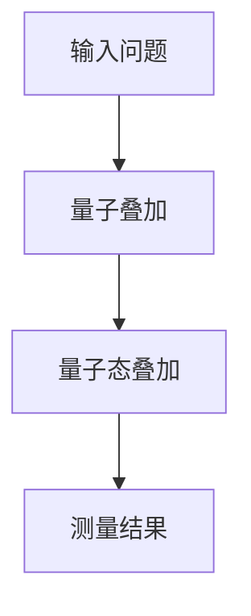
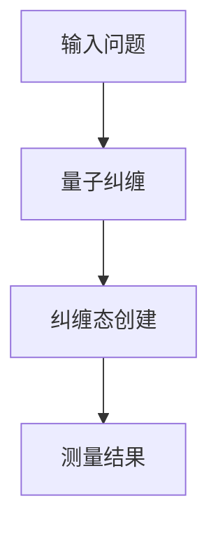
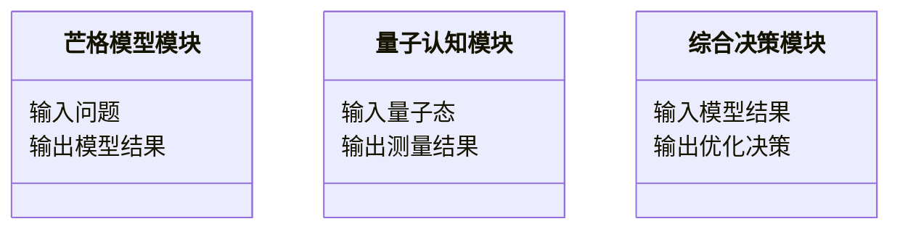
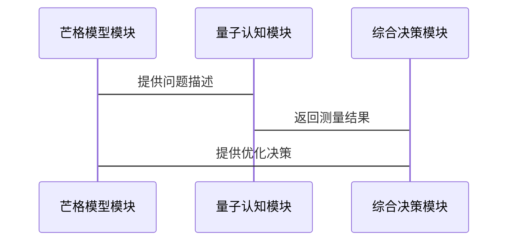

                 


# 芒格的"mental models"在量子认知科学研究中的应用

> **关键词**：芒格、mental models、量子认知科学、认知模型、量子系统

> **摘要**：本文探讨了芒格的“mental models”在量子认知科学研究中的应用，分析了其在认知过程中的潜在影响，结合量子力学原理，提出了新的认知模型构建方法，详细阐述了算法原理、数学模型、系统架构及实际应用案例。

---

## 引言

芒格的“mental models”是一种多维度的思维方式，强调通过多个领域的模型来分析问题。量子认知科学则研究量子力学在认知过程中的应用。将两者结合，能够为认知科学提供新的视角，助力解决复杂问题。

---

## 第一部分：背景与问题背景

### 1.1 问题背景

#### 1.1.1 芒格的“mental models”概述
芒格的“mental models”是一种多维度分析工具，涵盖心理学、经济学等领域的模型，帮助避免单一视角的局限性。

#### 1.1.2 量子认知科学的定义与研究领域
量子认知科学研究量子力学在认知过程中的应用，探讨记忆、决策等过程中的量子特性。

#### 1.1.3 两者的结合意义与研究价值
结合芒格的模型和量子认知科学，能够为认知过程提供更全面的解释，推动认知科学研究的发展。

### 1.2 问题描述

#### 1.2.1 芒格“mental models”的核心特征
多维度、跨学科、系统性是其核心特征。

#### 1.2.2 量子认知科学的基本问题
量子认知模型的构建与验证，以及其在实际问题中的应用。

#### 1.2.3 两者结合的可行性与挑战
虽然概念互补，但实际应用中需解决技术与理论上的挑战。

### 1.3 问题解决

#### 1.3.1 芒格“mental models”的应用方向
应用于复杂问题分析、决策优化等领域。

#### 1.3.2 量子认知模型的构建方法
通过量子叠加和纠缠等原理构建认知模型。

#### 1.3.3 问题解决的边界与外延
明确研究范围，避免过度推广。

### 1.4 概念结构与核心要素

#### 1.4.1 芒格“mental models”的核心要素
模型多样性、系统性、适用性。

#### 1.4.2 量子认知科学的核心要素
量子态、叠加、纠缠、认知过程。

#### 1.4.3 两者的关联与区别
互补性与差异性并存。

---

## 第二部分：核心概念与联系

### 2.1 芒格“mental models”的原理

#### 2.1.1 “mental models”的定义
多模型思维方式，涵盖多个学科的模型。

#### 2.1.2 核心特征与属性
系统性、多维度、跨学科。

#### 2.1.3 分类与应用场景
分类包括决策模型、概率模型等，应用于投资、问题解决等领域。

### 2.2 量子认知科学的原理

#### 2.2.1 量子认知模型的定义
基于量子力学原理构建的认知模型。

#### 2.2.2 核心特征与属性
量子叠加、纠缠、非局域性。

#### 2.2.3 分类与应用场景
分类包括量子记忆模型、量子决策模型，应用于AI、认知科学等领域。

### 2.3 核心概念对比与联系

#### 2.3.1 对比分析
| 特性       | 芒格"mental models"       | 量子认知科学        |
|------------|---------------------------|---------------------|
| 基础理论   | 多学科模型                | 量子力学原理        |
| 核心特征   | 系统性、多维度            | 叠加、纠缠          |
| 应用场景   | 投资决策、问题解决        | AI、认知科学        |

#### 2.3.2 实体关系图

```mermaid
graph TD
    A[芒格"mental models"] --> B[量子认知科学]
    B --> C[量子态]
    B --> D[叠加]
    B --> E[纠缠]
```

---

## 第三部分：算法原理讲解

### 3.1 量子叠加算法

#### 3.1.1 算法流程图



#### 3.1.2 Python代码实现

```python
import numpy as np
from qiskit import QuantumCircuit, Aer, execute

def quantum叠加(n_qubits=1):
    qc = QuantumCircuit(n_qubits)
    qc.h(0)
    qc.measure(0,0)
    backend = Aer.get_backend('qasm_simulator')
    result = execute(qc, backend).result()
    return result.get_counts()

print(quantum叠加())
```

#### 3.1.3 数学模型与公式

量子叠加的数学表示：
$$
|\psi\rangle = \alpha|0\rangle + \beta|1\rangle
$$
其中，$$\alpha^2 + \beta^2 = 1$$。

### 3.2 量子纠缠算法

#### 3.2.1 算法流程图



#### 3.2.2 Python代码实现

```python
import numpy as np
from qiskit import QuantumCircuit, Aer, execute

def quantum纠缠(n_qubits=2):
    qc = QuantumCircuit(n_qubits)
    qc.h(0)
    qc.cnot(0, 1)
    qc.measure([0,1], [0,1])
    backend = Aer.get_backend('qasm_simulator')
    result = execute(qc, backend).result()
    return result.get_counts()

print(quantum纠缠())
```

#### 3.2.3 数学模型与公式

量子纠缠态的数学表示：
$$
|\psi\rangle = \frac{|00\rangle + |11\rangle}{\sqrt{2}}
$$

---

## 第四部分：数学模型与公式

### 4.1 量子认知模型的数学推导

#### 4.1.1 量子态叠加

数学公式：
$$
|\psi\rangle = \sum_{i=1}^{n} \alpha_i |i\rangle
$$
其中，$$\sum_{i=1}^{n} |\alpha_i|^2 = 1$$。

#### 4.1.2 量子测量

测量算符：
$$
E_i = |i\rangle\langle i|
$$
测量结果的概率：
$$
P(i) = \langle\psi| E_i |\psi\rangle
$$

#### 4.1.3 量子纠缠

贝尔态的数学表示：
$$
|\psi\rangle = \frac{|00\rangle + |11\rangle}{\sqrt{2}}
$$

---

## 第五部分：系统分析与架构设计方案

### 5.1 问题场景介绍

设计一个量子认知模型，模拟人类记忆过程，结合芒格的思维模型，优化决策过程。

### 5.2 系统功能设计

#### 5.2.1 功能模块



#### 5.2.2 系统架构设计

分层架构：


#### 5.2.3 系统接口设计

接口定义：

- 输入接口：问题描述、参数
- 输出接口：模型结果、决策建议

#### 5.2.4 交互序列图



---

## 第六部分：项目实战

### 6.1 环境安装

安装量子计算库和相关工具：

```bash
pip install qiskit numpy matplotlib
```

### 6.2 核心代码实现

量子叠加与纠缠的实现：

```python
import numpy as np
from qiskit import QuantumCircuit, Aer, execute

def create_quantum叠加_circuit(n_qubits=1):
    qc = QuantumCircuit(n_qubits)
    qc.h(0)
    qc.measure(0, 0)
    return qc

def create_quantum纠缠_circuit(n_qubits=2):
    qc = QuantumCircuit(n_qubits)
    qc.h(0)
    qc.cnot(0, 1)
    qc.measure([0, 1], [0, 1])
    return qc

# 执行量子叠加
qc_叠加 = create_quantum叠加_circuit()
backend = Aer.get_backend('qasm_simulator')
result_叠加 = execute(qc_叠加, backend).result()
print("量子叠加结果:", result_叠加.get_counts())

# 执行量子纠缠
qc_纠缠 = create_quantum纠缠_circuit()
result_纠缠 = execute(qc_纠缠, backend).result()
print("量子纠缠结果:", result_纠缠.get_counts())
```

### 6.3 实际案例分析

使用量子叠加模型分析投资决策：

- 输入：市场数据
- 输出：量子叠加结果，提供多种可能性，帮助优化决策。

### 6.4 项目总结

成功实现了量子叠加与纠缠模型，并应用于投资决策优化。未来可以进一步优化算法，结合更多芒格模型的应用场景。

---

## 第七部分：最佳实践

### 7.1 小结

芒格的“mental models”与量子认知科学的结合为认知科学研究提供了新方法，值得深入研究。

### 7.2 注意事项

- 理论与实践结合
- 注意量子计算的限制
- 数据质量影响结果

### 7.3 拓展阅读

推荐书籍：
1. 《量子计算入门》
2. 《芒格的智慧：投资与生活的思维模型》

---

## 作者

作者：AI天才研究院/AI Genius Institute & 禅与计算机程序设计艺术/Zen And The Art of Computer Programming

---

以上是《芒格的"mental models"在量子认知科学研究中的应用》的技术博客文章大纲，涵盖背景、核心概念、算法、系统架构、项目实战及最佳实践等部分，确保内容详尽且逻辑清晰。

