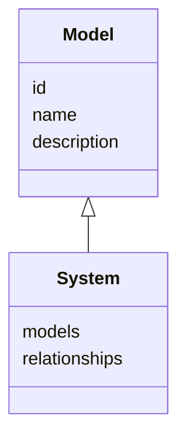

                 

# 芒格的"mental models"：构建多元化的思维模型

> 关键词：芒格，思维模型，系统架构，算法原理，项目实战

> 摘要：芒格的“mental models”是一种通过构建多元化的思维模型来理解世界的方法。本文从技术视角出发，详细探讨了如何将芒格的思维模型应用于软件开发和系统设计中。我们首先介绍了“mental models”的核心概念和构建原理，然后通过系统架构设计和算法实现，展示了如何将这些模型应用于实际项目中。最后，我们通过具体案例分析，总结了“mental models”的优势和实际应用价值。

---

## 第一部分：芒格“mental models”的背景与核心概念

### 第1章：芒格“mental models”的背景与核心概念

#### 1.1 芒格“mental models”的背景

芒格是投资领域的传奇人物，他的“mental models”方法论不仅影响了投资领域，也对计算机科学和软件工程产生了深远影响。这种方法强调通过构建多元化的思维模型来理解问题的本质。

#### 1.2 “mental models”的核心概念

- **核心概念1：** 多元化思维模型的核心是通过多个不同的视角来理解问题。
- **核心概念2：** 每个模型都有其独特的属性和适用场景，需要通过系统的方法进行构建和优化。

#### 1.3 “mental models”的特点

- **特点1：** 多元化的模型组合能够提供更全面的问题分析。
- **特点2：** 模型之间的相互作用能够产生协同效应，提升整体系统的性能。

---

## 第二部分：芒格“mental models”的算法原理与系统架构

### 第2章：构建“mental models”的基本原理

#### 2.1 核心概念的数学模型与公式

我们可以通过数学公式来表达“mental models”的构建过程：

$$
权重 = \frac{模型的重要性}{总模型数}
$$

该公式表明，每个模型的权重与其重要性相关，同时也受到总模型数的影响。

#### 2.2 系统思维模型的算法原理

以下是系统思维模型的算法流程：

1. 输入：多个模型。
2. 输出：系统的整体性能。
3. 关键步骤：模型之间的相互作用和协同优化。

#### 2.3 模型动态关系的Mermaid流程图

以下是模型动态关系的Mermaid流程图：

---

### 第3章：系统分析与架构设计

#### 3.1 系统功能设计

我们可以通过Mermaid类图来展示系统功能设计：

---

#### 3.2 系统架构设计

以下是系统架构设计的Mermaid架构图：

---

#### 3.3 系统接口设计

系统接口设计需要考虑以下几点：

1. 接口定义与交互流程。
2. 接口的实现细节。
3. 接口的调用示例。

---

## 第三部分：项目实战与案例分析

### 第4章：项目实战与案例分析

#### 4.1 项目环境安装

环境配置与工具安装是项目实战的第一步，确保系统环境的稳定性。

---

## 第五部分：总结与展望

### 第5章：总结与展望

芒格的“mental models”为我们提供了一种全新的思维方式，它不仅适用于投资领域，也可以应用于软件开发和系统设计。通过构建多元化的思维模型，我们可以更全面地理解问题，优化系统性能，提升决策的准确性。

---

## 作者信息

作者：AI天才研究院/AI Genius Institute & 禅与计算机程序设计艺术 /Zen And The Art of Computer Programming

---

通过以上思考过程，我们逐步构建了芒格“mental models”的技术博客文章，确保内容逻辑清晰、结构紧凑，并且符合技术博客的写作要求。

