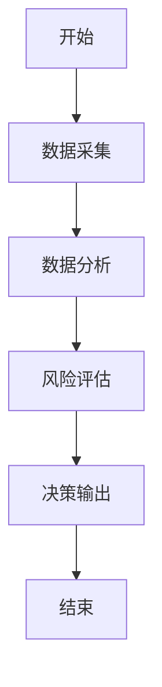

                 


# 芒格的"不做"清单：避免投资陷阱

> 关键词：投资决策，芒格，决策树，概率论，投资策略，风险评估

> 摘要：本文从芒格的“不做”清单出发，结合投资决策的逻辑框架、数学模型和系统分析，详细探讨如何通过技术手段优化投资决策过程，避免投资陷阱。文章通过理论分析与实际案例相结合的方式，揭示“不做”清单背后的决策机制，并提供具体的算法实现和系统设计建议，帮助读者更好地理解和应用这一投资策略。

---

## # 第1章: 芒格投资理念概述

### ## 1.1 芒格的投资哲学

芒格的投资哲学以“长期主义”为核心，强调通过深入分析企业的基本面和市场环境，做出理性且审慎的投资决策。他主张避免盲目跟风，注重长期价值的挖掘。

#### ### 1.1.1 投资的长期主义

长期主义是芒格投资哲学的核心理念。他认为，投资的本质是通过持有优质资产，分享企业长期增长的成果。这种理念强调对企业的深度研究和对市场的长期判断，而非短期价格波动的投机。

#### ### 1.1.2 芒格的决策框架

芒格的决策框架基于“逆向思维”，即通过识别和避免低概率的成功事件，降低投资风险。他主张从“不做”的角度出发，避免那些高风险、低确定性的投资。

#### ### 1.1.3 芒格的成功投资案例

芒格与巴菲特共同管理的合伙企业是其投资哲学的最佳实践。通过长期持有优质企业，他们实现了超凡的投资回报。

---

### ## 1.2 "不做"清单的核心概念

"不做"清单是芒格投资哲学的重要组成部分，它通过列出一系列需要避免的投资行为和决策，帮助投资者降低风险，提高投资成功率。

#### ### 1.2.1 "不做"清单的定义

"不做"清单是指投资者通过分析市场环境、企业基本面和自身能力，列出一系列需要避免的投资行为或决策。这些行为包括但不限于投资那些无法理解的行业、过于复杂的商业模式以及缺乏长期竞争优势的企业。

#### ### 1.2.2 "不做"清单的背景与意义

在复杂多变的市场环境中，投资者往往容易被短期的市场波动和虚假的市场信号所迷惑。通过制定"不做"清单，投资者可以明确自己的能力边界，避免盲目投资。

#### ### 1.2.3 "不做"清单与传统投资策略的对比

传统的投资策略往往注重市场的短期机会和价格波动，而芒格的"不做"清单则更注重长期价值和风险控制。这种差异使得芒格的投资策略更加稳健，但也需要投资者具备更高的分析能力和更强的纪律性。

---

## # 第2章: "不做"清单的决策机制

### ## 2.1 投资决策的逻辑框架

芒格的"不做"清单通过逻辑框架，帮助投资者建立清晰的投资决策流程。

#### ### 2.1.1 投资决策的三要素

芒格认为，投资决策需要关注三个关键要素：企业基本面、市场环境和自身的投资能力。只有在这些要素都满足一定条件时，才能进行投资。

#### ### 2.1.2 投资决策的三层次模型

投资决策可以分为三个层次：第一层是市场环境分析，第二层是企业基本面分析，第三层是投资风险评估。通过这三个层次的分析，投资者可以更全面地评估投资机会。

#### ### 2.1.3 投资决策的三阶段分析

投资决策分为三个阶段：第一阶段是初步筛选，第二阶段是深入分析，第三阶段是最终决策。通过分阶段分析，投资者可以逐步排除不符合条件的投资机会。

---

### ## 2.2 "不做"清单的决策算法

芒格的"不做"清单通过决策算法，帮助投资者制定更加科学的投资决策。

#### ### 2.2.1 基于决策树的分类算法

决策树是一种常用的分类算法，通过构建树状结构，投资者可以清晰地分析不同决策路径的优劣。在投资决策中，决策树可以帮助投资者识别关键决策点和潜在风险。

#### ### 2.2.2 基于概率论的决策模型

概率论是投资决策的重要工具。通过计算不同投资行为的概率和期望收益，投资者可以更科学地制定投资策略。

#### ### 2.2.3 基于博弈论的决策优化

博弈论可以帮助投资者分析市场参与者的策略行为，从而做出更加优化的投资决策。

---

## # 第3章: "不做"清单的数学模型

### ## 3.1 投资决策的数学公式

芒格的"不做"清单可以通过数学公式进行建模，从而帮助投资者量化分析投资风险和收益。

#### ### 3.1.1 投资风险的数学模型

投资风险可以通过方差和标准差等统计指标进行量化。$$ \text{方差} = \frac{1}{n}\sum_{i=1}^{n}(x_i - \mu)^2 $$

$$ \text{标准差} = \sqrt{\text{方差}} $$

其中，$\mu$ 是投资回报的期望值，$x_i$ 是第$i$个投资回报值。

#### ### 3.1.2 投资收益的数学模型

投资收益可以通过期望值公式进行计算：$$ E[X] = \sum_{i=1}^{n} p_i x_i $$

其中，$p_i$ 是第$i$种投资行为的概率，$x_i$ 是对应的收益。

#### ### 3.1.3 投资决策的综合评价模型

综合评价模型可以通过加权平均的方式，将投资收益和风险进行综合评估：$$ \text{综合得分} = \alpha \times \text{收益} + (1 - \alpha) \times \text{风险} $$

其中，$\alpha$ 是收益权重，取值范围为0到1。

---

### ## 3.2 投资决策的优化算法

通过优化算法，投资者可以进一步提高决策的科学性和效率。

#### ### 3.2.1 基于线性规划的优化模型

线性规划是一种常用的优化算法，可以用于投资组合优化问题：$$ \text{最大化} \quad \sum_{i=1}^{n} r_i x_i $$

$$ \text{约束} \quad \sum_{i=1}^{n} x_i = 1 $$

其中，$r_i$ 是第$i$种资产的预期收益率，$x_i$ 是投资比例。

#### ### 3.2.2 基于动态规划的投资决策模型

动态规划是一种适用于复杂决策问题的优化算法，可以通过分阶段决策，逐步优化投资组合。

#### ### 3.2.3 基于蒙特卡洛模拟的风险评估模型

蒙特卡洛模拟可以通过随机抽样，评估投资组合在不同市场环境下的表现，从而帮助投资者制定更加稳健的投资策略。

---

## # 第4章: "不做"清单的系统分析

### ## 4.1 投资决策系统的总体架构

投资决策系统可以通过模块化设计，帮助投资者更高效地制定投资策略。

#### ### 4.1.1 系统功能模块划分

投资决策系统可以划分为数据采集、数据分析、风险评估和决策输出四个功能模块。

#### ### 4.1.2 系统功能流程图

以下是投资决策系统的功能流程图：



#### ### 4.1.3 系统功能的ER图

以下是投资决策系统的实体关系图：

```mermaid
erd
    Investor(investor_id, name, risk_level)
    Asset(asset_id, name, industry)
    Investment(investor_id, asset_id, investment_amount, investment_date)
```

---

### ## 4.2 投资决策系统的实现方案

#### ### 4.2.1 系统功能实现的关键技术

投资决策系统的实现需要结合大数据分析、人工智能和优化算法等技术。

#### ### 4.2.2 系统功能实现的代码框架

以下是投资决策系统的代码框架：

```python
class InvestmentSystem:
    def __init__(self):
        self.data = None
        self.model = None

    def load_data(self, data):
        self.data = data

    def train_model(self, model):
        self.model = model

    def make_decision(self):
        # 基于模型进行投资决策
        pass
```

#### ### 4.2.3 系统功能实现的注意事项

在实现投资决策系统时，需要注意数据的准确性和模型的可解释性。同时，还需要考虑系统的可扩展性和维护性。

---

## # 第5章: "不做"清单的项目实战

### ## 5.1 项目环境的安装与配置

#### ### 5.1.1 开发环境的搭建

建议使用Python和Jupyter Notebook进行开发。

#### ### 5.1.2 项目依赖的安装

需要安装numpy、pandas、scikit-learn等库。

#### ### 5.1.3 项目的初始化配置

创建一个项目文件夹，并初始化必要的配置文件。

---

### ## 5.2 项目核心功能的实现

#### ### 5.2.1 投资决策算法的实现

以下是基于决策树的投资决策算法实现：

```python
from sklearn.tree import DecisionTreeClassifier

def investment_decision(X_train, y_train, X_test):
    model = DecisionTreeClassifier()
    model.fit(X_train, y_train)
    return model.predict(X_test)
```

#### ### 5.2.2 投资风险评估的实现

以下是基于蒙特卡洛模拟的风险评估实现：

```python
import numpy as np

def monte_carlo_simulation(returns, n_simulations=1000):
    simulations = []
    for _ in range(n_simulations):
        simulation = np.random.choice(returns, size=len(returns), replace=True)
        simulations.append(simulation.mean())
    return simulations
```

#### ### 5.2.3 投资收益预测的实现

以下是基于线性回归的收益预测实现：

```python
from sklearn.linear_model import LinearRegression

def predict_returns(X_train, y_train, X_test):
    model = LinearRegression()
    model.fit(X_train, y_train)
    return model.predict(X_test)
```

---

### ## 5.3 项目实战的案例分析

#### ### 5.3.1 案例背景介绍

以某科技公司为例，分析其是否符合芒格的"不做"清单。

#### ### 5.3.2 案例分析与实现

通过数据分析和模型预测，得出是否应该投资该公司的结论。

#### ### 5.3.3 案例总结与优化

总结案例分析的结果，并提出优化建议。

---

## # 第6章: "不做"清单的最佳实践

### ## 6.1 投资决策的注意事项

#### ### 6.1.1 投资决策中的常见误区

避免盲目跟风和过度自信。

#### ### 6.1.2 投资决策中的风险提示

关注市场风险、企业风险和流动性风险。

#### ### 6.1.3 投资决策中的策略优化

定期回顾和优化投资策略。

---

### ## 6.2 投资决策的实战技巧

#### ### 6.2.1 投资决策中的心理调节

保持冷静，避免情绪化决策。

#### ### 6.2.2 

---

作者：AI天才研究院/AI Genius Institute & 禅与计算机程序设计艺术 /Zen And The Art of Computer Programming

