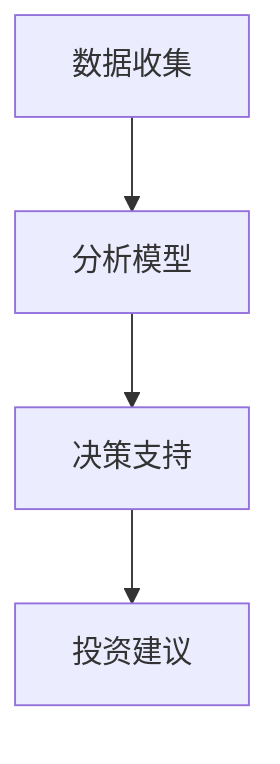
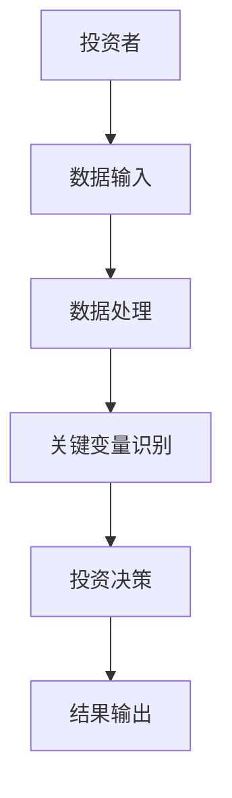
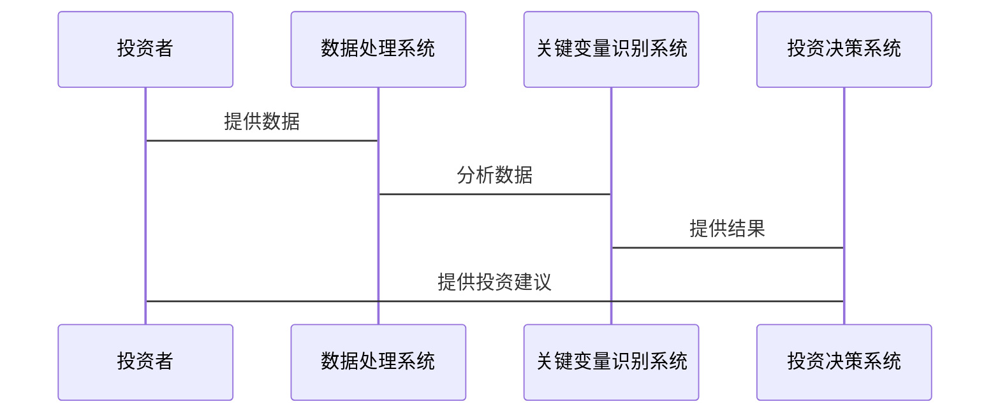

                 


# 芒格的"关键变量"理论：找出决定投资成败的核心因素

## 关键词：
芒格, 关键变量, 投资, 决策因素, 价值投资, 成长投资, 系统分析

## 摘要：
芒格的"关键变量"理论是投资领域的重要理论，它强调在投资决策中识别和分析关键变量的重要性。本文将详细介绍芒格的关键变量理论，包括其背景、核心概念、识别方法、在不同投资策略中的应用，以及系统分析与架构设计。通过实际案例分析和最佳实践，本文将帮助读者更好地理解和应用这一理论，从而提高投资决策的成功率。

---

# 正文

## 第一章：芒格的"关键变量"理论概述

### 1.1 芒格投资理论的背景与核心理念

#### 1.1.1 芒格的哲学与投资理念
芒格是一位著名的投资家和思想家，他的投资理念深受哲学和心理学的影响。他强调投资不仅是对市场的分析，更是对人性的理解。芒格的投资哲学包括以下核心观点：
- **机会成本**：任何投资的收益都应与其机会成本进行比较。
- **逆向思维**：寻找市场中被忽视的机会，避免跟随大众。
- **安全边际**：在投资中，确保本金的安全是最重要的。

#### 1.1.2 芒格"关键变量"理论的提出背景
芒格的"关键变量"理论源于他对投资决策中关键因素的深入研究。他认为，投资成功的关键在于识别那些能够决定企业长期价值的核心因素。这些关键变量包括企业的竞争优势、财务状况、行业趋势等。

#### 1.1.3 芒格理论与其他投资理论的对比
与其他投资理论（如技术分析和基本面分析）相比，芒格的"关键变量"理论更加注重对企业本质和长期趋势的分析。他认为，短期市场波动可以忽略，而长期趋势才是决定投资成败的关键。

### 1.2 "关键变量"理论的定义与特点

#### 1.2.1 关键变量的定义
关键变量是指那些能够对企业价值、行业趋势或市场走势产生重大影响的因素。这些变量通常是不可见的、隐藏在市场表象背后的深层因素。

#### 1.2.2 关键变量的核心特点
- **长期性**：关键变量通常影响企业的长期发展。
- **隐蔽性**：关键变量往往不容易被发现，需要深入分析。
- **决定性**：关键变量能够决定投资的成败。

#### 1.2.3 关键变量与次要变量的对比
| 特性        | 关键变量                          | 次要变量                          |
|-------------|-----------------------------------|------------------------------------|
| 影响程度     | 高                                | 低                                  |
| 可预测性     | 较高                              | 较低                                |
| 分析难度     | 高                                | 低                                  |
| 持续时间     | 长                                | 短                                  |

### 1.3 芒格理论在投资决策中的应用

#### 1.3.1 理论在投资决策中的作用
芒格的"关键变量"理论可以帮助投资者在复杂的市场环境中找到真正影响投资结果的因素，从而做出更明智的投资决策。

#### 1.3.2 理论的局限性与适用场景
尽管"关键变量"理论在长期投资中表现优异，但它在短期市场波动中可能显得不足。因此，该理论更适合用于长期投资策略，而不宜用于短期交易。

#### 1.3.3 理论的未来发展趋势
随着人工智能和大数据技术的发展，"关键变量"理论将更加依赖于数据分析和模型构建。未来的研究可能会更多地关注如何利用技术手段来识别和分析关键变量。

---

## 第二章：关键变量的识别与分析方法

### 2.1 基于基本面分析的变量识别

#### 2.1.1 基本面分析的定义与方法
基本面分析是指通过对企业的财务状况、行业地位、管理团队等因素进行分析，以评估其内在价值。关键变量的识别是基本面分析的核心。

#### 2.1.2 通过基本面分析识别关键变量
- **企业财务状况**：如盈利能力、资产负债率等。
- **行业地位**：如市场份额、竞争格局等。
- **管理团队**：如领导能力、战略规划等。

#### 2.1.3 基本面分析的优缺点
- **优点**：能够提供企业的内在价值，帮助识别长期趋势。
- **缺点**：可能忽视短期市场波动。

### 2.2 基于心理因素的变量识别

#### 2.2.1 投资者心理在关键变量识别中的作用
投资者的心理因素，如贪婪和恐惧，往往会影响市场走势。关键变量的识别需要考虑这些心理因素对市场的影响。

#### 2.2.2 常见心理偏差对投资决策的影响
- **从众心理**：跟随大众决策，可能导致错误判断。
- **过度自信**：过于相信自己的判断，忽视市场变化。

#### 2.2.3 如何克服心理偏差，理性识别关键变量
- **保持独立思考**：避免随大流。
- **长期视角**：关注企业的长期价值，而非短期波动。

### 2.3 基于外部环境的变量识别

#### 2.3.1 宏观经济环境对关键变量的影响
宏观经济环境，如GDP增长、利率变化等，可能影响企业的经营状况。

#### 2.3.2 行业趋势对关键变量的影响
行业趋势，如技术创新、市场需求变化等，是关键变量的重要来源。

#### 2.3.3 政策变化对关键变量的影响
政策变化，如税收政策、行业监管等，可能对企业的经营环境产生重大影响。

---

## 第三章：关键变量在价值投资中的应用

### 3.1 价值投资的基本原理

#### 3.1.1 价值投资的定义与核心理念
价值投资是指以低于企业内在价值的价格买入优质企业股票。芒格的"关键变量"理论为价值投资提供了理论支持。

#### 3.1.2 价值投资与"关键变量"理论的结合
在价值投资中，关键变量的识别是评估企业内在价值的核心步骤。

#### 3.1.3 价值投资中的关键变量分析
- **企业竞争优势**：如独特的商业模式、技术优势等。
- **财务状况**：如盈利能力、现金流等。
- **管理团队**：如领导能力、战略规划等。

### 3.2 价值投资中的关键变量识别

#### 3.2.1 企业基本面分析中的关键变量
- **盈利能力**：如净利润率、毛利率等。
- **资产负债率**：如债务负担、财务风险等。
- **现金流**：如自由现金流、现金流健康状况等。

#### 3.2.2 企业竞争优势中的关键变量
- **技术优势**：如专利、技术创新等。
- **市场地位**：如市场份额、品牌影响力等。
- **竞争优势可持续性**：如护城河宽度、竞争壁垒等。

#### 3.2.3 企业财务状况中的关键变量
- **盈利质量**：如收入质量、利润质量等。
- **财务健康状况**：如流动性、偿债能力等。
- **财务风险**：如债务风险、流动性风险等。

### 3.3 价值投资中的关键变量应用案例

#### 3.3.1 苹果公司的价值投资分析
苹果公司以其强大的技术创新能力和品牌影响力成为价值投资的典范。其关键变量包括：
- 技术创新：如iPhone、iPad等产品的持续创新。
- 市场地位：全球最大的科技公司之一。
- 财务状况：稳定的现金流和高利润率。

#### 3.3.2 谷歌的价值投资分析
谷歌（现Alphabet）以其搜索引擎技术和广告业务成为价值投资的另一个典范。其关键变量包括：
- 技术创新：如搜索引擎算法的持续优化。
- 市场地位：全球最大的搜索引擎公司。
- 财务状况：稳定的收入来源和高利润率。

#### 3.3.3 微软的价值投资分析
微软公司以其软件和服务业务成为价值投资的典范。其关键变量包括：
- 技术创新：如Windows操作系统、Azure云服务等。
- 市场地位：全球最大的软件公司之一。
- 财务状况：稳定的现金流和高利润率。

---

## 第四章：关键变量在成长投资中的应用

### 4.1 成长投资的基本原理

#### 4.1.1 成长投资的定义与核心理念
成长投资是指投资于那些具有高成长潜力的企业。芒格的"关键变量"理论为成长投资提供了理论支持。

#### 4.1.2 成长投资与"关键变量"理论的结合
在成长投资中，关键变量的识别是评估企业成长潜力的核心步骤。

#### 4.1.3 成长投资中的关键变量分析
- **企业成长潜力**：如收入增长率、净利润增长率等。
- **行业趋势**：如技术创新、市场需求变化等。
- **竞争优势**：如技术优势、市场地位等。

### 4.2 成长投资中的关键变量识别

#### 4.2.1 企业成长潜力分析中的关键变量
- **收入增长率**：如年收入增长率、复合年增长率等。
- **净利润增长率**：如年净利润增长率、复合年增长率等。
- **市场扩展潜力**：如新市场进入、市场份额扩大等。

#### 4.2.2 企业创新中的关键变量
- **技术创新**：如新产品、新技术的开发能力。
- **管理创新**：如管理模式、组织结构的创新能力。
- **市场创新**：如市场拓展、品牌推广能力。

#### 4.2.3 企业竞争优势中的关键变量
- **技术优势**：如专利、技术创新等。
- **市场地位**：如市场份额、品牌影响力等。
- **竞争优势可持续性**：如护城河宽度、竞争壁垒等。

### 4.3 成长投资中的关键变量应用案例

#### 4.3.1 科技公司的成长投资分析
科技公司（如苹果、谷歌、微软等）的成长潜力主要体现在技术创新和市场扩展上。其关键变量包括：
- 技术创新：如人工智能、云计算等。
- 市场扩展：如新兴市场的拓展。
- 竞争优势：如强大的研发能力和品牌影响力。

---

## 第五章：系统分析与架构设计方案

### 5.1 系统分析

#### 5.1.1 问题场景介绍
在投资决策中，识别关键变量需要一个系统化的分析框架。系统分析可以帮助投资者更好地理解市场环境和企业状况。

#### 5.1.2 系统功能设计
- **数据收集模块**：收集企业的财务数据、市场数据等。
- **分析模型模块**：构建关键变量识别的数学模型。
- **决策支持模块**：基于分析结果提供投资建议。

#### 5.1.3 系统架构设计


### 5.2 系统架构设计

#### 5.2.1 系统架构图


#### 5.2.2 系统接口设计
- **输入接口**：接受企业的财务数据、市场数据等。
- **输出接口**：提供关键变量识别结果和投资建议。

#### 5.2.3 系统交互设计


---

## 第六章：项目实战

### 6.1 环境安装

#### 6.1.1 投资分析工具的安装
- **工具选择**：如Excel、Python（Pandas、NumPy等）。
- **数据获取**：从公开市场数据源获取企业的财务数据和市场数据。

#### 6.1.2 数据分析环境的配置
- **安装Python**：如Anaconda。
- **安装数据分析库**：如Pandas、NumPy、Matplotlib等。

### 6.2 系统核心实现源代码

#### 6.2.1 关键变量识别的Python实现
```python
import pandas as pd
import numpy as np

# 数据加载
data = pd.read_csv('company_data.csv')

# 关键变量筛选
def identify_key_variables(data):
    # 计算相关指标
    metrics = data.describe()
    # 识别关键变量
    key_vars = metrics[metrics['mean'] > data['mean'].mean()]
    return key_vars

# 应用函数
key_vars = identify_key_variables(data)
print(key_vars)
```

#### 6.2.2 投资决策支持系统的实现
```python
def investment_decision(key_vars):
    # 分析关键变量
    for var in key_vars:
        if var['mean'] > 2 * var['std']:
            print(f"{var['name']} 是关键变量")
    return "投资建议：..."

decision = investment_decision(key_vars)
print(decision)
```

### 6.3 代码应用解读与分析

#### 6.3.1 关键变量识别的代码解读
- **数据加载**：从CSV文件中加载企业的财务数据。
- **关键变量筛选**：通过描述性统计分析，识别那些均值显著高于整体均值的变量。

#### 6.3.2 投资决策支持系统的代码解读
- **关键变量分析**：对筛选出的关键变量进行进一步分析。
- **投资建议**：基于关键变量分析结果，提供投资建议。

### 6.4 实际案例分析

#### 6.4.1 案例介绍
以科技公司为例，分析其关键变量。

#### 6.4.2 分析过程
- **数据收集**：获取公司的财务数据、市场数据等。
- **关键变量识别**：识别公司的竞争优势、财务状况等关键变量。
- **投资建议**：基于关键变量分析结果，提供投资建议。

#### 6.4.3 详细解读
- **关键变量识别**：如技术创新、市场地位等。
- **投资建议**：如买入、持有或卖出等。

### 6.5 项目小结

#### 6.5.1 项目总结
通过项目实战，读者可以更好地理解芒格的"关键变量"理论，并学会如何将其应用于实际投资决策中。

#### 6.5.2 项目经验
- **数据收集**：数据的准确性和完整性是关键。
- **模型构建**：模型的合理性和有效性是关键。
- **投资决策**：决策的科学性和可行性是关键。

---

## 第七章：总结与展望

### 7.1 总结

#### 7.1.1 理论总结
芒格的"关键变量"理论为投资决策提供了重要的理论支持。通过识别和分析关键变量，投资者可以更好地理解市场环境和企业状况，从而做出更明智的投资决策。

#### 7.1.2 实践总结
在实际投资中，关键变量的识别和分析需要结合企业的基本面、市场环境和投资者心理等多方面因素。通过系统分析和实际案例分析，读者可以更好地掌握芒格的关键变量理论。

### 7.2 未来研究方向

#### 7.2.1 理论研究
未来的研究可以进一步探讨关键变量的动态变化及其对投资决策的影响。

#### 7.2.2 实践应用
未来的研究可以进一步探讨关键变量理论在不同投资策略中的应用，如趋势投资、对冲基金等。

### 7.3 最佳实践 Tips

#### 7.3.1 投资者建议
- **长期视角**：关注企业的长期价值，而非短期波动。
- **独立思考**：避免随大流，保持独立思考。
- **持续学习**：不断学习和更新投资知识，提升自己的投资能力。

#### 7.3.2 风险提示
- **市场风险**：市场波动可能影响投资结果。
- **模型风险**：模型的合理性和有效性可能影响投资决策。
- **数据风险**：数据的准确性和完整性可能影响分析结果。

---

## 作者：AI天才研究院/AI Genius Institute & 禅与计算机程序设计艺术/Zen And The Art of Computer Programming

