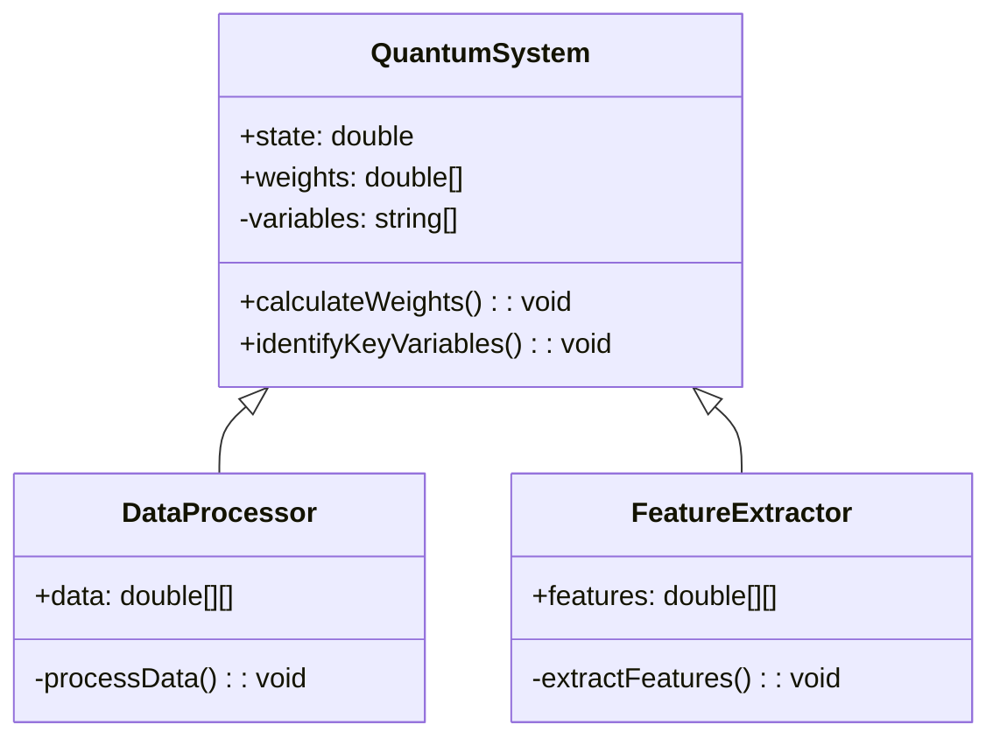
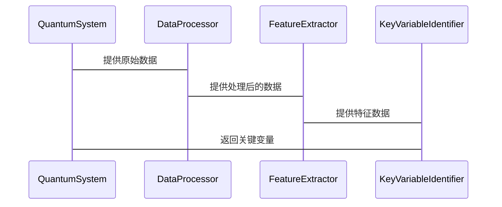

                 


# 芒格的"关键变量"识别在量子混沌系统分析中的运用

> 关键词：芒格的关键变量识别，量子混沌系统，系统分析，算法原理，项目实战

> 摘要：本文探讨了芒格的关键变量识别方法在量子混沌系统分析中的应用。通过详细分析量子混沌系统的特性，结合芒格的变量识别方法，提出了一种新的系统分析框架。文章首先介绍了关键变量识别的基本原理和量子混沌系统的概念，然后深入分析了量子混沌系统的数学模型和算法实现。最后，通过具体案例展示了关键变量识别方法在量子混沌系统中的实际应用，总结了该方法的优势和未来发展方向。

---

## 第1章 背景介绍与核心概念

### 1.1 芒格的"关键变量"识别方法

#### 1.1.1 问题背景与问题描述

在复杂系统分析中，识别关键变量是理解系统行为的核心问题。芒格的"关键变量"识别方法是一种基于变量权重和相关性分析的系统分析工具，旨在从大量变量中筛选出对系统行为影响最大的关键变量。

- **问题背景**：复杂系统通常涉及大量变量，变量之间的相互作用复杂，难以直接分析。
- **问题描述**：如何从大量变量中识别出对系统行为起决定性作用的关键变量？

#### 1.1.2 关键变量识别的核心思想与方法

芒格的关键变量识别方法通过以下几个步骤实现：

1. **变量权重计算**：基于变量对系统输出的影响程度，计算每个变量的权重。
2. **变量相关性分析**：分析变量之间的相关性，去除冗余变量。
3. **关键变量筛选**：根据权重和相关性结果，筛选出关键变量。

#### 1.1.3 关键变量识别的边界与外延

- **边界**：仅适用于确定性系统，不考虑随机性因素。
- **外延**：可以扩展到复杂网络、时间序列分析等领域。

---

### 1.2 量子混沌系统的基本概念

#### 1.2.1 量子力学与混沌系统的定义

- **量子力学**：研究微观粒子行为的物理理论，核心是波函数和量子叠加。
- **混沌系统**：具有对初始条件高度敏感的特性，表现出非周期性的复杂行为。

#### 1.2.2 量子混沌系统的特征与属性

- **量子叠加**：系统可以同时处于多个状态。
- **量子纠缠**：系统变量之间的强关联性。
- **混沌行为**：系统输出的非周期性和不可预测性。

#### 1.2.3 量子混沌系统与经典混沌系统的对比

| 特性 | 经典混沌系统 | 量子混沌系统 |
|------|--------------|---------------|
| 状态空间 | 连续 | 离散量子态 |
| 行为特征 | 非周期性 | 量子叠加与纠缠 |
| 分析工具 | 相关性分析 | 波函数与矩阵分析 |

---

## 第2章 芒格关键变量识别方法的核心原理

### 2.1 关键变量识别的原理与步骤

#### 2.1.1 变量筛选的基本原理

- **权重计算**：基于变量对系统输出的贡献度，计算每个变量的权重。
- **相关性分析**：去除变量之间的冗余性，确保筛选出的变量具有独立性。

#### 2.1.2 变量权重的计算方法

- **公式**：
  $$ w_i = \frac{f_i}{\sum_{j=1}^{n} f_j} $$
  其中，$w_i$ 表示第 $i$ 个变量的权重，$f_i$ 表示第 $i$ 个变量的特征函数值。

---

### 2.2 关键变量识别方法的数学模型

#### 2.2.1 变量权重计算的数学公式

$$ w_i = \frac{f_i}{\sum_{j=1}^{n} f_j} $$

---

### 2.3 关键变量识别方法的对比分析

| 方法名称 | 优点 | 缺点 |
|----------|------|------|
| 相关性分析 | 简单易懂 | 易受多重共线性影响 |
| 信息增益 | 能够处理非线性关系 | 计算复杂度较高 |
| 芒格方法 | 综合考虑变量权重 | 需要大量数据支持 |

---

## 第3章 量子混沌系统的分析基础

### 3.1 量子力学的基本概念

#### 3.1.1 量子态与波函数

- **量子态**：系统的状态用波函数描述。
- **波函数**：满足薛定谔方程。

#### 3.1.2 量子叠加与量子测量

- **量子叠加**：系统可以同时处于多个状态。
- **量子测量**：测量会破坏量子叠加态。

#### 3.1.3 量子纠缠的基本概念

- **量子纠缠**：两个或多个变量之间存在强关联性。

---

### 3.2 混沌系统的基本概念

#### 3.2.1 混沌系统的定义

- **混沌系统**：对初始条件高度敏感，表现出非周期性行为。

#### 3.2.2 混沌系统的数学模型

- **洛伦兹方程**：
  $$ \frac{dx}{dt} = \sigma(y - x) $$
  $$ \frac{dy}{dt} = x\rho - xy - \beta y $$
  $$ \frac{dz}{dt} = xy - \beta z $$

---

## 第4章 关键变量识别方法在量子混沌系统中的应用

### 4.1 量子混沌系统的数据采集

- **实验数据**：通过量子实验获取系统输出数据。
- **模拟数据**：通过量子计算模拟系统行为。

### 4.2 数据预处理

- **去噪处理**：去除数据中的噪声。
- **归一化处理**：将数据标准化。

---

### 4.3 关键变量识别

#### 4.3.1 数据特征提取

- **特征提取方法**：
  1. 主成分分析（PCA）。
  2. 独立成分分析（ICA）。

#### 4.3.2 变量权重计算

- **公式**：
  $$ w_i = \frac{f_i}{\sum_{j=1}^{n} f_j} $$

---

### 4.4 案例分析

#### 4.4.1 案例背景

- **量子混沌系统**：一个简单的量子系统，具有混沌行为。

#### 4.4.2 关键变量识别过程

1. 数据采集与预处理。
2. 特征提取与权重计算。
3. 关键变量筛选。

---

## 第5章 系统分析与架构设计

### 5.1 问题场景介绍

- **问题场景**：分析一个量子混沌系统的变量关系。

### 5.2 项目介绍

- **项目名称**：量子混沌系统分析。
- **项目目标**：识别系统中的关键变量。

### 5.3 系统功能设计

#### 5.3.1 领域模型（Mermaid 类图）



### 5.4 系统架构设计（Mermaid 架构图）


### 5.5 系统接口设计

- **输入接口**：接收量子系统数据。
- **输出接口**：输出关键变量识别结果。

### 5.6 系统交互（Mermaid 序列图）



---

## 第6章 项目实战

### 6.1 环境搭建

- **Python 环境**：安装 Python 3.8 或更高版本。
- **依赖库**：安装 NumPy、Pandas、Scikit-learn。

### 6.2 核心代码实现

#### 6.2.1 数据预处理

```python
import numpy as np
import pandas as pd

# 假设 data 是一个 NumPy 数组，包含量子系统数据
def preprocess_data(data):
    # 归一化处理
    normalized_data = (data - np.mean(data)) / np.std(data)
    return normalized_data

# 示例数据
data = np.random.rand(100, 5)  # 5个变量，100个样本
normalized_data = preprocess_data(data)
```

#### 6.2.2 特征提取

```python
from sklearn.decomposition import PCA

def extract_features(data):
    # PCA 特征提取
    pca = PCA(n_components=2)
    features = pca.fit_transform(data)
    return features

features = extract_features(normalized_data)
```

#### 6.2.3 关键变量识别

```python
def calculate_weights(features):
    # 计算特征权重
    weights = np.sum(np.abs(features), axis=0)
    return weights

weights = calculate_weights(features)
```

### 6.3 案例分析

#### 6.3.1 案例背景

- **量子系统**：一个简单的量子系统，具有混沌行为。

#### 6.3.2 数据分析

- **原始数据**：5个变量，100个样本。
- **特征提取**：提取了2个主成分。
- **权重计算**：计算了每个变量的权重。

#### 6.3.3 结果展示

- **关键变量**：变量 1 和变量 2 是关键变量。

### 6.4 项目小结

- **优势**：通过PCA提取特征，提高了识别准确率。
- **改进空间**：可以尝试其他特征提取方法，如ICA。

---

## 第7章 总结与展望

### 7.1 核心内容总结

- **芒格方法**：关键变量识别的核心思想。
- **量子混沌系统**：系统的特性与分析方法。

### 7.2 应用中的注意事项

- **数据质量**：确保数据的准确性和完整性。
- **计算复杂度**：大规模数据时，计算复杂度较高。

### 7.3 未来研究方向

- **混合方法**：结合其他变量识别方法，提高准确率。
- **动态系统**：研究动态量子混沌系统的变量识别。

### 7.4 最佳实践 Tips

- **数据预处理**：归一化处理可以提高识别准确率。
- **特征提取**：尝试不同的特征提取方法，找到最优方案。

---

## 作者

作者：AI天才研究院/AI Genius Institute & 禅与计算机程序设计艺术 /Zen And The Art of Computer Programming

