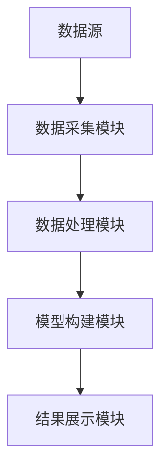

                 


# 芒格的"关键变量"识别：找出决定投资成败的核心因素

## 关键词：芒格，关键变量，投资决策，系统分析，算法实现，数学模型

## 摘要：芒格的"关键变量"识别方法是投资决策中的核心策略，通过系统性分析和算法实现，帮助投资者找出影响投资成败的关键因素。本文将从芒格的投资哲学出发，详细探讨关键变量的识别方法，结合数学模型和系统架构设计，提供实际案例分析和最佳实践建议。

---

# 第一部分：芒格“关键变量”识别的背景与核心概念

## 第1章：芒格投资理念与关键变量概述

### 1.1 芒格的生平与投资哲学
- 1.1.1 芒格的生平简介
  - 查理·芒格的背景：作为巴菲特的长期合作伙伴，芒格不仅是投资者，更是哲学家，他提出的“心智模型”和“逆向思维”深刻影响了投资领域。
  - 芒格的教育背景：毕业于哈佛大学，后获得斯坦福大学法学博士学位，这为他后来的思维方式奠定了基础。
- 1.1.2 芒格的投资哲学与思维方式
  - 核心理念：芒格强调“价格是投资的结果，价值是投资的起点”，主张以合理的价格买入优秀的公司。
  - 逆向思维：芒格倡导“反向思考”，即从问题的对立面寻找解决方案。
  - 多元思维模型：芒格提出，投资者需要构建多个知识模型，才能全面分析问题。
- 1.1.3 芒格与巴菲特的合作历程
  - 两人合作的历史：从1971年共同管理巴菲特的合伙企业开始，芒格和巴菲特共同创立了伯克希尔·哈撒韦公司。
  - 两人理念的异同：芒格更注重价值投资和长期持有，而巴菲特则更注重安全边际和价格因素。

### 1.2 关键变量识别的核心概念
- 1.2.1 什么是关键变量
  - 定义：关键变量是指在投资决策中对结果产生最大影响的因素。
  - 例如，在股票投资中，关键变量可能是公司的盈利能力、行业地位、管理团队等。
- 1.2.2 关键变量在投资中的重要性
  - 通过识别关键变量，投资者可以更准确地预测市场趋势，优化投资组合。
  - 关键变量分析可以帮助投资者避免被次要因素干扰，专注于真正影响结果的因素。
- 1.2.3 关键变量的分类与特征
  - 分类：可以将关键变量分为内部变量（如公司管理、财务状况）和外部变量（如市场环境、政策变化）。
  - 特征：关键变量具有高度的相关性、可测性和可预测性。

## 第2章：关键变量识别的理论基础

### 2.1 投资决策中的变量分析
- 2.1.1 投资决策的变量构成
  - 宏观变量：包括经济周期、利率水平、通货膨胀率等。
  - 行业变量：如行业竞争格局、政策变化等。
  - 公司变量：包括财务状况、管理团队、创新能力等。
- 2.1.2 变量之间的关系与影响
  - 直接关系：如公司盈利能力直接影响股价。
  - 间接关系：如行业政策变化可能通过影响公司利润进而影响股价。
- 2.1.3 变量的动态变化与投资机会
  - 变量的变化趋势：如经济周期的波动、行业趋势的变化。
  - 投资机会的识别：通过分析关键变量的变化趋势，发现投资机会。

### 2.2 芒格的关键变量识别方法
- 2.2.1 核心变量的筛选标准
  - 稳定性：变量在较长时期内对投资结果有显著影响。
  - 可测性：变量能够被准确测量和量化。
  - 相关性：变量与投资结果高度相关。
- 2.2.2 关键变量的量化与评估
  - 量化方法：如使用财务指标（ROE、净利润率）来量化公司盈利能力。
  - 评估标准：如通过历史数据验证变量的有效性。
- 2.2.3 关键变量的动态调整机制
  - 动态调整的必要性：市场环境和公司状况会不断变化，需要定期更新关键变量。
  - 调整方法：如根据市场变化重新评估变量的重要性。

---

# 第二部分：关键变量识别的系统性分析

## 第3章：关键变量识别的算法原理

### 3.1 数据分析与关键变量识别
- 3.1.1 数据预处理与清洗
  - 数据清洗：去除缺失值、异常值，确保数据质量。
  - 数据标准化：对数据进行标准化处理，以便后续分析。
- 3.1.2 数据特征提取与选择
  - 特征提取：通过统计分析和可视化工具（如PCA）提取关键特征。
  - 特征选择：使用相关系数矩阵或Lasso回归等方法选择重要特征。
- 3.1.3 数据分析方法与工具
  - 数据分析工具：如Python中的pandas、numpy库，以及可视化工具如Matplotlib和Seaborn。
  - 数据分析方法：如描述性统计、相关性分析、回归分析等。

### 3.2 关键变量识别的算法实现
- 3.2.1 回归分析法
  - 线性回归：用于预测连续型变量，如股价预测。
  - 逻辑回归：用于分类问题，如判断某公司是否为优质投资标的。
- 3.2.2 因子分析法
  - 因子分析的基本原理：通过提取公因子，将多个变量简化为少数几个因子。
  - 主成分分析（PCA）：将原始变量线性组合，提取主要成分。
- 3.2.3 决策树算法
  - ID3、C4.5、CART算法：用于分类问题，如判断某行业是否处于上升期。
  - 决策树的优势：易于解释，能够处理非线性关系。
- 3.2.4 聚类分析法
  - K-means聚类：将公司按某些变量进行分组，如按盈利能力分组。
  - 层次聚类：逐步合并相似的公司，形成层次结构。

### 3.3 算法实现示例
#### 使用Python进行回归分析
```python
import pandas as pd
import numpy as np
from sklearn.linear_model import LinearRegression
from sklearn.metrics import r2_score

# 假设我们有一个包含公司财务数据的数据框df
# df包含变量：收入（revenue）、利润（profit）、股价（stock_price）
# 使用收入和利润预测股价
X = df[['revenue', 'profit']]
y = df['stock_price']

# 使用线性回归模型
model = LinearRegression()
model.fit(X, y)

# 预测结果
y_pred = model.predict(X)

# 计算R平方值
print('R平方值:', r2_score(y, y_pred))
```

---

## 第4章：关键变量识别的数学模型

### 4.1 回归分析模型
- 4.1.1 线性回归模型
  - 模型公式：$$ y = \beta_0 + \beta_1 x_1 + \beta_2 x_2 + \cdots + \beta_n x_n + \epsilon $$
  - 参数解释：$$ \beta_0 $$为截距，$$ \beta_1, \beta_2, \cdots, \beta_n $$为各变量的回归系数。
- 4.1.2 逻辑回归模型
  - 模型公式：$$ P(y=1|x) = \frac{e^{\beta_0 + \beta_1 x_1 + \cdots + \beta_n x_n}}{1 + e^{\beta_0 + \beta_1 x_1 + \cdots + \beta_n x_n}} $$
  - 应用场景：用于分类问题，如判断某公司是否为优质股。
- 4.1.3 回归系数的解释与应用
  - 回归系数的经济意义：如回归系数为正，表示该变量对目标变量有正向影响。
  - 变量重要性排序：根据回归系数的绝对值大小，判断各变量的重要性。

### 4.2 因子分析模型
- 4.2.1 因子分析的基本原理
  - 基本假设：存在少数几个潜在变量（因子），能够解释多个观测变量的大部分变异。
  - 因子载荷矩阵：表示观测变量与潜在因子之间的相关性。
- 4.2.2 主成分分析（PCA）
  - PCA的基本思想：将原始变量线性组合，提取主要成分。
  - 成分解释：如第一个主成分可能代表公司的整体盈利能力。
- 4.2.3 因子载荷矩阵的解读
  - 载荷值的含义：如载荷值为0.8，表示该变量与该因子的相关性较高。
  - 因子命名：根据载荷矩阵，给因子命名，如“盈利能力因子”、“市场地位因子”。

---

## 第5章：关键变量识别的系统架构设计

### 5.1 系统功能设计
- 5.1.1 数据采集模块
  - 功能：从多种数据源（如金融数据库、新闻网站）采集投资相关的数据。
  - 工具：使用爬虫技术（如BeautifulSoup、Selenium）进行数据采集。
- 5.1.2 数据处理模块
  - 功能：对采集到的数据进行清洗、标准化和特征提取。
  - 工具：使用Python的pandas库进行数据处理。
- 5.1.3 模型构建模块
  - 功能：基于关键变量识别算法，构建数学模型。
  - 工具：使用Scikit-learn库进行模型构建。
- 5.1.4 结果展示模块
  - 功能：将模型的输出结果以可视化的方式展示，如生成图表、报告。
  - 工具：使用Matplotlib、Seaborn进行可视化。

### 5.2 系统架构图


---

## 第6章：关键变量识别的项目实战

### 6.1 项目背景与目标
- 背景：假设我们希望识别影响某行业股票表现的关键变量。
- 目标：通过数据分析，找出影响该行业股票表现的关键变量。

### 6.2 项目环境安装
```bash
# 安装所需库
pip install numpy pandas matplotlib seaborn scikit-learn
```

### 6.3 项目核心实现
#### 数据预处理
```python
import pandas as pd
import numpy as np

# 加载数据
data = pd.read_csv('stock_data.csv')

# 数据清洗
data.dropna()  # 去除缺失值
data = data[~data['revenue'].isin([np.nan])]  # 去除收入为NaN的行
```

#### 模型构建
```python
from sklearn.linear_model import LinearRegression
from sklearn.metrics import r2_score

# 选择特征和目标变量
X = data[['revenue', 'profit', 'market_share']]
y = data['stock_price']

# 训练模型
model = LinearRegression()
model.fit(X, y)

# 预测结果
y_pred = model.predict(X)

# 计算R平方值
print('R平方值:', r2_score(y, y_pred))
```

### 6.4 案例分析与结果解读
- 案例分析：假设我们选择某行业的公司数据，构建回归模型，发现公司收入和利润率是影响股价的关键变量。
- 结果解读：回归系数显示，收入对股价的影响比利润率更大。
- 可视化展示：绘制收入和股价的散点图，观察它们之间的相关性。

### 6.5 项目小结
- 成功识别关键变量：通过模型分析，找到了影响投资结果的关键变量。
- 模型的优势：回归模型能够较好地拟合数据，R平方值较高。
- 模型的局限性：回归模型假设变量之间是线性关系，可能存在遗漏变量的问题。

---

## 第7章：关键变量识别的最佳实践与总结

### 7.1 最佳实践
- 数据清洗：确保数据质量，避免异常值和缺失值的影响。
- 特征选择：根据业务知识和统计方法，选择相关的变量。
- 模型验证：通过交叉验证、ROC曲线等方法，验证模型的性能。
- 结果解读：结合业务背景，解读模型的输出结果。

### 7.2 小结
- 关键变量识别是投资决策中的核心环节，通过系统性分析和算法实现，可以有效提高投资的准确性。
- 芒格的关键变量识别方法，结合现代数据分析技术，为投资者提供了强大的工具。

### 7.3 注意事项
- 避免过度拟合：在模型训练过程中，要注意防止过度拟合，可以通过正则化方法（如Lasso、Ridge回归）来解决。
- 动态调整：市场环境和公司状况会不断变化，需要定期更新关键变量和模型。

### 7.4 拓展阅读
- 建议阅读芒格的《穷查理芒格传》和巴菲特的《投资之道》，深入理解他们的投资哲学。
- 推荐学习Python的数据分析库（如pandas、numpy）和机器学习库（如Scikit-learn），提升数据分析能力。

---

## 作者：AI天才研究院/AI Genius Institute & 禅与计算机程序设计艺术/Zen And The Art of Computer Programming

---

**本文通过详细分析芒格的关键变量识别方法，结合数学模型和系统架构设计，为投资者提供了一种科学的投资决策方法。通过实际案例分析和代码实现，帮助读者更好地理解和应用这些理论。**

