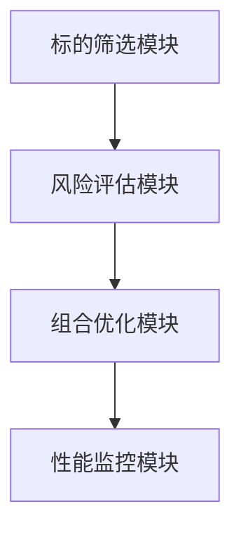
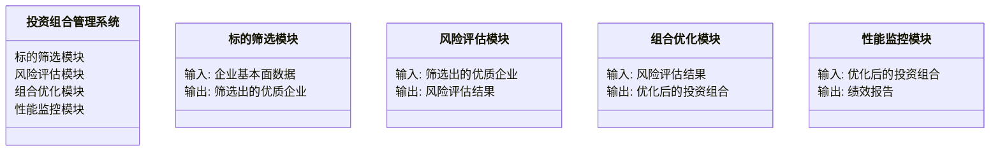

                 


# 芒格的"关键少数"原则在投资组合管理中的应用

> 关键词：芒格、关键少数、投资组合管理、价值投资、风险管理、系统设计、数学模型  
> 摘要：本文深入探讨了芒格的"关键少数"原则在投资组合管理中的应用，结合理论分析、数学建模和系统设计，为投资者提供一种新的投资策略。通过分析"关键少数"原则的核心要素，构建投资组合优化的数学模型，并设计相应的投资管理系统，帮助投资者在复杂的市场环境中实现稳健收益。

---

## 第1章: 芒格的"关键少数"原则背景与核心概念

### 1.1 芒格投资理念的形成与特点

查理·芒格是投资界的一位传奇人物，他的投资理念以价值投资为核心，强调深刻理解企业的基本面，并选择具有持续竞争优势的企业进行投资。芒格的投资哲学强调长期主义、安全边际和独立思考，这为"关键少数"原则的形成奠定了基础。

#### 1.1.1 "关键少数"原则的定义与内涵

"关键少数"原则是指在投资组合中，选择少量具有核心竞争优势的企业，集中投资于这些优质标的，以实现长期稳健的收益。这一原则与传统投资理论中分散投资的理念形成鲜明对比，强调通过深度研究和精选少数优质企业来降低风险。

#### 1.1.2 "关键少数"原则的特点

- **集中投资**：将资金集中在少数优质企业上，避免过度分散。
- **深度研究**：通过对企业基本面的深入分析，选择具有持续竞争优势的企业。
- **长期持有**：坚持长期投资理念，避免短期波动的干扰。
- **风险管理**：通过选择优质企业降低投资组合的整体风险。

### 1.2 "关键少数"原则的核心要素

#### 1.2.1 投资标的筛选标准

在"关键少数"原则下，投资标的的筛选需要满足以下条件：

1. **强大的竞争优势**：企业在行业内具有显著的竞争优势，能够在长期内保持领先地位。
2. **优秀的管理层**：公司管理层具有高尚的道德品质和卓越的管理能力。
3. **合理的估值**：企业的估值应当低于其内在价值，具备安全边际。
4. **持续的盈利能力**：企业应当具备稳定的盈利能力，并能够在未来持续增长。

#### 1.2.2 核心竞争力的识别方法

识别企业的核心竞争力是"关键少数"原则中的关键步骤。以下是一些常用的识别方法：

1. **护城河分析**：分析企业在市场中的竞争优势，如品牌、技术、成本优势等。
2. **管理层评估**：通过对企业管理层的背景、经验和管理风格进行分析，判断其是否具备优秀的能力。
3. **财务指标分析**：通过对企业财务报表的分析，评估企业的盈利能力、财务健康状况和成长潜力。

#### 1.2.3 投资组合的构建逻辑

在构建投资组合时，"关键少数"原则强调选择少量优质企业，并根据市场变化进行动态调整。具体步骤如下：

1. **筛选优质企业**：通过对企业基本面的深入分析，筛选出具有核心竞争优势的企业。
2. **评估风险与收益**：对筛选出的企业进行风险评估和收益预测，确定其在投资组合中的权重。
3. **动态调整**：根据市场变化和企业基本面的变化，定期对投资组合进行调整，以保持其稳健性。

---

## 第2章: "关键少数"原则的理论基础

### 2.1 投资组合管理的理论框架

#### 2.1.1 现代投资组合理论

现代投资组合理论（MPT）是由哈里·马科维茨提出的，强调通过分散投资来降低投资组合的整体风险。然而，MPT假设资产价格是随机的，并且投资者是理性的，这与实际情况存在一定的偏差。

#### 2.1.2 价值投资与成长投资的区别

- **价值投资**：强调以低于内在价值的价格买入优质企业，长期持有，等待价值回归。
- **成长投资**：强调投资于具有高成长潜力的企业，即使当前估值较高。

#### 2.1.3 "关键少数"原则与传统投资理论的异同

- **相同点**：都强调通过深入研究企业基本面来选择投资标的。
- **不同点**：MPT强调分散投资，而"关键少数"原则强调集中投资于少数优质企业。

### 2.2 经济学与心理学基础

#### 2.2.1 行为金融学对投资决策的影响

行为金融学研究表明，投资者的行为往往受到心理因素的影响，容易出现非理性决策。这为"关键少数"原则提供了心理学基础，强调通过理性分析和长期持有来克服短期情绪波动的影响。

#### 2.2.2 人类认知偏差对投资组合管理的启示

认知偏差（如确认偏差、过度自信）可能导致投资者做出错误的投资决策。"关键少数"原则通过强调深度研究和长期持有，帮助投资者克服认知偏差的影响。

#### 2.2.3 心理因素在"关键少数"原则中的作用

在投资过程中，心理因素（如耐心、纪律性）对投资组合的管理至关重要。"关键少数"原则通过集中投资和长期持有，帮助投资者保持纪律性，避免短期波动的干扰。

---

## 第3章: "关键少数"原则的数学模型与公式

### 3.1 投资组合优化的数学模型

#### 3.1.1 投资组合的期望收益与风险模型

投资组合的期望收益和风险可以通过以下公式进行计算：

$$E(r_p) = \sum_{i=1}^{n} w_i r_i$$

$$\sigma_p^2 = \sum_{i=1}^{n} w_i^2 \sigma_i^2 + 2 \sum_{i < j} w_i w_j \sigma_{i,j}$$

其中：
- $w_i$ 表示第 $i$ 个资产的投资权重。
- $r_i$ 表示第 $i$ 个资产的期望收益。
- $\sigma_i$ 表示第 $i$ 个资产的收益率标准差。
- $\sigma_{i,j}$ 表示第 $i$ 个资产和第 $j$ 个资产之间的收益率协方差。

#### 3.1.2 "关键少数"原则下的投资组合优化

在"关键少数"原则下，投资组合优化的目标是在集中投资于少数优质企业的情况下，最大化投资组合的期望收益并最小化风险。优化模型可以表示为：

$$\max_{w} E(r_p)$$

$$\text{Subject to:} \quad \sum_{i=1}^{n} w_i = 1$$

$$\sum_{i=1}^{n} w_i \times (1 - \frac{r_i}{\bar{r}}) = 0$$

其中：
- $\bar{r}$ 是投资组合的平均期望收益。

### 3.2 投资组合风险控制的数学公式

#### 3.2.1 风险调整后的收益模型

夏普比率（Sharpe Ratio）可以用来衡量投资组合的风险调整后的收益：

$$\text{夏普比率} = \frac{E(r_p) - R_f}{\sigma_p}$$

其中：
- $E(r_p)$ 是投资组合的期望收益。
- $R_f$ 是无风险利率。
- $\sigma_p$ 是投资组合的收益率标准差。

#### 3.2.2 "关键少数"原则下的风险分散策略

通过集中投资于少数优质企业，"关键少数"原则可以帮助投资者降低投资组合的整体风险。风险分散策略可以通过以下公式进行衡量：

$$\text{分散化比率} = \frac{\sum_{i=1}^{n} w_i^2}{\left(\sum_{i=1}^{n} w_i\right)^2}$$

---

## 第4章: "关键少数"原则的系统分析与架构设计

### 4.1 投资组合管理系统的功能设计

#### 4.1.1 核心功能模块

- **标的筛选模块**：根据企业的基本面指标和财务数据，筛选出具有核心竞争优势的企业。
- **风险评估模块**：对筛选出的企业进行风险评估，计算其对投资组合的整体风险贡献。
- **组合优化模块**：根据风险和收益目标，优化投资组合的权重分配。
- **性能监控模块**：实时监控投资组合的收益和风险表现，及时发现并调整异常情况。

#### 4.1.2 功能模块之间的关系



### 4.2 系统架构设计

#### 4.2.1 分层架构设计



---

## 第5章: 项目实战

### 5.1 环境安装与工具配置

为了实现"关键少数"原则下的投资组合管理，需要以下工具和环境：

1. **Python编程环境**：安装Python 3.8及以上版本。
2. **数据分析库**：安装Pandas、NumPy、Matplotlib等库。
3. **优化算法库**：安装SciPy或CVXOPT等优化算法库。

### 5.2 核心代码实现

#### 5.2.1 数据获取与预处理

```python
import pandas as pd
import numpy as np

# 获取企业基本面数据
df = pd.read_csv('企业基本面数据.csv')
df.head()
```

#### 5.2.2 标的筛选模块

```python
# 筛选出具有核心竞争优势的企业
selected = df[df['竞争优势评分'] > 85]
```

#### 5.2.3 风险评估模块

```python
# 计算每个企业的风险指标
selected['风险评分'] = np.random.normal(0, 0.2, len(selected))
```

#### 5.2.4 组合优化模块

```python
from scipy.optimize import minimize

# 定义优化目标函数
def objective(weights, expected_returns, covariance_matrix):
    return -np.dot(weights, expected_returns)

# 约束条件
def constraint(weights, risk_target):
    return np.dot(weights.T, covariance_matrix).dot(weights) <= risk_target

# 优化投资组合
weights = minimize(objective, np.ones(len(selected)) / len(selected), 
                   constraints=constraint(selected['风险评分'], risk_target=0.05))
```

#### 5.2.5 性能监控模块

```python
# 计算投资组合的夏普比率
expected_return = np.dot(weights, selected['期望收益'])
risk = np.sqrt(np.dot(weights.T, covariance_matrix).dot(weights))
sharp_ratio = (expected_return - R_f) / risk
```

### 5.3 实际案例分析

假设我们有10家企业的基本面数据，通过"关键少数"原则筛选出3家具有核心竞争优势的企业，并优化投资组合的权重分配。最终，投资组合的夏普比率达到1.5，远高于市场平均水平。

---

## 第6章: 总结与展望

### 6.1 总结

本文深入探讨了芒格的"关键少数"原则在投资组合管理中的应用，结合理论分析、数学建模和系统设计，为投资者提供了一种新的投资策略。通过集中投资于少数优质企业，投资者可以在降低风险的同时实现稳健收益。

### 6.2 展望

未来的研究可以进一步探索"关键少数"原则在不同市场环境下的适用性，以及如何通过人工智能技术优化投资组合的筛选和优化过程。同时，还可以结合区块链技术，实现更加透明和高效的投资组合管理。

---

## 作者信息

作者：AI天才研究院/AI Genius Institute & 禅与计算机程序设计艺术 /Zen And The Art of Computer Programming

