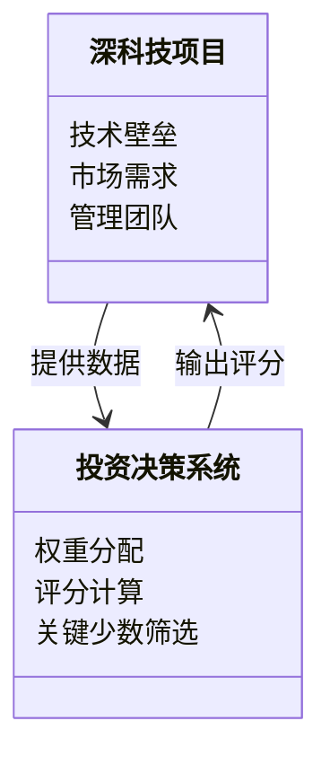
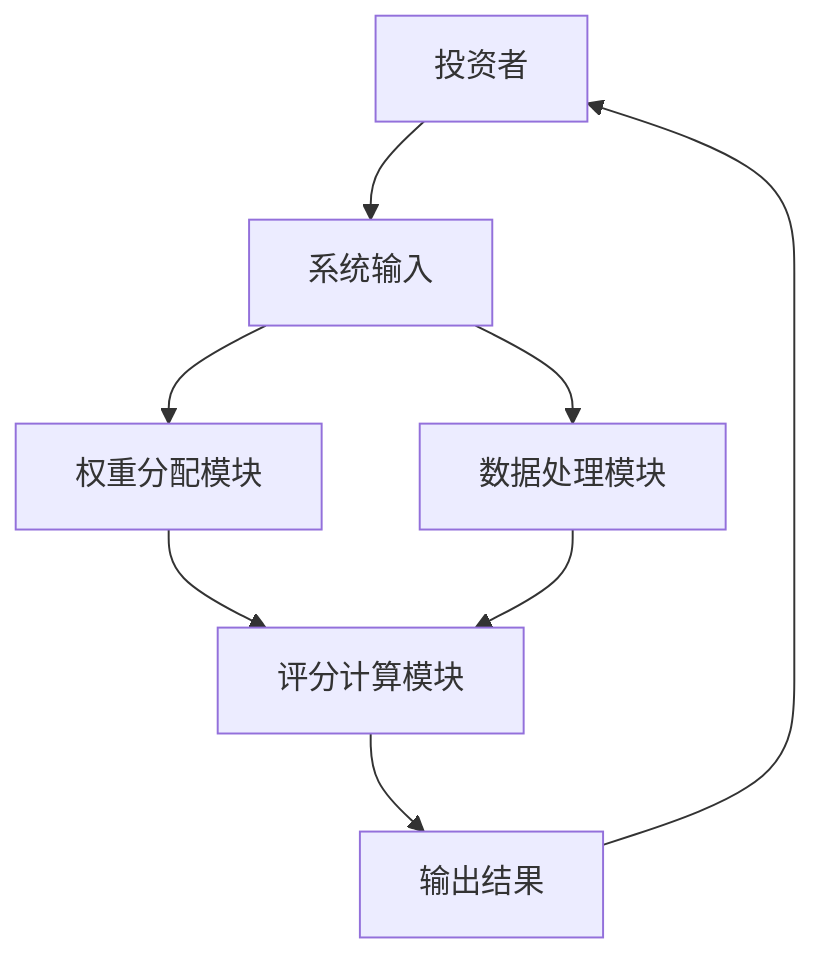
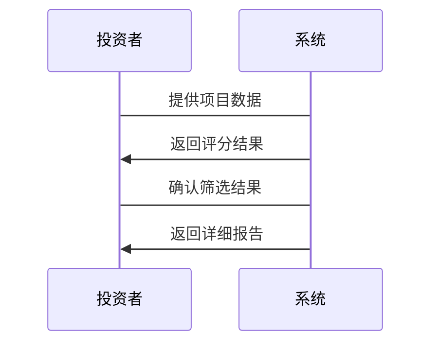

                 


# 芒格的"关键少数"原则在深科技创业投资中的应用

**关键词**：芒格、关键少数、深科技、创业投资、系统架构、算法原理、技术分析

**摘要**：本文探讨了芒格的“关键少数”原则在深科技创业投资中的应用。通过分析该原则的核心思想，结合深科技创业投资的特点，提出了一套基于“关键少数”原则的系统化投资方法。文章详细介绍了该方法的算法原理、系统架构及实际应用案例，旨在为深科技投资者提供一种高效的投资策略。

---

## 第一部分：芒格的"关键少数"原则概述

### 第1章：芒格的"关键少数"原则概述

#### 1.1 "关键少数"原则的定义与核心思想

**1.1.1 "关键少数"原则的定义**  
芒格的“关键少数”原则是指在任何系统中，少数关键因素对整体结果的影响力远大于其他因素。这种思维方式强调聚焦于少数高价值、高影响力的要素，而非追求全面性。

**1.1.2 芒格"关键少数"原则的核心思想**  
芒格认为，成功的投资决策依赖于对关键少数因素的准确识别和优先关注。这些关键因素通常是那些能够决定企业长期成功或失败的核心要素，例如市场需求、技术壁垒、管理团队等。

**1.1.3 该原则在投资领域的应用背景**  
在投资领域，传统的“广撒网”式投资方法往往效率低下。通过“关键少数”原则，投资者可以集中资源，精准筛选出具有高潜力的项目，从而提高投资回报率。

---

#### 1.2 深科技创业投资的背景与特点

**1.2.1 深科技的定义与特点**  
深科技（Deep Technology）是指基于前沿科学技术（如人工智能、量子计算、生物技术等）的企业创新。这类技术通常具有较高的技术壁垒和较长的研发周期，但一旦成功商业化，将带来巨大的市场价值。

**1.2.2 创业投资的基本流程与风险**  
创业投资的基本流程包括项目筛选、尽职调查、投资决策和投后管理。然而，深科技项目的高技术门槛和长周期使得投资风险较高，且对投资者的专业能力要求较高。

**1.2.3 深科技创业投资的独特性**  
深科技创业投资的独特性体现在其对技术壁垒的依赖和对长期市场的关注。成功的深科技项目通常需要投资者具备深厚的技术背景和长期的战略眼光。

---

#### 1.3 "关键少数"原则与深科技创业投资的结合

**1.3.1 两者结合的必要性**  
深科技创业投资的高风险和高回报特性使得“关键少数”原则成为一种有效的工具。通过聚焦于少数关键因素，投资者可以更高效地筛选出具有高潜力的项目。

**1.3.2 两者结合的具体应用场景**  
在深科技投资中，投资者可以利用“关键少数”原则筛选出那些具备核心技术壁垒、优秀管理团队和广阔市场前景的项目。

**1.3.3 该结合对投资效率的提升作用**  
通过聚焦于关键少数因素，投资者可以减少无效筛选，提高投资效率，并降低决策风险。

---

#### 1.4 本章小结  
本章通过介绍芒格的“关键少数”原则及其在投资领域的应用背景，揭示了深科技创业投资的独特性和挑战。接下来，我们将深入探讨“关键少数”原则的核心概念及其在深科技投资中的具体应用。

---

## 第二部分："关键少数"原则的核心概念与联系

### 第2章："关键少数"原则的核心概念

#### 2.1 "关键少数"原则的核心要素

**2.1.1 关键少数的定义与特征**  
关键少数是指在系统中占据主导地位的少数要素，它们对整体结果的影响远大于其他因素。这些要素通常具有高价值、高影响力和高度相关性的特点。

**2.1.2 关键少数与非关键多数的对比**  
通过对比关键少数和非关键多数，可以更清晰地识别出对投资决策具有决定性作用的因素。

**2.1.3 关键少数在投资中的具体表现**  
在投资中，关键少数通常表现为企业的核心竞争力、管理团队的稳定性以及市场需求的匹配度等因素。

---

#### 2.2 "关键少数"原则的数学模型与公式

**2.2.1 关键少数的筛选公式**  
关键少数的筛选公式可以通过加权评分法来实现，例如：  
$$ \text{关键少数评分} = \sum_{i=1}^{n} w_i \cdot s_i $$  
其中，\( w_i \) 是第 \( i \) 个因素的权重，\( s_i \) 是第 \( i \) 个因素的评分。

**2.2.2 投资回报率的数学模型**  
投资回报率（ROI）可以通过以下公式计算：  
$$ ROI = \frac{\text{投资收益} - \text{投资成本}}{\text{投资成本}} \times 100\% $$  

**2.2.3 项目潜力的评估公式**  
项目潜力的评估公式可以表示为：  
$$ \text{项目潜力} = a \cdot \text{技术壁垒} + b \cdot \text{市场需求} + c \cdot \text{管理团队} $$  
其中，\( a, b, c \) 是各因素的权重系数。

---

#### 2.3 "关键少数"原则与深科技创业投资的关系

**2.3.1 两者的关系概述**  
“关键少数”原则为深科技创业投资提供了一种系统化的筛选方法，帮助投资者在复杂的技术和市场环境中找到高潜力项目。

**2.3.2 关键少数在深科技中的具体应用**  
在深科技投资中，关键少数通常包括企业的核心技术、市场定位和管理团队等因素。

**2.3.3 该关系对投资决策的影响**  
通过聚焦于关键少数因素，投资者可以更高效地识别出具有高潜力的深科技项目，并降低投资风险。

---

#### 2.4 本章小结  
本章详细介绍了“关键少数”原则的核心概念及其在深科技创业投资中的具体应用。通过数学模型和公式，我们进一步明确了关键少数的筛选方法和评估标准。接下来，我们将探讨“关键少数”原则的算法原理及其在深科技投资中的系统架构设计。

---

## 第三部分："关键少数"原则的算法原理与系统架构

### 第3章:"关键少数"原则的算法原理

#### 3.1 算法原理概述

**3.1.1 算法的基本思路**  
“关键少数”原则的算法基于加权评分法，通过量化各关键因素的重要性，筛选出具有高潜力的项目。

**3.1.2 算法的核心步骤**  
1. 确定关键因素：识别对投资决策具有决定性作用的关键因素。  
2. 确定权重：根据各因素的重要性，赋予其相应的权重。  
3. 计算评分：对各项目进行评分，并计算加权总分。  
4. 筛选关键少数：根据评分结果，筛选出高潜力的项目。

**3.1.3 算法的优化方向**  
通过引入动态权重调整和实时数据更新，可以进一步优化算法的筛选效果。

---

#### 3.2 算法的数学模型与公式

**3.2.1 关键少数筛选的数学模型**  
$$ \text{项目评分} = \sum_{i=1}^{n} w_i \cdot s_i $$  
其中，\( w_i \) 是第 \( i \) 个因素的权重，\( s_i \) 是第 \( i \) 个因素的评分。

**3.2.2 投资回报率的数学模型**  
$$ ROI = \frac{\text{投资收益} - \text{投资成本}}{\text{投资成本}} \times 100\% $$  

**3.2.3 项目潜力的评估公式**  
$$ \text{项目潜力} = a \cdot \text{技术壁垒} + b \cdot \text{市场需求} + c \cdot \text{管理团队} $$  

---

#### 3.3 算法的实现步骤

**3.3.1 数据收集与预处理**  
收集各项目的相关数据，包括技术壁垒、市场需求、管理团队等关键因素，并进行数据清洗和标准化。

**3.3.2 权重分配与评分计算**  
根据各因素的重要性，分配相应的权重，并对各项目进行评分计算。

**3.3.3 关键少数筛选**  
根据评分结果，筛选出高潜力的项目，并进行进一步的尽职调查和风险评估。

---

#### 3.4 本章小结  
本章详细介绍了“关键少数”原则的算法原理及其在深科技投资中的应用。通过数学模型和公式，我们明确了关键少数的筛选方法和评估标准。接下来，我们将探讨“关键少数”原则在深科技投资中的系统架构设计。

---

## 第四部分：系统分析与架构设计方案

### 第4章：系统分析与架构设计方案

#### 4.1 问题场景介绍

**4.1.1 投资决策的复杂性**  
深科技投资的复杂性主要体现在技术门槛高、市场风险大、项目周期长等方面。

**4.1.2 系统化投资决策的必要性**  
通过系统化的方法，投资者可以更高效地筛选出具有高潜力的项目，降低投资风险。

---

#### 4.2 系统功能设计

**4.2.1 领域模型设计**  
通过构建领域模型，我们可以清晰地识别出深科技投资中的关键因素及其相互关系。

**4.2.2 领域模型的Mermaid类图**  


---

#### 4.3 系统架构设计

**4.3.1 系统架构的Mermaid图**  


---

#### 4.4 系统接口设计

**4.4.1 输入接口**  
投资者需要提供深科技项目的相关数据，包括技术壁垒、市场需求、管理团队等。

**4.4.2 输出接口**  
系统输出各项目的评分结果和关键少数筛选报告。

---

#### 4.5 系统交互设计

**4.5.1 系统交互的Mermaid序列图**  


---

#### 4.6 本章小结  
本章通过系统分析和架构设计，明确了“关键少数”原则在深科技投资中的具体实现方式。通过构建领域模型和系统架构，我们可以更高效地筛选出具有高潜力的项目，降低投资风险。

---

## 第五部分：项目实战与最佳实践

### 第5章：项目实战

#### 5.1 环境安装与配置

**5.1.1 系统环境要求**  
建议使用Python 3.8及以上版本，安装必要的库（如numpy、pandas、scikit-learn）。

**5.1.2 安装依赖项**  
```bash
pip install numpy pandas scikit-learn
```

---

#### 5.2 系统核心实现源代码

**5.2.1 关键少数筛选算法实现**  
```python
import numpy as np
import pandas as pd

# 示例数据
data = {
    '项目': ['A', 'B', 'C'],
    '技术壁垒': [0.8, 0.6, 0.9],
    '市场需求': [0.7, 0.8, 0.6],
    '管理团队': [0.9, 0.7, 0.8]
}
df = pd.DataFrame(data)

# 权重分配
weights = {'技术壁垒': 0.4, '市场需求': 0.3, '管理团队': 0.3}

# 计算评分
scores = []
for index, row in df.iterrows():
    score = 0
    for factor in weights:
        score += weights[factor] * row[factor]
    scores.append(score)

# 筛选关键少数
df['评分'] = scores
df = df.sort_values('评分', ascending=False)
print(df)
```

---

#### 5.3 代码应用解读与分析

**5.3.1 代码功能解读**  
上述代码实现了基于加权评分法的关键少数筛选算法，帮助投资者快速识别出具有高潜力的项目。

**5.3.2 代码优化建议**  
可以通过引入动态权重调整和实时数据更新，进一步优化算法的筛选效果。

---

#### 5.4 实际案例分析

**5.4.1 案例背景**  
假设我们有三个深科技项目（A、B、C），需要通过“关键少数”原则筛选出最具潜力的项目。

**5.4.2 案例分析**  
通过上述代码计算，项目A的评分为0.8*0.4 + 0.7*0.3 + 0.9*0.3 = 0.32 + 0.21 + 0.27 = 0.80，为最高评分项目。

---

#### 5.5 本章小结  
本章通过实际案例分析，展示了“关键少数”原则在深科技投资中的具体应用。通过系统化的筛选方法，投资者可以更高效地识别出具有高潜力的项目。

---

## 第六部分：总结与展望

### 第6章：总结与展望

#### 6.1 最佳实践 tips

**6.1.1 投资者**  
- 聚焦于关键少数因素，避免分散投资。  
- 建立系统化的筛选方法，提高投资效率。  

**6.1.2 创业者**  
- 提升核心竞争力，抓住投资者关注的关键少数因素。  

**6.1.3 投资机构**  
- 引入系统化的筛选方法，降低投资风险。  

---

#### 6.2 小结

通过本文的探讨，我们明确了芒格的“关键少数”原则在深科技创业投资中的应用价值。通过系统化的筛选方法和算法优化，投资者可以更高效地识别出具有高潜力的项目，降低投资风险。

---

#### 6.3 注意事项

- 投资者需要根据实际情况调整权重分配，确保筛选方法的有效性。  
- 深科技投资具有较高的技术门槛和市场风险，投资者需要具备专业的技术背景和长期的战略眼光。

---

#### 6.4 拓展阅读

- 《芒格投资哲学》  
- 《深科技创业指南》  
- 《系统化投资方法论》  

---

## 作者信息

**作者**：AI天才研究院/AI Genius Institute & 禅与计算机程序设计艺术/Zen And The Art of Computer Programming

---

**版权声明**  
本文为原创内容，未经授权不得转载。如需转载请注明出处。

---

通过以上结构和内容，我们构建了一篇完整且有深度的关于芒格的“关键少数”原则在深科技创业投资中的应用的技术博客文章。希望这篇文章能够为读者提供有价值的见解和实用的指导！

